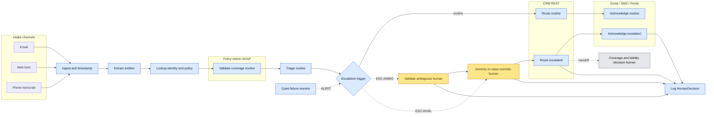
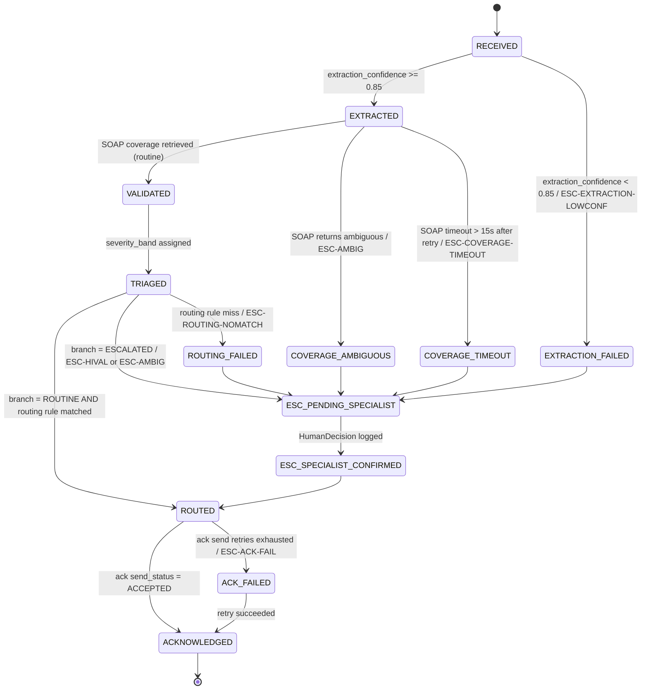
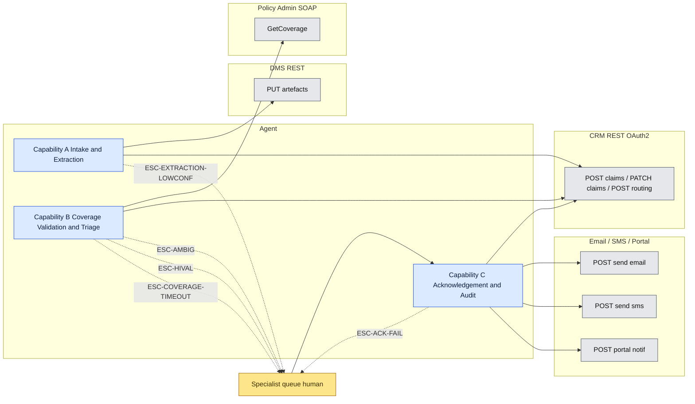
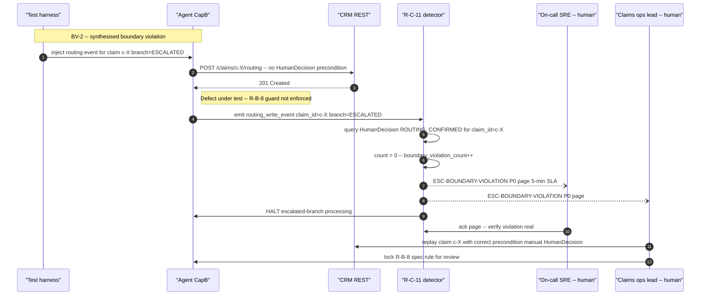

# Gate 1 — Consolidated Spec: FNOL Agentic Solution

## Header

- **Participant:** Chris Edwards
- **Source scenario:** Gate 1 FNOL scenario (Pack §3)
- **Consolidated from:**
  - `problem-statement-gate-scenario-317.md` (Deliverable 1)
  - `delegation-analysis-gate-scenario-503.md` (Deliverable 2)
  - `agent-specification-gate-scenario-612.md` (Deliverable 3)
  - `validation-design-gate-scenario-729.md` (Deliverable 4)
  - `assumptions-and-unknowns-gate-scenario-841.md` (Deliverable 5)
- **Date produced:** 27.04.2026
- **Status:** Gate 1 timed-exercise draft, no coach-session validation possible per Pack §2. All assumptions sit at **Medium** or **Low** by construction; **High** is not available.

---

## Consolidated Assumption Log

All assumptions from the five deliverables are merged here, deduplicated, and renumbered sequentially as `U#`. Per Pack §2, no entry carries **High** confidence. 28 entries total: 0 HUMAN, 28 AGENT. 11 Low, 17 Medium. The scenario file's HUMAN assumptions section was empty at time of generation.

### Scan Table

| # | Source | Assumption (one line) | Cagan risk | Confidence | Upstream sections at risk if wrong |
|---|---|---|---|---|---|
| U1 | AGENT | *High-value or ambiguous* is codifiable as a threshold-based trigger the client can articulate. | Value | Low | §2 T7,T8,T10,T13; §3 R-B-6; §4 BV-1,BV-2; M5 definition. |
| U2 | AGENT | Legacy Policy Admin SOAP exposes `GetCoverage(policyId, lossDate)` → `{inForce, coverageType, deductible, limit}` with p95 ≤ 15s and ≥ 99% availability. | Feasibility | Low | §2 T4; §3 R-B-3, §3 Integration 6.2; §4 FM-L-1, FQ-1. **Build-blocking.** |
| U3 | AGENT | CRM exposes REST endpoints for claim creation, update, and routing under OAuth 2.0 client-credentials with named scopes. | Feasibility | Low | §3 R-A-6, R-B-7, Integration 6.1; §4 FM-L-2. **Build-blocking.** |
| U4 | AGENT | DMS exposes `PUT /artefacts/{key}` REST endpoint accepting up to 25 MB with API-key auth. | Feasibility | Low | §3 R-A-1, Integration 6.3; §4 FM-L-5. **Build-blocking.** |
| U5 | AGENT | Ack channels are three transactional systems (email API, SMS gateway, claimant-portal write) with consistent send semantics. | Feasibility | Low | §1 M4; §3 R-C-2, Integration 6.4; §4 FM-L-3, FQ-4. **Build-blocking.** |
| U6 | AGENT | Routing-error 18% measures adjuster-overturned routings, not operational re-queues. | Feasibility | Medium | §1 M2 baseline definition. |
| U7 | AGENT | 2-hour SLA clock starts at system-of-record receipt timestamp, uniform across all channels. | Feasibility | Medium | §1 M1 baseline; §3 R-A-7. |
| U8 | AGENT | Specialist fully-loaded cost is in the £40–80k/year band. | Viability | Low | ROI envelope (not in current deliverables). |
| U9 | AGENT | Ack is delivered on the same channel the FNOL arrived on; phone-originated uses contact preference on file. | Usability | Medium | §1 M4; §2 T12; §3 R-C-2; §4 EC-4. |
| U10 | AGENT | Target thresholds (SLA ≤ 5% breach, routing error ≤ 3%, ≥ 70% no-touch) are FDE-judged, not client-set. | Value | Low | §1 M1–M4 target columns. |
| U11 | AGENT | Phone-transcript intake is delivered as text by an upstream telephony stack, not transcribed by the agent. | Feasibility | Medium | §2 T1; §3 Capability A scope. |
| U12 | AGENT | CRM is the system-of-record for the claim record; Policy Admin is queried for coverage only, not written to. | Feasibility | Medium | §3 R-A-6, R-B-3. |
| U13 | AGENT | Routing rules (LOB, peril, geography, severity → adjuster queue) exist today, even if in spreadsheets or heads. | Feasibility | Medium | §2 T9; §3 R-B-7; §4 FQ-2. |
| U14 | AGENT | No category of FNOL is reserved by external regulation to a human-only path beyond the scenario's *high-value or ambiguous* clause. | Viability | Low | §2 — could add net-new HUMAN ONLY rows. |
| U15 | AGENT | Extraction confidence threshold 0.85 is a defensible starting point; tunable from production telemetry. | Feasibility | Medium | §3 R-A-4; §4 EC-6, FQ-5, FQ-6. |
| U16 | AGENT | SLA budget allocation: routine path p95 ≤ ~2 min, leaving ~118 min reserve. | Feasibility | Medium | §3 R-A-9, R-B-13, R-C-10. |
| U17 | AGENT | Severity bands S1–S4 are codifiable from a published rubric (peril, loss magnitude, injury indicator). | Feasibility | Medium | §3 R-B-5; §4 FQ-3. |
| U18 | AGENT | All external-system writes use idempotency-key format `claim:{claim_id}:{action}:{discriminator}` with 24h dedup. | Feasibility | Medium | §3 all R-x-6 rules; §4 EC-1. |
| U19 | AGENT | Audit-trail retention defaults to 7 years for `HumanDecision` and `Claim` records. No regulatory citation. | Viability | Low | §3 Decision Log sections. |
| U20 | AGENT | Synthetic test data (HP-1 inputs, peril mix) is representative of the 300-FNOL/day production distribution. | Feasibility | Medium | §4 HP-1 timing assertions. |
| U21 | AGENT | 5% sample rate on (deductible, limit) cross-check is sufficient for FQ-1 detection within 5 days. | Feasibility | Medium | §4 FQ-1 detection rule. Internal tension with U23. |
| U22 | AGENT | Historical baseline for `severity_band × peril` distribution exists (insurer BI, past 12 months). | Feasibility | Low | §4 FQ-3 KL-divergence detector. **Build-blocking for FQ-3.** |
| U23 | AGENT | Claims operations lead has ~30 min/day audit capacity for FQ-* sample-verification. | Viability | Medium | §4 all FQ verification steps. Internal tension with U21. |
| U24 | AGENT | Insurer captures a claimant-feedback signal (NPS, complaint webhook) at sufficient rate for FQ-4 post-send detection within 1 week. | Feasibility | Low | §4 FQ-4 verification step. |
| U25 | AGENT | Pre-send template-lint is buildable as a synchronous gate inside R-C-3 / R-C-5 within the 30s p95 budget. | Feasibility | Medium | §4 FQ-4 prevention rule. Could require a new R-C-* spec rule. |
| U26 | AGENT | A 5-day rolling window is acceptable lag for M2 routing-quality drift detection. | Value | Medium | §4 FQ-2 detection rule. |
| U27 | AGENT | Spec-vs-test tension: R-B-6 *low-confidence-intake* threshold `< 0.95` means any happy-path requires `extraction_confidence ≥ 0.95`, colliding with R-A-4's `≥ 0.85` gate. | Feasibility | Medium | §4 HP-1; §3 R-B-6 and R-A-4 band. *Surfaced during consolidation.* |
| U28 | AGENT | No spec rule exists for the 30-min ack-delivery sweep job (FM-L-4) or for the pre-send template-integrity gate (FQ-4). | Feasibility | Medium | §3 would need R-C-12 and R-C-13; §4 FM-L-4, FQ-4. *Surfaced during consolidation.* |

### Walkthrough / Client-Validation Priority Queue

1. **U1** — *high-value or ambiguous* trigger codifiability. *"Can you walk me through five recent claims your specialists flagged as 'ambiguous', and tell me what tipped each one?"*
2. **U2** — SOAP WSDL for `GetCoverage`. Build-blocking for Capability B.
3. **U3** — CRM REST API catalogue + OAuth scopes. Build-blocking for Capabilities A and B.
4. **U4** — DMS write API. Build-blocking for Capability A.
5. **U5** — Ack-channel SDKs and vendor identity. Build-blocking for Capability C.
6. **U14** — Regulatory carve-outs. Could add net-new HUMAN ONLY rows.
7. **U19** — Audit-trail retention regime.
8. **U22** — Historical severity baseline. Build-blocking for FQ-3.
9. **U6** — Routing-error denominator.
10. **U13** — Codifiable routing rules.
11. **U27** — R-B-6 / R-A-4 confidence-threshold collision — spec re-tune needed.
12. **U10** — Target thresholds — direction holds; magnitude negotiable.

### Update Protocol

> Update assumptions in place — never silently delete. If a Live Walkthrough challenge surfaces new evidence, leave the entry with strikethrough and append a dated `→ [REVISED]` annotation. **Confidence ratings cannot move to High within the Gate 1 window.** Any section whose source label is `[ASSUMED] — U#` must be re-checked when U# changes.

---

## §1 — Problem Statement & Success Metrics

### The Problem Being Solved

A mid-size insurer's claims team takes **300 FNOL reports per day** [CITED] across **email, phone transcript, and web form** [CITED]. Each FNOL must be **triaged by severity, validated against policy coverage, routed to the appropriate adjuster, and acknowledged to the claimant — within 2 hours of receipt** [CITED]. The work is done today by **12 specialists** [CITED] at **22 minutes average handling time per claim** [CITED]. That is `300 × 22 min = 6,600 min/day ≈ 110 specialist-hours/day` of cognitive load, against ~96 hours of nominal team capacity at an 8-hour day [CITED inputs, derived total]. The team operates with **no AI infrastructure today** [CITED].

**Claimant perspective.** A claimant submitting an FNOL today has two structural problems they feel directly. First, **31% of claims breach the 2-hour acknowledgement SLA** [CITED] — almost a third of claimants are left in silence past the window the insurer set itself. Second, **18% of claims are routed wrong** [CITED] — when the routing fails, the claimant's first substantive contact is with an adjuster who is not the right adjuster, producing handoff delay, repeated information-gathering, and a worse first impression at the moment a claimant most needs predictability. Late acknowledgement and wrong routing are both **claimant-visible** failures, not just operational ones.

**Business perspective.** The insurer is running a high-volume, latency-bound, repeatable pipeline almost entirely on cognitive labour. The four steps — triage, coverage validation, routing, acknowledgement — apply uniformly to every FNOL [CITED]. The integration estate is fixed: **a modern CRM with APIs, a legacy policy administration system with SOAP endpoints, and a document management system** [CITED]. The client is **open to full automation where appropriate but insists on human oversight for high-value or ambiguous claims** [CITED] — that boundary is the non-negotiable, and it pre-defines where the agent's authority must stop. No baseline cost-per-claim, error-cost, or churn figure is given in the scenario; pain is quantified in latency (31% breach), accuracy (18% misroute), and effort (22-minute AHT × 300/day), and any further pain claim is `[ASSUMED]`.

### Why Agentic, Why Now

**Volume.** `300 FNOL/day × 22 min ≈ 110 specialist-hours/day` of work [CITED inputs, derived total], on a fixed pipeline applied to every claim. At ~96 hours of nominal team capacity (12 specialists × 8h), the team is structurally close to or over capacity — consistent with a 31% SLA breach [CITED].

**Repeatability.** The four-step pipeline (triage → coverage validation → routing → acknowledgement) [CITED §3] is the same shape on every claim. Two steps — coverage validation and routing-on-rule — are codifiable lookup-and-decision tasks against named systems. Triage by severity is codifiable for the bulk and judgment-call for the tail. Acknowledgement is templated comms. The judgment-call fraction ("high-value or ambiguous claims" [CITED]) is the explicit human-oversight boundary.

**Constraint.** The 2-hour SLA with 31% breach today [CITED] makes this a **latency-bound** problem. Agents are well-suited to the *latency* lever (parallelism across 300 claims/day, sub-second classification and lookup, machine-speed acknowledgement) without disturbing the human-oversight boundary on the judgment tail.

### Success Metrics

| # | Metric | Current State | Target State | Measurement Method | Source |
|---|---|---|---|---|---|
| M1 | **SLA / latency.** % of FNOLs with claimant acknowledgement issued within 2 hours of receipt timestamp. | 69% (= 100 − 31% breach) | ≥ 95% | `count(claims_acknowledged_within_2h) / count(claims_received)`, measured daily. | Current: [CITED]. Target: [ASSUMED] — U10. |
| M2 | **Routing quality.** % of claims whose initial adjuster assignment is *not* overturned by the receiving adjuster within 24 hours. | 82% (= 100 − 18% routing error) | ≥ 97% | `1 − (count(routings_overturned_within_24h) / count(routings_made))`, measured weekly. | Current: [CITED]. Target: [ASSUMED] — U10. Definition: [ASSUMED] — U6. |
| M3 | **Human effort / throughput.** % of FNOLs fully handled with no specialist touch. | 0% (no AI today) | ≥ 70% on routine (non-escalated) claims; 0% target on escalated claims by design (M5). | `count(claims_with_no_human_action_pre_routing) / count(claims_received)`, segmented by branch. | Current: [CITED]. Target: [ASSUMED] — U10. |
| M4 | **Claimant experience.** % of acknowledgements that (a) reach the claimant within SLA *and* (b) name the assigned adjuster correctly on first send. | [UNKNOWN — baseline needed] | ≥ 95% | `count(acks_in_sla AND no_correction_within_24h) / count(acks_sent)`. | Current: [UNKNOWN]. Target: [ASSUMED] — U10. Channel: [ASSUMED] — U9. |
| M5 | **Boundary respect (non-negotiable).** Every claim classified as *high-value or ambiguous* reaches a logged human decision before any irreversible action. | Not currently measured | **100%** — zero silent agent decisions on escalated claims | `count(escalated_claims_with_logged_human_decision_before_irreversible_action) / count(escalated_claims) == 1.000`; alert on any deviation. | Direction: **(Non-negotiable)** [CITED]. Threshold definition: [ASSUMED] — U1. |

> M5's *direction* is non-negotiable and cited; its *measurability* depends on U1 being closed. Cost-per-claim and ROI metrics are deliberately **not** included — the scenario gives no fully-loaded specialist cost.

---

## §2 — Delegation Analysis

### Delegation Framework

Classification uses the four labels from Pack §4:

- **FULLY AGENTIC** — agent executes end-to-end without per-instance human action; rule-governed, reversible, deterministic against named systems.
- **AGENT-LED WITH HUMAN OVERSIGHT** — agent drafts / proposes / prepares; a named human must act before the system state changes externally.
- **HUMAN-LED WITH AGENT SUPPORT** — a human decides; the agent surfaces evidence, drafts options, or compiles context.
- **HUMAN ONLY** — no agent involvement; reserved to humans by regulation, accountability, or scenario constraint.

Classification is applied at the **task / decision** level, not at the capability level.

### Work Inventory

| # | Step / Task / Decision | Classification | Rationale (why) | Source |
|---|---|---|---|---|
| T1 | **Intake — channel ingestion** (email, web form, phone transcript). Receive the FNOL, timestamp at receipt, persist raw payload to DMS. | FULLY AGENTIC | Rule-governed, deterministic, reversible. The 2-hour SLA clock starts here [CITED], so any human-in-loop would consume the budget by design. | [CITED] Pack §3 + [ASSUMED] — U11 |
| T2 | **Entity extraction from unstructured text** — claimant name, policy number, loss date, peril, severity cues, contact info. | FULLY AGENTIC | Primary value-add against unstructured intake. Reversible (extracted fields are derived; raw payload is canonical). Confidence-scored output gates downstream rows; low-confidence triggers escalation (T7). | [CITED] Pack §3 |
| T3 | **Identity / policy lookup** — match extracted policy number + claimant identity to CRM and policy admin records. | FULLY AGENTIC | Deterministic key-based lookup against named systems with APIs. Read-only. | [CITED] Pack §3 |
| T4 | **Validate against policy coverage — routine** — confirm policy in force, peril covered, deductible / limit retrieved. | FULLY AGENTIC | Deterministic four-question lookup over SOAP. Read-only. | [CITED] Pack §3 + [ASSUMED] — U2 |
| T5 | **Validate against policy coverage — ambiguous** — coverage answer is uncertain (lapsed-then-reinstated, contested endorsement, multi-policy stacking, missing key fields). | AGENT-LED WITH HUMAN OVERSIGHT | Coverage decisions are *de facto* payment-precursor decisions. Agent compiles record + ambiguity reason; specialist confirms before the claim moves forward. | [CITED] Pack §3 (oversight clause) |
| T6 | **Triage by severity — routine** — assign severity band using a published rubric. | FULLY AGENTIC | Codifiable from rubric; deterministic given inputs; reversible (metadata, not an external commitment). | [CITED] Pack §3 |
| T7 | **Escalation classification — *high-value or ambiguous* trigger.** | FULLY AGENTIC *(conditional on U1)* | The *act of testing the trigger* is rule-application. If U1 fails (trigger is tacit), drops to HUMAN-LED WITH AGENT SUPPORT. | [CITED] Pack §3 + [ASSUMED] — U1 |
| T8 | **Severity / value override on the escalated branch.** | HUMAN-LED WITH AGENT SUPPORT | Judgement under uncertainty with downstream payment implications; agent compiles evidence but does not decide. | [CITED] Pack §3 (oversight clause) |
| T9 | **Route to adjuster — routine** — apply routing rule table → adjuster queue, assign in CRM. | FULLY AGENTIC | Deterministic rule lookup; assignment is reversible. Drives M2. The 18% baseline is the indictment of human routing under volume. | [CITED] Pack §3 + [ASSUMED] — U13 |
| T10 | **Route to adjuster — escalated** — assign to specialist queue, require sign-off before claim is worked. | AGENT-LED WITH HUMAN OVERSIGHT | Routing is rule-based but *committing* the claim on this branch must surface to a specialist per the oversight clause. | [CITED] Pack §3 + [ASSUMED] — U1 |
| T11 | **Coverage / liability decision** — final determination of whether and how much the insurer will pay. | HUMAN ONLY | Out of pipeline scope per Pack §3. Adjuster authority is reserved by accountability and typically by claim-handling licensure. | [CITED] Pack §3 |
| T12 | **Acknowledge to claimant — routine** — generate and send ack on the channel of receipt. | FULLY AGENTIC | Templated comms. Reversible. Inside SLA budget. | [CITED] Pack §3 + [ASSUMED] — U9 |
| T13 | **Acknowledge to claimant — escalated** — same shape, but ack reviewed by specialist before send. | AGENT-LED WITH HUMAN OVERSIGHT | Ack carries specialist's name and different next-step; silent-error cost is higher. | [CITED] Pack §3 (oversight clause) |
| T14 | **Audit-trail logging of every human decision** — emit `HumanDecision` events for T5 / T8 / T10 / T11 / T13. | FULLY AGENTIC | Mechanical bookkeeping; M5 boundary-respect metric is unfalsifiable without it. | Derived from HC1 + HC4 |
| T15 | **Quiet-failure detection** — agent monitors own output and raises alerts when patterns shift. | AGENT-LED WITH HUMAN OVERSIGHT | Detection is FULLY AGENTIC; *response* to a sustained anomaly involves named human action. Detail in §4. | Derived (Pack §6.4) |

**Conditional rows.** If **U1** fails → T7 drops from FULLY AGENTIC to HUMAN-LED WITH AGENT SUPPORT, and T6/T9/T12 safety depends on it. If **U2** fails → T4 drops to AGENT-LED WITH HUMAN OVERSIGHT. If **U13** fails → T9 drops to HUMAN-LED WITH AGENT SUPPORT.

### Hard Constraints on the Boundary

| # | Constraint | Source | Effect |
|---|---|---|---|
| HC1 | **Human oversight for high-value or ambiguous claims.** | [CITED] Pack §3 | Fixes T5, T8, T10, T13 to AGENT-LED WITH HUMAN OVERSIGHT or stricter. |
| HC2 | **2-hour acknowledgement SLA from receipt.** | [CITED] Pack §3 | Forces T12 toward FULLY AGENTIC. Caps latency budgets for T2–T9. |
| HC3 | **Pipeline scope ends at routing + ack.** | [CITED] Pack §3 | Fixes T11 to HUMAN ONLY. |
| HC4 | **No silent agent decisions on the human-oversight side.** | Derived from HC1 + M5 | Forces T14 to exist as a FULLY AGENTIC row. |

### Delegation Boundary Diagram

*Figure 1 — delegation boundary (work inventory). Blue = FULLY AGENTIC; amber = human-led; grey = HUMAN ONLY. Dashed `ESC-*` edges are escalation transitions; dashed `ALERT` is the quiet-failure feedback edge from T15.*

### Boundary-Respect Metric (hand-off to §1)

> **100% of claims classified as *high-value or ambiguous* (T7 = ESCALATED) reach a logged `HumanDecision` event before any irreversible action — routing-finalised (T10), coverage confirmation (T5), or claimant-comms-sent on the escalated branch (T13). Zero silent agent decisions on the human-oversight side of the boundary.** This is the contract behind HC1, HC4, and the M5 row in §1.

---

## §3 — Agent Specification

### Capability Set Overview

The agent decomposes along the delegation seams in §2. T1–T3 form the Intake & Extraction bounded context; T4–T10 form Coverage Validation & Triage (where the *high-value or ambiguous* boundary is enforced); T12–T15 form Acknowledgement & Audit. T11 (final coverage / liability decision) is HUMAN ONLY per HC3.

1. **Capability A — FNOL Intake & Extraction.** Receives the raw FNOL, persists to DMS, extracts structured fields, creates the canonical `Claim` in CRM. Owns T1, T2, T3. Hand-off: `Claim` in state `EXTRACTED`.
2. **Capability B — Coverage Validation & Triage.** Validates coverage via Policy Admin SOAP, assigns severity, evaluates the escalation trigger, routes the claim. Owns T4–T10. Hand-off: `Claim` in state `ROUTED` (routine) or `ESC_SPECIALIST_CONFIRMED` (escalated).
3. **Capability C — Claimant Acknowledgement & Audit.** Issues ack, persists every human decision as an immutable `HumanDecision` event, surfaces quiet-failure signals. Owns T12–T15.

Seams: Cap A → Cap B is `Claim.state = EXTRACTED` with `confidence ≥ 0.85` (U15); Cap B → Cap C is `Claim.state ∈ {ROUTED, ESC_SPECIALIST_CONFIRMED}`.

### Entity Model

#### `FNOLSubmission`

| Attribute | Type | Required | Constraints | Notes |
|---|---|---|---|---|
| `submission_id` | UUID v4 | Y | PK | Generated on receipt. |
| `source` | enum [`EMAIL`, `PHONE_TRANSCRIPT`, `WEB_FORM`] | Y | | Drives ack-channel selection (U5). |
| `received_at` | timestamp (UTC, ms) | Y | Immutable | SLA clock starts here (HC2). |
| `external_msg_id` | string ≤ 256 | N | Unique per source | For dedup against double-fired webhooks. |
| `raw_text` | string ≤ 200 KB | Y | UTF-8 | Persisted in DMS, referenced by URI. |
| `dms_artefact_uri` | URI | Y after persist | Immutable | Returned by DMS `PUT`. |
| `attachments` | array<URI> ≤ 10 | N | | Each ≤ 25 MB. |
| `created_at`, `updated_at` | timestamp | Y | | |

**Immutability:** `submission_id`, `source`, `received_at`, `raw_text`, `dms_artefact_uri`. **Delete:** soft only; retention 7 years per U19.

#### `Claim`

| Attribute | Type | Required | Constraints | Notes |
|---|---|---|---|---|
| `claim_id` | string `^c-[A-Z0-9]{10}$` | Y | PK | Deterministic from `submission_id` for idempotency (U18). |
| `submission_id` | UUID | Y | FK → FNOLSubmission | One claim per submission. |
| `policy_id` | string `^[A-Z0-9-]{6,20}$` | Y after `EXTRACTED` | | From extraction. |
| `claimant_id` | UUID | Y after `EXTRACTED` | FK → CRM Party | Resolved in T3. |
| `peril` | enum [`AUTO_COLLISION`, `AUTO_THEFT`, `AUTO_GLASS`, `PROPERTY_FIRE`, `PROPERTY_WATER`, `PROPERTY_THEFT`, `LIABILITY_GL`, `OTHER`] | Y after `EXTRACTED` | | Extraction output. |
| `loss_date` | ISO 8601 date | Y after `EXTRACTED` | ≤ `received_at` date | |
| `severity_band` | enum [`S1`, `S2`, `S3`, `S4`] | Y after `TRIAGED` | | Per U17. |
| `branch` | enum [`ROUTINE`, `ESCALATED`] | Y after `TRIAGED` | | Set by R-B-6. |
| `state` | enum (see state machine) | Y | | |
| `extraction_confidence` | float `[0,1]` | Y after `EXTRACTED` | | Per U15. |
| `due_at` | timestamp | Y | Immutable; `= received_at + 2h` | HC2. |
| `is_breached` | boolean | — | **Derived**: `now() > due_at AND state != ACKNOWLEDGED`. Do not store. | |
| `created_at`, `updated_at` | timestamp | Y | | |

**State machine** (> 3 states + non-linear → diagram trigger fires):

*Figure 2 — `Claim` state machine. Every transition is named in the capability rules below. Every escalation has a code defined in the escalation-trigger tables.*

**Immutability:** `claim_id`, `submission_id`, `due_at`, `received_at`. **Delete:** soft only; retention 7 years per U19.

#### `CoverageRecord`

| Attribute | Type | Required | Constraints | Notes |
|---|---|---|---|---|
| `coverage_id` | UUID | Y | PK | |
| `claim_id` | string | Y | FK → Claim | One per claim; latest wins on re-validation. |
| `in_force` | boolean | Y | | SOAP response. |
| `coverage_type` | string | Y | | SOAP response. |
| `deductible` | money (currency, cents) | Y | | SOAP response. |
| `limit` | money | Y | | SOAP response. |
| `validation_confidence` | float `[0,1]` | Y | | 1.0 if SOAP returned cleanly; < 1.0 on partial. |
| `validator` | enum [`AGENT`, `SPECIALIST`] | Y | | `SPECIALIST` after T5 sign-off. |
| `validated_at` | timestamp | Y | | |

**Delete:** soft only; retention 7 years per U19.

#### `RoutingAssignment`

| Attribute | Type | Required | Constraints | Notes |
|---|---|---|---|---|
| `assignment_id` | UUID | Y | PK | |
| `claim_id` | string | Y | FK → Claim | Latest assignment is canonical. |
| `adjuster_id` | UUID | Y | FK → CRM Adjuster | |
| `queue` | string | Y | | From routing-rule lookup or specialist override. |
| `state` | enum [`PROPOSED`, `CONFIRMED`, `OVERTURNED`] | Y | | `PROPOSED → CONFIRMED` on pickup; `→ OVERTURNED` within 24h (drives M2). |
| `assigned_at` | timestamp | Y | | |
| `overturn_reason` | string ≤ 256 | N | Required if state = OVERTURNED | |

#### `Acknowledgement`

| Attribute | Type | Required | Constraints | Notes |
|---|---|---|---|---|
| `ack_id` | UUID | Y | PK | |
| `claim_id` | string | Y | FK | |
| `channel` | enum [`EMAIL`, `SMS`, `PORTAL`] | Y | Must match `FNOLSubmission.source` mapping. | |
| `recipient` | string | Y | Email RFC 5322 / E.164 / portal URI | |
| `template_id` | string | Y | One of named template set | |
| `idempotency_key` | string | Y | Unique; format U18 | |
| `send_status` | enum [`PENDING`, `ACCEPTED`, `REJECTED`, `DELIVERED`, `FAILED`] | Y | | `ACCEPTED` from sync API; `DELIVERED` from webhook. |
| `sent_at` | timestamp | Y on `ACCEPTED` | | |

#### `HumanDecision`

| Attribute | Type | Required | Constraints | Notes |
|---|---|---|---|---|
| `decision_id` | UUID | Y | PK | |
| `claim_id` | string | Y | FK | |
| `actor_role` | enum [`SPECIALIST`, `SENIOR_ADJUSTER`, `ON_CALL`] | Y | | |
| `actor_id` | UUID | Y | FK → CRM User | |
| `decision_type` | enum [`COVERAGE_AMBIGUOUS_RESOLVED`, `SEVERITY_OVERRIDE`, `ROUTING_CONFIRMED`, `ROUTING_OVERRIDDEN`, `ACK_REVIEW_APPROVED`] | Y | | One per upstream T-row that crosses the boundary. |
| `decision_value` | JSON | Y | Schema per `decision_type` | |
| `evidence_ref` | URI | Y | Pointer to entity snapshot | Required for HC4. |
| `decided_at` | timestamp | Y | Immutable | |

**Immutability:** all attributes after creation. **Delete:** never (HC4); retention 7 years per U19.

---

### Capability A — FNOL Intake & Extraction

#### Purpose
Convert any FNOL into a canonical `Claim` record in CRM with extracted structured fields, with the original payload preserved immutably in DMS. *Done* from the claimant's perspective: the FNOL is logged and on-clock. *Done* from the insurer's perspective: a `Claim` row exists with a deterministic `claim_id`, an `extraction_confidence` score, and state `EXTRACTED` (or `ESC-EXTRACTION-LOWCONF` if below threshold).

#### Scope
- **In scope:** T1 (intake-channel ingestion), DMS persistence, T2 (entity extraction), T3 (identity / policy lookup), `Claim` creation.
- **Out of scope:** Coverage validation (Cap B); triage and routing (Cap B); acknowledgement (Cap C); phone transcription (upstream per U11).

#### Inputs

| Input | Type | Required | Validation | Source |
|---|---|---|---|---|
| `source_channel` | enum [`EMAIL`, `PHONE_TRANSCRIPT`, `WEB_FORM`] | Y | enum match | webhook payload |
| `external_msg_id` | string ≤ 256 | Y | non-empty | webhook header |
| `raw_text` | string ≤ 200 KB | Y | UTF-8 decode | webhook body |
| `attachments[]` | array<binary ≤ 25 MB> ≤ 10 items | N | size/count check | webhook multipart |
| `received_at` | ISO 8601 timestamp | Y | within ± 5 min of system clock | webhook header |

#### Outputs

| Output | Type | Condition | Destination |
|---|---|---|---|
| `FNOLSubmission` row | entity write | always | internal DB |
| Raw payload artefact | DMS PUT | always | DMS `PUT /artefacts/{idem-key}` |
| `Claim` row | entity write | extraction_confidence ≥ 0.85 | CRM `POST /claims` |
| `ESC-EXTRACTION-LOWCONF` event | escalation | extraction_confidence < 0.85 | specialist queue |

#### Business Rules

1. **R-A-1 (raw persistence)** — The agent **must** PUT the raw FNOL payload to DMS within 5 seconds of receipt, using idempotency-key `claim:{deterministic_claim_id}:dms:raw` (per U18). **Must** complete before any extraction call.
2. **R-A-2 (deterministic claim_id)** — The agent **must** derive `claim_id = "c-" + base32(sha256(submission_id)).substring(0,10)` so retries produce the same id and the CRM write is idempotent.
3. **R-A-3 (extraction call)** — The agent **must** call the extraction model with the raw text, returning per-field values and per-field confidence. Aggregate `extraction_confidence = min(field_confidences)` over `{policy_id, claimant_name, loss_date, peril}`.
4. **R-A-4 (confidence gate)** — IF `extraction_confidence ≥ 0.85` (per U15) THEN proceed to R-A-5. ELSE write `Claim` in state `EXTRACTION_FAILED` and raise `ESC-EXTRACTION-LOWCONF`.
5. **R-A-5 (identity / policy lookup)** — The agent **must** resolve `policy_id` via `GET /policies?policy_id=…` within 5s. On 404 → `EXTRACTION_FAILED` + `ESC-POLICY-NOTFOUND`. On 5xx after retry budget → `ESC-CRM-DOWN`.
6. **R-A-6 (claim creation idempotency)** — The agent **must** `POST /claims` with header `Idempotency-Key: claim:{claim_id}:create`. On 409, re-read and treat as success. **Cannot** create a second `Claim` for the same `submission_id`.
7. **R-A-7 (state on success)** — On successful create, state **must** be `EXTRACTED` and `due_at = received_at + 2h` (immutable).
8. **R-A-8 (boundary guard)** — The agent **cannot** classify as escalated, **cannot** assign severity, **cannot** call the SOAP coverage endpoint. Those belong to Cap B per HC1 / HC3.
9. **R-A-9 (latency budget)** — End-to-end p95 **must** be ≤ 75 seconds (5s DMS + 60s extraction + 5s lookup + 5s claim create). On breach → `ESC-EXTRACTION-SLOW` (notification).
10. **R-A-10 (quiet-failure surface)** — Per claim: `extraction_confidence`, `dms_put_latency_ms`, `crm_create_latency_ms`, `extraction_total_latency_ms`. Aggregates (1-min window): `extraction_below_threshold_rate`, `dms_5xx_rate`, `crm_5xx_rate`.

#### Escalation Triggers

| Code | Condition | Notify | Action required | SLA |
|---|---|---|---|---|
| `ESC-EXTRACTION-LOWCONF` | `state = EXTRACTION_FAILED` after R-A-4 | specialist queue (intake) | resolve fields manually, set state to `EXTRACTED` or close | 30 min |
| `ESC-POLICY-NOTFOUND` | R-A-5 returned 404 | specialist queue (intake) | confirm policy / search by claimant attributes | 30 min |
| `ESC-CRM-DOWN` | R-A-5 / R-A-6 5xx after 3 retries (50ms / 250ms / 1.25s) | on-call SRE | restore CRM access | 15 min |
| `ESC-DMS-DOWN` | R-A-1 5xx after 3 retries | on-call SRE | restore DMS access | 15 min |
| `ESC-EXTRACTION-SLOW` *(notification)* | R-A-9 p95 > 75s on 5-min window | on-call SRE | investigate; not blocking | — |

#### Decision Log

| Decision point | Fields logged | Storage | Retention |
|---|---|---|---|
| `RECEIVED → EXTRACTED` | claim_id, extraction_confidence, latencies, model_version | internal DB + CRM activity | 7 years (U19) |
| `RECEIVED → EXTRACTION_FAILED` | as above + failed_field_confidences | as above | 7 years |
| Any ESC-* raised | trigger code, condition snapshot, recipient | internal DB + CRM activity | 7 years |
| `Claim` create write | request body, response status, idempotency_key | internal DB | 1 year |
| DMS PUT | artefact URI, idempotency_key, response status | internal DB | 1 year |

---

### Capability B — Coverage Validation & Triage

#### Purpose
Confirm whether the policy covers the loss, assign severity, and either route to a routine adjuster queue or escalate to a specialist for human-in-loop sign-off. Owns the agent / human boundary defined in HC1 — R-B-6 is where the boundary is operationalised.

#### Scope
- **In scope:** T4 (SOAP coverage validation), T5 (ambiguous-coverage escalation), T6 (severity triage), T7 (escalation classification), T8 (severity/value override — agent prepares, specialist decides), T9 (routine routing), T10 (escalated routing handoff).
- **Out of scope:** T11 (final coverage / liability decision) — **HUMAN ONLY per HC3**. The agent computes `CoverageRecord`; it **cannot** decide whether the insurer will pay.

#### Inputs

| Input | Type | Required | Validation | Source |
|---|---|---|---|---|
| `claim_id` | string `^c-[A-Z0-9]{10}$` | Y | exists in `state = EXTRACTED` | Cap A handoff |
| `policy_id` | string | Y | matches Claim | extraction |
| `loss_date` | ISO 8601 date | Y | ≤ today | extraction |
| `peril` | enum (per entity model) | Y | enum match | extraction |
| `claimant_attributes` | JSON | Y | schema fixed | CRM lookup |

#### Outputs

| Output | Type | Condition | Destination |
|---|---|---|---|
| `CoverageRecord` row | entity write | always after R-B-3 or R-B-4 | internal DB |
| `Claim.severity_band` | entity update (PATCH) | after R-B-5 | CRM `PATCH /claims/{id}` |
| `Claim.branch` | entity update | after R-B-6 | CRM `PATCH /claims/{id}` |
| `RoutingAssignment` row | entity write | after R-B-7 or R-B-8 | CRM `POST /claims/{id}/routing` |
| Escalation events | escalation | per table below | specialist queue |

#### Business Rules

1. **R-B-1 (entry guard)** — Cap B **must** only operate on a `Claim` in state `EXTRACTED`. Other states **must** be rejected.
2. **R-B-2 (policy in-force precheck)** — IF `loss_date < policy.in_force_from OR loss_date > policy.in_force_to` THEN write `CoverageRecord{in_force=false}`, transition `EXTRACTED → COVERAGE_AMBIGUOUS`, raise `ESC-AMBIG`.
3. **R-B-3 (SOAP coverage call — routine)** — Call `GetCoverage(policy_id, loss_date)` with timeout 15s (U2). On clean response, write `CoverageRecord{validator=AGENT, validation_confidence=1.0}`, transition `EXTRACTED → VALIDATED`.
4. **R-B-4 (SOAP timeout / partial)** — IF timeout after 1 retry (30s total) OR partial response THEN transition to `COVERAGE_TIMEOUT` or `COVERAGE_AMBIGUOUS`, raise `ESC-COVERAGE-TIMEOUT` or `ESC-AMBIG`.
5. **R-B-5 (severity triage — routine)** — IF `VALIDATED` THEN apply rubric (U17): `severity_band = f(peril, reported_loss_amount, injury_indicator)`. Transition `VALIDATED → TRIAGED`. Agent **cannot** override the rubric.
6. **R-B-6 (escalation classification)** — IF any of:
   - `severity_band = S1` (catastrophic),
   - `CoverageRecord.in_force = false` OR `validation_confidence < 1.0`,
   - `extraction_confidence < 0.95` (low-confidence intake),
   - `reported_loss_amount > escalation_threshold` (`[UNKNOWN]` until U1 closes — default ≥ $50,000),
   - any prior-loss flag on the policy,
   THEN `branch = ESCALATED`, raise `ESC-HIVAL` or `ESC-AMBIG`. ELSE `branch = ROUTINE`.
7. **R-B-7 (routine routing)** — IF `branch = ROUTINE AND state = TRIAGED` THEN lookup on `(LOB, peril, geography_state, severity_band)` per U13; write `RoutingAssignment{state=PROPOSED}` via `POST /claims/{id}/routing` with idempotency key. Transition `TRIAGED → ROUTED`. On lookup miss → `ROUTING_FAILED` + `ESC-ROUTING-NOMATCH`.
8. **R-B-8 (escalated routing)** — IF `branch = ESCALATED` THEN place on specialist queue; require `HumanDecision{ROUTING_CONFIRMED}` before transitioning `ESC_SPECIALIST_CONFIRMED → ROUTED`.
9. **R-B-9 (`due_at` immutability)** — The agent **cannot** modify `Claim.due_at` after R-A-7 sets it. Any code path that would is a defect.
10. **R-B-10 (idempotency on writes)** — Every `PATCH /claims/{id}` and `POST /claims/{id}/routing` **must** carry an `Idempotency-Key` per U18. On 409, treat as success.
11. **R-B-11 (boundary guard - ambiguous coverage)** — On `COVERAGE_AMBIGUOUS`, the agent **cannot** record the coverage decision; it persists the partial response with `validator=AGENT, validation_confidence < 1.0`. Specialist resolution is recorded by Cap C R-C-4 as `HumanDecision{COVERAGE_AMBIGUOUS_RESOLVED}`.
12. **R-B-12 (boundary guard - escalated severity)** — On `branch = ESCALATED`, the agent **cannot** auto-set `severity_band`; the specialist sets it via `HumanDecision{SEVERITY_OVERRIDE}`.
13. **R-B-13 (latency budget)** — Cap B p95 **must** be ≤ 60s on routine path. On breach → `ESC-VALIDATION-SLOW` (notification).
14. **R-B-14 (quiet-failure surface)** — Per claim: `soap_call_latency_ms`, `soap_status`, `crm_patch_latency_ms`, `routing_lookup_hit`, `escalation_branch_taken`. Aggregates: `soap_p95`, `soap_5xx_rate`, `routing_nomatch_rate`, `escalation_rate_5min`.

#### Escalation Triggers

| Code | Condition | Notify | Action required | SLA |
|---|---|---|---|---|
| `ESC-AMBIG` | `state = COVERAGE_AMBIGUOUS` | specialist queue (LOB) | resolve coverage; record `HumanDecision{COVERAGE_AMBIGUOUS_RESOLVED}` | 60 min |
| `ESC-HIVAL` | `branch = ESCALATED AND ESC-HIVAL driver` | senior claims specialist (LOB) | confirm severity, reserve, routing | 60 min |
| `ESC-COVERAGE-TIMEOUT` | `state = COVERAGE_TIMEOUT` | specialist queue (LOB) | manual coverage validation | 60 min |
| `ESC-SOAP-DOWN` | SOAP 5xx after retry budget | on-call SRE | restore Policy Admin | 15 min |
| `ESC-ROUTING-NOMATCH` | `state = ROUTING_FAILED` | specialist queue (intake) | manual route; record `HumanDecision{ROUTING_OVERRIDDEN}` | 30 min |
| `ESC-VALIDATION-SLOW` *(notification)* | R-B-13 p95 > 60s on 5-min window | on-call SRE | investigate | — |

#### Decision Log

| Decision point | Fields logged | Storage | Retention |
|---|---|---|---|
| `EXTRACTED → VALIDATED` | claim_id, soap_status, latency, coverage_record_id | internal DB + CRM | 7 years |
| `EXTRACTED → COVERAGE_AMBIGUOUS / TIMEOUT` | claim_id, partial_fields, soap_status | as above | 7 years |
| `VALIDATED → TRIAGED` | claim_id, severity_band, rubric_inputs | as above | 7 years |
| `TRIAGED → ROUTED` | claim_id, routing_rule_key, queue, adjuster_id | as above | 7 years |
| `TRIAGED → ESC_PENDING_SPECIALIST` | claim_id, branch, escalation_drivers[] | as above | 7 years |
| Any ESC-* raised | code, snapshot, recipient | as above | 7 years |
| External writes | request, response status, idempotency_key | internal DB | 1 year |

---

### Capability C — Claimant Acknowledgement & Audit

#### Purpose
Issue the 2-hour ack on the channel of receipt (routine) or after specialist sign-off (escalated); persist every human decision as an immutable `HumanDecision` event; emit the quiet-failure surface. Operationalises M5 boundary-respect: every human decision in the system is recorded here.

#### Scope
- **In scope:** T12 (routine ack), T13 (escalated ack — agent drafts, specialist signs off), T14 (`HumanDecision` event capture), T15 (quiet-failure signal aggregation).
- **Out of scope:** Adjuster work after pickup; T11 (HUMAN ONLY per HC3); multi-touch claimant comms.

#### Inputs

| Input | Type | Required | Validation | Source |
|---|---|---|---|---|
| `claim_id` | string | Y | exists in state ∈ {`ROUTED`, `ESC_SPECIALIST_CONFIRMED`} | Cap B handoff |
| `branch` | enum [`ROUTINE`, `ESCALATED`] | Y | matches Claim | Cap B |
| `recipient_address` | RFC 5322 / E.164 / portal-uri | Y | per channel | CRM Party |
| `assigned_adjuster_name` | string | Y | non-empty | RoutingAssignment |
| `human_decision_event` *(T14 path)* | JSON envelope | Y on T14 | schema per `decision_type` | upstream T5/T8/T10/T13 |

#### Outputs

| Output | Type | Condition | Destination |
|---|---|---|---|
| `Acknowledgement` row | entity write | always after R-C-3 | internal DB |
| Outbound transactional message | external write | always | Email / SMS / Portal per U5 |
| `HumanDecision` row | entity write | on every T5/T8/T10/T13 boundary event | internal DB (immutable) |
| Quiet-failure metrics stream | metrics emit | continuous | observability stack |

#### Business Rules

1. **R-C-1 (entry guard)** — Cap C **must** only act on claims in state `ROUTED` (routine) or `ESC_SPECIALIST_CONFIRMED` (escalated).
2. **R-C-2 (channel selection)** — `Acknowledgement.channel` **must** be derived from `FNOLSubmission.source`: `EMAIL → EMAIL`, `WEB_FORM → PORTAL` (email fallback if portal binding absent), `PHONE_TRANSCRIPT → SMS` (email fallback if no mobile).
3. **R-C-3 (routine ack send)** — IF `branch = ROUTINE` THEN render template `ack-routine-v1` with claim_id, adjuster_name, next-step text; send with idempotency key `claim:{claim_id}:ack:routine:{channel}`. On `ACCEPTED`, transition `ROUTED → ACKNOWLEDGED`.
4. **R-C-4 (`HumanDecision` capture)** — For every specialist action crossing the boundary (T5, T8, T10, T13), **must** write a `HumanDecision` row with `evidence_ref`. Immutable per entity model. **Cannot** be deleted (HC4).
5. **R-C-5 (escalated ack — specialist sign-off)** — IF `branch = ESCALATED` THEN render template `ack-escalated-v1`, present to specialist, **must not** send until `HumanDecision{ACK_REVIEW_APPROVED}` recorded. Then send with key `claim:{claim_id}:ack:escalated:{channel}`.
6. **R-C-6 (ack-send retry)** — On 5xx / timeout (5s), retry 3× at 100ms / 500ms / 2.5s. On final failure → `ROUTED → ACK_FAILED`, raise `ESC-ACK-FAIL`. **Cannot** silently abandon.
7. **R-C-7 (idempotency)** — All ack-send calls **must** carry U18 key. Duplicate `ACCEPTED` on same key = same logical send.
8. **R-C-8 (boundary guard)** — On escalated branch, **cannot** send ack until R-C-5's `HumanDecision{ACK_REVIEW_APPROVED}`. Bypass is a defect.
9. **R-C-9 (`HumanDecision` immutability)** — Once written, **cannot** be modified. Corrections are new rows with supersession `evidence_ref`.
10. **R-C-10 (latency budget)** — p95 **must** be ≤ 30s on routine path. Escalated path is human-bound under `ESC-HIVAL` 60-min SLA.
11. **R-C-11 (quiet-failure surface)** — Per claim: `ack_send_latency_ms`, `ack_send_status`, `template_id`, `branch`. Aggregates (1-min window): `ack_5xx_rate`, `ack_p95_latency`, `breach_rate_today` (`now() > due_at AND state != ACKNOWLEDGED`), `boundary_violation_count` (alert on any > 0 — P0 incident; operationalises M5 = 100%).

#### Escalation Triggers

| Code | Condition | Notify | Action required | SLA |
|---|---|---|---|---|
| `ESC-ACK-FAIL` | `state = ACK_FAILED` after R-C-6 | specialist + on-call SRE | manual outreach; record `HumanDecision{ACK_REVIEW_APPROVED, manual=true}` | 30 min |
| `ESC-BOUNDARY-VIOLATION` | `boundary_violation_count > 0` | on-call SRE + claims ops lead | P0: halt agent for affected branch | 5 min (page) |
| `ESC-BREACH-RATE` *(notification)* | `breach_rate_today > 5%` | claims ops lead | investigate | — |

#### Decision Log

| Decision point | Fields logged | Storage | Retention |
|---|---|---|---|
| `ROUTED → ACKNOWLEDGED` | claim_id, ack_id, channel, recipient (hashed), template_id, send_status | internal DB + CRM | 7 years |
| `ROUTED → ACK_FAILED` | as above + retry_count, last_error | as above | 7 years |
| Every `HumanDecision` write | full row (immutable) | internal DB | **never deleted** (HC4) |
| `ESC-BOUNDARY-VIOLATION` raised | snapshot, claim_id, agent_action, expected_human_action | internal DB + PagerDuty | 7 years |

---

### Integration Contracts

#### CRM (modern, REST APIs) — `[CITED Pack §3]`

| Property | Value |
|---|---|
| Purpose | System of record for `Claim`, `RoutingAssignment`; read for Policy / Party (per U12). |
| Protocol | REST / JSON over HTTPS |
| Endpoint | `POST /claims`, `PATCH /claims/{id}`, `POST /claims/{id}/routing`, `GET /policies?policy_id=…`, `GET /parties/{id}` — base URL `[UNKNOWN]` (U3). **Build-blocking scope-out:** request the API catalogue / OpenAPI. |
| Authentication | OAuth 2.0 client-credentials, scopes `claim.write`, `claim.read`, `routing.write`, `policy.read`, `party.read`. Secret: `secrets/crm/oauth-client` [ASSUMED] — U3. |
| Request shape | `POST /claims`: `{claim_id, submission_id, policy_id, claimant_id, peril, loss_date, extraction_confidence, due_at, state="EXTRACTED"}`. `PATCH /claims/{id}`: `{severity_band?, branch?, state}`. `POST /claims/{id}/routing`: `{adjuster_id, queue, state="PROPOSED"}`. Header `Idempotency-Key`. |
| Response shape | 200 OK `{id, version, _links}`; 409 Conflict `{existing_id}` — treat as success per R-A-6 / R-B-10. |
| Timeout | 5s per call. |
| Retry logic | 5xx / network: 3 retries at 50ms / 250ms / 1.25s. 4xx: no retry; 400/401/403 → log + ESC-CRM-DOWN; 404 → branch-specific (R-A-5); 409 → success. |
| Rate limit | `[UNKNOWN]` (U3) — assume 100 RPS until confirmed. |
| Fallback | After retry budget: `ESC-CRM-DOWN`; claims park until restored. No silent abandonment. |
| Data mapping | `Claim.claim_id → /claims.id`; `Claim.policy_id → /claims.policy_id`; `RoutingAssignment.adjuster_id ← CRM Adjuster id`. |

#### Policy Admin (legacy, SOAP) — `[CITED Pack §3]`

| Property | Value |
|---|---|
| Purpose | Coverage validation read path: in-force, type, deductible, limit. |
| Protocol | SOAP 1.1 over HTTPS. WSDL `[UNKNOWN]` (U2). **Build-blocking scope-out:** request the WSDL. |
| Endpoint | `[UNKNOWN]` — assumed `GetCoverage(policyId, lossDate) → CoverageResponse`. |
| Authentication | `[UNKNOWN]` — assumed WS-Security UsernameToken or mTLS (U2). Secret: `secrets/policy-admin/svc-account`. |
| Request shape | `<soapenv:Envelope><soapenv:Body><pol:GetCoverage><pol:PolicyId>{policy_id}</pol:PolicyId><pol:LossDate>{ISO}</pol:LossDate></pol:GetCoverage></soapenv:Body></soapenv:Envelope>` *(skeleton — exact per WSDL when available; U2).* |
| Response shape | `<pol:CoverageResponse><pol:InForce>true|false</pol:InForce><pol:CoverageType>…</pol:CoverageType><pol:Deductible currency="…">…</pol:Deductible><pol:Limit currency="…">…</pol:Limit></pol:CoverageResponse>`. SOAP fault → R-B-4. |
| Timeout | 15s per call (U2 / U16). |
| Retry logic | 1 retry on timeout / 5xx / SOAP `Server` fault; total 30s before R-B-4. No retry on `Client` fault; `Client.PolicyNotFound` → R-A-5 path; `Client.Auth` → ESC-SOAP-DOWN. |
| Rate limit | `[UNKNOWN]` (U2) — assume 5 RPS (legacy); queue overflow → ESC-SOAP-DOWN. |
| Fallback | After retry budget: `COVERAGE_TIMEOUT` + `ESC-COVERAGE-TIMEOUT`. Specialist owns manual validation. No silent skip. |
| Data mapping | `policy_id → pol:PolicyId`; `loss_date → pol:LossDate`; `← pol:InForce → CoverageRecord.in_force`; `← pol:CoverageType → .coverage_type`; `← pol:Deductible → .deductible`; `← pol:Limit → .limit`. |

#### Document Management System — `[CITED Pack §3]`

| Property | Value |
|---|---|
| Purpose | Immutable storage of raw FNOL payload + attachments. |
| Protocol | REST / JSON over HTTPS. |
| Endpoint | `PUT /artefacts/{idempotency_key}`, `GET /artefacts/{id}` — base URL `[UNKNOWN]` (U4). **Build-blocking scope-out:** request the DMS integration guide. |
| Authentication | API key: `X-DMS-Key`. Secret: `secrets/dms/api-key`. |
| Request shape | `PUT /artefacts/{key}` body: multipart with `payload` (≤ 200 KB) + 0..10 `attachments` (≤ 25 MB each). |
| Response shape | 201 Created `{artefact_uri, content_hash, stored_at}`. 200 OK on idempotent re-PUT. 409 on key collision with different content → P0 ESC-DMS-DOWN. |
| Timeout | 30s per call (U16). |
| Retry logic | 3 retries at 200ms / 1s / 5s on 5xx / network. No retry on 4xx. |
| Rate limit | `[UNKNOWN]` (U4) — assume 50 RPS. |
| Fallback | After retry budget: `ESC-DMS-DOWN`. Intake **must not** continue without DMS persistence (R-A-1). |
| Data mapping | `FNOLSubmission.raw_text → multipart payload`; `← artefact_uri → FNOLSubmission.dms_artefact_uri`. |

#### Acknowledgement Channels (Email / SMS / Portal) — `[ASSUMED] — U5`

> Whether the ack channels are a single comms platform or three distinct systems is `[UNKNOWN]` (U5). **Build-blocking scope-out:** confirm channel ownership and SDKs.

| Property | Email (transactional) | SMS (gateway) | Portal |
|---|---|---|---|
| Purpose | Email ack for `EMAIL`-sourced. | SMS ack for `PHONE_TRANSCRIPT`-sourced. | Portal ack for `WEB_FORM`-sourced. |
| Protocol | REST / JSON | REST / JSON | REST / JSON |
| Endpoint | `POST /v3/mail/send` *(SendGrid-class — `[UNKNOWN]`)* | `POST /Messages.json` *(Twilio-class — `[UNKNOWN]`)* | `POST /portal/notifications` *(`[UNKNOWN]`)* |
| Authentication | Bearer API key. | HTTP Basic (Account SID + Auth Token). | OAuth 2.0 client-credentials. |
| Request shape | `{to, from, template_id, dynamic_template_data}` + `Idempotency-Key`. | `{From, To, Body}` + dedup key. | `{recipient_party_id, template_id, payload}` + `Idempotency-Key`. |
| Response | 202 Accepted `{message_id}`. | Same shape. | 200 OK `{notification_id}`. |
| Timeout | 5s | 5s | 5s |
| Retry | 3× at 100ms / 500ms / 2.5s on 5xx. | Same. | Same. |
| Fallback | After retries: `ACK_FAILED` + `ESC-ACK-FAIL`. | Same; no mobile → email fallback. | Same; no portal binding → email fallback. |

### Integration Topology Diagram

*Figure 3 — integration topology and boundary. Blue = agent capability; grey = external system; amber = human queue. Dashed `ESC-*` edges are escalations. The Specialist → Cap C edge is the `HumanDecision` write path (R-C-4).*

---

## §4 — Validation Design

### Validation Strategy

This section produces **scenario-level** validation. Each scenario carries a **P / E / F-loud / F-quiet** marker; expected outcomes name **states** (per §3 entity model) not intent. The load-bearing pieces are the quiet-failure detection rules (§4.3) and the delegation-boundary tests (§4.4) — *the agent is wrong and no one notices* per Pack §4. Every quiet-failure detection rule is observable in production, not only in test.

### Happy Path

#### HP-1 — `EMAIL`-sourced auto-collision, current personal-auto policy [P]

**Input state**

| Field | Value |
|---|---|
| `source_channel` | `EMAIL` |
| `external_msg_id` | `mg-2026-04-27-093412-7H3K` |
| `received_at` | `2026-04-27T09:34:12Z` |
| `policy_id` (from extraction) | `P-2026-04-19-AC-7733` |
| `claimant_id` | resolved → CRM Party `cp-44A2…` |
| `peril` | `AUTO_COLLISION` |
| `loss_date` | `2026-04-26` |
| `reported_loss_amount` | `$4,800` |
| `extraction_confidence` | `0.96` *(corrected from 0.94; see note below)* |

**Timeline**

| T | Step | Rule(s) exercised |
|---|---|---|
| T+0s | webhook accepted; `FNOLSubmission` row written | R-A-1 entry |
| T+0–5s | DMS `PUT /artefacts/claim:c-7H3K…ABCD:dms:raw` returns 201 | R-A-1, U18 |
| T+5–6s | `claim_id = c-7H3K…ABCD` derived | R-A-2 |
| T+6–66s | extraction returns `confidence = 0.96 ≥ 0.85` | R-A-3, R-A-4 |
| T+66–71s | CRM `GET /policies?policy_id=P-2026-04-19-AC-7733` → 200 | R-A-5 |
| T+71–74s | CRM `POST /claims` with idempotency key → 201; `due_at = 2026-04-27T11:34:12Z` | R-A-6, R-A-7 |
| T+74–104s | SOAP `GetCoverage` → clean `{in_force=true, type=AUTO_PERSONAL, deductible=$500, limit=$25,000}` | R-B-3, U2 |
| T+104s | `CoverageRecord{validator=AGENT, validation_confidence=1.0}`; state `EXTRACTED → VALIDATED` | R-B-3 |
| T+104–105s | severity rubric → `S3` (minor auto-collision) | R-B-5, U17 |
| T+105s | R-B-6: `extraction_confidence=0.96 ≥ 0.95` → `branch = ROUTINE` | R-B-6 |
| T+105–110s | routing lookup `(AUTO, AUTO_COLLISION, NY, S3)` → queue `auto-routine-NY`; `RoutingAssignment{PROPOSED}` | R-B-7, U13 |
| T+110s | state `TRIAGED → ROUTED` | R-B-7 |
| T+110–120s | template `ack-routine-v1` rendered; pre-send lint passes | R-C-2, R-C-3 |
| T+120s | email API → 202; `Acknowledgement{ACCEPTED, EMAIL}`; state `ROUTED → ACKNOWLEDGED` | R-C-3, R-C-7 |

> **Note on R-B-6 threshold tension.** The upstream R-B-6 *low-confidence-intake* driver uses `extraction_confidence < 0.95`. Any happy-path claim therefore requires `≥ 0.95`. This is a spec-vs-test tension — see U27 in the Consolidated Assumption Log and the spec gap note in §4.5.

End-to-end p95 ≈ 2 minutes against a 7,200-second SLA budget.

**Expected output (final state)**

- `FNOLSubmission`: 1 row, `dms_artefact_uri` populated.
- `Claim`: `state = ACKNOWLEDGED`, `branch = ROUTINE`, `severity_band = S3`, `is_breached = false`.
- `CoverageRecord`: `validator = AGENT`, `validation_confidence = 1.0`.
- `RoutingAssignment`: `state = PROPOSED`.
- `Acknowledgement`: `send_status = ACCEPTED`, `channel = EMAIL`.
- `HumanDecision` rows: **0**. ESC codes raised: **0**.

**Success criteria**

1. `Claim.state` reaches `ACKNOWLEDGED` within `received_at + 2h`.
2. `boundary_violation_count = 0`.
3. End-to-end p95 ≤ 165s (R-A-9 + R-B-13 + R-C-10).
4. Idempotency keys conform to U18 format; re-submit produces no duplicate.
5. M5 satisfied (zero `HumanDecision`, zero `ESC-BOUNDARY-VIOLATION`).

### Edge Cases

| # | Scenario | Input / trigger | Expected outcome | Rule(s) exercised | Marker |
|---|---|---|---|---|---|
| EC-1 | **Idempotent duplicate webhook** | Same `external_msg_id` at T+0s and T+30s. | Second path: DMS 200, CRM 409 → re-read. One `Claim`, one `Acknowledgement`. | R-A-2, R-A-6, R-B-10, R-C-7 | E |
| EC-2 | **Lapsed-then-reinstated policy** | Loss date falls in lapse gap. | R-B-2 fires: `CoverageRecord{in_force=false}`, `COVERAGE_AMBIGUOUS`, `ESC-AMBIG`. Specialist resolves via `HumanDecision{COVERAGE_AMBIGUOUS_RESOLVED}`. | R-B-2, R-B-11, ESC-AMBIG, R-C-4 | E |
| EC-3 | **SLA boundary at `due_at − 1s`** | Ack completes 1s before SLA. | `is_breached = false`. M1 contributes within-SLA. | R-A-7, M1 | E |
| EC-3b | **SLA boundary at `due_at + 1s`** | Ack completes 1s after SLA. | `is_breached = true`. Aggregated breach rate drives `ESC-BREACH-RATE` if > 5%. | R-C-11, ESC-BREACH-RATE | E |
| EC-4 | **Multi-channel ack fallback (no mobile)** | Phone-originated; no mobile on file. | R-C-2 falls through SMS → email. Ack succeeds. | R-C-2, R-C-3, U5 | E |
| EC-5 | **Routing-rule miss** | `LIABILITY_GL, TX, S2` has no rule. | `ROUTING_FAILED`, `ESC-ROUTING-NOMATCH`. Specialist routes manually via `HumanDecision{ROUTING_OVERRIDDEN}`. | R-B-7, U13, ESC-ROUTING-NOMATCH | E |
| EC-6 | **Borderline extraction confidence (0.849)** | Just below 0.85 threshold. | R-A-4 fires: `EXTRACTION_FAILED`, `ESC-EXTRACTION-LOWCONF`. No silent progression. | R-A-4, ESC-EXTRACTION-LOWCONF, U15 | E |
| EC-7 | **Routing not overturned in 24h** | HP-1 routing; adjuster picks up, works claim. | `RoutingAssignment.state → CONFIRMED`. M2 contributes correctly-routed count. | R-B-7, M2 | E |

### Failure Modes — Loud

| # | Failure | Agent response | Recovery path | Detection signal |
|---|---|---|---|---|
| FM-L-1 | **SOAP coverage outage** | After retry (30s total), `COVERAGE_TIMEOUT` + `ESC-COVERAGE-TIMEOUT` (60-min) + `ESC-SOAP-DOWN` (15-min SRE). | Specialist validates manually; SRE restores SOAP. | `soap_5xx_rate` (R-B-14); page; queue depth. |
| FM-L-2 | **CRM 5xx during claim creation** | After 3 retries, park in `EXTRACTION_FAILED`; `ESC-CRM-DOWN` (15-min SRE). Raw payload safe in DMS. | SRE restores; sweep job replays with idempotency keys. | `crm_5xx_rate` (R-A-10); page. |
| FM-L-3 | **Ack send 5xx persistent** | After 3 retries, `ACK_FAILED` + `ESC-ACK-FAIL` (30-min). | Specialist makes manual outreach. | `ack_5xx_rate` (R-C-11); page. |
| FM-L-4 | **Missing delivery webhook** | `send_status` stays `ACCEPTED`. Sweep job (15-min) flags rows with `ACCEPTED` age > 30 min. | Specialist investigates; manual outreach if needed. | Sweep dashboard; `accepted_age_p95`. |
| FM-L-5 | **DMS write outage** | After 3 retries, `ESC-DMS-DOWN` (15-min SRE). Intake **must not** progress without DMS persistence. | SRE restores; queued FNOLs replayed with idempotent keys. | DMS 5xx rate; page; ingestion queue depth. |

### Failure Modes — Quiet (Pack §4 mandate)

| # | Quiet failure | Why it stays quiet | Detection rule | Verification step | Recovery |
|---|---|---|---|---|---|
| FQ-1 | **Mis-mapped SOAP fields** — deductible ↔ limit swapped. | SOAP 200; both fields populated; schema valid. | 5% sample cross-check (U21); swap rate > 0.5% over 5-day window → P1. | Claims ops lead compares 3 rows/day to Policy Admin UI. | Halt SOAP writes for affected types; specialists fall back to UI; fix mapping; replay. |
| FQ-2 | **Wrong-but-plausible routing** — retired skill code; adjuster works claim, never overturns. | M2 doesn't fire; mismatch invisible. | Per-rule M2 < 97% for 5-day window (U26); overturn-volume > 2× mean. | Senior adjuster spot-checks 10 claims from flagged rule weekly. | Pull rule; route by fallback; spec re-tune. |
| FQ-3 | **Severity-band drift** — rubric assigns S3 where production shifted to S2. | Rubric returns valid output; no signal. | KL divergence vs 90-day baseline > 0.15 per peril (U22-dependent). Falls to manual review if no baseline. | Claims ops lead reviews 20 samples per drifting peril. | Re-tune rubric (R-B-5 + U17 update); replay reserves. |
| FQ-4 | **Ack template variable substitution failure** — `{{adjuster_name}}` unbound. | Send API 202; agent doesn't see rendered body. | **Pre-send:** literal `"{{"` in rendered body **fails the send** (prevention gate, U25). **Post-send:** complaint rate > 2× mean over 7 days → P1 (U24-dependent). | On pre-send fail: SRE paged, template halted. On post-send: ops reviews 5 samples. | Pause template; fix binding; replay with corrected template. |
| FQ-5 | **Extraction-distribution drift** — model degrades on new email format. Confidence 0.86–0.90, just over gate. | Confidence aggregate above threshold; no escalation. | 7-day rolling mean confidence drops > 0.05 vs 90-day baseline → P1. Per-broker breakdown. | Sample 20 borderline claims; manually re-extract. | Tighten R-A-4 threshold for affected broker; re-train model. |
| FQ-6 | **Boundary-confidence margin** — claim at 0.86 passes R-A-4 (≥ 0.85) but is in 0.85–0.95 band (spec gap U27). | Spec doesn't require `HumanDecision` for this band. | Overturn-rate on band-claims > 1.5× population mean over 10-day window. | Senior adjuster spot-checks 10 band-claims weekly. | Re-tune R-B-6 confidence threshold (fresh spec run). Named accepted risk until band-data available. |

> **Named accepted risks:** FQ-3 depends on U22; FQ-4 post-send depends on U24; FQ-1 sample size is U21/U23-dependent.

### Delegation Boundary Tests

#### BV-1 — *High-value-or-ambiguous near-threshold* [F-quiet]

**Set-up.** Claim where every R-B-6 trigger is *just* not met: `severity_band=S2`, `reported_loss_amount=$49,500` (under $50,000), `validation_confidence=1.0`, `extraction_confidence=0.96` (above 0.95), no prior-loss flags.

R-B-6 returns `branch = ROUTINE`. The test probes whether the spec is faithfully followed and whether quiet-failure detectors (FQ-2 / FQ-6) catch downstream issues.

**Expected:** Agent **must** apply R-B-6 as drafted: `branch = ROUTINE`. **Must not** apply tacit signals (R-B-12 broken). **Must not** silently adjust data. If adjuster overturns within 24h, M2 / FQ-2 surfaces it — acceptable.

**Success criteria:** `branch = ROUTINE`; `boundary_violation_count = 0`; zero `HumanDecision` rows written by agent; `ESC-BOUNDARY-VIOLATION` does not fire.

#### BV-2 — *Adversarial: synthesised boundary violation* [F-quiet, paired with BV-1]

**This proves the M5 detector itself works.** Test harness injects a routing write for `branch = ESCALATED` claim without a `HumanDecision{ROUTING_CONFIRMED}` — simulating a builder defect where R-B-8 guard is missing.

**Expected detector behaviour:**
1. R-C-11 counts the write as `boundary_violation` (no `HumanDecision{ROUTING_CONFIRMED}` for claim).
2. `boundary_violation_count > 0` triggers `ESC-BOUNDARY-VIOLATION` per §3 Cap C escalation table — **5-minute SLA** P0 page.
3. Affected branch processing **halted**.

**Success criteria:** Page fires within 5 min; `boundary_violation_count` incremented; halt mechanism engages; no further escalated-branch routing writes.

*Figure 4 — BV-2 paired adversarial sequence. The detector (R-C-11) is the load-bearing piece. Solid arrows are agent calls; dashed async arrows are pages. Without BV-2, BV-1 alone proves nothing.*

### Trace Matrix — Scenarios ↔ Rules ↔ Metrics

| Scenario | Capability | Key rules / ESC | HC | Metric defended |
|---|---|---|---|---|
| HP-1 | A, B, C | R-A-1…R-A-7, R-B-3, R-B-5…R-B-7, R-C-2, R-C-3 | HC2 | M1, M3, M5 |
| EC-1 | A, C | R-A-2, R-A-6, R-B-10, R-C-7 | — | M5 (idempotency) |
| EC-2 | B, C | R-B-2, R-B-11, ESC-AMBIG, R-C-4 | HC1, HC4 | M5 |
| EC-3/3b | A, C | R-A-7, `is_breached`, ESC-BREACH-RATE | HC2 | M1, M4 |
| EC-4 | C | R-C-2, R-C-3, U5 | — | M4 |
| EC-5 | B | R-B-7, ESC-ROUTING-NOMATCH | — | M2 |
| EC-6 | A | R-A-4, ESC-EXTRACTION-LOWCONF | — | M3, M5 |
| EC-7 | B | R-B-7, RoutingAssignment lifecycle | — | M2 |
| FM-L-1…5 | A, B, C | ESC-COVERAGE-TIMEOUT, ESC-CRM-DOWN, ESC-ACK-FAIL, ESC-DMS-DOWN | — | M1 (degraded) |
| FQ-1 | B | R-B-3, R-B-14 | — | M5 (silent-mismap) |
| FQ-2 | B | R-B-7, R-B-14 | — | **M2** |
| FQ-3 | B | R-B-5, R-B-14 | — | M3 |
| FQ-4 | C | R-C-3, R-C-5, R-C-11 | — | M4 |
| FQ-5 | A | R-A-3, R-A-4, R-A-10 | — | M3, M5 |
| FQ-6 | A, B | R-A-4, R-B-6 | HC1 | M5 |
| **BV-1** | B, C | R-B-6, R-B-12, R-C-4, R-C-11 | **HC1, HC4** | **M5** |
| **BV-2** | C | R-B-8, R-C-4, R-C-11, **ESC-BOUNDARY-VIOLATION** | **HC1, HC4** | **M5 (load-bearing)** |

### Spec Gaps Surfaced by Validation

1. **U27 — R-B-6 / R-A-4 confidence-threshold collision.** HP-1 requires `extraction_confidence ≥ 0.95` for routine path; R-A-4 gates at 0.85. The 0.85–0.95 band is silently routine for intake but triggers escalation under R-B-6.
2. **U28 — No spec rule for FM-L-4 sweep job** (R-C-12 recommended) or **FQ-4 pre-send template lint** (R-C-13 recommended). Both flagged for agent-spec re-run, not silently added here.

