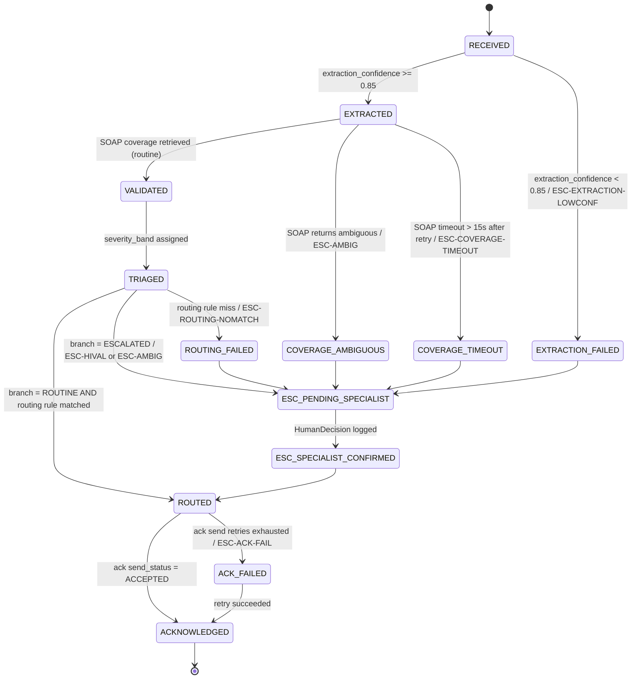
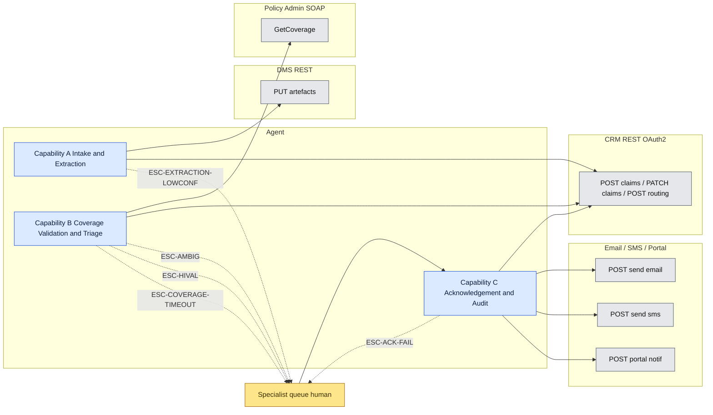

# Agent Specification — Gate 1 (FNOL)

## Front-matter

- **Submission ID:** `agent-specification-gate-scenario-612`
- **Source scenario:** [`../gate-scenario.md`](../gate-scenario.md) (verbatim from [`../SupportingDocs/Gate1-Participant-Pack.md`](../SupportingDocs/Gate1-Participant-Pack.md) §3)
- **Upstream deliverables:**
  - Deliverable 1 — [`./problem-statement-gate-scenario-317.md`](./problem-statement-gate-scenario-317.md) (success metrics M1–M5; A1–A7 assumptions).
  - Deliverable 2 — [`./delegation-analysis-gate-scenario-503.md`](./delegation-analysis-gate-scenario-503.md) (work inventory T1–T15; hard constraints HC1–HC4; D1–D7 assumptions).
  Both treated as authoritative for boundary, metrics, and upstream assumption numbering. This file does not silently re-derive any of them.
- **Date produced:** 27.04.2026
- **Status:** Gate 1 timed-exercise draft, no coach-session validation possible per Pack §2. All assumptions in §2 sit at **Medium** or **Low** by construction; **High** is not available for this deliverable.

---

## 2. Assumption Log

> Scoped to assumptions that load-bear on the agent spec itself — feasibility (API shapes, retry semantics, latency budgets) and viability (audit retention, idempotency, governance). Upstream A1–A7 (problem statement) and D1–D7 (delegation analysis) are referenced where they share an anchor; this register is not a duplicate. Per Pack §2, no entry can carry **High** confidence.

### 2.1 Scan table

| # | Source | Assumption (one line) | Cagan risk | Confidence | What's at risk if wrong | Build-blocking? |
|---|---|---|---|---|---|---|
| S1 | AGENT | Legacy Policy Admin SOAP exposes a `GetCoverage(policyId, lossDate)` operation returning `{inForce, coverageType, deductible, limit}` with p95 latency ≤ 15s and ≥ 99% availability. | Feasibility | Low | Capability B §5.B.5 R-B-3 (validation rule); Integration §6.2 request/response envelope; SLA budget. (Same anchor as upstream D2 / A7.) | **Yes** — cannot define the SOAP envelope without the WSDL. |
| S2 | AGENT | CRM exposes REST endpoints `POST /claims`, `PATCH /claims/{id}`, `POST /claims/{id}/routing` under OAuth 2.0 client-credentials with scopes `claim.write`, `routing.write`. | Feasibility | Low | Capability A §5.A.5 R-A-2 (claim creation); Capability B §5.B.5 R-B-7 (routing assignment); Integration §6.1. | **Yes** — cannot define request paths without the API catalogue. |
| S3 | AGENT | DMS exposes a `PUT /artefacts/{idempotency_key}` REST endpoint accepting up to 25 MB payloads with API-key auth. | Feasibility | Low | Capability A §5.A.5 R-A-1 (raw-payload persistence); Integration §6.3. | **Yes** — cannot define the payload-store call without the API. |
| S4 | AGENT | Acknowledgement uses three transactional channels: a transactional-email API (SendGrid-class), an SMS gateway (Twilio-class) for phone-originated claims, and a claimant-portal write API for web-originated claims. Channel selection is by FNOLSubmission.source. | Feasibility | Low | Capability C §5.C.5 R-C-2 (channel selection); Integration §6.4. (Same anchor as A5 / D7.) | **Yes** — cannot define the send call without the SDK. |
| S5 | AGENT | Extraction confidence is computed per-field by the extraction model and aggregated to a claim-level score in `[0, 1]`. The threshold for FULLY AGENTIC progression is 0.85; below 0.85 the claim escalates via `ESC-EXTRACTION-LOWCONF`. | Feasibility | Medium | Capability A §5.A.5 R-A-4 (gate to creation); ESC-EXTRACTION-LOWCONF semantics. | No — threshold is participant-set and adjustable. |
| S6 | AGENT | The 2-hour SLA budget allocates as follows for the routine path: ingest+timestamp 5s, extraction ≤ 60s, identity/policy lookup ≤ 5s, coverage validation ≤ 30s (p95) + 15s SOAP timeout, triage <1s, routing ≤ 5s, ack send ≤ 10s. Total p95 ≤ ~2 minutes; the remaining ~118 minutes is reserve for retries and for the escalated-path human action. | Feasibility | Medium | All capability per-step time-out values; ESC-COVERAGE-TIMEOUT condition. | No — budgets are tunable; what matters is that the routine p95 is well inside 2h. |
| S7 | AGENT | Severity bands are S1 (catastrophic / multi-claimant) → S4 (minor, single-vehicle / minor-property), assigned by a published rubric on (peril, reported loss magnitude, injury indicator). | Feasibility | Medium | Capability B §5.B.5 R-B-5 (triage); routing rule table dependency. | No — rubric is internal to the agent. |
| S8 | AGENT | Routing rules are a flat lookup table keyed on `(LOB, peril, geography_state, severity_band)` returning `(adjuster_queue, required_skills[])`. Lookup miss escalates via `ESC-ROUTING-NOMATCH`. | Feasibility | Medium | Capability B §5.B.5 R-B-7. (Same anchor as D3.) | No — table is internal; missing-rule case is escalated. |
| S9 | AGENT | All external-system writes use the idempotency-key format `claim:{claim_id}:{action}:{discriminator}` (e.g. `claim:c-7H3K…:ack:routine:email`); writes are deduplicated for 24 hours. | Feasibility | Medium | All R-x-6 (idempotency rules); Integration §6.* fallback rows. | No — convention; system support assumed. |
| S10 | AGENT | Audit-trail retention defaults to 7 years for `HumanDecision` and `Claim` records (financial-records industry default). The Gate 1 scenario does not name a regulation; this is `[UNKNOWN]` strictly speaking. | Viability | Low | Decision-log retention rows in §5.A.7 / §5.B.7 / §5.C.7. Pack §7 *"Bluffing"* held — flagged as assumption, not asserted. | No — affects storage policy, not buildability. |

### 2.2 Walkthrough / client-validation priority queue (highest leverage first)

Build-blocking unknowns first. None of these resolve before submission.

1. **S1** — SOAP WSDL for `GetCoverage`. Whole of Capability B's validation step is contracted only as a scope-out without it.
2. **S2** — CRM REST API catalogue. Capability A's claim-creation and Capability B's routing writes both depend.
3. **S3** — DMS write API. Capability A's first action.
4. **S4** — Ack-channel SDKs. Capability C's only outbound integration.
5. **D1 (upstream)** — *high-value or ambiguous* trigger definition. Drives ESC-AMBIG / ESC-HIVAL semantics in every capability; flagged in delegation-analysis but felt here as unbuildable escalation logic if tacit.
6. **S10** — retention regime. Affects governance, not boot-up.
7. **S5–S9** — internal tunables; defensible at the Live Walkthrough.

### 2.3 Update protocol

Update assumptions in place — never silently delete. If an assumption is refuted, leave the entry with strikethrough text, append a dated `→ [REVISED]` annotation, and add a new numbered entry for the replacement. **Confidence ratings cannot move to High within the Gate 1 window.** Any spec section whose source label is `[ASSUMED] — S#` must be re-checked when S# changes.

### 2.4 Full entries

**S1 — SOAP `GetCoverage` shape.** *Assumption:* a single SOAP operation answers the four coverage questions (in-force, type, deductible, limit) keyed on `(policyId, lossDate)` with p95 ≤ 15s. *Hypothesis:* if true, Cap B §5.B.5 R-B-3 is buildable from the WSDL alone. If false (e.g. multiple operations required, or paged responses), the validation step's latency budget S6 collapses and the FULLY AGENTIC routine path drops to AGENT-LED WITH HUMAN OVERSIGHT for the slow tail. *How I'd test it:* request the WSDL plus 30-day p95/p99 latency and availability stats. *Confidence:* Low. **Build-blocking.**

**S2 — CRM REST surface.** *Assumption:* claim creation, claim update, and routing assignment are three REST writes under OAuth2 client-credentials with named scopes. *Hypothesis:* if true, Capabilities A and B integrate against documented endpoints; idempotency-key support per S9 is required. If the CRM lacks an idempotency primitive, the agent owns deduplication via a write-log keyed on S9. *How I'd test it:* request the OpenAPI / Swagger and the auth handbook. *Confidence:* Low. **Build-blocking.**

**S3 — DMS write API.** *Assumption:* a single REST `PUT /artefacts/{idempotency_key}` accepts the raw FNOL payload with API-key auth, max 25 MB, and returns a stable artefact URI. *Hypothesis:* if true, Capability A R-A-1 is one call. *How I'd test it:* request the DMS integration guide. *Confidence:* Low. **Build-blocking.**

**S4 — Ack channels.** *Assumption:* three channels with consistent send semantics: transactional-email, SMS, claimant-portal. Each accepts a templated payload and returns a `send_id` and a synchronous accept/reject; delivery status arrives via webhook. *Hypothesis:* if true, Capability C is one switch on FNOLSubmission.source feeding three send shapes. *How I'd test it:* confirm channel ownership and SDK with comms / customer-experience owner. *Confidence:* Low. **Build-blocking.**

**S5 — Extraction confidence threshold = 0.85.** *Assumption:* the 0.85 threshold is a defensible starting point; will tune from production telemetry. *Hypothesis:* if too low, agent over-reaches on garbled intake (silent error risk); if too high, escalation rate rises and M3 throughput target softens. *How I'd test it:* shadow-run on 200 historical FNOLs once the agent is built; tune to maximise M3 subject to M2 ≥ 97% and M5 = 100%. *Confidence:* Medium.

**S6 — SLA budget allocation.** As per the table; tunable from production p95s. *Confidence:* Medium.

**S7 — Severity-band rubric.** *Assumption:* S1–S4 bands keyed on peril + loss magnitude + injury indicator are codifiable. *Hypothesis:* if rubric is tacit (specialist intuition), R-B-5 drops to HUMAN-LED WITH AGENT SUPPORT, mirroring D1 fallback for triage. *How I'd test it:* walk 20 recent claims with the claims operations lead. *Confidence:* Medium.

**S8 — Routing rule table.** Flat lookup; lookup-miss escalates via `ESC-ROUTING-NOMATCH`. *Confidence:* Medium. Same anchor as D3.

**S9 — Idempotency-key convention.** *Assumption:* `claim:{claim_id}:{action}:{discriminator}` is unique per logical write; 24-hour dedup window. *Confidence:* Medium.

**S10 — 7-year retention default.** *Assumption:* claims-records retention sits in the 7-year band typical for financial records; insurer's actual policy may be longer. The scenario is silent. *Hypothesis:* if shorter than 7 years, the spec over-allocates storage; if longer, decision-log retention rows in §5.x.7 must extend. *How I'd test it:* ask compliance / records-management owner. Pack §7 *"Bluffing"* held — flagged, not asserted. *Confidence:* Low.

---

## 3. Capability Set Overview

The agent is decomposed along the natural delegation seams in [`./delegation-analysis-gate-scenario-503.md`](./delegation-analysis-gate-scenario-503.md) §4. T1–T3 form the Intake & Extraction bounded context (no judgement, three external reads/writes); T4–T10 form the Coverage Validation & Triage bounded context (where the *high-value or ambiguous* boundary is enforced); T12–T15 form the Acknowledgement & Audit bounded context (terminal claimant-facing action plus the cross-cutting decision-log surface). T11 (final coverage / liability decision) is HUMAN ONLY per HC3 and stays out of scope for every capability.

1. **Capability A — FNOL Intake & Extraction.** Receives the raw FNOL across email / phone-transcript / web-form, persists the immutable raw payload to DMS, extracts structured fields, creates the canonical `Claim` record in CRM. Owns T1, T2, T3. Hand-off: `Claim` in state `EXTRACTED`.
2. **Capability B — Coverage Validation & Triage.** Validates coverage via Policy Admin SOAP, assigns severity, evaluates the *high-value or ambiguous* trigger, routes the claim — to an adjuster queue (routine) or to a specialist for sign-off (escalated). Owns T4, T5, T6, T7, T8 (boundary), T9, T10. Hand-off: `Claim` in state `ROUTED` (routine) or `ESC_SPECIALIST_CONFIRMED` (escalated).
3. **Capability C — Claimant Acknowledgement & Audit.** Issues acknowledgement on the channel of receipt (or after specialist sign-off on the escalated branch); emits `HumanDecision` events for every human action across the system; surfaces quiet-failure detection signals for Deliverable 4. Owns T12, T13, T14, T15.

The seams are: Cap A → Cap B is a `Claim.state = EXTRACTED` event with `confidence ≥ S5`; Cap B → Cap C is a `Claim.state ∈ {ROUTED, ESC_SPECIALIST_CONFIRMED}` event. Both seams are write-then-event against the CRM as system-of-record (per upstream D5).

---

## 4. Entity Model

### 4.1 `FNOLSubmission`

| Attribute | Type | Required | Constraints | Notes |
|---|---|---|---|---|
| `submission_id` | UUID v4 | Y | PK | Generated on receipt. |
| `source` | enum [`EMAIL`, `PHONE_TRANSCRIPT`, `WEB_FORM`] | Y | | Drives ack-channel selection (S4). |
| `received_at` | timestamp (UTC, ms) | Y | Immutable | SLA clock starts here (HC2). |
| `external_msg_id` | string ≤ 256 | N | Unique per source | For dedup against double-fired webhooks. |
| `raw_text` | string ≤ 200 KB | Y | UTF-8 | Persisted in DMS, referenced by URI. |
| `dms_artefact_uri` | URI | Y after persist | Immutable | Returned by DMS `PUT`. |
| `attachments` | array<URI> ≤ 10 | N | | Each ≤ 25 MB. |
| `created_at`, `updated_at` | timestamp | Y | | |

**Immutability:** `submission_id`, `source`, `received_at`, `raw_text`, `dms_artefact_uri`. **Delete:** soft only; retention 7 years per S10.

### 4.2 `Claim`

| Attribute | Type | Required | Constraints | Notes |
|---|---|---|---|---|
| `claim_id` | string `^c-[A-Z0-9]{10}$` | Y | PK | Deterministic from `submission_id` for idempotency (S9). |
| `submission_id` | UUID | Y | FK → FNOLSubmission | One claim per submission. |
| `policy_id` | string `^[A-Z0-9-]{6,20}$` | Y after `EXTRACTED` | | From extraction. |
| `claimant_id` | UUID | Y after `EXTRACTED` | FK → CRM Party | Resolved in T3. |
| `peril` | enum [`AUTO_COLLISION`, `AUTO_THEFT`, `AUTO_GLASS`, `PROPERTY_FIRE`, `PROPERTY_WATER`, `PROPERTY_THEFT`, `LIABILITY_GL`, `OTHER`] | Y after `EXTRACTED` | | Extraction output. |
| `loss_date` | ISO 8601 date | Y after `EXTRACTED` | ≤ `received_at` date | |
| `severity_band` | enum [`S1`, `S2`, `S3`, `S4`] | Y after `TRIAGED` | | Per S7. |
| `branch` | enum [`ROUTINE`, `ESCALATED`] | Y after `TRIAGED` | | Set by ESC trigger (R-B-6). |
| `state` | enum (see state machine) | Y | | |
| `extraction_confidence` | float `[0,1]` | Y after `EXTRACTED` | | Per S5. |
| `due_at` | timestamp | Y | Immutable; `= received_at + 2h` | HC2. |
| `is_breached` | boolean | — | **Derived**: `now() > due_at AND state != ACKNOWLEDGED`. Do not store. | |
| `created_at`, `updated_at` | timestamp | Y | | |

**State machine** (Mermaid, > 3 states + non-linear → diagram trigger fires):

*Figure 1 — `Claim` state machine. Every transition is named in §5.A.5 / §5.B.5 / §5.C.5. Every dashed escalation has a code defined in §5.x.6.*

**Immutability:** `claim_id`, `submission_id`, `due_at`, `received_at`. **Delete:** soft only; retention 7 years per S10.

### 4.3 `CoverageRecord`

| Attribute | Type | Required | Constraints | Notes |
|---|---|---|---|---|
| `coverage_id` | UUID | Y | PK | |
| `claim_id` | string | Y | FK → Claim | One per claim; latest wins on re-validation. |
| `in_force` | boolean | Y | | SOAP response. |
| `coverage_type` | string | Y | | SOAP response. |
| `deductible` | money (currency, cents) | Y | | SOAP response. |
| `limit` | money | Y | | SOAP response. |
| `validation_confidence` | float `[0,1]` | Y | | Agent-side; 1.0 if SOAP returned cleanly, < 1.0 on partial response. |
| `validator` | enum [`AGENT`, `SPECIALIST`] | Y | | `SPECIALIST` after T5 sign-off. |
| `validated_at` | timestamp | Y | | |

**Delete:** soft only; retention 7 years per S10.

### 4.4 `RoutingAssignment`

| Attribute | Type | Required | Constraints | Notes |
|---|---|---|---|---|
| `assignment_id` | UUID | Y | PK | |
| `claim_id` | string | Y | FK → Claim | Latest assignment is canonical. |
| `adjuster_id` | UUID | Y | FK → CRM Adjuster | |
| `queue` | string | Y | | From routing-rule lookup or specialist override. |
| `state` | enum [`PROPOSED`, `CONFIRMED`, `OVERTURNED`] | Y | | `PROPOSED → CONFIRMED` on adjuster-pickup; `→ OVERTURNED` on adjuster-initiated reassignment within 24h (drives M2). |
| `assigned_at` | timestamp | Y | | |
| `overturn_reason` | string ≤ 256 | N | Required if state = OVERTURNED | |

### 4.5 `Acknowledgement`

| Attribute | Type | Required | Constraints | Notes |
|---|---|---|---|---|
| `ack_id` | UUID | Y | PK | |
| `claim_id` | string | Y | FK | |
| `channel` | enum [`EMAIL`, `SMS`, `PORTAL`] | Y | Must match `FNOLSubmission.source` mapping (S4). | |
| `recipient` | string | Y | Email RFC 5322 / E.164 / portal URI | |
| `template_id` | string | Y | One of named template set | |
| `idempotency_key` | string | Y | Unique; format S9 | |
| `send_status` | enum [`PENDING`, `ACCEPTED`, `REJECTED`, `DELIVERED`, `FAILED`] | Y | | `ACCEPTED` from sync API; `DELIVERED` from webhook. |
| `sent_at` | timestamp | Y on `ACCEPTED` | | |

### 4.6 `HumanDecision`

| Attribute | Type | Required | Constraints | Notes |
|---|---|---|---|---|
| `decision_id` | UUID | Y | PK | |
| `claim_id` | string | Y | FK | |
| `actor_role` | enum [`SPECIALIST`, `SENIOR_ADJUSTER`, `ON_CALL`] | Y | | |
| `actor_id` | UUID | Y | FK → CRM User | |
| `decision_type` | enum [`COVERAGE_AMBIGUOUS_RESOLVED`, `SEVERITY_OVERRIDE`, `ROUTING_CONFIRMED`, `ROUTING_OVERRIDDEN`, `ACK_REVIEW_APPROVED`] | Y | | One enum per upstream T-row that touches the boundary. |
| `decision_value` | JSON | Y | Schema per `decision_type` | |
| `evidence_ref` | URI | Y | Pointer to entity snapshot | Cap C R-C-4 — required for HC4. |
| `decided_at` | timestamp | Y | Immutable | |

**Immutability:** all attributes after creation. **Delete:** never (HC4); retention 7 years per S10.

---

## 5. Capability Specifications

### 5.A — Capability A: FNOL Intake & Extraction

#### 5.A.1 Purpose
Convert any FNOL — across email, phone transcript, or web form — into a canonical `Claim` record in CRM with extracted structured fields, with the original payload preserved immutably in DMS. *Done* from the claimant's perspective: the FNOL is logged and on-clock against the 2h SLA. *Done* from the insurer's perspective: a `Claim` row exists in CRM with a deterministic `claim_id`, an `extraction_confidence` score, and a state of `EXTRACTED` (or a logged `ESC-EXTRACTION-LOWCONF` if the score is below threshold).

#### 5.A.2 Scope
- **In scope:** intake-channel ingestion (T1), DMS persistence of raw payload, entity extraction (T2), identity / policy lookup against CRM and Policy Admin (T3), `Claim` creation with deterministic id.
- **Out of scope:**
  - Coverage validation — Capability B (T4 / T5).
  - Triage and routing — Capability B (T6–T10).
  - Acknowledgement — Capability C (T12 / T13). Cap A finishes well before the 2h SLA window.
  - Phone transcription — upstream of the agent boundary per upstream D4. If transcription quality fails the extraction-confidence gate (S5), the claim escalates via `ESC-EXTRACTION-LOWCONF`; the agent does not re-transcribe.

#### 5.A.3 Inputs

| Input | Type | Required | Validation | Source |
|---|---|---|---|---|
| `source_channel` | enum [`EMAIL`, `PHONE_TRANSCRIPT`, `WEB_FORM`] | Y | enum match | webhook payload |
| `external_msg_id` | string ≤ 256 | Y | non-empty | webhook header |
| `raw_text` | string ≤ 200 KB | Y | UTF-8 decode | webhook body |
| `attachments[]` | array<binary ≤ 25 MB> ≤ 10 items | N | size/count check | webhook multipart |
| `received_at` | ISO 8601 timestamp | Y | within ± 5 min of system clock | webhook header |

#### 5.A.4 Outputs

| Output | Type | Condition | Destination |
|---|---|---|---|
| `FNOLSubmission` row | entity write | always | internal DB |
| Raw payload artefact | DMS PUT | always | DMS `PUT /artefacts/{idem-key}` |
| `Claim` row | entity write | extraction_confidence ≥ 0.85 | CRM `POST /claims` |
| `ESC-EXTRACTION-LOWCONF` event | escalation | extraction_confidence < 0.85 | specialist queue |

#### 5.A.5 Business Rules

1. **R-A-1 (raw persistence)** — The agent **must** PUT the raw FNOL payload to DMS within 5 seconds of receipt, using idempotency-key `claim:{deterministic_claim_id}:dms:raw` (per S9). The PUT **must** complete before any extraction call. *Source:* T1 + S3 + HC2.
2. **R-A-2 (deterministic claim_id)** — The agent **must** derive `claim_id = "c-" + base32(sha256(submission_id)).substring(0,10)` so that retries produce the same id and the CRM write is idempotent. *Source:* S9.
3. **R-A-3 (extraction call)** — The agent **must** call the extraction model with the raw text, returning per-field values and per-field confidence. Aggregate `extraction_confidence = min(field_confidences)` over the required-field set `{policy_id, claimant_name, loss_date, peril}`. *Source:* T2.
4. **R-A-4 (confidence gate)** — IF `extraction_confidence ≥ 0.85` (per S5) THEN proceed to R-A-5. ELSE write `Claim` in state `EXTRACTION_FAILED` and raise `ESC-EXTRACTION-LOWCONF`. *Source:* S5.
5. **R-A-5 (identity / policy lookup)** — The agent **must** resolve `policy_id` to a CRM Policy and a CRM Party via `GET /policies?policy_id=…` within 5s. On 404 → `EXTRACTION_FAILED` + `ESC-POLICY-NOTFOUND`. On 5xx after retry budget → `ESC-CRM-DOWN`. *Source:* T3.
6. **R-A-6 (claim creation idempotency)** — The agent **must** `POST /claims` with header `Idempotency-Key: claim:{claim_id}:create` (S9). On 409 (conflict) the existing row **must** be re-read and the operation **must** be considered successful. The agent **cannot** create a second `Claim` for the same `submission_id`. *Source:* S2 + S9.
7. **R-A-7 (state on success)** — On successful `Claim` create, state **must** be set to `EXTRACTED` and `due_at = received_at + 2h` (immutable, R-B-9 enforces). *Source:* HC2.
8. **R-A-8 (boundary guard)** — The agent **cannot** classify the claim as escalated, **cannot** assign severity, and **cannot** call the SOAP coverage endpoint. Those decisions belong to Capability B per HC1 / HC3. *Source:* delegation-analysis HC1 / HC3 / HC4.
9. **R-A-9 (latency budget)** — End-to-end p95 for Cap A **must** be ≤ 75 seconds (S6 budget: 5s DMS + 60s extraction + 5s lookup + 5s claim create). On budget breach → `ESC-EXTRACTION-SLOW` (notification, not blocking).
10. **R-A-10 (quiet-failure surface)** — The capability **must** emit, per claim: `extraction_confidence`, `dms_put_latency_ms`, `crm_create_latency_ms`, `extraction_total_latency_ms`, plus running aggregates (1-minute window): `extraction_below_threshold_rate`, `dms_5xx_rate`, `crm_5xx_rate`. Detail: Deliverable 4.

#### 5.A.6 Escalation Triggers

| Code | Condition (state + time) | Notify | Action required | SLA |
|---|---|---|---|---|
| `ESC-EXTRACTION-LOWCONF` | `state = EXTRACTION_FAILED` after R-A-4 | specialist queue (intake) | resolve fields manually, set state to `EXTRACTED` or close as invalid | 30 min |
| `ESC-POLICY-NOTFOUND` | R-A-5 returned 404 | specialist queue (intake) | confirm policy / search by claimant attributes | 30 min |
| `ESC-CRM-DOWN` | R-A-5 / R-A-6 5xx after 3 retries (50ms / 250ms / 1.25s) | on-call SRE | restore CRM access | 15 min |
| `ESC-DMS-DOWN` | R-A-1 5xx after 3 retries | on-call SRE | restore DMS access | 15 min |
| `ESC-EXTRACTION-SLOW` *(notification)* | R-A-9 p95 > 75s on a 5-minute window | on-call SRE | investigate; not blocking individual claims | — |

#### 5.A.7 Decision Log

| Decision point | Fields logged | Storage | Retention |
|---|---|---|---|
| `RECEIVED → EXTRACTED` | claim_id, extraction_confidence, latencies, model_version | internal DB + CRM activity | 7 years (S10) |
| `RECEIVED → EXTRACTION_FAILED` | as above + failed_field_confidences | as above | 7 years |
| Any ESC-* raised | trigger code, condition snapshot, recipient | internal DB + CRM activity | 7 years |
| `Claim` create write | request body, response status, idempotency_key | internal DB | 1 year |
| DMS PUT | artefact URI, idempotency_key, response status | internal DB | 1 year |

---

### 5.B — Capability B: Coverage Validation & Triage

#### 5.B.1 Purpose
Confirm whether the policy covers the loss, assign severity, and either route the claim to a routine adjuster queue or escalate it to a specialist for human-in-loop sign-off. This capability owns the agent / human boundary defined in HC1 — the *high-value or ambiguous* test (R-B-6) is where the boundary is operationalised.

#### 5.B.2 Scope
- **In scope:** SOAP coverage validation (T4), ambiguous-coverage escalation (T5 — agent prepares evidence, specialist confirms), severity triage (T6), escalation classification (T7), severity / value override on the escalated branch (T8 — agent prepares evidence, specialist decides), routine routing (T9), escalated routing handoff (T10).
- **Out of scope:**
  - Final coverage / liability decision — **HUMAN ONLY per HC3** (T11). The agent computes and records `CoverageRecord`; it **cannot** decide whether the insurer will pay.
  - Severity / value override decision — AGENT-LED WITH HUMAN OVERSIGHT, the *decision* belongs to the specialist (T8 is HUMAN-LED WITH AGENT SUPPORT in the upstream work inventory). The agent compiles evidence and is forbidden from setting severity on the escalated branch (R-B-12).

#### 5.B.3 Inputs

| Input | Type | Required | Validation | Source |
|---|---|---|---|---|
| `claim_id` | string `^c-[A-Z0-9]{10}$` | Y | exists in `state = EXTRACTED` | Cap A handoff |
| `policy_id` | string | Y | matches Claim | extraction |
| `loss_date` | ISO 8601 date | Y | ≤ today | extraction |
| `peril` | enum (per §4.2) | Y | enum match | extraction |
| `claimant_attributes` | JSON | Y | schema fixed | CRM lookup |

#### 5.B.4 Outputs

| Output | Type | Condition | Destination |
|---|---|---|---|
| `CoverageRecord` row | entity write | always after R-B-3 or R-B-4 | internal DB |
| `Claim.severity_band` | entity update (PATCH) | after R-B-5 | CRM `PATCH /claims/{id}` |
| `Claim.branch` | entity update | after R-B-6 | CRM `PATCH /claims/{id}` |
| `RoutingAssignment` row | entity write | after R-B-7 (routine) or R-B-8 (escalated) | CRM `POST /claims/{id}/routing` |
| Escalation events | escalation | per §5.B.6 | specialist queue |

#### 5.B.5 Business Rules

1. **R-B-1 (entry guard)** — Cap B **must** only operate on a `Claim` in state `EXTRACTED`. Claims in any other state **must** be rejected at the seam.
2. **R-B-2 (policy in-force precheck)** — IF `loss_date < policy.in_force_from OR loss_date > policy.in_force_to` THEN write `CoverageRecord{in_force=false}` and transition `EXTRACTED → COVERAGE_AMBIGUOUS`, raise `ESC-AMBIG`. Reason: policy lapsed at loss date is the canonical ambiguous case.
3. **R-B-3 (SOAP coverage call — routine)** — The agent **must** call Policy Admin SOAP `GetCoverage(policy_id, loss_date)` with timeout 15s (S1). On clean response, write `CoverageRecord{validator=AGENT, validation_confidence=1.0}` and transition `EXTRACTED → VALIDATED`. *Source:* T4 + S1 (build-blocking).
4. **R-B-4 (SOAP coverage timeout / partial)** — IF SOAP times out after 1 retry (15s + 15s = 30s budget) OR returns a partial response (any of `{in_force, coverage_type, deductible, limit}` missing) THEN transition `EXTRACTED → COVERAGE_TIMEOUT` (timeout) or `→ COVERAGE_AMBIGUOUS` (partial), raise `ESC-COVERAGE-TIMEOUT` or `ESC-AMBIG` respectively.
5. **R-B-5 (severity triage — routine)** — IF state = `VALIDATED` THEN apply rubric (S7): `severity_band = f(peril, reported_loss_amount, injury_indicator)`. Transition `VALIDATED → TRIAGED`. The agent **cannot** override the rubric. *Source:* T6 + S7.
6. **R-B-6 (escalation classification — *high-value or ambiguous*)** — IF any of:
   - `severity_band = S1` (catastrophic),
   - `CoverageRecord.in_force = false` OR `CoverageRecord.validation_confidence < 1.0`,
   - `extraction_confidence < 0.95` (low-confidence intake),
   - `reported_loss_amount > escalation_threshold` (per upstream D1; threshold is `[UNKNOWN]` until D1 closes — until then default is reserve-estimate ≥ $50,000, marked S5/D1-derived),
   - any prior-loss flag on the policy (per upstream D1 — pattern flag),
   THEN `Claim.branch = ESCALATED`, raise `ESC-HIVAL` (severity / value driver) or `ESC-AMBIG` (coverage / extraction driver). ELSE `Claim.branch = ROUTINE`. *Source:* T7 + HC1 + upstream D1.
7. **R-B-7 (routine routing)** — IF `branch = ROUTINE AND state = TRIAGED` THEN look up routing rule on `(LOB, peril, geography_state, severity_band)` per S8; write `RoutingAssignment{state=PROPOSED}` via `POST /claims/{id}/routing` with `Idempotency-Key: claim:{claim_id}:routing:routine`. Transition `TRIAGED → ROUTED`. On lookup miss → `ROUTING_FAILED` + `ESC-ROUTING-NOMATCH`.
8. **R-B-8 (escalated routing)** — IF `branch = ESCALATED AND state ∈ {ESC_PENDING_SPECIALIST, COVERAGE_AMBIGUOUS, COVERAGE_TIMEOUT, EXTRACTION_FAILED}` THEN do **not** auto-assign an adjuster. Instead, place the claim on the named specialist queue (per LOB), require a `HumanDecision{decision_type=ROUTING_CONFIRMED}` event before transitioning to `ESC_SPECIALIST_CONFIRMED → ROUTED`. Cap C R-C-4 owns the `HumanDecision` log row.
9. **R-B-9 (`due_at` immutability)** — The agent **cannot** modify `Claim.due_at` after R-A-7 sets it. Any code path that would update `due_at` is a defect.
10. **R-B-10 (idempotency on writes)** — Every `PATCH /claims/{id}` and `POST /claims/{id}/routing` **must** carry an `Idempotency-Key` per S9 format. On 409 conflict, treat as success and re-read.
11. **R-B-11 (boundary guard — ambiguous coverage)** — On `state = COVERAGE_AMBIGUOUS`, the agent **cannot** record the coverage decision; it can only persist the SOAP partial response with `validator=AGENT, validation_confidence < 1.0`. The specialist's resolution is recorded by Cap C R-C-4 as a `HumanDecision{decision_type=COVERAGE_AMBIGUOUS_RESOLVED}`, which then writes a new `CoverageRecord{validator=SPECIALIST, validation_confidence=1.0}` and transitions `COVERAGE_AMBIGUOUS → VALIDATED`. *Source:* HC1 + HC4.
12. **R-B-12 (boundary guard — escalated severity)** — On `branch = ESCALATED`, the agent **cannot** auto-set `severity_band`; the specialist sets it via `HumanDecision{decision_type=SEVERITY_OVERRIDE}`. *Source:* HC1.
13. **R-B-13 (latency budget)** — Cap B end-to-end p95 **must** be ≤ 60s on the routine path (5s entry guard + 30s SOAP budget + 1s triage + 5s routing + safety). On budget breach → `ESC-VALIDATION-SLOW` (notification).
14. **R-B-14 (quiet-failure surface)** — Per claim: `soap_call_latency_ms`, `soap_status`, `crm_patch_latency_ms`, `routing_lookup_hit`, `escalation_branch_taken`. Aggregates: `soap_p95`, `soap_5xx_rate`, `routing_nomatch_rate`, `escalation_rate_5min`. A sustained spike in `escalation_rate_5min` triggers a quiet-failure investigation in Deliverable 4.

#### 5.B.6 Escalation Triggers

| Code | Condition (state + time) | Notify | Action required | SLA |
|---|---|---|---|---|
| `ESC-AMBIG` | `state = COVERAGE_AMBIGUOUS` set by R-B-2/R-B-4 | specialist queue (LOB) | resolve coverage decision; record `HumanDecision{COVERAGE_AMBIGUOUS_RESOLVED}` | 60 min |
| `ESC-HIVAL` | `branch = ESCALATED AND ESC-HIVAL driver in R-B-6` | senior claims specialist (LOB) | confirm severity, reserve, routing; record `HumanDecision{SEVERITY_OVERRIDE, ROUTING_CONFIRMED}` | 60 min |
| `ESC-COVERAGE-TIMEOUT` | `state = COVERAGE_TIMEOUT` set by R-B-4 | specialist queue (LOB) | manual coverage validation; record `HumanDecision{COVERAGE_AMBIGUOUS_RESOLVED}` | 60 min |
| `ESC-SOAP-DOWN` | SOAP 5xx after retry budget on R-B-3 | on-call SRE | restore Policy Admin access; meanwhile claims accumulate on `ESC-COVERAGE-TIMEOUT` queue | 15 min |
| `ESC-ROUTING-NOMATCH` | `state = ROUTING_FAILED` set by R-B-7 | specialist queue (intake) | manual route; record `HumanDecision{ROUTING_OVERRIDDEN}` | 30 min |
| `ESC-VALIDATION-SLOW` *(notification)* | R-B-13 p95 > 60s on 5-minute window | on-call SRE | investigate | — |

#### 5.B.7 Decision Log

| Decision point | Fields logged | Storage | Retention |
|---|---|---|---|
| `EXTRACTED → VALIDATED` | claim_id, soap_status, latency, coverage_record_id | internal DB + CRM | 7 years |
| `EXTRACTED → COVERAGE_AMBIGUOUS / COVERAGE_TIMEOUT` | claim_id, partial_fields, soap_status | as above | 7 years |
| `VALIDATED → TRIAGED` | claim_id, severity_band, rubric_inputs | as above | 7 years |
| `TRIAGED → ROUTED` | claim_id, routing_rule_key, queue, adjuster_id | as above | 7 years |
| `TRIAGED → ESC_PENDING_SPECIALIST` | claim_id, branch, escalation_drivers[] | as above | 7 years |
| Any ESC-* raised | code, snapshot, recipient | as above | 7 years |
| External writes | request, response status, idempotency_key | internal DB | 1 year |

---

### 5.C — Capability C: Claimant Acknowledgement & Audit

#### 5.C.1 Purpose
Issue the 2-hour acknowledgement to the claimant on the channel of receipt (routine path) or after specialist sign-off (escalated path); persist every human decision across the system as an immutable `HumanDecision` event; emit the cross-cutting quiet-failure detection surface. This capability operationalises the M5 boundary-respect metric: every human decision in the system is recorded here.

#### 5.C.2 Scope
- **In scope:** routine claimant acknowledgement (T12), escalated claimant acknowledgement (T13 — agent drafts, specialist signs off), `HumanDecision` event capture for T5 / T8 / T10 / T13 (T14), quiet-failure detection signal aggregation (T15 — surface only; response logic is Deliverable 4).
- **Out of scope:**
  - Adjuster's own work on the claim after pickup — outside agent boundary.
  - Final coverage / liability decision (T11) — HUMAN ONLY per HC3.
  - Multi-touch claimant comms (status updates, follow-ups) — out of pipeline scope per Pack §3.

#### 5.C.3 Inputs

| Input | Type | Required | Validation | Source |
|---|---|---|---|---|
| `claim_id` | string | Y | exists in state ∈ {`ROUTED`, `ESC_SPECIALIST_CONFIRMED`} | Cap B handoff |
| `branch` | enum [`ROUTINE`, `ESCALATED`] | Y | matches Claim | Cap B handoff |
| `recipient_address` | RFC 5322 / E.164 / portal-uri | Y | per channel | CRM Party |
| `assigned_adjuster_name` | string | Y | non-empty | RoutingAssignment |
| `human_decision_event` *(for T14 path)* | JSON envelope | Y on T14 | schema per `decision_type` | upstream T5 / T8 / T10 / T13 |

#### 5.C.4 Outputs

| Output | Type | Condition | Destination |
|---|---|---|---|
| `Acknowledgement` row | entity write | always after R-C-3 | internal DB |
| Outbound transactional message | external write | always | Email API / SMS gateway / Portal API per S4 |
| `HumanDecision` row | entity write | on every upstream T5 / T8 / T10 / T13 boundary event | internal DB (immutable) |
| Quiet-failure metrics stream | metrics emit | continuous | observability stack |

#### 5.C.5 Business Rules

1. **R-C-1 (entry guard)** — Cap C **must** only act on claims in state `ROUTED` (routine) or `ESC_SPECIALIST_CONFIRMED` (escalated). Claims in any other state **must** be rejected.
2. **R-C-2 (channel selection)** — `Acknowledgement.channel` **must** be derived from `FNOLSubmission.source` per S4: `EMAIL → EMAIL`, `WEB_FORM → PORTAL` (with email fallback if portal binding absent), `PHONE_TRANSCRIPT → SMS` (with email fallback if no mobile on file).
3. **R-C-3 (routine ack send)** — IF `branch = ROUTINE` THEN render template `ack-routine-v1` with claim_id, assigned_adjuster_name, next-step text; send via channel-appropriate API with `Idempotency-Key: claim:{claim_id}:ack:routine:{channel}`. On `ACCEPTED`, transition `ROUTED → ACKNOWLEDGED` and write `Acknowledgement{send_status=ACCEPTED, sent_at=now()}`. *Source:* T12.
4. **R-C-4 (`HumanDecision` capture)** — For every upstream specialist action that crosses the boundary (T5 ambiguous-coverage resolution, T8 severity / value override, T10 routing confirmation on the escalated branch, T13 ack sign-off), Cap C **must** write a `HumanDecision` row with `evidence_ref` pointing to the entity snapshot at decision time. The row is immutable per §4.6 and **cannot** be deleted (HC4). *Source:* HC4 + M5 boundary-respect metric.
5. **R-C-5 (escalated ack — specialist sign-off)** — IF `branch = ESCALATED` THEN render template `ack-escalated-v1` (specialist name, escalated-handling next-step text), present to assigned specialist for review, **must not** send until a `HumanDecision{ACK_REVIEW_APPROVED}` is recorded. On approval, send per R-C-3 with idempotency-key `claim:{claim_id}:ack:escalated:{channel}`. *Source:* T13 + HC1.
6. **R-C-6 (ack-send retry)** — On send-API 5xx or timeout (5s budget), retry up to 3 times with backoff 100ms / 500ms / 2.5s. On final failure, transition `ROUTED → ACK_FAILED`, raise `ESC-ACK-FAIL`. The agent **cannot** silently abandon an ack.
7. **R-C-7 (idempotency)** — All ack-send calls **must** carry the S9 idempotency key. Duplicate `ACCEPTED` responses on the same key **must** be treated as the same logical send (no second `Acknowledgement` row).
8. **R-C-8 (boundary guard — escalated branch)** — On the escalated branch, the agent **cannot** send the acknowledgement until R-C-5's `HumanDecision{ACK_REVIEW_APPROVED}` exists. Any code path that bypasses this guard is a defect.
9. **R-C-9 (`HumanDecision` immutability)** — Once written, a `HumanDecision` row's fields **cannot** be modified. Corrections **must** be recorded as a new `HumanDecision` row of `decision_type` indicating supersession, with explicit `evidence_ref` to the row being superseded.
10. **R-C-10 (latency budget)** — Cap C end-to-end p95 (entry → `ACKNOWLEDGED`) **must** be ≤ 30s on the routine path. The escalated path's latency is human-bound and budgeted under `ESC-HIVAL`'s 60-minute SLA.
11. **R-C-11 (quiet-failure surface)** — Per claim: `ack_send_latency_ms`, `ack_send_status`, `template_id`, `branch`. Aggregates (1-minute window): `ack_5xx_rate`, `ack_p95_latency`, `breach_rate_today` (count of claims where `now() > due_at AND state != ACKNOWLEDGED`), `boundary_violation_count` (alerts on any > 0; non-zero is a P0 incident — operationalises M5 = 100%).

#### 5.C.6 Escalation Triggers

| Code | Condition (state + time) | Notify | Action required | SLA |
|---|---|---|---|---|
| `ESC-ACK-FAIL` | `state = ACK_FAILED` after R-C-6 retries | specialist queue + on-call SRE | manual claimant outreach; record `HumanDecision{ACK_REVIEW_APPROVED, manual=true}` | 30 min (within remaining SLA budget) |
| `ESC-BOUNDARY-VIOLATION` | `boundary_violation_count > 0` (R-C-11) | on-call SRE + claims operations lead | P0: stop agent processing for affected branch; investigate | 5 min (page) |
| `ESC-BREACH-RATE` *(notification)* | `breach_rate_today > 5%` | claims operations lead | investigate volume / SOAP / extraction | — |

#### 5.C.7 Decision Log

| Decision point | Fields logged | Storage | Retention |
|---|---|---|---|
| `ROUTED → ACKNOWLEDGED` | claim_id, ack_id, channel, recipient (hashed), template_id, send_status | internal DB + CRM activity | 7 years |
| `ROUTED → ACK_FAILED` | as above + retry_count, last_error | as above | 7 years |
| Every `HumanDecision` write | full row (immutable) | internal DB | **never deleted** (HC4) |
| `ESC-BOUNDARY-VIOLATION` raised | snapshot of violating event, claim_id, agent_action, expected_human_action | internal DB + on-call PagerDuty | 7 years |

---

## 6. Integration Contracts

### 6.1 CRM (modern, REST APIs) — `[CITED Pack §3]`

| Property | Value |
|---|---|
| Purpose | System of record for `Claim`, `RoutingAssignment`; read for Policy / Party (per upstream D5). |
| Protocol | REST / JSON over HTTPS |
| Endpoint | `POST /claims`, `PATCH /claims/{id}`, `POST /claims/{id}/routing`, `GET /policies?policy_id=…`, `GET /parties/{id}` — exact base URL `[UNKNOWN]` (S2). **Build-blocking scope-out:** request the API catalogue / OpenAPI. |
| Authentication | OAuth 2.0 client-credentials, scopes `claim.write`, `claim.read`, `routing.write`, `policy.read`, `party.read`. Secret: `secrets/crm/oauth-client` (assumed S9). |
| Request shape | `POST /claims`: `{claim_id, submission_id, policy_id, claimant_id, peril, loss_date, extraction_confidence, due_at, state="EXTRACTED"}`. `PATCH /claims/{id}`: `{severity_band?, branch?, state}`. `POST /claims/{id}/routing`: `{adjuster_id, queue, state="PROPOSED"}`. Header `Idempotency-Key: …` (S9). |
| Response shape | 200 OK `{id, version, _links}`; 409 Conflict `{existing_id}` — treat as success per R-A-6 / R-B-10. |
| Timeout | 5s per call. |
| Retry logic | 5xx / network: 3 retries at 50ms / 250ms / 1.25s. 4xx: no retry; 400 / 401 / 403 → log + ESC-CRM-DOWN; 404 → branch-specific (R-A-5); 409 → success per idempotency. |
| Rate limit | `[UNKNOWN]` (S2) — assume 100 RPS until confirmed. |
| Fallback | After retry budget: `ESC-CRM-DOWN` to on-call SRE; affected claims park in `EXTRACTION_FAILED` or `ROUTING_FAILED` until restored. No silent abandonment. |
| Data mapping | `Claim.claim_id → /claims.id`; `Claim.policy_id → /claims.policy_id`; `Policy ← /policies.policy_id`; `Party ← /parties.id`; `RoutingAssignment.adjuster_id ← CRM Adjuster id`. |

### 6.2 Policy Admin (legacy, SOAP) — `[CITED Pack §3]`

| Property | Value |
|---|---|
| Purpose | Coverage validation read path: in-force, type, deductible, limit. |
| Protocol | SOAP 1.1 over HTTPS. WSDL `[UNKNOWN]` (S1). **Build-blocking scope-out:** request the WSDL. |
| Endpoint | `[UNKNOWN]` — assumed single operation `GetCoverage(policyId, lossDate) → CoverageResponse`. |
| Authentication | `[UNKNOWN]` — assumed WS-Security UsernameToken or mTLS (S1). Secret: `secrets/policy-admin/svc-account`. |
| Request shape | `<soapenv:Envelope><soapenv:Body><pol:GetCoverage><pol:PolicyId>{policy_id}</pol:PolicyId><pol:LossDate>{ISO}</pol:LossDate></pol:GetCoverage></soapenv:Body></soapenv:Envelope>` *(skeleton — exact namespaces and field names per WSDL when available; flagged S1).* |
| Response shape | `<pol:CoverageResponse><pol:InForce>true|false</pol:InForce><pol:CoverageType>…</pol:CoverageType><pol:Deductible currency="…">…</pol:Deductible><pol:Limit currency="…">…</pol:Limit></pol:CoverageResponse>`. SOAP fault → R-B-4 partial path. |
| Timeout | 15s per call (S1 / S6). |
| Retry logic | 1 retry on timeout / 5xx / SOAP `Server` fault; total budget 30s before R-B-4 timeout path. No retry on `Client` fault (4xx semantics) — `Client.PolicyNotFound` → R-A-5 path; `Client.Auth` → ESC-SOAP-DOWN. |
| Rate limit | `[UNKNOWN]` (S1) — legacy systems often single-digit-RPS; assume 5 RPS, queue overflow → ESC-SOAP-DOWN. |
| Fallback | After retry budget: transition to `COVERAGE_TIMEOUT`, raise `ESC-COVERAGE-TIMEOUT`. The specialist owns manual coverage validation. No silent skip. |
| Data mapping | `policy_id → pol:PolicyId →`; `loss_date → pol:LossDate →`; `← pol:InForce → CoverageRecord.in_force`; `← pol:CoverageType → CoverageRecord.coverage_type`; `← pol:Deductible → CoverageRecord.deductible`; `← pol:Limit → CoverageRecord.limit`. |

### 6.3 Document Management System — `[CITED Pack §3]`

| Property | Value |
|---|---|
| Purpose | Immutable storage of raw FNOL payload + attachments. |
| Protocol | REST / JSON over HTTPS. |
| Endpoint | `PUT /artefacts/{idempotency_key}`, `GET /artefacts/{id}` — exact base URL `[UNKNOWN]` (S3). **Build-blocking scope-out:** request the DMS integration guide. |
| Authentication | API key in header `X-DMS-Key: …`. Secret: `secrets/dms/api-key`. |
| Request shape | `PUT /artefacts/{key}` body: multipart with `payload` (raw text, ≤ 200 KB) + 0..10 `attachments` (≤ 25 MB each). Headers: `X-DMS-Key`, `Content-Type: multipart/mixed`. |
| Response shape | 201 Created `{artefact_uri, content_hash, stored_at}`. 200 OK on idempotent re-PUT (same key, same content). 409 on key collision with different content → P0 ESC-DMS-DOWN (deterministic-key contract violated). |
| Timeout | 30s per call (S6). |
| Retry logic | 3 retries at 200ms / 1s / 5s on 5xx / network. No retry on 4xx. |
| Rate limit | `[UNKNOWN]` (S3) — assume 50 RPS. |
| Fallback | After retry budget: `ESC-DMS-DOWN` to on-call SRE; intake **must not** continue to extraction without DMS persistence (R-A-1). |
| Data mapping | `FNOLSubmission.raw_text → multipart payload →`; `← artefact_uri → FNOLSubmission.dms_artefact_uri`. |

### 6.4 Acknowledgement Channels (Email / SMS / Portal) — `[ASSUMED] — S4`

> The Pack §3 names email / phone / web as intake channels and "acknowledged to the claimant" as the action. Whether the ack channels are a single comms platform or three distinct systems is `[UNKNOWN]` (S4). **Build-blocking scope-out:** confirm channel ownership and SDKs.

| Property | Email (transactional) | SMS (gateway) | Portal |
|---|---|---|---|
| Purpose | Email ack for `EMAIL`-sourced claims (S4). | SMS ack for `PHONE_TRANSCRIPT`-sourced claims. | Portal in-app ack for `WEB_FORM`-sourced claims. |
| Protocol | REST / JSON | REST / JSON | REST / JSON |
| Endpoint | `POST /v3/mail/send` *(SendGrid-class — exact `[UNKNOWN]`)* | `POST /Messages.json` *(Twilio-class — exact `[UNKNOWN]`)* | `POST /portal/notifications` *(internal — `[UNKNOWN]`)* |
| Authentication | Bearer API key. Secret: `secrets/comms/email-api-key`. | HTTP Basic (Account SID + Auth Token). Secret: `secrets/comms/sms`. | OAuth 2.0 client-credentials. Secret: `secrets/portal/oauth-client`. |
| Request shape | `{to, from, template_id, dynamic_template_data: {claim_id, adjuster_name, …}}` + `Idempotency-Key` header. | `{From, To, Body}` + idempotency via dedup key in `Body` metadata header. | `{recipient_party_id, template_id, payload}` + `Idempotency-Key`. |
| Response shape | 202 Accepted `{message_id}` → `Acknowledgement.send_status = ACCEPTED`. 4xx → no retry. 5xx → retry per R-C-6. | Same shape; provider-specific. | 200 OK `{notification_id}`. |
| Timeout | 5s | 5s | 5s |
| Retry logic | 3 retries at 100ms / 500ms / 2.5s on 5xx / timeout. | Same. | Same. |
| Rate limit | `[UNKNOWN]` (S4) — assume 100 RPS per channel. | Same. | Same. |
| Fallback | After retry budget: transition to `ACK_FAILED` (R-C-6), raise `ESC-ACK-FAIL`. Specialist makes manual contact. | Same; if no mobile on file, fall through to email. | Same; if portal binding absent, fall through to email. |
| Data mapping | `Acknowledgement.recipient → to`; `template_id → template_id`; `← message_id → Acknowledgement` provider-id. | Same. | Same. |

---

## 7. Diagrams

The `Claim` state machine in §4.2 already satisfies the *state machine > 3 states* trigger. One additional diagram earns its place: an **integration topology** showing the four named external systems plus the boundary, since the agent talks to four-plus systems with distinct auth profiles and the topology is otherwise scattered across §6.

*Figure 2 — integration topology and boundary. Blue = agent capability; grey = external system; amber = human queue. Dashed `ESC-*` edges are the escalations defined in §5.A.6 / §5.B.6 / §5.C.6. The Specialist → Cap C edge is the `HumanDecision` write path (R-C-4).*

---

## 8. Self-audit (against `production-spec-checklist.md` and Pack §6.3 / §7)

- [x] Every business rule uses **must / will / cannot** (Pack §7 *Hand-waving verbs* not triggered; R-A-1 through R-C-11 reviewed).
- [x] Every numeric threshold is explicit: 0.85 confidence (S5), 2h SLA, 5s/15s/30s/60s/75s timeouts, 3-retry policies, 24h dedup window, 7-year retention, 5%/0% breach thresholds.
- [x] Every conditional has IF/THEN (and ELSE where it exists): R-A-4, R-B-2, R-B-6, R-C-2, R-C-5.
- [x] Every entity has PK, `created_at`, `updated_at`; stateful entities (`Claim`, `RoutingAssignment`, `Acknowledgement`) have explicit state machines (Figure 1 + textual). Pack §7 *Implicit state* not triggered: every state is reachable, has a creator, an invalidator, and a checker.
- [x] Every integration has protocol, endpoint, auth, **request shape**, **response shape**, timeout, retry, rate limit, fallback, data mapping. Where unknown (CRM base URL S2, SOAP WSDL S1, DMS base URL S3, ack-channel SDKs S4), the `[UNKNOWN]` is named and traced to a build-blocking S-entry. Pack §6.3 / §7 *Integration hand-wave* not triggered: silent omission is replaced with explicit scope-out.
- [x] Delegation boundary respected: T11 HUMAN ONLY explicitly out of scope in §5.B.2; HC1 / HC3 cited; boundary-guard rules R-A-8, R-B-11, R-B-12, R-C-8 in place; M5 boundary-respect operationalised by R-C-4 + R-C-9 + the `boundary_violation_count` quiet-failure surface (R-C-11 / `ESC-BOUNDARY-VIOLATION`).
- [x] Every escalation has code, state-and-time condition, role recipient, specific human action, numeric SLA. Codes match Figure 2.
- [x] Every external write is idempotent on a named deterministic key per S9: `claim:{claim_id}:dms:raw`, `claim:{claim_id}:create`, `claim:{claim_id}:routing:{branch}`, `claim:{claim_id}:ack:{branch}:{channel}`.
- [x] Every `[ASSUMED]` and `[UNKNOWN]` traced to a numbered S-entry (or upstream A / D entry).
- [x] **No assumption in §2 carries High confidence** (all S1–S10 sit at Low or Medium per Pack §2 no-coach-session rule).
- [x] No `[TODO]` markers remain. The four build-blocking unknowns (S1–S4) are named scope-outs with concrete resolution plans (request the WSDL / OpenAPI / DMS guide / ack-SDK ownership), satisfying Pack §4's allowance.
- [x] Every state transition, threshold, and escalation can be implemented from this document alone, **except** for the four build-blocking unknowns S1–S4 which require external artefacts (WSDL, OpenAPI, DMS guide, ack SDKs). Pack §6.3 *"Would an AI coding agent need to guess at intent?"* — answer: **no on agent logic; yes on integration envelopes until S1–S4 close**, which is the senior-FDE position in this gate.
- [x] Spec is consistent with upstream M1 (SLA target operationalised by R-A-9 / R-B-13 / R-C-10 latency budgets), M2 (routing-quality operationalised by R-B-7 + RoutingAssignment state machine), M3 (no-touch throughput operationalised by R-A-4 confidence gate + R-B-6 escalation rate), M4 (claimant experience operationalised by R-C-3 + R-C-5 + R-C-11 breach surface), M5 (boundary-respect operationalised by R-C-4 + ESC-BOUNDARY-VIOLATION). Upstream HC1–HC4 honoured in full. No row in the upstream work inventory has been silently re-classified.

**Overall buildability read.** Capabilities A, B, C are **buildable on agent logic alone** from this document — entities, state machines, decision logic, idempotency contracts, retry semantics, and quiet-failure surfaces are concrete. They are **not buildable end-to-end** until four build-blocking unknowns close: S1 (SOAP WSDL — Cap B), S2 (CRM OpenAPI — Cap A + B + C), S3 (DMS guide — Cap A), S4 (ack-channel SDKs — Cap C). All four are named scope-outs with concrete resolution plans (Pack §4). The highest-leverage Live Walkthrough probe is the intersection of S1 and upstream D1: if SOAP coverage is unreliable *and* the *high-value or ambiguous* trigger is tacit, the agent collapses to a triage-and-acknowledge skeleton — that is the worst-case the participant should be prepared to defend. Conversely, if S1 closes cleanly and D1 closes with a codifiable trigger, the spec stands as drafted.

---

## 9. Out of scope for this deliverable

This file covers Pack §4 Deliverable 3 only. It does not cover:

- **Problem statement & success metrics** (Deliverable 1) — see [`./problem-statement-gate-scenario-317.md`](./problem-statement-gate-scenario-317.md).
- **Delegation analysis** (Deliverable 2) — see [`./delegation-analysis-gate-scenario-503.md`](./delegation-analysis-gate-scenario-503.md).
- **Validation design** (Deliverable 4) — happy-path / edge-case / failure-mode / quiet-failure detection. The *surfaces* are named here (R-A-10, R-B-14, R-C-11) but the *detection algorithms and assertions* belong to Deliverable 4.
- **Assumptions & unknowns register** (Deliverable 5) — full client-validation backlog, ≥ 5 genuine unknowns, deduplicated across all five deliverables. The S1–S10 entries above are scoped to this deliverable; Deliverable 5 owns the consolidated register.

