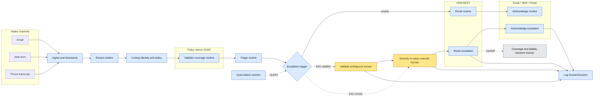

# Delegation Analysis — Gate 1 (FNOL)

## Front-matter

- **Submission ID:** `delegation-analysis-gate-scenario-503`
- **Source scenario:** [`../gate-scenario.md`](../gate-scenario.md) (verbatim from [`../SupportingDocs/Gate1-Participant-Pack.md`](../SupportingDocs/Gate1-Participant-Pack.md) §3)
- **Date produced:** 27.04.2026
- **Status:** Gate 1 timed-exercise draft, no coach-session validation possible per Pack §2. All assumptions in §2 sit at **Medium** or **Low** by construction; **High** is not available for this deliverable. The Live Walkthrough (Pack §5) is a post-submission challenge, not a validation channel that can elevate the document's confidence ratings before submission.
- **Companion deliverables:** problem statement at [`./problem-statement-gate-scenario-317.md`](./problem-statement-gate-scenario-317.md). The boundary-respect metric in §7 of this file is the contract behind M5 in that document; divergence is a defect.

---

## 2. Assumption Log

> Scoped to assumptions that move rows in the work inventory. Companion-deliverable assumptions (problem-statement A1–A7) are referenced where they share an anchor; this register is not a duplicate. Per Pack §2, no assumption here can carry **High** confidence — there is no coach session inside the Gate 1 window. Anything not directly traceable to the scenario or the Pack is an assumption.

### 2.1 Scan table

| # | Source | Assumption (one line) | Cagan risk | Confidence | What's at risk if wrong |
|---|---|---|---|---|---|
| D1 | AGENT | The scenario's *"high-value or ambiguous"* clause can be reduced to a codifiable trigger (reserve-estimate threshold, coverage-confidence threshold, prior-claim flag, missing-key-field flag) the client can articulate. | Value | Low | Every escalated row in §4. If the trigger is tacit, the FULLY AGENTIC vs. AGENT-LED WITH HUMAN OVERSIGHT split is unenforceable and §7's boundary-respect metric is unfalsifiable. (Same anchor as problem-statement A3.) |
| D2 | AGENT | The legacy SOAP policy-admin endpoints can return policy-in-force / coverage / deductible / limit on demand, with latency that fits inside the 2-hour SLA budget for ≥ 95% of calls. | Feasibility | Medium | *Validate against policy coverage — routine* row. If SOAP is unreliable, that row drops from FULLY AGENTIC to AGENT-LED WITH HUMAN OVERSIGHT and the SLA target collapses. (Same anchor as problem-statement A7.) |
| D3 | AGENT | The insurer already maintains routing rules from claim attributes (line of business, peril, geography, severity band) to adjuster queue / skill, even if today they live in heads or spreadsheets rather than CRM config. | Feasibility | Medium | *Route to adjuster — routine* row. If routing is judgement-only, that row drops to HUMAN-LED WITH AGENT SUPPORT and the 18% routing-error baseline ceases to be a fair comparison. |
| D4 | AGENT | Phone-transcript intake is delivered to the agent as text — transcription happens upstream (telephony platform / contact-centre stack), not inside the agent boundary. | Feasibility | Medium | *Intake — phone transcript* row. If transcription is in-scope for the agent, latency budget against the 2-hour SLA tightens and a transcription-quality failure mode is added (Deliverable 4). |
| D5 | AGENT | The system of record for the claim record is the CRM (modern, APIed); the policy admin is queried for coverage data only, not written to from this pipeline. | Feasibility | Medium | *Create / update claim record* row, and the audit-trail row. If claim records live in policy admin, write paths over SOAP become in-scope and several rows shift toward AGENT-LED WITH HUMAN OVERSIGHT for safety. |
| D6 | AGENT | No category of FNOL is reserved by external regulation (state insurance code, NAIC model act, HIPAA, SIU / fraud workflow, workers'-comp jurisdictional rules) to a *human-only* handling path beyond what the scenario's *"high-value or ambiguous"* clause already covers. | Viability | Low | Could add net-new HUMAN ONLY rows that are not present in §4 today. Pack §7 *"Bluffing"* applies — refused to invent regulatory citations; flagged as the open question instead. |
| D7 | AGENT | Acknowledgement returns on the same channel the FNOL arrived on (email-in → email-ack, web → portal/email-ack, phone → SMS/email-ack against contact preference). | Usability | Medium | *Acknowledge to claimant — routine* row. If multi-channel ack is required per claim, the row stays FULLY AGENTIC but its measurement decomposes (M4). (Same anchor as problem-statement A5.) |

### 2.2 Walkthrough / client-validation priority queue (highest leverage first)

This is the queue the participant defends in the Live Walkthrough (Pack §5) and would take into a real client conversation. Under gate conditions none of these get resolved before submission.

1. **D1** — *high-value or ambiguous* trigger. Moves the most rows; without it the boundary is prose, not contract.
2. **D2** — SOAP coverage read-path feasibility. Build-blocking for *Validate against policy coverage*.
3. **D3** — codifiable routing rules. Determines whether *Route — routine* is FULLY AGENTIC or HUMAN-LED WITH AGENT SUPPORT.
4. **D6** — regulatory carve-outs. Could add HUMAN ONLY rows.
5. **D5** — claim system-of-record. Affects integration shape, less the boundary.
6. **D4** — transcription locus. Affects latency budget and Deliverable 4.
7. **D7** — ack channel symmetry. Measurement, not classification.

### 2.3 Update protocol

Update assumptions in place — never silently delete. If an assumption is refuted (e.g. by a Live Walkthrough challenge that surfaces new information), leave the entry with strikethrough text, append a dated `→ [REVISED]` annotation, and add a new numbered entry for the replacement. **Confidence ratings cannot move to High within the Gate 1 window**; regeneration in this gate is driven by *new or revised* assumptions and by *cited* corrections, not by validation upgrades. Any work-inventory row whose source label is `[ASSUMED] — D#` must be re-checked when D# changes; divergence between an updated assumption and an unchanged row is a defect, diagnosed the same way as a spec-vs-code divergence per `SupportingDocs/spec-ambiguity-vs-builder-mistakes.md`.

### 2.4 Full entries

**D1 — *High-value or ambiguous* is codifiable.**
- *Assumption:* The client can articulate (formally or informally) the criteria that flip a claim onto the human-oversight branch — e.g. estimated reserve over $X, coverage-validation confidence under Y%, prior-loss pattern, ambiguous coverage language, missing key fields.
- *Hypothesis:* If the criteria are codifiable, escalation classification (row T7 below) is FULLY AGENTIC and M5 is measurable. If they are tacit, escalation classification drops to HUMAN-LED WITH AGENT SUPPORT and M5 becomes unfalsifiable.
- *How I'd test it:* Walk five recent claims with the claims supervisor — three routine, two escalated — and ask "what flagged this one?" Look for a rule, not a vibe. Cannot be tested inside the Gate 1 window.
- *Confidence:* Low. Highest-leverage open question for this deliverable.

**D2 — SOAP coverage read-paths within SLA.**
- *Assumption:* The legacy policy admin's SOAP endpoints answer, for a given policy number + loss date, the four coverage questions (in-force? type? deductible? limit?) within a latency budget that lets the agent complete the four-step pipeline inside 2 hours for ≥ 95% of claims.
- *Hypothesis:* If yes, *Validate — routine* is FULLY AGENTIC. If no (or if SOAP availability is poor), the row drops to AGENT-LED WITH HUMAN OVERSIGHT and the SLA target softens accordingly.
- *How I'd test it:* Ask for SOAP WSDL plus 30-day uptime / p95 latency stats. Pack §7 *"Integration hand-wave"* applies — the gap is named, not designed-around.
- *Confidence:* Medium.

**D3 — Routing rules are codifiable.**
- *Assumption:* The mapping from {line of business, peril, geography, severity band, claimant attributes} → {adjuster queue, skill profile} exists today, even if held in spreadsheets or specialists' heads rather than in CRM.
- *Hypothesis:* If yes, *Route — routine* is FULLY AGENTIC against a deterministic rule table. If no, the row drops to HUMAN-LED WITH AGENT SUPPORT (agent suggests, specialist confirms) and the 18%→3% target in M2 is unreachable.
- *How I'd test it:* Ask the claims operations lead to walk through 10 recent assignments, naming the *why* for each. Look for a stable rule pattern.
- *Confidence:* Medium — typical for mid-size insurers, not guaranteed.

**D4 — Transcription is upstream.**
- *Assumption:* Phone calls are transcribed by the contact-centre / telephony stack and arrive at the agent as text, with a timestamp that reflects the original call-end time.
- *Hypothesis:* If yes, *Intake — phone transcript* is a FULLY AGENTIC text-handling row. If transcription is in-scope, agent owns transcription quality and a new failure mode (silent mistranscription of policy number, claim type, severity cue) lands in Deliverable 4.
- *How I'd test it:* Confirm with contact-centre / IT lead.
- *Confidence:* Medium.

**D5 — CRM is system-of-record for the claim.**
- *Assumption:* New claim records are created and updated in the CRM (modern, REST APIs); the SOAP policy admin is queried for coverage data, not written to.
- *Hypothesis:* If yes, write paths in §4 are CRM REST and well-bounded. If claim records live in policy admin, write-over-SOAP becomes in-scope and idempotency / failure handling get harder — those rows shift toward AGENT-LED WITH HUMAN OVERSIGHT for safety.
- *How I'd test it:* Confirm with the architect; ask for the canonical claim-creation entry point.
- *Confidence:* Medium.

**D6 — No regulatory human-only carve-out.**
- *Assumption:* No external regulation forces a category of FNOL into HUMAN ONLY beyond the scenario's own *"high-value or ambiguous"* clause. Candidate carve-outs the client may yet name: state insurance code prompt-acknowledgement language; SIU / fraud workflow when a claim trips internal flags; jurisdictional workers'-comp rules; HIPAA on medical-claim PHI handling.
- *Hypothesis:* If a carve-out is named, a new HUMAN ONLY row is added to §4 covering the affected branch.
- *How I'd test it:* Ask compliance / legal owner. Pack §7 *"Bluffing"* prohibits inventing the citation; this is held open until the client provides it.
- *Confidence:* Low — these regimes commonly bite in claims, but the scenario does not name them.

**D7 — Ack channel symmetry.**
- *Assumption:* Acknowledgement is sent on the channel the FNOL arrived on, with phone-originated claims using the contact preference on file.
- *Hypothesis:* If symmetric, M4 is a single-event metric per claim. If multi-channel, M4 splits.
- *How I'd test it:* Confirm with comms / customer-experience owner.
- *Confidence:* Medium.

---

## 3. Delegation Framework

Classification uses the four labels from Pack §4 verbatim, mapped to the ATX *Delegation Archetypes* in `SupportingDocs/the-fde.md`:

- **FULLY AGENTIC** — agent executes end-to-end without per-instance human action; rule-governed, reversible, deterministic against named systems. (ATX *Full delegation*.)
- **AGENT-LED WITH HUMAN OVERSIGHT** — agent drafts / proposes / prepares; a named human must act (approve, confirm, sign off) before the system state changes externally. (ATX *Human-in-the-loop*.)
- **HUMAN-LED WITH AGENT SUPPORT** — a human decides; the agent surfaces evidence, drafts options, or compiles context, but does not take the decision. (ATX *AI assistance*.)
- **HUMAN ONLY** — no agent involvement; the work is reserved to humans by regulation, accountability, or scenario constraint. (Outside the ATX delegation continuum.)

Classification is applied at the **task / decision** level, not at the capability level. A single FNOL pipeline step (e.g. *Route to adjuster*) appears as more than one row when its routine path and its escalated path classify differently.

---

## 4. Work Inventory

| # | Step / Task / Decision | Classification | Rationale (why) | Source |
|---|---|---|---|---|
| T1 | **Intake — channel ingestion** (email, web form, phone transcript). Receive the FNOL, timestamp at receipt, persist raw payload to DMS. | FULLY AGENTIC | Rule-governed, deterministic, reversible (raw payload is immutable after capture). The 2-hour SLA clock starts at this step [CITED Pack §3], so any human-in-loop here would consume the budget by design. | [CITED] Pack §3 (channels, SLA) + [ASSUMED] — D4 |
| T2 | **Entity extraction from unstructured text** — claimant name, policy number, loss date, peril, severity cues, contact info. | FULLY AGENTIC | The agent's primary value-add against unstructured intake. Reversible (extracted fields are derived data; raw payload is canonical). Codifiable as NER + structured-output prompting against a schema. Confidence-scored output gates downstream FULLY AGENTIC rows; low-confidence output triggers escalation classification (T7). | [CITED] Pack §3 (unstructured text across 3 channels) |
| T3 | **Identity / policy lookup** — match extracted policy number + claimant identity to a record in CRM and policy admin. | FULLY AGENTIC | Deterministic key-based lookup against named systems with APIs (CRM REST, policy admin SOAP). Reversible (read-only). | [CITED] Pack §3 (CRM with APIs, policy admin SOAP) |
| T4 | **Validate against policy coverage — routine path** — confirm policy in force on loss date, peril covered, deductible / limit retrieved. | FULLY AGENTIC | Deterministic four-question lookup over SOAP. Output is a structured coverage record gating downstream rows; reversible (read-only). | [CITED] Pack §3 (validate against policy coverage) + [ASSUMED] — D2 |
| T5 | **Validate against policy coverage — ambiguous path** — coverage answer is uncertain (lapsed-then-reinstated, contested endorsement, multi-policy stacking, missing key fields). | AGENT-LED WITH HUMAN OVERSIGHT | Coverage decisions are *de facto* payment-precursor decisions in a claims context — silent error here is the silent-failure mode Pack §7 warns about and Deliverable 4 will probe. Agent compiles the coverage record + the ambiguity reason; specialist confirms before the claim moves forward. | [CITED] Pack §3 (*"insist on human oversight for ambiguous claims"*) |
| T6 | **Triage by severity — routine** — assign severity band from extracted entities (peril type, reported loss magnitude, injury indicators) using a published rubric. | FULLY AGENTIC | Codifiable from the rubric; deterministic given inputs; reversible (severity band is metadata that drives routing, not an external commitment). | [CITED] Pack §3 (triage by severity) |
| T7 | **Escalation classification — *high-value or ambiguous* trigger.** Decide whether this claim leaves the routine branch and joins the human-oversight branch. | FULLY AGENTIC *(conditional on D1)* | The *act of testing the trigger* is rule-application, not judgement. The judgement happens downstream when a human decides on the escalated branch (T8, T11). If D1 fails (trigger is tacit), this row drops to HUMAN-LED WITH AGENT SUPPORT. | [CITED] Pack §3 (the clause itself) + [ASSUMED] — D1 |
| T8 | **Severity / value override on the escalated branch** — a specialist sets or confirms severity, reserve estimate, or routing-relevant attributes when T7 has flagged the claim. | HUMAN-LED WITH AGENT SUPPORT | Judgement under uncertainty with downstream payment implications; agent compiles evidence (extracted entities, similar prior claims, coverage record) but does not decide. | [CITED] Pack §3 (oversight clause) |
| T9 | **Route to adjuster — routine** — apply the routing rule table to {LOB, peril, geography, severity, claimant attributes} → adjuster queue / skill, then assign in CRM. | FULLY AGENTIC | Deterministic rule lookup; assignment is reversible (the receiving adjuster can re-queue). Drives M2 (routing-quality). The 18% baseline error rate today is the indictment of human routing under volume; rule-based routing is the explicit improvement lever. | [CITED] Pack §3 (route to adjuster) + [ASSUMED] — D3 |
| T10 | **Route to adjuster — escalated** — claim is on the human-oversight branch; routing assigns to a senior / specialist queue and notifies a named specialist for sign-off before the claim is worked. | AGENT-LED WITH HUMAN OVERSIGHT | Routing itself is rule-based on the escalated branch (senior queue), but the act of *committing* the claim to the adjuster's workload on this branch must surface to a specialist as an explicit decision per the scenario's oversight clause. The specialist confirms or redirects; the agent prepares the assignment record. | [CITED] Pack §3 (oversight clause) + [ASSUMED] — D1 |
| T11 | **Coverage / liability decision** — final determination of whether and how much the insurer will pay. | HUMAN ONLY | Out of pipeline scope per Pack §3 (the four named steps stop at routing + ack); this row exists to close the boundary explicitly. Adjuster authority is reserved by accountability and (typically) by claim-handling licensure / authority limits. | [CITED] Pack §3 (pipeline scope) |
| T12 | **Acknowledge to claimant — routine** — generate and send acknowledgement on the channel of receipt, naming the assigned adjuster, claim number, and next-step expectation. | FULLY AGENTIC | Templated comms. Reversible (a follow-up correction is cheap). Inside the 2-hour SLA budget [CITED]. Any human-in-loop on the routine ack consumes the SLA budget — fixed by §5 hard constraint. | [CITED] Pack §3 (acknowledge to claimant, 2h SLA) + [ASSUMED] — D7 |
| T13 | **Acknowledge to claimant — escalated** — same comms shape, but ack copy is reviewed by the assigned specialist before send when the claim is on the human-oversight branch. | AGENT-LED WITH HUMAN OVERSIGHT | The ack on the escalated branch carries the specialist's name and a different next-step expectation (the claim is being worked by a senior); silent-error cost is higher (claimant-visible misrepresentation). Specialist signs off; agent drafts and sends. | [CITED] Pack §3 (oversight clause + acknowledgement) |
| T14 | **Audit-trail logging of every human decision** — emit `HumanDecision` events with actor, timestamp, decision, evidence reference, and link to the claim entity, for T5 / T8 / T10 / T11 / T13. | FULLY AGENTIC | Pure write-side bookkeeping; the decisions themselves remain with the human, but the act of capturing them is mechanical and must not depend on a human remembering. The boundary-respect metric in §7 is unfalsifiable without it. | Derived from Pack §3 oversight clause + §7 metric definition |
| T15 | **Quiet-failure detection** — agent monitors its own output (extraction confidence, SOAP error rates, coverage-validation timeouts, ack send failures) and raises alerts when patterns shift. | AGENT-LED WITH HUMAN OVERSIGHT | The detection is FULLY AGENTIC; the *response to* a sustained anomaly (pause routine routing? widen escalation trigger? page on-call?) involves a named human action and changes operating state. Owned in detail by Deliverable 4. | Derived (Pack §6.4 *"detect the agent is wrong"*) |

**Conditional rows.** If **D1** fails (the *high-value or ambiguous* trigger is tacit, not codifiable), T7 drops from FULLY AGENTIC to HUMAN-LED WITH AGENT SUPPORT, and T6 / T9 / T12 stop being safe to FULLY AGENTIC at the routine end (because the trigger is what kept the routine branch routine). If **D2** fails (SOAP unreliable), T4 drops to AGENT-LED WITH HUMAN OVERSIGHT and the M1 SLA target collapses. If **D3** fails (routing rules tacit), T9 drops to HUMAN-LED WITH AGENT SUPPORT and M2's target softens. If **D6** is contradicted (a regulatory carve-out is named), one or more new HUMAN ONLY rows are added — they do not replace existing rows, they add to them. None of these conditionals can be closed inside the Gate 1 window per Pack §2.

---

## 5. Hard Constraints on the Boundary

| # | Constraint | Source | Effect on the boundary |
|---|---|---|---|
| HC1 | **Human oversight for high-value or ambiguous claims.** | [CITED] Pack §3 — *"open to full automation where appropriate but insist on human oversight for high-value or ambiguous claims"* | Fixes T5, T8, T10, T13 to AGENT-LED WITH HUMAN OVERSIGHT or stricter. Cannot be designed around. |
| HC2 | **2-hour acknowledgement SLA from receipt.** | [CITED] Pack §3 — *"all within 2 hours of receipt"* | Forces T12 (routine ack) toward FULLY AGENTIC. Any human-in-loop step on the routine ack path would consume the SLA budget and breach by design. Also caps the latency budgets allocated to T2 / T3 / T4 / T6 / T7 / T9. |
| HC3 | **Pipeline scope ends at routing + ack.** | [CITED] Pack §3 — the four named steps are *"triaged by severity, validated against policy coverage, routed to the appropriate adjuster, and acknowledged to the claimant"* | Fixes T11 (final coverage / liability decision) to HUMAN ONLY by exclusion — it is downstream of the boundary the scenario draws. |
| HC4 | **No silent agent decisions on the human-oversight side of the boundary.** | Derived from HC1 + the boundary-respect metric in §7; the metric definition is the contract. | Forces T14 (audit-trail logging) to be present as a FULLY AGENTIC row; without it, HC1 is unfalsifiable. |

No regulatory citation (state insurance code, NAIC model act, HIPAA, jurisdictional workers'-comp rule, internal audit-retention policy) is asserted as a hard constraint here. Any such citation belongs in this table only when the participant can pin the reference; otherwise it is held in **D6** in §2 as an open assumption. Pack §7 *"Bluffing"* applies — the prohibition against inventing regulatory cover is explicit, and the gate provides no channel to confirm one before submission.

---

## 6. Delegation Boundary Diagram

The work inventory has 15 rows and includes a veto / override path at the *high-value or ambiguous* branch — both diagram triggers per `CLAUDE.md` § *Diagrams* fire. Diagram included.

*Figure 1 — delegation boundary (work inventory §4). Blue = FULLY AGENTIC; amber = human-led with or without agent support; grey = HUMAN ONLY (out of pipeline scope). Dashed `ESC-*` edges are escalation transitions; dashed `ALERT` is the quiet-failure feedback edge from T15.*

---

## 7. Boundary-Respect Metric (hand-off to Deliverable 1)

The delegation analysis forces the following non-negotiable into the success-metrics table:

> **100% of claims classified as *high-value or ambiguous* (T7 = ESCALATED) reach a logged `HumanDecision` event before any irreversible action — routing-finalised (T10), payout-precursor coverage confirmation (T5), or claimant-comms-sent on the escalated branch (T13). Zero silent agent decisions on the human-oversight side of the boundary.**

This is the contract behind §5 HC1 and HC4. It must appear verbatim in the M5 row of `Week1/Gate1/Output/problem-statement-{{scenario-slug}}-{NNN}.md`; any softening between the two documents is a defect. The current problem-statement output (`-317`) carries an aligned M5 — confirmed at draft time, re-confirm on regeneration.

---

## 8. Out of scope for this deliverable

This file covers Pack §4 Deliverable 2 only: which parts of FNOL processing are fully agentic, agent-led with human oversight, human-led with agent support, or human only — and why. It does not cover:

- **Problem statement & success metrics** (Deliverable 1) — see [`./problem-statement-gate-scenario-317.md`](./problem-statement-gate-scenario-317.md).
- **Agent specification** (Deliverable 3) — purpose, scope, I/O contracts, decision thresholds, state machines, integration contracts (CRM REST endpoints, policy admin SOAP WSDL, DMS), error handling, retry / fallback. See `Week1/Gate1/Prompts/capability-specification.md` (when authored).
- **Validation design** (Deliverable 4) — happy-path, edge-case, and *quiet-failure* detection, including how the T15 monitor in §4 actually works. See `Week1/Gate1/Prompts/validation-design.md`.
- **Assumptions & unknowns register** (Deliverable 5) — full client-validation backlog, ≥ 5 genuine unknowns, deduplicated across all five deliverables. The seven entries in §2 above are scoped to this deliverable; Deliverable 5 owns the consolidated register. See `Week1/Gate1/Prompts/assumptions-and-unknowns.md`.

