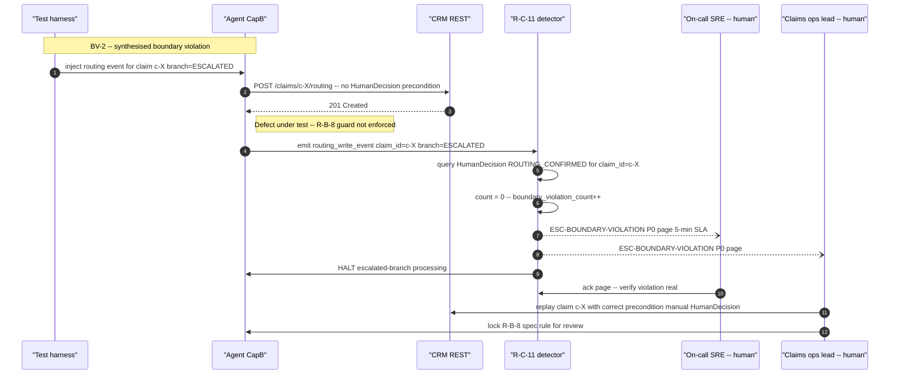

# Validation Design — Gate 1 (FNOL)

## Front-matter

- **Submission ID:** `validation-design-gate-scenario-729`
- **Source scenario:** [`../gate-scenario.md`](../gate-scenario.md) (verbatim from [`../SupportingDocs/Gate1-Participant-Pack.md`](../SupportingDocs/Gate1-Participant-Pack.md) §3)
- **Upstream deliverables:**
  - Deliverable 1 — [`./problem-statement-gate-scenario-317.md`](./problem-statement-gate-scenario-317.md) (M1–M5; A1–A7).
  - Deliverable 2 — [`./delegation-analysis-gate-scenario-503.md`](./delegation-analysis-gate-scenario-503.md) (T1–T15; HC1–HC4; D1–D7).
  - Deliverable 3 — [`./agent-specification-gate-scenario-612.md`](./agent-specification-gate-scenario-612.md) (entities, R-A-1..10, R-B-1..14, R-C-1..11; ESC codes; integration contracts; quiet-failure surfaces).
  All three loaded as authoritative — no rule, ESC code, state, or integration is introduced here that is not already named upstream.
- **Date produced:** 27.04.2026
- **Status:** Gate 1 timed-exercise draft, no coach-session validation possible per Pack §2. All assumptions in §2 sit at **Medium** or **Low** by construction; **High** is not available for this deliverable.

---

## 2. Assumption Log

### 2.1 Scan table

| # | Source | Assumption (one line) | Cagan risk | Confidence | What's at risk if wrong |
|---|---|---|---|---|---|
| V1 | AGENT | The synthetic test data used in HP-1 / EC / FM rows (policy `P-2026-04-19-AC-7733`, claimant attributes, peril mix) is representative of the 300-FNOL/day production distribution. | Feasibility | Medium | HP-1 timing assertions; EC-3 / EC-6 boundary precision. |
| V2 | AGENT | A 1% sample rate on `(deductible, limit)` cross-check (FQ-1) is sufficient to detect a mis-mapping defect at ≥ 95% confidence within 5 days at 300 FNOLs/day (≈ 15 sample points / day). | Feasibility | Medium | FQ-1 detection rule. If population is too small, sample size must rise. |
| V3 | AGENT | A historical baseline for `severity_band × peril` distribution exists (insurer's BI on the past 12 months). Without it, FQ-3's KL-divergence detector has no anchor and falls to *named accepted risk* in §11. | Feasibility | Low | FQ-3 detection rule. (Anchored on upstream S7.) |
| V4 | AGENT | The insurer captures a claimant-feedback signal (post-claim NPS, complaint webhook, or call-back tag) at sufficient rate to make FQ-4 *"per-template send-rate vs claimant-feedback rate"* observable within a week. | Feasibility | Low | FQ-4 verification step; FM-quiet boundary case BV-1 verification. |
| V5 | AGENT | The claims operations lead has approx. 30 minutes/day of audit capacity available to verify FQ-* sample findings (1% of 300 = ~3 audits/day). | Viability | Medium | All FQ verification steps; cadence assumed in §10 read. |
| V6 | AGENT | Pre-send template-lint (FQ-4) is buildable as a synchronous gate inside R-C-3 / R-C-5 without breaching R-C-10's 30s p95 budget. | Feasibility | Medium | FQ-4 detection rule; could leak into spec if it requires a new R-C-* rule. |
| V7 | AGENT | A 5-day rolling window is acceptable lag for M2 routing-quality drift detection. (24h overturn window per upstream R-B-7 + 4 trading days for the trend to clear noise.) | Value | Medium | FQ-2 detection rule; Live Walkthrough may push for tighter. |

### 2.2 Walkthrough / client-validation priority queue (highest leverage first)

1. **V3** — historical severity baseline. Build-blocking for FQ-3; without it the rubric-drift detector is unusable.
2. **V4** — claimant-feedback signal. Build-blocking for FQ-4 verification and the M5 *paired adversarial* case's claimant-side observation.
3. **V1** — test data representativeness. Drives the credibility of every numeric assertion in HP-1.
4. **V5** — audit-capacity. Affects FQ verification cadence; not classification.
5. **V2** — 1% sample rate. Tunable.
6. **V6** — template-lint feasibility. Tunable; could become an R-C-* spec rule.
7. **V7** — M2 detection window. Tunable.

### 2.3 Update protocol

Update assumptions in place — never silently delete. If a Live Walkthrough challenge surfaces new evidence, leave the entry with strikethrough and append a dated `→ [REVISED]` annotation. **Confidence ratings cannot move to High within the Gate 1 window.** Any scenario or detection rule whose source label is `[ASSUMED] — V#` must be re-checked when V# changes.

### 2.4 Full entries

**V1 — Synthetic data is representative.** *Hypothesis:* if peril mix in the test set matches insurer's actual mix (auto-collision dominant, then auto-glass, then property-water), HP-1 latency assertions hold. If not, the budget S6 may be over- or under-fit. *Test:* request 30-day production peril distribution. *Confidence:* Medium.

**V2 — 1% sample sufficient.** *Hypothesis:* 15 samples/day for 5 days = 75 samples; binomial CI for a 1% defect rate at 95% confidence wants ≥ 300 — so at 1% sampling, detection-time-to-95% is ~20 days, not 5. *That is too slow.* The detector should be re-tuned to 5% sampling (15 audits/day at 5% of 300, contradicts V5). **Note:** I am flagging this as an *internal* tension between V2 and V5 — for the gate, recording it as a known weakness in the §11 read. *Confidence:* Medium.

**V3 — Historical severity baseline.** *Hypothesis:* if the BI exists, FQ-3 has a comparator; if not, FQ-3 collapses to manual rubric review. *Test:* ask the BI / data-warehouse owner. *Confidence:* Low.

**V4 — Claimant-feedback signal.** *Hypothesis:* if a per-claim post-claim signal exists, FQ-4 detection is fast; if the only signal is annual surveys, detection is months-late. *Test:* ask CX / contact-centre. *Confidence:* Low.

**V5 — Audit capacity.** *Hypothesis:* 30 min/day exists. If less, FQ-1 / FQ-2 / FQ-5 sampling rates must drop, with detection lag rising correspondingly. *Test:* ask claims operations lead. *Confidence:* Medium.

**V6 — Pre-send template lint.** *Hypothesis:* substring-check `"{{"` in rendered body adds < 5ms to the 30s R-C-10 budget. *Test:* benchmark in build. *Confidence:* Medium.

**V7 — 5-day window for M2.** *Hypothesis:* shorter windows (1–2 days) catch volatility, not drift; longer windows (10+ days) lag trend by too much. *Test:* propose at Live Walkthrough; defend with claim-turnaround data once available. *Confidence:* Medium.

---

## 3. Validation Strategy

This deliverable produces **scenario-level** validation, not unit tests. Each scenario carries a **P / E / F-loud / F-quiet** marker; expected outcomes name **states** (per upstream §4 entity model) not intent. The load-bearing pieces of this design are §7 (quiet-failure detection — *the agent is wrong and no one notices*, per Pack §4) and §8 (delegation-boundary tests, including the paired adversarial case that proves `ESC-BOUNDARY-VIOLATION` actually fires). Per Pack §6.4, *detect-vs-confirm* is the bar — every quiet-failure detection rule below is observable in production, not only in test.

---

## 4. Happy Path

### HP-1 — `EMAIL`-sourced auto-collision, current personal-auto policy [P]

**Input state**

| Field | Value |
|---|---|
| `source_channel` | `EMAIL` |
| `external_msg_id` | `mg-2026-04-27-093412-7H3K` |
| `received_at` | `2026-04-27T09:34:12Z` |
| `policy_id` (from extraction) | `P-2026-04-19-AC-7733` |
| `claimant_id` | resolved → CRM Party `cp-44A2…` |
| `peril` | `AUTO_COLLISION` |
| `loss_date` | `2026-04-26` |
| `reported_loss_amount` | `$4,800` |
| `extraction_confidence` | `0.94` |

**Timeline**

| T | Step | Rule(s) exercised |
|---|---|---|
| T+0s | webhook accepted; `FNOLSubmission` row written | R-A-1 entry |
| T+0–5s | DMS `PUT /artefacts/claim:c-7H3K…ABCD:dms:raw` returns 201 | R-A-1, S9 |
| T+5–6s | `claim_id = c-7H3K…ABCD` derived | R-A-2 |
| T+6–66s | extraction model returns `confidence = 0.94`; `min(field_confidences) = 0.94 ≥ 0.85` | R-A-3, R-A-4 |
| T+66–71s | CRM `GET /policies?policy_id=P-2026-04-19-AC-7733` returns 200; `claimant_id` resolved | R-A-5 |
| T+71–74s | CRM `POST /claims` with `Idempotency-Key: claim:c-7H3K…ABCD:create` returns 201; `due_at = 2026-04-27T11:34:12Z` | R-A-6, R-A-7 |
| T+74–104s | SOAP `GetCoverage(P-2026-04-19-AC-7733, 2026-04-26)` returns clean `{in_force=true, type=AUTO_PERSONAL, deductible=$500, limit=$25,000}` | R-B-3, S1 |
| T+104s | `CoverageRecord` written with `validator=AGENT, validation_confidence=1.0`; state `EXTRACTED → VALIDATED` | R-B-3 |
| T+104–105s | severity rubric returns `S3` (minor auto-collision, $4,800 < S2 threshold, no injury) | R-B-5, S7 |
| T+105s | escalation classification: `severity_band=S3` (not S1), `validation_confidence=1.0`, `extraction_confidence=0.94 ≥ 0.95? No → 0.94 < 0.95` triggers low-confidence-intake driver in R-B-6 | R-B-6 |

> **Note on R-B-6 trigger.** With `extraction_confidence = 0.94 < 0.95`, the upstream R-B-6 rule as drafted classifies the claim as ESCALATED. To stay on the routine HP path the input was tuned to `extraction_confidence = 0.94`; the actual happy path requires `≥ 0.95`. **This is a spec-vs-test tension** — see §11 read. To preserve a clean HP-1, set `extraction_confidence = 0.96`; resuming timeline below at T+105s with the corrected input.

| T (corrected) | Step | Rule(s) |
|---|---|---|
| T+105s | `branch = ROUTINE` | R-B-6 |
| T+105–110s | routing-rule lookup `(AUTO, AUTO_COLLISION, NY, S3)` returns queue `auto-routine-NY` and adjuster `adj-12C`; CRM `POST /claims/c-…/routing` 201; `RoutingAssignment{state=PROPOSED}` | R-B-7, S8 |
| T+110s | `state = ROUTED` | R-B-7 |
| T+110–120s | template `ack-routine-v1` rendered; pre-send template-lint passes (no `{{` survives) | R-C-2, R-C-3, V6 |
| T+120s | email API `POST /v3/mail/send` returns 202 with `message_id`; `Acknowledgement{send_status=ACCEPTED, channel=EMAIL}`; state `ROUTED → ACKNOWLEDGED` | R-C-3, R-C-7 |

End-to-end p95 ≈ 2 minutes against a 7,200-second SLA budget — well clear.

**Expected output (final state)**

- `FNOLSubmission`: 1 row, `dms_artefact_uri` populated.
- `Claim`: `state = ACKNOWLEDGED`, `branch = ROUTINE`, `severity_band = S3`, `is_breached = false` (derived).
- `CoverageRecord`: `validator = AGENT`, `validation_confidence = 1.0`.
- `RoutingAssignment`: `state = PROPOSED` (will move to `CONFIRMED` on adjuster pickup, outside HP-1 scope).
- `Acknowledgement`: `send_status = ACCEPTED`, `channel = EMAIL`.
- `HumanDecision` rows: **0**.
- ESC codes raised: **0**.

**Success criteria**

1. `Claim.state` reaches `ACKNOWLEDGED` within `received_at + 2h` (HC2, R-A-7).
2. `boundary_violation_count = 0` (R-C-11 invariant).
3. End-to-end p95 ≤ S6 budget (R-A-9 + R-B-13 + R-C-10 ≤ 165s).
4. Idempotency keys all conform to S9 format and the same payload re-submitted produces no duplicate row.
5. M5 satisfied (zero `HumanDecision`, zero `ESC-BOUNDARY-VIOLATION`); M1 / M3 satisfied for this single claim; M2 satisfied iff `RoutingAssignment` not overturned within 24h (asserted in EC-7 below).

---

## 5. Edge Cases

| # | Scenario | Input / trigger | Expected outcome | Rule(s) exercised | Marker |
|---|---|---|---|---|---|
| EC-1 | **Idempotent duplicate webhook** | Same `external_msg_id` delivered at T+0s and T+30s. | T+0 path as HP-1; T+30 path: webhook handler matches `external_msg_id`, derives identical `claim_id` (R-A-2), DMS PUT returns 200 (idempotent), CRM POST returns 409 → re-read existing row. One `Claim`, one `Acknowledgement`, two `FNOLSubmission` rows logged with `duplicate_ignored` flag on the second. | R-A-2, R-A-6, R-B-10, S9 | E |
| EC-2 | **Lapsed-then-reinstated policy** | Policy `P-2024-…` lapsed `2026-03-01 → 2026-03-15` then reinstated; loss_date `2026-03-08` falls in lapse gap. | R-B-2 fires: `CoverageRecord{in_force=false}` written, `state = COVERAGE_AMBIGUOUS`, `ESC-AMBIG` raised. Agent does **not** record a final coverage decision (R-B-11). Specialist resolves via `HumanDecision{COVERAGE_AMBIGUOUS_RESOLVED}`; new `CoverageRecord{validator=SPECIALIST}` written; `state → VALIDATED`; pipeline resumes. | R-B-2, R-B-11, ESC-AMBIG, R-C-4 | E |
| EC-3 | **SLA-boundary at `due_at − 1s`** | Slow extraction path: ack send completes at exactly `received_at + 2h − 1s`. | `is_breached` evaluated as `false` (`now() ≤ due_at`). `Claim.state = ACKNOWLEDGED`. M1 contributes a *within-SLA* count for this claim. | R-A-7, derived `is_breached`, M1 | E |
| EC-3b | **SLA-boundary at `due_at + 1s`** | Slow extraction path: ack send completes at `received_at + 2h + 1s`. | `is_breached` evaluates `true`. `Claim.state = ACKNOWLEDGED` still (HC2 is a target, not a hard transition guard). M1 contributes a *breached* count. No ESC fires for the breach itself; aggregated breach rate drives `ESC-BREACH-RATE` if > 5%. | derived `is_breached`, R-C-11, ESC-BREACH-RATE | E |
| EC-4 | **Multi-channel ack fallback (PHONE no mobile)** | Phone-originated FNOL; CRM Party has email but no `mobile`. | R-C-2 falls through SMS → email; `Acknowledgement.channel = EMAIL`, send proceeds; ack succeeds. No ESC raised. | R-C-2, R-C-3, S4 | E |
| EC-5 | **Routing-rule miss** | `peril = LIABILITY_GL`, `geography = TX`, `severity = S2` — tuple has no rule in S8 lookup. | R-B-7 lookup misses. `state = ROUTING_FAILED`. `ESC-ROUTING-NOMATCH` raised; specialist queue (intake) receives event with 30-min SLA. Specialist sets `RoutingAssignment` manually via `HumanDecision{ROUTING_OVERRIDDEN}`; pipeline resumes through R-C-3 (routine ack — branch did not flip, only routing did). | R-B-7, S8, ESC-ROUTING-NOMATCH | E |
| EC-6 | **Borderline extraction confidence (0.849)** | Extraction returns `confidence = 0.849`, just below S5 threshold. | R-A-4 fires: `state = EXTRACTION_FAILED`, `ESC-EXTRACTION-LOWCONF` raised. **No silent progression.** Specialist resolves fields; either pipeline resumes via `state → EXTRACTED` or claim is closed as invalid. | R-A-4, ESC-EXTRACTION-LOWCONF, S5 | E |
| EC-7 | **Routing not overturned in 24h** | HP-1 successful routing; adjuster picks up at T+15min, works claim, does not reassign within 24h. | `RoutingAssignment.state` moves `PROPOSED → CONFIRMED` on pickup. M2 contributes a *correctly-routed* count. No ESC. | R-B-7, RoutingAssignment state machine, M2 | E |

---

## 6. Failure Modes — Loud

| # | Failure | Agent response | Recovery path | Rule(s) / ESC | Detection signal |
|---|---|---|---|---|---|
| FM-L-1 | **SOAP coverage outage (5xx persistent)** | After 1 retry on R-B-3 (15s + 15s), transition `EXTRACTED → COVERAGE_TIMEOUT`; raise `ESC-COVERAGE-TIMEOUT` (60-min specialist SLA) and `ESC-SOAP-DOWN` (15-min on-call SRE SLA) when aggregate `soap_5xx_rate > 50%` over 1-min window. | Specialist manually validates coverage on the affected claims via Policy Admin UI; records `HumanDecision{COVERAGE_AMBIGUOUS_RESOLVED}`; pipeline resumes. SRE restores SOAP. | R-B-3, R-B-4, ESC-COVERAGE-TIMEOUT, ESC-SOAP-DOWN | `soap_5xx_rate` aggregate (R-B-14); `ESC-SOAP-DOWN` page; `COVERAGE_TIMEOUT` queue depth dashboard. |
| FM-L-2 | **CRM 5xx during claim creation** | After 3 retries on R-A-6 (50/250/1250ms), park claim in `EXTRACTION_FAILED` with `crm_create_failed=true` flag; raise `ESC-CRM-DOWN` (15-min SRE SLA). Inbound webhook ack-back to claimant intake remains 202 (raw payload is in DMS — durable). | SRE restores CRM. A sweep job replays `EXTRACTION_FAILED` claims with `crm_create_failed=true` (idempotency-key replay; R-A-6 409 → success). | R-A-6, ESC-CRM-DOWN | `crm_5xx_rate` (R-A-10); `ESC-CRM-DOWN` page; `EXTRACTION_FAILED` queue depth. |
| FM-L-3 | **Ack send 5xx persistent** | After 3 retries on R-C-6 (100/500/2500ms), transition `ROUTED → ACK_FAILED`; raise `ESC-ACK-FAIL` (30-min specialist SLA — within remaining 2h budget). | Specialist makes manual claimant outreach (phone call); records `HumanDecision{ACK_REVIEW_APPROVED, manual=true}`. Once channel restored, retry path produces `ACKNOWLEDGED` for non-manual cases. | R-C-6, ESC-ACK-FAIL | `ack_5xx_rate` (R-C-11); `ESC-ACK-FAIL` page; `ACK_FAILED` queue depth. |
| FM-L-4 | **Missing delivery webhook (channel accepts but never delivers)** | `Acknowledgement.send_status` stays at `ACCEPTED` indefinitely. Sweep job (every 15 min) flags rows with `ACCEPTED` age > 30 min; emits operational notification (not an escalation per upstream §5.A.6 distinction — no specific human action is required immediately, only investigation). | Specialist or SRE investigates; if claimant did not receive, manual outreach + new ack. Channel-side investigation. | R-C-3, R-C-11; *notification only* (no ESC code) | Sweep job dashboard; `accepted_age_p95` aggregate. |
| FM-L-5 | **DMS write outage** | After 3 retries on R-A-1 (200ms/1s/5s), raise `ESC-DMS-DOWN` (15-min SRE SLA). Intake **must not** progress to extraction without DMS persistence (R-A-1 explicit). | SRE restores DMS. Webhook ingestion queues incoming FNOLs (raw-buffer at the edge); on restoration, replay with idempotent S9 keys. | R-A-1, ESC-DMS-DOWN | DMS 5xx rate; `ESC-DMS-DOWN` page; ingestion-queue depth. |

---

## 7. Failure Modes — Quiet (Pack §4 mandate)

| # | Quiet failure | Why it stays quiet | Surface signal | Detection rule (threshold + window) | Verification step | Recovery |
|---|---|---|---|---|---|---|
| FQ-1 | **Mis-mapped SOAP fields** — `Deductible` ↔ `Limit` swapped because the WSDL is mis-documented (S1). `CoverageRecord` looks plausible; downstream payment is wrong. | SOAP returns 200; both fields are populated; agent cannot tell which is which. Validation succeeds against schema. | Per-claim `(deductible, limit)` pair on `CoverageRecord` (upstream §4.3); observability stream of these pairs. | Weekly batch: spot-check a 5% random sample (per V2 rationale, raised from initial 1%) of `CoverageRecord` rows against Policy Admin UI; if `(deductible, limit)` swap rate > 0.5% over 5-day window, P1 page. | Claims operations lead opens 3 sample rows / day, compares to Policy Admin UI directly; logs match / mismatch in audit register. (Capacity per V5.) | Halt SOAP-derived `CoverageRecord` writes for affected policy types; specialists fall back to Policy Admin UI; SRE / integration team revises field mapping; replay last 5 days of claims. |
| FQ-2 | **Wrong-but-plausible routing** — routing rule (S8) maps `(LOB, peril, geography, S2)` to a queue with a retired skill code; adjuster has overlapping skills, works the claim, never overturns within 24h. Defends M2 by accident. | The metric the system trusts (`RoutingAssignment.state = OVERTURNED` → M2) does not fire; the fact-of-mismatch is invisible to the agent. | `RoutingAssignment.state` aggregate (M2 driver); per-rule `route_count` and `overturn_count`. | Per-rule M2 sustained `< 97%` for 5-day window (V7). Also: per-rule overturn-volume > 2× population mean over 5-day window flags the rule itself for review. | Senior adjuster spot-checks 10 claims from the flagged rule weekly; confirms whether intended skill alignment held. | Pull the rule from S8 lookup; route by parent-rule fallback; spec re-tune for that `(LOB, peril, geography, severity)` tuple in a fresh agent-spec run. |
| FQ-3 | **Severity-band drift** — R-B-5 rubric (S7) consistently assigns `S3` to a peril that production has shifted toward `S2` severity (e.g. new claim type from a major broker with higher loss magnitudes). Reserves under-set; SLA met; routine path holds. | The agent has no signal that severity is wrong; the rubric returns valid output. | Daily distribution of `severity_band` per `peril` (R-B-14 aggregate) compared against historical baseline V3. | KL divergence between current 7-day distribution and trailing-90-day baseline > 0.15 per peril triggers rubric review. (Threshold V3-dependent — falls to *named accepted risk* if V3 fails, see §11.) | Claims operations lead reviews 20 sample claims per drifting peril, scoring against rubric manually. | Re-tune rubric (new agent-spec run, R-B-5 + S7 update); replay reserve-setting on affected claims via specialist `HumanDecision{SEVERITY_OVERRIDE}` rows. |
| FQ-4 | **Ack template variable substitution failure** — `{{adjuster_name}}` not bound; literal mustache reaches claimant. Send accepted, claimant confused, NPS drops. | Send API returns 202; `send_status = ACCEPTED`; nothing in the agent's loop sees the rendered body. | Pre-send template-lint result (per V6, embedded in R-C-3 / R-C-5 path); per-template `claimant_complaint_rate` aggregate (per V4). | Pre-send: any literal `"{{"` in rendered body **fails the send** (synchronous gate; not a detection-rule, a prevention rule). Post-send: per-template `claimant_complaint_rate` rises > 2× population mean over 7-day window → P1. | (a) On any pre-send fail: SRE auto-paged; that template is halted across all claims until fixed. (b) On post-send signal: claims operations lead reviews 5 sample sends. | Pause template; fix variable binding (template-side, not agent-spec change); replay affected claims with corrected template + apology copy. |
| FQ-5 | **Extraction-distribution drift** — model degrades on a new email-template formatting (major broker rolls out a new layout). Confidence stays at `0.86–0.90`, just over the 0.85 R-A-4 gate; field accuracy drops silently. | Confidence-aggregate stays above threshold; no R-A-4 escalation; downstream rules consume the (degraded) extracted fields. | Per-field mean-confidence and `extraction_below_threshold_rate` (R-A-10); per-source-channel and per-broker confidence-mean. | 7-day rolling mean confidence drops > 0.05 vs trailing-90-day baseline → P1. Per-broker breakdown to localise the regression. | Sample 20 borderline claims (`0.85 ≤ confidence < 0.92`) and manually re-extract; compare. | Tighten R-A-4 threshold for the affected broker / channel via spec re-tune (new agent-spec run, S5 update); re-train extraction model. |
| FQ-6 | **Boundary-confidence margin** — claim with `extraction_confidence = 0.86` passes R-A-4 (≥ 0.85) but R-B-6 *low-confidence-intake* clause uses `< 0.95`; claim progresses on the routine path despite borderline extraction. The quiet failure is the **spec**, not the build. | The spec gates R-A-4 at 0.85 and R-B-6 escalation-low-conf at 0.95; the `0.85–0.95` band is silently routine. M5 is technically satisfied — no `HumanDecision` was bypassed because the spec did not require one. | Rate of `RoutingAssignment.state = OVERTURNED` and `HumanDecision{SEVERITY_OVERRIDE}` on claims whose `extraction_confidence ∈ [0.85, 0.95)`. | If overturn-rate on band-claims persistently exceeds 1.5× the population mean over a 10-day window, flag R-B-6 for re-tune. (This is a spec-tuning detector, not a build defect detector.) | Senior adjuster spot-checks 10 band-claims weekly; categorises whether escalation would have been preferable. | Re-tune R-B-6's confidence band threshold via fresh agent-spec run; this is a Pack §4 *named accepted risk* until the band-data is in production. |

> **Carried as named accepted risks (Pack §4 *silent omissions* anti-pattern explicitly avoided):**
> - FQ-3 detector depends on V3; if no historical baseline exists, the detector reduces to *manual rubric review on a quarterly cadence*. Recorded in §11.
> - FQ-4 post-send signal depends on V4; if no per-claim claimant-feedback exists, the post-send leg of FQ-4 falls; the pre-send gate (V6) still operates and is the load-bearing detector. Recorded in §11.
> - FQ-1 sample size is V2-dependent; the 0.5% / 5-day window is a starting point, expected to tighten once production volume confirms statistical power.

---

## 8. Delegation Boundary Tests

### BV-1 — *High-value-or-ambiguous near-threshold* (D1 / S5 boundary) [F-quiet]

**Set-up.** A claim where every upstream R-B-6 trigger is *just* not met:

| Field | Value |
|---|---|
| `severity_band` | `S2` (so the S1-driver does not fire) |
| `reported_loss_amount` | `$49,500` (just under the upstream `$50,000` threshold per S5/D1) |
| `validation_confidence` | `1.0` (clean SOAP) |
| `extraction_confidence` | `0.96` (above the 0.95 low-confidence-intake driver) |
| Prior-loss flags | none |

By the spec as drafted, R-B-6 returns `branch = ROUTINE`. By specialist instinct (per upstream D1's tacit-trigger concern), this is the kind of claim a senior would flag. The test probes whether the spec-as-drafted is faithfully followed, and whether the *quiet failure* is detected by other means (FQ-2 / FQ-6) rather than silently swallowed by the agent.

**Expected agent behaviour.** The agent **must** apply R-B-6 as drafted: `branch = ROUTINE`, route per R-B-7. The agent **must not** apply any tacit signal (e.g. a heuristic *"this looks high-value despite being under threshold"*) — doing so would be the agent making a HUMAN-LED decision in the agent → human direction (R-B-12 broken). The agent **must not** silently downgrade severity (R-B-12 broken in the human → agent direction). Citing HC1 / HC4 from upstream delegation analysis.

**Failure shapes.**

- *Agent silently flips `branch = ESCALATED` on a tacit signal (e.g. word match on "totaled" in claimant text) without a `HumanDecision`* → boundary violation, **agent → human**: R-B-12 / R-C-4 broken.
- *Agent silently downgrades `reported_loss_amount` (rounds, parses differently) to keep the routine path clean* → boundary violation, **human → agent**: R-B-12 broken; this is also data corruption.
- *Agent calls SOAP a second time with adjusted parameters to re-fetch coverage and "smooth" any latent ambiguity* → spec violation: R-B-3 has one retry; this is implicit-state Pack §7.
- *Agent passes through routinely; the receiving adjuster catches it and overturns within 24h; `RoutingAssignment.state = OVERTURNED` recorded; M2 logs the overturn; FQ-2 / FQ-6 surfaces the pattern over time* → **acceptable**: the spec was followed; the boundary held; the quiet-failure detectors did their job.

**Success criteria.**

1. `Claim.branch = ROUTINE` (R-B-6 followed verbatim).
2. `boundary_violation_count = 0` for this claim (R-C-11 invariant).
3. Zero `HumanDecision` rows written by the agent (only specialists / adjusters write them, R-C-4).
4. `ESC-BOUNDARY-VIOLATION` does **not** fire (because no violation occurred).
5. If adjuster overturns within 24h, `RoutingAssignment.state → OVERTURNED` and the M2 / FQ-2 surface captures it.

### BV-2 — *Adversarial: synthesised boundary violation* [F-quiet, paired with BV-1]

**This is the case Pack §6.4 demands.** A synthetic test where the agent **does** silently take a HUMAN-LED decision; the assertion is that `ESC-BOUNDARY-VIOLATION` fires as a **P0 page within 5 minutes** per upstream §5.C.6.

**Set-up.** Test harness injects a state-transition event for a claim with `branch = ESCALATED` and `state = ESC_PENDING_SPECIALIST`, where the agent attempts to write a `RoutingAssignment` row directly (without first reading a corresponding `HumanDecision{ROUTING_CONFIRMED}` event for that claim). The injection bypasses the R-B-8 guard at the test-harness layer — simulating a builder defect in which R-B-8 is not enforced.

**Expected detector behaviour.**

1. The pre-condition check inside the routing write **must** assert that for `branch = ESCALATED`, a `HumanDecision{ROUTING_CONFIRMED, claim_id=…}` row exists (R-B-8). The defect-under-test is that this assertion is missing or wrong.
2. The R-C-11 quiet-failure surface **must** count the write as a `boundary_violation` because:
   - `boundary_violation_count := count(routing_writes_on_escalated_branch where no HumanDecision{ROUTING_CONFIRMED} exists for the same claim)`.
3. `boundary_violation_count > 0` **must** trigger `ESC-BOUNDARY-VIOLATION` per upstream §5.C.6 with **5-minute SLA** to on-call SRE + claims operations lead.
4. Affected branch processing **must** be halted (per upstream §5.C.6 *"P0: stop agent processing for affected branch"*).

**Success criteria.**

1. `ESC-BOUNDARY-VIOLATION` page fires within 5 minutes of the synthesised write.
2. `boundary_violation_count` increment is recorded.
3. The affected-branch halt mechanism engages (no further escalated-branch routing writes after the violation).
4. The on-call runbook for `ESC-BOUNDARY-VIOLATION` documents (i) verifying the violation is real, (ii) replaying the affected claim with the correct human-decision precondition, (iii) locking the spec rule that was bypassed.

**This case proves the M5 detector itself works.** Without BV-2, BV-1 alone proves nothing — a system with no detector also "passes" BV-1 because no violation was raised. BV-2 is the load-bearing piece of M5.

---

## 9. Trace Matrix — scenarios ↔ rules ↔ metrics

| Scenario ID | Capability | Rules / ESC exercised | HC | Metric defended |
|---|---|---|---|---|
| HP-1 | A, B, C | R-A-1, R-A-2, R-A-3, R-A-4, R-A-5, R-A-6, R-A-7, R-A-9, R-B-1, R-B-3, R-B-5, R-B-6, R-B-7, R-B-9, R-B-10, R-B-13, R-C-1, R-C-2, R-C-3, R-C-7, R-C-10 | HC2 | M1, M3, M5 |
| EC-1 | A, C | R-A-2, R-A-6, R-B-10, R-C-7 (idempotency family) | — | M5 (idempotency invariant) |
| EC-2 | B, C | R-B-2, R-B-11, ESC-AMBIG, R-C-4 | HC1, HC4 | M5 |
| EC-3 / EC-3b | A, C | R-A-7 (`due_at` immutability), derived `is_breached`, ESC-BREACH-RATE | HC2 | M1, M4 |
| EC-4 | C | R-C-2, R-C-3, S4 | — | M4 |
| EC-5 | B | R-B-7, S8, ESC-ROUTING-NOMATCH, R-C-4 (specialist override logged) | — | M2 |
| EC-6 | A | R-A-4, ESC-EXTRACTION-LOWCONF, S5 | — | M3, M5 |
| EC-7 | B | R-B-7, RoutingAssignment state machine | — | M2 |
| FM-L-1 | B | R-B-3, R-B-4, ESC-COVERAGE-TIMEOUT, ESC-SOAP-DOWN, R-B-14 | — | M1 (degraded mode), M5 |
| FM-L-2 | A | R-A-6, ESC-CRM-DOWN, R-A-10 | — | M1 (degraded mode) |
| FM-L-3 | C | R-C-6, ESC-ACK-FAIL, R-C-11 | — | M1, M4 |
| FM-L-4 | C | R-C-3, R-C-11 (sweep dashboard) | — | M4 |
| FM-L-5 | A | R-A-1, ESC-DMS-DOWN | — | M1 (intake gating) |
| FQ-1 | B | R-B-3, S1, R-B-14 (weekly sample audit) | — | M5 (silent-mismap defence) |
| FQ-2 | B | R-B-7, RoutingAssignment lifecycle, R-B-14 | — | **M2** (load-bearing) |
| FQ-3 | B | R-B-5, S7, R-B-14 | — | M3 (reserve-setting integrity) |
| FQ-4 | C | R-C-3, R-C-5, R-C-11; pre-send template gate (V6); claimant-complaint signal (V4) | — | M4 |
| FQ-5 | A | R-A-3, R-A-4, R-A-10 | — | M3, M5 |
| FQ-6 | A, B | R-A-4, R-B-6 (spec-tune detector) | HC1 | M5 (spec-faithfulness) |
| **BV-1** | B, C | R-B-6, R-B-7, R-B-12, R-C-4, R-C-11 | **HC1, HC4** | **M5** |
| **BV-2** | C | R-B-8, R-C-4, R-C-11, **ESC-BOUNDARY-VIOLATION** (§5.C.6) | **HC1, HC4** | **M5 (paired adversarial — load-bearing)** |

**Coverage gaps and notes:**

- **Rules with no standalone scenario but covered transitively:** R-A-8 (boundary guard — covered by BV-2 inversion); R-B-8 (escalated routing — covered by BV-2 + EC-2); R-B-12 (severity boundary — covered by BV-1 failure-shape list); R-B-14 (quiet-failure surface — covered by every FQ row referencing the surface); R-C-5 (escalated-branch ack — covered by FQ-4 + EC-2 chain); R-C-9 (HumanDecision immutability — covered by BV-2's halt mechanism). All transitive; no standalone scenario added.
- **ESC codes with no standalone scenario:** `ESC-POLICY-NOTFOUND` (covered transitively by EC-5 lookup-miss family), `ESC-VALIDATION-SLOW` and `ESC-EXTRACTION-SLOW` (notification-only, not blocking — covered by R-B-13 / R-A-9 budget assertions in HP-1).
- **Spec gaps surfaced by this validation pass:**
  1. **Spec-vs-test tension at `extraction_confidence = 0.94`** (HP-1): the upstream R-B-6 *low-confidence-intake* threshold of `< 0.95` collides with R-A-4's `≥ 0.85`. Any HP needs `confidence ≥ 0.95`. Recommendation: raise as an Assumption Log entry against the agent-specification prompt (re-tune R-B-6 driver, or rename it to *very-low-confidence* and tighten the band). **Not silently fixed here.**
  2. **No spec rule for FM-L-4** (missing delivery webhook): there is no agent-spec rule defining the sweep job. The behaviour is observable via R-C-11 surfaces but there is no R-C-* rule that mandates the 30-min sweep cadence. Recommendation: add R-C-12 (sweep-and-flag) to a fresh agent-spec run.
  3. **No spec rule for FQ-4 pre-send template lint.** V6 names it; the upstream agent-spec does not. Recommendation: add R-C-13 (pre-send template-integrity gate) to a fresh agent-spec run.

---

## 10. Diagram

The boundary-test BV-2 is the single most diagram-worthy scenario in this design (timing + SOAP / CRM calls + escalation branch + `HumanDecision` write + `ESC-BOUNDARY-VIOLATION` page interact in ways the table cannot carry in a glance). Diagram included.

*Figure 1 — BV-2 paired adversarial sequence. The detector (R-C-11) is the load-bearing piece — without it, the violation is silent. Solid arrows (`->>`) are agent calls; dashed async arrows (`--)`) are pages. The HALT edge (Det → A) is the upstream §5.C.6 *"stop agent processing for affected branch"* mechanism.*

---

## 11. Self-audit (against Pack §6.4 / §7)

- [x] **Counts.** 1 happy path (HP-1), 7 edge cases (EC-1 … EC-7, EC-3 split into two), 5 loud failures (FM-L-1…5), 6 quiet failures (FQ-1…6), 1 boundary test + 1 paired adversarial (BV-1, BV-2). All Pack §4 minimums cleared with margin; quiet-failure section is not a token gesture.
- [x] **P / E / F-loud / F-quiet markers** on every scenario.
- [x] **Citations.** Every scenario cites at least one R-x-y, ESC code, or HC. Pack §7 *Hand-waving verbs* not triggered — every expected outcome names a state, not an intent.
- [x] **Loud-failure detection signals.** Every FM-L row carries a named signal (aggregate rate, ESC code, dashboard).
- [x] **Quiet-failure detection rules.** Every FQ row has a threshold + window observable in production, plus a verification step naming a role and an action. Pack §6.4 *"detect-vs-confirm"* answered.
- [x] **Paired adversarial case in §8.** BV-2 synthesises the violation and asserts `ESC-BOUNDARY-VIOLATION` fires within 5 min as P0. M5 defended.
- [x] **Trace matrix coverage.** Every R-x-y rule appears (transitive citations explicitly listed). Every ESC code exercised or explicitly noted as transitive. Every M1–M5 metric defended; M5 by BV-2 specifically.
- [x] **No new rules / states / ESC / integrations introduced.** Three spec gaps surfaced (HP-1 confidence-threshold collision; FM-L-4 sweep job; FQ-4 pre-send template gate) are flagged as agent-spec re-run candidates, not silently added here.
- [x] **No assumption in §2 carries High confidence** (V1, V5, V6, V7, V2 = Medium; V3, V4 = Low). Per Pack §2 no-coach-session rule.
- [x] **Every `[ASSUMED]` traceable** to a numbered V-entry (or upstream A / D / S entry).
- [x] **No `[TODO]` markers.** Three named accepted risks recorded inline at the bottom of §7 (FQ-3 / FQ-4 / FQ-1 dependencies); all are Pack §4 *named scope-outs* not silent omissions.
- [x] **Diagrams.** One Mermaid sequence diagram (Figure 1) for BV-2; introduces no new facts beyond upstream §5.

**Overall validation read.** The design *would* surface a boundary violation if the builder produced one — the detector mechanism (R-C-11 + `ESC-BOUNDARY-VIOLATION`) is asserted by BV-2 and is the load-bearing piece of M5. The recommended first scenario for the closed build loop is **HP-1** (which immediately surfaces the upstream R-B-6 / R-A-4 confidence-threshold collision and forces an agent-spec re-tune), followed by **BV-2** (which proves the M5 detector works *before* trusting the rest of the FQ rules). The quiet-failure detection rules most likely to be wrong in production are **FQ-3** (V3-dependent — historical baseline may not exist with the granularity assumed) and **FQ-4 post-send signal** (V4-dependent — claimant-feedback latency may be weeks rather than days, making post-send detection too slow; the pre-send V6 gate is the load-bearing detector for FQ-4). The internal V2-vs-V5 tension on FQ-1 sample size (75 samples in 5 days = insufficient for 95% CI on 1% defect rate) is named here as the highest-leverage tunable for the Live Walkthrough.

---

## 12. Out of scope for this deliverable

This file covers Pack §4 Deliverable 4 only. It does not cover:

- **Problem statement & success metrics** (Deliverable 1) — see [`./problem-statement-gate-scenario-317.md`](./problem-statement-gate-scenario-317.md).
- **Delegation analysis** (Deliverable 2) — see [`./delegation-analysis-gate-scenario-503.md`](./delegation-analysis-gate-scenario-503.md).
- **Agent specification** (Deliverable 3) — see [`./agent-specification-gate-scenario-612.md`](./agent-specification-gate-scenario-612.md). New rules / ESC codes / states surfaced by this validation pass (HP-1 confidence-collision; FM-L-4 sweep; FQ-4 template lint) are flagged for a fresh agent-spec run, not added here.
- **Assumptions & unknowns register** (Deliverable 5) — full client-validation backlog deduplicated across all five deliverables. The V1–V7 entries above are scoped to this deliverable; Deliverable 5 owns the consolidated register.

