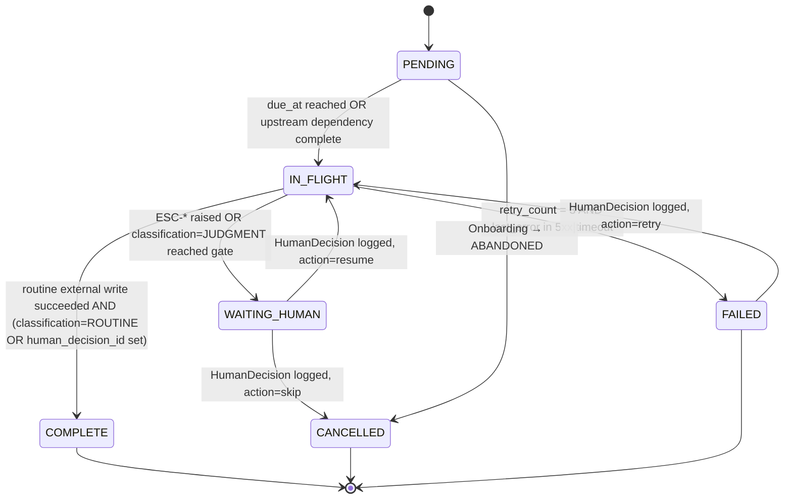
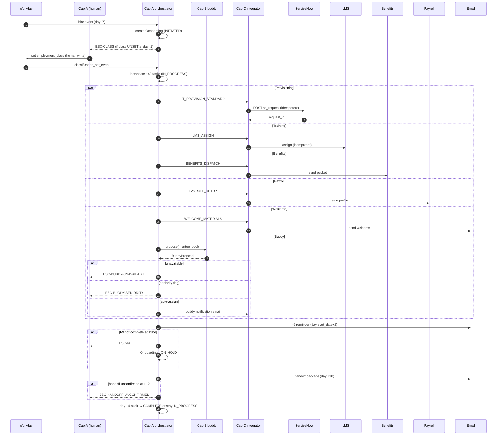

# Capability Specification — Scenario 1 (HR Onboarding Coordination)

## Front-matter

- **Submission ID:** `capability-specification-scenario-1-203`
- **Source scenario:** [`../../scenario-1.md`](../../scenario-1.md)
- **Upstream deliverables:**
  - Problem statement: [`./problem-statement-scenario-1-201.md`](./problem-statement-scenario-1-201.md) — metrics M1–M4 used as the spec's target set; M4 is the boundary-respect non-negotiable.
  - Delegation analysis: [`./delegation-analysis-scenario-1-202.md`](./delegation-analysis-scenario-1-202.md) — work inventory rows 1–22 and hard constraints C1–C4 are authoritative.
- **Date produced:** 24.04.2026
- **Status:** First draft, pre-build-loop. HUMAN assumptions H4, H5, H6 carry **High**; H1, H3, H7 **Medium**; H2 **Low**. AGENT assumptions A5–A9 from the delegation analysis remain load-bearing here; new AGENT assumptions are renumbered A10–A16.

---

## 2. Assumption Log (scoped to the capability spec)

### 2.1 Scan table

| # | Source | Assumption (one line) | Cagan risk | Confidence | Rule / integration / entity at risk if wrong |
|---|---|---|---|---|---|
| H4 | HUMAN | 3-factor buddy filter with named tie-break, one-buddy-per-mentee | Feasibility | High | Cap-B rules 3–6 |
| H5 | HUMAN | Unnamed systems = Benefits + Payroll/Time | Feasibility | High | Integrations §6.5, §6.6 |
| H6 | HUMAN | HR Ops will grant integration access | Viability | High | All FULL rows |
| H7 | HUMAN | I-9 "hold" is regulatory | Viability | Medium | Cap-A rule 11; ESC-I9 wording |
| A5 | AGENT | Buddy "unavailable" = zero-match of unencumbered pool | Feasibility | Medium | Cap-B rule 7; ESC-BUDDY-UNAVAILABLE |
| A6 | AGENT | Tie-break order: dept → location → seniority → random | Feasibility | Medium | Cap-B rule 5 |
| A7 | AGENT | Classification is HUMAN-LED, never inferred | Viability | High (regulatory) | Cap-A rule 12 (boundary guard) |
| A8 | AGENT | Seniority-norm flag = post-filter HUMAN-IN-LOOP exception (not 4th filter factor) | Feasibility | Medium | Cap-B rules 6, 8 |
| A9 | AGENT | Retention: 7y employment, 1y integ audit | Viability | Medium | Decision-log retention across all capabilities |
| A10 | AGENT | LMS vendor + API shape **[UNKNOWN]** (scenario says "a separate LMS" without naming it) | Feasibility | **Build-blocking** | §6.3 completion webhook |
| A11 | AGENT | ServiceNow and Workday tenants have OAuth2 client-credentials flows with service-account creds stored in a secrets manager (name `fde-onboarding-*`) | Feasibility | Medium | §6.1, §6.2 auth |
| A12 | AGENT | Idempotency key for external writes = `sha256("{onboarding_id}:{task_id}:{system}:{action}")` | Feasibility | Medium | Cap-A rule 13; §6 per-system |
| A13 | AGENT | Role-template access bundles exist in ServiceNow as CIs keyed by `role_code`; anything outside the named bundle requires a named approver | Feasibility | Medium | Cap-A rules 4–5; ESC-ACCESS-NONTEMPLATE |
| A14 | AGENT | Business-day calendar = Mon–Fri, client's observed US federal holidays; I-9 3-business-day deadline counts from `start_date` (first day worked) | Viability | Medium | Cap-A rule 11 |
| A15 | AGENT | Day-14 is the onboarding-complete checkpoint (source of M3 denominator); day-10 is the manager-handoff nag | Feasibility | Medium | Cap-A rules 9, 10 |
| A16 | AGENT | Seniority-delta threshold defaults to 3 levels above or below the mentee's band, configurable per HR Ops | Feasibility | Low | Cap-B rule 6 |
| A17 | AGENT | Email transactional sender is a named SMTP relay or transactional API (e.g. SES) with DKIM/SPF on the HR domain; specific vendor **[UNKNOWN]** | Feasibility | Medium | §6.4 |

### 2.2 Coach-session priority queue

1. **A10 (LMS vendor)** — build-blocking for Cap-A's training-assignment completion branch. Highest priority. Without it, ESC-TRAINING-LATE has no detection signal.
2. **A13 (ServiceNow bundle shape)** — directly blocks Cap-A rule 4 and the ESC-ACCESS-NONTEMPLATE trigger.
3. **A5 + A8 + A16 (buddy operational semantics)** — together pin Cap-B's three rules 5, 6, 7.
4. **A14 (business-day calendar)** — touches Cap-A rule 11 (I-9), which is regulatory; wrong calendar = wrong legal-hold timing.
5. **A9 (retention envelope)** — gates every decision-log row.
6. **A11 (auth flavours)** — medium leverage; unknown auth does not block drafting but blocks the first build-loop run.
7. **A12 (idempotency key)** — design choice; coach can confirm but drafting does not wait.
8. **A17 (email sender)** — blocks only the first build-loop run of ESC-* notifications.

### 2.3 Update protocol

Standard: update in place; never silently delete; strikethrough refuted entries and add a new numbered replacement. Changes to the delegation analysis or problem statement are applied by **re-running the upstream prompts and regenerating this file**, not by hand-patching.

### 2.4 Full entries (new AGENT entries only; H* and A5–A9 carried from upstream unchanged)

**A10 — LMS vendor identity is [UNKNOWN]** _(AGENT — Build-blocking; Low effective confidence)_
- **Assumption:** The LMS has an assignment API and a completion webhook.
- **Hypothesis:** Major LMS vendors (Cornerstone, Workday Learning, Docebo, LinkedIn Learning, TalentLMS) all expose both.
- **How I'd test it:** "Which LMS vendor and edition is in use? Can you share the admin console URL and the API/webhook documentation?"
- **Confidence:** Low until vendor is named. Flagged build-blocking per §1 of this deliverable's coach-session queue.

**A11 — Tenant auth flavours for Workday + ServiceNow** _(AGENT — Medium)_
- **Assumption:** OAuth2 client-credentials is supported and a service account can be issued for each.
- **Hypothesis:** Both vendors standardise on OAuth2 client-credentials for machine-to-machine; tenants typically expose `/ccx/oauth2/{tenant}/token` (Workday) and `/oauth_token.do` (ServiceNow).
- **How I'd test it:** Ask the client IT contact for the tenant URL and a service-account provisioning timeline.
- **Confidence:** Medium — common but tenant-specific; legacy basic-auth is still in the wild.

**A12 — Idempotency-key formula** _(AGENT — Medium)_
- **Assumption:** Idempotency key = `sha256("{onboarding_id}:{task_id}:{system}:{action}")` prefixed in the outbound request header.
- **Hypothesis:** A deterministic key per (onboarding, task, system, action) tuple survives retries and is narrow enough that a re-execution of the same intent collides (desirable), while a different action (retry vs. deprovision) does not (desirable).
- **How I'd test it:** Replay test — re-send the same write twice, confirm the external system records one effect.
- **Confidence:** Medium — design is clean but the target systems' idempotency support must be verified per vendor.

**A13 — ServiceNow access bundles** _(AGENT — Medium)_
- **Assumption:** Role-template access bundles are named CIs; outside-template = ESC-ACCESS-NONTEMPLATE to a named approver.
- **Hypothesis:** Most ServiceNow IT-services implementations use catalogue items keyed by role; non-template additions require manager approval.
- **How I'd test it:** "Show the catalogue view filtered by `role_code`; confirm the approver for anything outside template."
- **Confidence:** Medium.

**A14 — Business-day calendar** _(AGENT — Medium)_
- **Assumption:** Mon–Fri excluding client-observed US federal holidays; I-9 3-business-day clock starts on `start_date`.
- **Hypothesis:** IRCA's "three business days" is industry-standard-interpreted as Mon–Fri minus federal holidays; "start_date" = first day actually worked, per Workday's `hireDate`.
- **How I'd test it:** Client's written I-9 procedure.
- **Confidence:** Medium.

**A15 — Day-14 / day-10 milestones** _(AGENT — Medium)_
- **Assumption:** Day-14 is the onboarding-complete checkpoint (driving M3); day-10 is the manager-handoff nag window.
- **Hypothesis:** Scenario specifies "~2 weeks" and names "30-day checkpoint scheduling" and "manager handoff" as separate tasks — suggesting handoff sits earlier than day-30.
- **How I'd test it:** Confirm with HR Ops lead.
- **Confidence:** Medium.

**A16 — Seniority-delta threshold default** _(AGENT — Low)_
- **Assumption:** Default is 3 levels above or below mentee's band; HR Ops can configure.
- **Hypothesis:** Typical career-framework deltas.
- **How I'd test it:** Ask HR Ops for their current rule of thumb.
- **Confidence:** Low.

**A17 — Email sender** _(AGENT — Medium; [UNKNOWN] on vendor)_
- **Assumption:** Transactional email is routed via a named relay with DKIM/SPF.
- **Hypothesis:** Any of SES/SendGrid/Mailgun/client-SMTP is fine from a design standpoint.
- **How I'd test it:** Ask IT for the outbound relay.
- **Confidence:** Medium.

---

## 3. Capability Set Overview

Three capabilities cover every FULL and HUMAN-IN-LOOP row in the work inventory. Capabilities fully downstream of a HUMAN-LED decision (training track, benefits packet dispatch, IT provisioning) are in scope; the HUMAN-LED decisions themselves (classification, benefits election, I-9 hold) are deliberately *not* capabilities of this spec.

1. **Cap-A — Onboarding Orchestrator.** The orchestrating capability. Owns the `Onboarding` and `Task` entities, instantiates the ~40 tasks on hire, schedules time-triggered actions, enforces the state machine, writes the decision log, and fires all `ESC-*` escalations.
2. **Cap-B — Buddy Matcher.** Owns the three-factor filter per H4, the one-buddy-per-mentee invariant, tie-break logic per A6, and the post-filter seniority-norm flag per A8. Proposes a match, which Cap-A persists (or holds pending HR review on the exception path).
3. **Cap-C — System Integrator.** Owns all outbound writes to Workday, ServiceNow, LMS, Benefits, Payroll, Email, and inbound webhooks from LMS (and any others discovered). Enforces idempotency, retry, timeout, and fallback. Cap-A never writes to an external system directly; it always goes through Cap-C.

The agent does not classify, does not elect benefits, does not hold I-9s, and does not decide who overrides a missing buddy. Those are HUMAN-LED rows in the delegation analysis and sit outside every capability here.

---

## 4. Entity Model

### 4.1 `Onboarding`

| Attribute | Type | Required | Constraints | Notes |
|---|---|---|---|---|
| `id` | UUID | Y | PK, immutable | Generated on create. |
| `employee_id` | UUID | Y | FK → Workday worker UUID; immutable | From hire event. |
| `employment_class` | enum [`FULL_EMPLOYEE`, `CONTRACTOR`, `UNSET`] | Y | Default `UNSET`; agent **must not** write `FULL_EMPLOYEE` or `CONTRACTOR` | HUMAN-LED (hard constraint C1). |
| `role_code` | string | Y | Matches ServiceNow `role_code` pattern `/^[A-Z]{2,5}-\d{2,4}$/` | Drives IT bundle lookup. |
| `start_date` | ISO 8601 date (UTC) | Y | ≥ `created_at::date` | First day worked. |
| `status` | enum [`INITIATED`, `IN_PROGRESS`, `ON_HOLD`, `COMPLETE`, `ABANDONED`] | Y | See state machine | Derived-but-stored. |
| `handoff_status` | enum [`PENDING`, `PACKAGE_SENT`, `CONFIRMED`] | Y | Default `PENDING` | Cap-A rule 10. |
| `hold_reason` | enum [`I9_OVERDUE`, `CLASSIFICATION_PENDING`, `MANUAL`] \| null | N | Required iff `status = ON_HOLD` | Hold cause logged. |
| `created_at` | ISO 8601 timestamp (UTC) | Y | Immutable |  |
| `updated_at` | ISO 8601 timestamp (UTC) | Y | Updated on every write |  |
| `created_by` | string (service account id or user id) | Y | Immutable | Agent service account for auto-created. |
| `deleted_at` | ISO 8601 timestamp (UTC) | N | Soft delete; immutable once set; retention 7y per A9 |  |

**State machine** (Mermaid — entity has 5 states + non-linear transitions, diagram trigger fires):

```mermaid
stateDiagram-v2
    [*] --> INITIATED : hire event received
    INITIATED --> IN_PROGRESS : employment_class != UNSET (human write)
    IN_PROGRESS --> ON_HOLD : ESC-I9 unresolved past deadline / HR sets MANUAL hold
    ON_HOLD --> IN_PROGRESS : HR records resolution (HumanDecision logged)
    IN_PROGRESS --> COMPLETE : day-14 audit passes (all required tasks COMPLETE; no open judgment task without HumanDecision)
    INITIATED --> ABANDONED : hire rescinded (Workday event)
    IN_PROGRESS --> ABANDONED : hire rescinded
    ON_HOLD --> ABANDONED : hire rescinded
    COMPLETE --> [*]
    ABANDONED --> [*]
```

*Figure 2 — `Onboarding` lifecycle. Transitions into IN_PROGRESS depend on a human write of `employment_class` — the boundary guard for C1 is enforced at this transition.*

- **Immutability:** `id`, `employee_id`, `start_date`, `created_at`, `created_by`, `deleted_at` (once set).
- **Delete behaviour:** Soft delete only; 7-year retention per A9. Hard delete disallowed while linked `HumanDecision` records exist.

### 4.2 `Task`

| Attribute | Type | Required | Constraints | Notes |
|---|---|---|---|---|
| `id` | UUID | Y | PK, immutable |  |
| `onboarding_id` | UUID | Y | FK → `Onboarding.id`; on delete: restrict | |
| `type` | enum (exhaustive list below) | Y | See §4.2.a | |
| `classification` | enum [`ROUTINE`, `JUDGMENT`] | Y | Set at instantiation from template | M1 + M4 denominators. |
| `status` | enum [`PENDING`, `IN_FLIGHT`, `WAITING_HUMAN`, `COMPLETE`, `FAILED`, `CANCELLED`] | Y | See state machine | |
| `due_at` | ISO 8601 timestamp | Y | Computed at instantiation; immutable after set | Cap-A rule 3. |
| `idempotency_key` | string(64) | Y | Deterministic per A12 | For Cap-C. |
| `human_decision_id` | UUID \| null | N | Required iff `classification = JUDGMENT` AND `status = COMPLETE` | **Enforces M4.** |
| `escalation_code` | string \| null | N | Set when an ESC-* is raised against this task | |
| `retry_count` | int | Y | Default 0; max 3 | Cap-C retry. |
| `created_at` / `updated_at` | ISO 8601 | Y | | |

#### 4.2.a `Task.type` exhaustive enum

`CREATE_ONBOARDING`, `INSTANTIATE_TASKS`, `IT_PROVISION_STANDARD`, `IT_PROVISION_NONTEMPLATE`, `BENEFITS_DISPATCH`, `LMS_ASSIGN`, `PAYROLL_SETUP`, `WELCOME_MATERIALS`, `CHECKPOINT_SCHEDULE_30D`, `BUDDY_PROPOSE`, `BUDDY_ASSIGN`, `I9_REMINDER`, `MANAGER_HANDOFF_PACKAGE`, `MANAGER_HANDOFF_CONFIRM`.

**State machine** (6 states, non-linear — Mermaid triggered):

*Figure 3 — `Task` lifecycle. The WAITING_HUMAN state is the mechanism that enforces the M4 non-negotiable — a JUDGMENT task cannot reach COMPLETE without passing through WAITING_HUMAN and acquiring a `human_decision_id`.*

- **Immutability:** `id`, `onboarding_id`, `type`, `classification`, `due_at` (after set), `idempotency_key`.
- **Delete behaviour:** No hard delete. `CANCELLED` and `FAILED` persist 1y per A9.

### 4.3 `HumanDecision`

| Attribute | Type | Required | Constraints | Notes |
|---|---|---|---|---|
| `id` | UUID | Y | PK, immutable | |
| `task_id` | UUID | Y | FK → `Task.id`; on delete: restrict | |
| `actor_user_id` | string | Y | A *named human* — never an agent service account; enforced at write time | Boundary-respect. |
| `decision` | enum [`APPROVE`, `REJECT`, `HOLD`, `RESUME`, `SKIP`, `OVERRIDE`, `ASSIGN`, `RETRY`] | Y | |
| `reason` | string | Y | Max 2000 chars | Free text; required. |
| `payload` | JSON | N | E.g. override buddy selection; classification value; hold expiry | |
| `decided_at` | ISO 8601 timestamp | Y | Immutable | |
| `created_at` / `updated_at` | ISO 8601 | Y | `updated_at` may move only on amendment (with reason, immutable audit trail) | |

- **Immutability:** `id`, `task_id`, `actor_user_id`, `decision`, `decided_at` — amendments create a new row with `payload.amends = <prior_id>`; the original stays.
- **Delete behaviour:** Never deleted. 7y retention per A9.

### 4.4 `EscalationEvent`

| Attribute | Type | Required | Constraints | Notes |
|---|---|---|---|---|
| `id` | UUID | Y | PK, immutable | |
| `task_id` | UUID | Y | FK → `Task.id` | |
| `code` | enum [`ESC-CLASS`, `ESC-I9`, `ESC-BUDDY-UNAVAILABLE`, `ESC-BUDDY-SENIORITY`, `ESC-ACCESS-NONTEMPLATE`, `ESC-HANDOFF-UNCONFIRMED`, `ESC-INTEG-OUTAGE`, `ESC-TRAINING-LATE`] | Y | §5.1.6 | |
| `recipient_role` | string | Y | E.g. `HR_OPS_LEAD`, `IT_APPROVER`, `HIRING_MANAGER` | |
| `sla_due_at` | ISO 8601 | Y | Computed from fired_at + SLA | |
| `status` | enum [`OPEN`, `RESOLVED`, `BREACHED`] | Y | | |
| `fired_at` / `resolved_at` | ISO 8601 | Y / N | `resolved_at` only when `status=RESOLVED` | |

Retention 7y per A9.

---

## 5. Capability Specifications

### 5.1 Cap-A — Onboarding Orchestrator

#### 5.1.1 Purpose
Instantiate and steward an `Onboarding` from hire event through day-14 audit, honouring the delegation boundary at every gate. "Done" = `Onboarding.status = COMPLETE` with zero open required tasks and every JUDGMENT task carrying a logged `HumanDecision`.

#### 5.1.2 Scope

**In scope:** creating `Onboarding`; instantiating tasks; scheduling time-triggered actions; firing escalations; enforcing state-machine guards; writing the decision log.

**Out of scope:**
- Setting `employment_class` — HUMAN-LED per §2.2 C1.
- Making benefits elections — HUMAN-LED per C3.
- Deciding an I-9 hold — HUMAN-LED per C2 (agent fires `ESC-I9`, does not hold).
- Overriding a missing buddy — HUMAN-LED per work-inventory row #13.
- Executing external writes — delegated to Cap-C.

#### 5.1.3 Inputs

| Input | Type | Required | Validation | Source |
|---|---|---|---|---|
| `workday_hire_event` | JSON `{employee_id: UUID, role_code: regex above, start_date: ISO 8601, manager_id: UUID, location: enum [...], seniority_band: enum [IC1..IC7, M1..M5]}` | Y | Schema validated; `start_date ≥ today` | Workday webhook → Cap-C → Cap-A |
| `classification_set_event` | JSON `{onboarding_id, employment_class, actor_user_id, decided_at}` | Y for transition out of INITIATED | `actor_user_id` must resolve to a named user, never a service account | Workday write observed via webhook |
| `lms_completion_event` | JSON `{lms_assignment_id, onboarding_id, completed_at}` | Y for task COMPLETE | Signature verified | LMS webhook → Cap-C |
| `manager_confirm_event` | JSON `{onboarding_id, actor_user_id, confirmed_at}` | Y | Actor must equal `manager_id` from hire event | UI webhook → Cap-A |
| `hr_decision_event` | JSON `{task_id, decision, reason, payload?, actor_user_id}` | Y for ESC resolutions | Actor role in allowed set for the ESC code | UI / ticketing |

#### 5.1.4 Outputs

| Output | Type | Condition | Destination |
|---|---|---|---|
| `Onboarding` write | DB row | On every state transition | Orchestrator store |
| `Task` batch write | DB rows | On `INSTANTIATE_TASKS` | Orchestrator store |
| External write intent | Queue message to Cap-C | On every task reaching `IN_FLIGHT` with routine action | Cap-C inbound queue |
| `EscalationEvent` row + notification | DB + email (via Cap-C §6.4) | On each ESC-* condition | Recipient role distribution |
| `HumanDecision` row | DB row | On receipt of `hr_decision_event` / `manager_confirm_event` / `classification_set_event` | Decision log |
| Day-14 audit report | JSON, emitted to `HR_OPS_LEAD` distribution | Daily at 06:00 local | Email + dashboard |

#### 5.1.5 Business Rules

1. **Rule 1 — Onboarding creation.** On receipt of a `workday_hire_event` whose `employee_id` does not already have an active (`status ∈ {INITIATED, IN_PROGRESS, ON_HOLD}`) `Onboarding`, the orchestrator **must** create one with `status = INITIATED`, `employment_class = UNSET`, and `hold_reason = null`. If an active `Onboarding` exists for the `employee_id`, the event **must** be logged `duplicate_hire_event` and ignored (no second record created, no error raised upstream).
2. **Rule 2 — Task instantiation.** On transition `INITIATED → IN_PROGRESS` (i.e. `employment_class` is set by a named human), the orchestrator **will** instantiate the full task template for the `employment_class` × `role_code` tuple. Task types are drawn from the §4.2.a enum; each task is given `classification` per template (`IT_PROVISION_NONTEMPLATE`, `BUDDY_ASSIGN` on the seniority-exception path, and `I9_REMINDER` flagged for `WAITING_HUMAN` on overdue are classified `JUDGMENT`; all others `ROUTINE`).
3. **Rule 3 — Deadline computation.** Each task's `due_at` **must** be computed at instantiation as `start_date + offset_days(type)` in business days per A14. The offset table is stored as a configuration artefact; `due_at` is immutable after set. No task's `due_at` may exceed `start_date + 14 business days` (M3 audit boundary).
4. **Rule 4 — IT provisioning routing.** For every `IT_PROVISION_STANDARD` task, Cap-A **must** resolve the access bundle from ServiceNow CIs keyed by `role_code` (per A13) and dispatch via Cap-C §6.2. For any provisioning item that does not match a bundle, a sibling `IT_PROVISION_NONTEMPLATE` task **will** be created with `classification = JUDGMENT` and `ESC-ACCESS-NONTEMPLATE` fired to `IT_APPROVER` with the list of non-template items attached.
5. **Rule 5 — I-9 regulatory guard.** A dedicated `I9_REMINDER` task **will** be instantiated with `due_at = start_date + 3 business days` per IRCA (C2 + A14). On `due_at - 1 business day`, Cap-A **must** dispatch a reminder email to the employee and the hiring manager. If, at `due_at`, Cap-A has not received a Workday signal that I-9 Section 2 is complete, it **must** fire `ESC-I9` to `HR_OPS_LEAD` and transition the `Onboarding` to `ON_HOLD` with `hold_reason = I9_OVERDUE`. Cap-A **cannot** lift the hold; only a `HumanDecision { decision: RESUME }` from HR Ops lifts it.
6. **Rule 6 — OVERDUE is derived, not stored.** A task is OVERDUE iff `status ∈ {PENDING, IN_FLIGHT} AND now() > due_at`. This is computed on read; it is not a stored `status`. The dashboard shows OVERDUE as a derived badge.
7. **Rule 7 — Idempotency for external writes.** Every task handed to Cap-C **must** carry `idempotency_key` per A12. Cap-C guarantees at-most-once effect on the external system; Cap-A's guarantee is that it never retries an intent with a mutated payload under the same key.
8. **Rule 8 — Scheduled day-10 handoff nag.** Per A15, at `start_date + 10 business days`, if `handoff_status ≠ CONFIRMED`, the orchestrator **must** dispatch a handoff-package email to the manager and set `handoff_status = PACKAGE_SENT`. At `start_date + 12 business days`, if still `≠ CONFIRMED`, `ESC-HANDOFF-UNCONFIRMED` **will** fire to `HIRING_MANAGER` and `HR_OPS_LEAD`.
9. **Rule 9 — Day-14 audit.** At `start_date + 14 business days 06:00 local`, Cap-A **must** evaluate each active `Onboarding`. If every required task is `COMPLETE` and every JUDGMENT task carries a non-null `human_decision_id`, it **will** transition to `COMPLETE`. Otherwise it **must** remain `IN_PROGRESS` or `ON_HOLD`; the audit report enumerates the blocking tasks.
10. **Rule 10 — Manager handoff confirmation.** `handoff_status` **cannot** move to `CONFIRMED` on silence or on an agent-synthesised signal. Only a `manager_confirm_event` whose `actor_user_id = Onboarding.manager_id` may make the transition (boundary guard).
11. **Rule 11 — Retry budget.** Any task whose external write fails after `retry_count = 3` with a 5xx or timeout **will** transition to `FAILED`, raise `ESC-INTEG-OUTAGE` to `HR_OPS_LEAD`, and wait for a `HumanDecision { decision: RETRY | SKIP | OVERRIDE }` before moving.
12. **Rule 12 — Boundary guard (C1 + C3 + C2).** Cap-A **cannot** write `Onboarding.employment_class` to any value other than `UNSET`. Cap-A **cannot** transition `Onboarding.status` from `ON_HOLD` to `IN_PROGRESS` without a matching `HumanDecision { decision: RESUME, actor_user_id ≠ agent_service_account }`. Cap-A **cannot** create a `HumanDecision` row where `actor_user_id` resolves to a service account; the DB has a check constraint on this (`actor_user_id NOT LIKE 'svc-%'`). These three checks together enforce C1, C2, C3 of the delegation analysis.
13. **Rule 13 — Decision log completeness.** Every `Task.status` transition, every `Onboarding.status` transition, every `EscalationEvent` fired, every external write intent dispatched to Cap-C, and every `HumanDecision` row **must** produce a row in the decision log (`decision_log_entries` table) carrying `(entity_id, event_type, actor, before, after, timestamp, correlation_id)`. The day-14 audit report's "every JUDGMENT task has a `HumanDecision`" check reads from this log — it is the enforcement point for M4.

#### 5.1.6 Escalation Triggers

| Trigger code | Condition | Who is notified | What the human must do | SLA |
|---|---|---|---|---|
| `ESC-CLASS` | `Onboarding.status = INITIATED` AND `now() > start_date - 1 business day` AND `employment_class = UNSET` | `HR_OPS_LEAD` | Set `employment_class` in Workday | Before `start_date` (≤ 1 business day) |
| `ESC-I9` | I-9 Section 2 not complete at `start_date + 3 business days` | `HR_OPS_LEAD` | Decide hold (HOLD) or waiver with reason (RESUME) | 1 business day |
| `ESC-ACCESS-NONTEMPLATE` | Provisioning request includes items outside the role bundle (per A13) | `IT_APPROVER` | Approve or reject the non-template items | 2 business days |
| `ESC-BUDDY-UNAVAILABLE` | Cap-B returns no candidate for an unencumbered three-factor match (per A5) | `HR_OPS_LEAD` | Assign a buddy manually (ASSIGN with payload = buddy_id) | 3 business days |
| `ESC-BUDDY-SENIORITY` | Cap-B returns a candidate whose seniority delta to mentee > threshold A16 (per A8) | `HR_OPS_LEAD` | Approve proposed buddy (APPROVE) or select alternative (OVERRIDE) | 2 business days |
| `ESC-HANDOFF-UNCONFIRMED` | `handoff_status ≠ CONFIRMED` at `start_date + 12 business days` | `HIRING_MANAGER`, `HR_OPS_LEAD` | Confirm handoff | 1 business day |
| `ESC-INTEG-OUTAGE` | External write failed after `retry_count = 3` with 5xx/timeout | `HR_OPS_LEAD` | Decide RETRY / SKIP / OVERRIDE | 1 business day |
| `ESC-TRAINING-LATE` | LMS completion signal not received by `due_at + 2 business days` | `HR_OPS_LEAD`, `HIRING_MANAGER` | Nudge employee or mark SKIP with reason | 3 business days |

All escalations name the role, not a person; role-to-distribution resolution is done by an org lookup (tracked as A-open: specific distribution list names).

#### 5.1.7 Decision Log

| Decision point | Fields logged | Storage location | Retention |
|---|---|---|---|
| Every `Onboarding.status` transition | `(onboarding_id, from, to, actor, reason, correlation_id, ts)` | `decision_log_entries` | 7y |
| Every `Task.status` transition | as above, with `task_id` | same | 7y |
| Every `EscalationEvent` fire | `(task_id, code, recipient_role, sla_due_at, ts)` | same | 7y |
| Every `HumanDecision` | full record | `human_decisions` (primary) + `decision_log_entries` (mirror) | 7y |
| Every external-write intent dispatched | `(task_id, system, action, idempotency_key, ts)` | `integration_audit` | 1y |

### 5.2 Cap-B — Buddy Matcher

#### 5.2.1 Purpose
Given a mentee `Onboarding`, propose a buddy or escalate. Outputs one of: `{proposed_buddy_id, flag}` → Cap-A persists via the `BUDDY_ASSIGN` task.

#### 5.2.2 Scope

**In scope:** three-factor filter; tie-break; one-buddy-per-mentee invariant; seniority-norm flag.

**Out of scope:**
- Persisting the assignment — that is Cap-A's write via Cap-C.
- Deciding the HR override on `ESC-BUDDY-UNAVAILABLE` — HUMAN-LED.
- Deciding the seniority-norm exception — HUMAN-IN-LOOP, decided by HR outside this capability.

#### 5.2.3 Inputs

| Input | Type | Required | Validation | Source |
|---|---|---|---|---|
| `mentee` | `{employee_id, department, location, seniority_band}` | Y | Schema validated | Cap-A |
| `candidate_pool` | list of `Employee` with fields as above + `current_buddy_count`, `on_leave` | Y | Fetched from Workday directory | Cap-C §6.1 |
| `seniority_threshold` | int (default 3 per A16) | N | ≥ 1 | HR Ops config |

#### 5.2.4 Outputs

| Output | Type | Condition | Destination |
|---|---|---|---|
| `BuddyProposal { proposed_buddy_id, reason }` | JSON | Filter returns ≥ 1 match with no norm flag | Cap-A |
| `BuddyProposal { proposed_buddy_id, reason, seniority_flag: true, delta }` | JSON | Match exists but delta > threshold | Cap-A (triggers `ESC-BUDDY-SENIORITY`) |
| `BuddyProposal { proposed_buddy_id: null, reason: "no unencumbered match" }` | JSON | No candidate passes the filter with `current_buddy_count=0` AND `on_leave=false` | Cap-A (triggers `ESC-BUDDY-UNAVAILABLE`) |

#### 5.2.5 Business Rules

1. **Rule 1 — Three-factor filter.** A candidate `c` passes iff `c.department == mentee.department` AND `c.location == mentee.location` AND `c.seniority_band` is within **any** band (seniority is a ranking factor, not a filter factor, per H4's wording). *(Flagged as A-open: H4 is ambiguous on whether seniority is a filter factor or a ranking factor; current reading = ranking factor, because the seniority-norm *judgment* is post-filter per A8. To confirm in coach session.)*
2. **Rule 2 — One-buddy-per-mentee invariant.** A candidate with `current_buddy_count ≥ 1` is excluded (per H4's "you can only be a buddy to one person").
3. **Rule 3 — Availability filter.** A candidate with `on_leave = true` is excluded (per A5).
4. **Rule 4 — Fallback to HR escalation.** If no candidate passes Rules 1–3, Cap-B **must** return `{proposed_buddy_id: null}` with reason, triggering `ESC-BUDDY-UNAVAILABLE`. It **cannot** relax the filter silently.
5. **Rule 5 — Tie-break ordering** (per A6 and H4's hypothesis text): rank passing candidates by (a) department match (all pass by Rule 1, so this degenerates), then (b) location match (same), then (c) smallest absolute seniority-band delta to mentee, then (d) uniform-random among remaining. The ranking is deterministic given a seeded RNG whose seed is the `Onboarding.id`.
6. **Rule 6 — Seniority-norm flag.** The top-ranked candidate is evaluated against the configured seniority threshold (default 3 bands per A16). If `|candidate.seniority_band - mentee.seniority_band| > threshold`, Cap-B **will** return the proposal with `seniority_flag = true`; Cap-A's `BUDDY_ASSIGN` task then waits in `WAITING_HUMAN` for an HR `APPROVE` or `OVERRIDE` (ESC-BUDDY-SENIORITY). The flag **cannot** be suppressed.
7. **Rule 7 — No silent override.** Cap-B **cannot** itself apply an HR override; it has no write path to `BuddyProposal.actor_user_id`. Overrides come from Cap-A via a `HumanDecision`.
8. **Rule 8 — Boundary guard.** Cap-B **cannot** propose a buddy that fails any filter rule (1–3). The DB-side check on `BuddyProposal` rejects such rows.

(Rule count: 8 — clears the Week 1 ≥ 6 floor.)

#### 5.2.6 Escalation Triggers

| Trigger code | Condition | Who | Action | SLA |
|---|---|---|---|---|
| `ESC-BUDDY-UNAVAILABLE` | Rule 4 | `HR_OPS_LEAD` | `ASSIGN` via HumanDecision payload | 3 bd |
| `ESC-BUDDY-SENIORITY` | Rule 6 | `HR_OPS_LEAD` | `APPROVE` or `OVERRIDE` | 2 bd |

#### 5.2.7 Decision Log
Every `BuddyProposal` (with full candidate pool size, chosen candidate, rank reason, seniority flag) is logged to `buddy_proposals` with 7y retention.

### 5.3 Cap-C — System Integrator

#### 5.3.1 Purpose
Own every external system boundary. Guarantee idempotency, retry, timeout, and fallback on behalf of Cap-A and Cap-B.

#### 5.3.2 Scope

**In scope:** outbound HTTP to Workday, ServiceNow, LMS, Benefits, Payroll; outbound email via the transactional relay; inbound webhook receipt + verification; retry and backoff; dead-lettering.

**Out of scope:**
- Deciding what to write — that is upstream capability logic.
- Writing `employment_class` into Workday — **explicitly forbidden by a code-level allowlist** (boundary guard for C1).

#### 5.3.3 Inputs

Queue messages from Cap-A carrying `{system, action, payload, idempotency_key, correlation_id}`. Schema validated; rejected messages return to Cap-A dead-letter queue (triggers `ESC-INTEG-OUTAGE` after 3 Cap-A-level retries).

#### 5.3.4 Outputs

External HTTP calls; webhook receipts; rows in `integration_audit` (1y retention per A9).

#### 5.3.5 Business Rules

1. **Rule 1 — Per-system timeout.** Each system has a configured timeout (see §6). Cap-C **must** cancel and report the timeout as a retryable failure if the external call exceeds it.
2. **Rule 2 — Retry policy.** 5xx and timeout: retry up to 3 times with exponential backoff (2s, 4s, 8s); 429: retry honouring `Retry-After` up to 3 times; 4xx (except 429): no retry, report upstream.
3. **Rule 3 — Idempotency.** Every write carries `idempotency_key`. Cap-C **must** include it in the `Idempotency-Key` header where the target system supports it (Workday, ServiceNow, Stripe-style), and in a request-body field where it does not; the key is logged regardless.
4. **Rule 4 — Allowlist for writes.** Cap-C **cannot** dispatch a Workday write whose payload attempts to set `workerType` / `employment_class`. The allowlist is enforced at the Cap-C entrypoint, independent of upstream logic. This is the code-level corollary of boundary guard C1.
5. **Rule 5 — Webhook verification.** Every inbound webhook **must** be verified against the per-system shared secret (HMAC or signature). Unverified webhooks are dropped and logged; they do not fire upstream.
6. **Rule 6 — Rate-limit respect.** If a burst exceeds the rate limit, Cap-C **will** queue and drain at the limit; it **cannot** shed requests silently.
7. **Rule 7 — Fallback.** If a system is unavailable for > 10 minutes (3 retries × backoff + margin), Cap-C **will** move the message to `deadletter` and raise `ESC-INTEG-OUTAGE` via Cap-A.
8. **Rule 8 — Audit.** Every outbound call is logged to `integration_audit` with `(system, action, idempotency_key, http_status, duration_ms, retry_count, ts)`.

#### 5.3.6 Escalation Triggers

| Code | Condition | Who | Action | SLA |
|---|---|---|---|---|
| `ESC-INTEG-OUTAGE` | Rule 7 | `HR_OPS_LEAD` + IT on-call | RETRY / SKIP / OVERRIDE via HumanDecision | 1 bd |

#### 5.3.7 Decision Log
`integration_audit` (1y). Per-task `write_dispatched` mirror in `decision_log_entries` (7y), keyed by `correlation_id`, for M4 traceability.

---

## 6. Integration Contracts

### 6.1 Workday

| Property | Value |
|---|---|
| Purpose | Hire event webhook; worker read; directory lookup for Cap-B |
| Endpoint | `POST {tenant}/ccx/service/{customer}/Human_Resources/v42.0` (SOAP) or REST equivalent `GET /ccx/api/v1/workers/{id}` — **[UNKNOWN]** which edition until tenant confirmed (A11) |
| Authentication | OAuth2 client-credentials at `{tenant}/ccx/oauth2/{customer}/token`; secret `fde-onboarding-workday` (A11) |
| Timeout | 10s |
| Retry | 3× on 5xx/timeout/429 per Cap-C rule 2; no retry on 4xx |
| Rate limit | **[UNKNOWN]** — tenant-specific, typically 30 rps (A11) |
| Fallback | Dead-letter; `ESC-INTEG-OUTAGE` after 10 min |

Data mapping:
- Internal `Onboarding.employee_id` ← Workday `Worker.workerId`
- Internal `role_code` ← Workday `Worker.jobProfile.id`
- Internal `start_date` ← Workday `Worker.hireDate`
- Internal `employment_class` ← Workday `Worker.workerType` (**read-only** from agent's side; write forbidden by Cap-C rule 4)

### 6.2 ServiceNow

| Property | Value |
|---|---|
| Purpose | IT provisioning request creation; bundle lookup |
| Endpoint | `POST /api/now/table/sc_request` and `GET /api/now/table/sc_cat_item?role_code=…` |
| Authentication | OAuth2 at `/oauth_token.do`; secret `fde-onboarding-servicenow` |
| Timeout | 15s |
| Retry | per Cap-C rule 2 |
| Rate limit | **[UNKNOWN]** — typically 60 rpm per app (A11) |
| Fallback | Dead-letter; `ESC-INTEG-OUTAGE` after 10 min |

Data mapping:
- Internal `Task.idempotency_key` → ServiceNow `correlation_id`
- Internal `role_code` → ServiceNow catalogue `role_code` (A13)
- External `sc_request.number` ← persisted on `Task.payload.external_id`

### 6.3 LMS — **[BUILD-BLOCKING UNKNOWN — A10]**

| Property | Value |
|---|---|
| Purpose | Compliance-training assignment; completion webhook |
| Endpoint | `[UNKNOWN]` — pending LMS vendor disclosure |
| Authentication | `[UNKNOWN]` |
| Timeout | 15s (placeholder) |
| Retry | per Cap-C rule 2 |
| Rate limit | `[UNKNOWN]` |
| Fallback | Dead-letter; `ESC-INTEG-OUTAGE`; also `ESC-TRAINING-LATE` if completion signal does not arrive within SLA — two distinct conditions. |

Data mapping: pending vendor disclosure. **This entry is raised to the top of the coach-session priority queue.**

### 6.4 Email (transactional)

| Property | Value |
|---|---|
| Purpose | Reminders, escalations, welcome materials, handoff packages |
| Endpoint | `[UNKNOWN] — per A17`; assumed to support batch `POST /send` |
| Authentication | API key in secrets manager `fde-onboarding-email` |
| Timeout | 10s |
| Retry | per Cap-C rule 2; max 3 |
| Rate limit | `[UNKNOWN]` — typically 10 rps |
| Fallback | Dead-letter; degrade to in-app notification only; `ESC-INTEG-OUTAGE` |

Data mapping: template-based; payload fields map to Mustache-style placeholders.

### 6.5 Benefits system (per H5)

| Property | Value |
|---|---|
| Purpose | Dispatch enrolment packet; poll/receive completion status |
| Endpoint | `[UNKNOWN]` pending vendor disclosure (A10-adjacent) |
| Authentication | API key or OAuth — `[UNKNOWN]` |
| Timeout | 15s |
| Retry | per Cap-C rule 2 |
| Rate limit | `[UNKNOWN]` |
| Fallback | Dead-letter + ESC-INTEG-OUTAGE |

Data mapping: `Onboarding.employee_id` → benefits `person_id` (assumed 1:1 match via Workday ID).

### 6.6 Payroll / Time (per H5)

| Property | Value |
|---|---|
| Purpose | Create payroll profile; register time-tracking user |
| Endpoint | `[UNKNOWN]` |
| Authentication | `[UNKNOWN]` |
| Timeout | 15s |
| Retry | per Cap-C rule 2 |
| Rate limit | `[UNKNOWN]` |
| Fallback | Dead-letter + ESC-INTEG-OUTAGE |

Data mapping: `Onboarding.employee_id` → payroll `employee_id`; `role_code` → pay-band defaults (a human may adjust).

---

## 7. Diagrams

Diagrams already present:
- **Figure 2** — `Onboarding` state machine (triggered: 5 states, non-linear).
- **Figure 3** — `Task` state machine (triggered: 6 states, non-linear; the WAITING_HUMAN state carries the M4 enforcement point).

A third diagram — **orchestration sequence across systems** — is warranted because the day-(-1) to day-14 timeline touches 6 external systems with distinct retry profiles and escalation branches (`CLAUDE.md` trigger: sequence + orchestration flows across 4+ systems with distinct fallbacks). Rendered here:

*Figure 4 — Onboarding orchestration sequence, day −7 to day +14. Dashed escalation edges carry ESC-* codes; human actor lane labelled `(human)`. No node here is absent from §5.*

---

## 8. Self-audit (production-spec-checklist alignment)

- [x] Every business rule uses **must / will / cannot**.
- [x] Every numeric threshold is explicit (`10s`, `3 business days`, `3 retries`, `2s/4s/8s`, `10 min`, `12 bd`, `14 bd`).
- [x] Every conditional has an explicit IF / THEN (see Rules 1, 3, 4, 5, 8, 9, 11 in Cap-A).
- [x] Every entity has PK, `created_at`, `updated_at`, state machine (where stateful).
- [x] Every integration has endpoint, auth, timeout, retry, rate limit, fallback, data mapping — OR an explicit `[UNKNOWN]` traced to an Assumption Log entry (LMS/A10, Email/A17, Benefits+Payroll rate limits/A11).
- [x] Delegation boundary respected: HUMAN-LED rows in §4 of the delegation analysis are out-of-scope *and* backed by boundary-guard rules (Cap-A rule 12; Cap-C rule 4).
- [x] Every escalation trigger has code, state-based condition, role recipient, specific required action, numeric SLA (§5.1.6 + §5.2.6 + §5.3.6).
- [x] Every external-system write is idempotent on a named deterministic key (A12 + Cap-C rule 3).
- [x] Every `[ASSUMED]` or `[UNKNOWN]` in the body has a matching numbered entry in the Assumption Log (§2).
- [x] No `[TODO]` markers remain open. (LMS `[UNKNOWN]` is traced to A10, not a TODO.)
- [x] Cap-A has 13 rules; Cap-B has 8; Cap-C has 8 — all clear the ≥ 6 floor.
- [x] Spec is consistent with upstream problem-statement M1–M4 and delegation-analysis rows 1–22 + C1–C4. M4 is enforced by Task WAITING_HUMAN state + Cap-A rule 12 + DB check constraint on HumanDecision.actor_user_id.

**Overall buildability read.** Cap-A and Cap-B are buildable in their routine paths today — the rules, state machines, and boundary guards are specific enough for a coding agent to scaffold from without clarifying questions on those paths. **Cap-C's LMS branch is not yet buildable** because A10 (LMS vendor) is unresolved; an agent would have to guess the assignment and webhook contracts. The recommended next coach-session probe is *"Which LMS vendor is in use — Cornerstone, Workday Learning, Docebo, or other — and can you share the admin console URL and API docs?"* Everything else is medium-confidence and can be validated in parallel without blocking the first build loop.

---

## 9. Out of scope for this deliverable

- Problem statement and success metrics — see [`./problem-statement-scenario-1-201.md`](./problem-statement-scenario-1-201.md).
- Delegation analysis — see [`./delegation-analysis-scenario-1-202.md`](./delegation-analysis-scenario-1-202.md).
- Validation design — happy-path walk-through, edge cases, failure modes, boundary tests. See [`./validation-design-scenario-1-204.md`](./validation-design-scenario-1-204.md).
- Full consolidated assumptions register. See [`./assumptions-and-unknowns-scenario-1-205.md`](./assumptions-and-unknowns-scenario-1-205.md).

