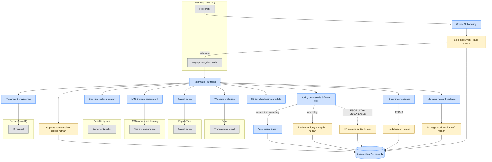
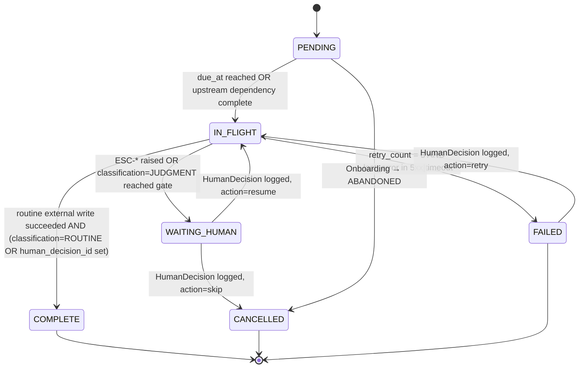
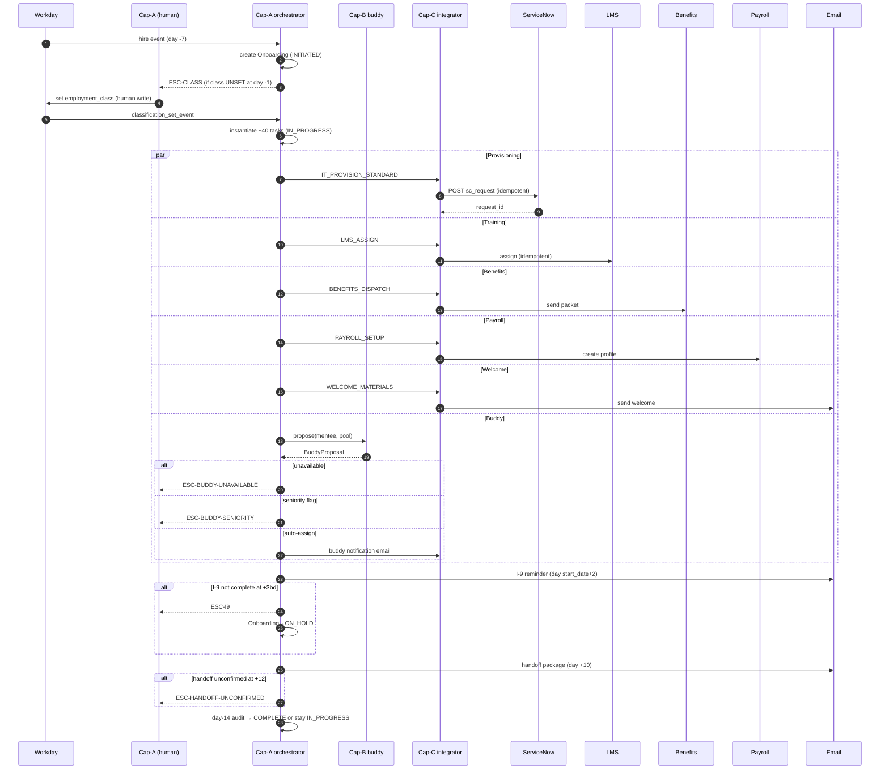

# Gate 1 Consolidated Spec — Scenario 1 (HR Onboarding Coordination)

## Front-matter (consolidated)

- **Submission IDs (sources):** `problem-statement-scenario-1-201`, `delegation-analysis-scenario-1-202`, `capability-specification-scenario-1-203`, `validation-design-scenario-1-204`, `assumptions-and-unknowns-scenario-1-205`.
- **Source scenario:** [`../../scenario-1.md`](../../scenario-1.md)
- **Date produced (consolidation):** 24.04.2026
- **Run suffix:** 413. Produced by running [`../../Prompts/concatonate-and-review.md`](../../Prompts/concatonate-and-review.md) against the five source deliverables in the `Week1/Output/Scenario1/` folder.
- **Status:** First consolidated draft, post-Deliverables-1–5, pre-coach-session on the merged register. HUMAN assumptions **H4, H5, H6** carry **High (coach-validated)**; **A7** carries **High (regulation-anchored)**. **H1, H3, H7** are **Medium**; **H2** is **Low** and explicitly unused to move any delegation row.
- **Consolidation notes.** (i) Per-file front-matter and per-file §2 Assumption Log blocks are stripped; their content is consolidated here in §0.1 below. (ii) Per-file "Out of scope" sections are stripped — this is one document, not five. (iii) Per-file "self-audit" sections from the capability spec and validation design are preserved in §3.8 / §4.10 unchanged. (iv) Section numbering in the body is renumbered to the single-document hierarchy (§1…§5); cross-references from the source files that used the old "D1 §n / D2 §n" form have been retained where they are load-bearing for traceability. (v) No new facts, rules, escalations, entities, metrics, or integrations have been introduced during consolidation. The only additions are a consolidation note in this front-matter, cross-references to the top-level Assumption Log, and **Appendix A** (production-spec-checklist review).
- **Rules for this file (inherited from `CLAUDE.md`):** citation tags `[CITED]` / `[ASSUMED]` / `[UNKNOWN]` and source tags `HUMAN` / `AGENT` are preserved verbatim from the source files. Confidence ratings reflect the source files as of 24.04.2026. `High` is reserved for coach-session-validated or regulation-anchored entries; see §0.1.

---

## 0.1 Assumption Log (merged — single source of truth)

Every `[ASSUMED]` or `[UNKNOWN]` reference elsewhere in this document traces to a numbered entry here. The numbers match the source-file numbers (H1–H7, A1–A17, V2, V4, V5, A-open-1) so upstream prose does not need re-numbering. **V1** has been merged into **A1** and **V3** is tracked as a dependency of **A10**, both per the source consolidation in the upstream `assumptions-and-unknowns-scenario-1-205.md`.

### 0.1.1 Scan table

| # | Source | Assumption (one line) | Cagan risk | Confidence | Upstream sections at risk if wrong |
|---|---|---|---|---|---|
| H1 | HUMAN | HR Ops will adopt an agent for onboarding coordination | Value / Viability | Medium | §1.3, §1.4 (business case); §2.3 rows depending on access follow-through |
| H2 | HUMAN | 15% judgment calls follow identifiable patterns | Feasibility | Low | §1.4 (M1 denominator target); §2.3 row 3 (explicitly **not** relied on); §3.5 Cap-B rule set |
| H3 | HUMAN | Existing systems expose APIs or integration points | Feasibility | Medium | §3.6 (all integrations); §2.3 row 21 |
| H4 | HUMAN | Buddy 3-factor filter + one-buddy + tie-break dept→loc→sen→random + HR-escalate-on-zero | Feasibility | **High (coach-validated)** | §2.3 rows 10, 11, 13; §3.5 Cap-B rules 1–6; §4.4 HP-1, §4.5 EC-6, §4.7 BT-2 |
| H5 | HUMAN | Unnamed 2 of 6 systems = Benefits + Payroll/Time | Feasibility | **High (coach-validated)** | §2.3 rows 6, 21; §3.6.5, §3.6.6 |
| H6 | HUMAN | HR Ops will grant integration access | Viability | **High (coach-validated)** | §2.3 rows 4–22 (all FULL rows); §3.6 (all integrations) |
| H7 | HUMAN | "Late I-9 triggers a hold" is a regulatory hold with legal exposure | Viability | Medium | §1.4 M4 wording; §2.3 row 19, C2; §3.5 Cap-A rule 5; §4.5 EC-5, §4.6 FM-3 |
| A1 | AGENT | Baseline "fell-through-the-cracks" rate is retrievable from HR Ops records | Value | Low | §1.4 M3 Current State; §4.2 V1 (merged); defence of M3 target |
| A2 | AGENT | Current time-per-onboarding (M2 baseline) is retrievable | Value | Low | §1.4 M2 Current State |
| A3 | AGENT | Scenario's "15%" refers to 15% of ~40 tasks (≈ 6/hire), not 15% of onboardings | Feasibility | Medium | §1.3 derivation; §1.4 M1 denominator; §2.3 row 2; §3.5 Cap-A rule 2 |
| A4 | AGENT | I-9 3-business-day deadline (IRCA 8 U.S.C. § 1324a) from `start_date` | Viability | Medium | §2.5 C2; §3.5 Cap-A rule 5; §0.1.4 A14 |
| A5 | AGENT | Buddy "unavailable" = zero-match of unencumbered pool; leave + capacity pre-filtered | Feasibility | Medium | §2.3 row 13; §3.5 Cap-B rules 2, 3, 4; ESC-BUDDY-UNAVAILABLE |
| A6 | AGENT | Tie-break order dept → location → seniority → random, seeded RNG | Feasibility | Medium | §3.5 Cap-B rule 5; §4.4 HP-1 determinism |
| A7 | AGENT | Classification is HUMAN-LED regardless of signal strength | Viability | **High (regulation-anchored)** | §2.3 row 3, C1; §3.5 Cap-A rule 12, Cap-C rule 4; §4.7 BT-1 |
| A8 | AGENT | Seniority-norm flag is a post-filter HUMAN-IN-LOOP exception, not a 4th filter factor | Feasibility | Medium | §2.3 row 12; §3.5 Cap-B rule 6; §4.7 BT-2 |
| A9 | AGENT | Retention: 7y employment, 1y integration audit | Viability | Medium | §2.5 C4; §3.4 entity delete behaviour; §3.5.7, §3.5.17 decision logs |
| A10 | AGENT | LMS vendor + API + webhook contract **[UNKNOWN]** | Feasibility | Low / **Build-blocking** | §3.6.3; §4.6 FM-2, §4.2 V3 (merged) |
| A11 | AGENT | Workday + ServiceNow OAuth2 client-credentials auth with service-account creds | Feasibility | Medium | §3.6.1, §3.6.2 |
| A12 | AGENT | Idempotency key = `sha256("{onboarding_id}:{task_id}:{system}:{action}")` | Feasibility | Medium | §3.5 Cap-A rule 7; Cap-C rule 3 |
| A13 | AGENT | ServiceNow role-bundle CI schema; non-template = ESC-ACCESS-NONTEMPLATE | Feasibility | Medium | §3.5 Cap-A rule 4; ESC-ACCESS-NONTEMPLATE; §4.5 EC-3 |
| A14 | AGENT | Business-day calendar = Mon–Fri − US federal holidays; clock from `start_date` | Viability | Medium | §3.5 Cap-A rule 5; §4.5 EC-5 |
| A15 | AGENT | Day-14 = audit milestone; Day-10 = handoff nag | Feasibility | Medium | §3.5 Cap-A rules 8, 9; §4.4 HP-1 timeline |
| A16 | AGENT | Seniority-delta threshold default = 3 bands, configurable | Feasibility | Low | §3.5 Cap-B rule 6; §4.7 BT-2 |
| A17 | AGENT | Email sender is a named relay with DKIM/SPF; specific vendor **[UNKNOWN]** | Feasibility | Medium | §3.6.4 |
| V2 | AGENT | Synthetic test harness can reproduce production distributions for role / location / seniority | Feasibility | Medium | §4 all test data |
| V4 | AGENT | Ground truth for BT-1 is the HR reviewer's eventual decision, not a test-author inference | Value / Viability | Medium | §4.7 BT-1 |
| V5 | AGENT | Seniority threshold is parameterisable for BT-2 runs | Feasibility | Medium | §4.7 BT-2 |
| A-open-1 | AGENT | Capability spec does not yet model `ESC-SCHEDULE-DRIFT` for `start_date` changes post-creation — spec gap surfaced in §4.6 FM-4 | Feasibility | **Build-blocking for FM-4** | §3.5 Cap-A (new rule + ESC needed); §4.6 FM-4 |
| A-open-2 | AGENT | *(Consolidation-surfaced)* M2 target ("≥ 60% reduction vs. baseline by month 6") is an assumed target, not a validated one; its absolute minutes figure can only be set once A2 resolves. Noted here so no downstream reader treats it as a hard commitment. | Value | Low | §1.4 M2 row |
| A-open-3 | AGENT | *(Consolidation-surfaced)* Distribution-list names per `recipient_role` (e.g. `HR_OPS_LEAD`, `IT_APPROVER`, `HIRING_MANAGER`) are role labels; their concrete email addresses / Teams channels are **[UNKNOWN]** and must be supplied by the client before first build-loop run. | Feasibility | Medium | §3.5.6 escalation triggers; all `ESC-*` notifications |
| A-open-4 | AGENT | *(Consolidation-surfaced — BUILDABILITY)* The three ambiguous-word flags introduced by merging "routine" and "required task" language across §1 and §3 — specifically: "required task" ≡ any `Task` with `classification ∈ {ROUTINE, JUDGMENT}` and `status ≠ CANCELLED`, and "routine task" ≡ `Task.classification = ROUTINE`. Stated here so M1/M3 denominators are unambiguous for a coding agent. | Feasibility | Medium | §1.4 M1, M3; §3.4 `Task` entity |
| A-open-5 | AGENT | *(Consolidation-surfaced — ECONOMICS)* The spec does not yet classify agent operations by token cost (Check/Validate/Generate/Coordinate/Transform) nor pin circuit-breaker thresholds. Scenario 1's agent is an orchestrator with deterministic routing, so the expected cost shape is *Coordinate-heavy, Generate-light*; no LLM-graded decisions on the happy path. Circuit-breaker for Cap-C fan-out = **10 concurrent outbound writes per Onboarding** before Cap-A stops dispatching and surfaces `ESC-INTEG-OUTAGE` preventively. | Feasibility / Viability | Low | §3.5 Cap-C rules; §5 Appendix A (Economics Alignment) |

### 0.1.2 Overall read

- **Total entries:** 30 (25 from the upstream register + 5 consolidation-surfaced entries A-open-2…A-open-5 and the retained A-open-1).
- **HUMAN vs AGENT:** 7 HUMAN (H1–H7); 23 AGENT.
- **Confidence split:** 4 High (H4, H5, H6 coach-validated; A7 regulation-anchored). Medium: 15. Low: 7 (H2, A1, A2, A10, A16, A-open-2, A-open-5).
- **Open tensions (preserved from upstream):** (a) *H4 vs scenario text* — resolved by A8 (post-filter HUMAN-IN-LOOP exception) rather than silently picking a side. (b) *H2 vs scenario text* — resolved by not using H2 to move any row into FULL delegation.

### 0.1.3 Coach-session priority queue (consolidated)

In order, highest leverage first:

1. **Open tension A8 (seniority-norm path) + H4 reconciliation** — moves §2.3 row 11 and §3.5 Cap-B rule 6 materially. Probe: *"For buddy matches that pass the three-factor filter, do you want every match routed through HR, or only matches exceeding a seniority-delta threshold (e.g. 3 bands)?"*
2. **A10 — LMS vendor identity** — build-blocking for §3.6.3 and §4.6 FM-2.
3. **A-open-1 — `ESC-SCHEDULE-DRIFT`** — spec gap surfaced by FM-4.
4. **A1 + A2 — Baselines for M2 and M3** — without baselines, §1.4 targets are unanchored.
5. **A13 — ServiceNow bundle schema** and **A14 — business-day calendar** — both touch regulatory timing and ESC-ACCESS-NONTEMPLATE.
6. **A9 — Retention envelope** — touches every decision-log row.
7. **A-open-3 — Distribution-list names per `recipient_role`** — blocks first-build-loop `ESC-*` notifications.
8. **A11 — Tenant auth flavours.** Required for first build-loop run of §3.6.1 and §3.6.2; does not block drafting.
9. **A17 — Email sender identity.** Blocks only first build-loop run of ESC-* notifications.
10. **H1 — Adoption willingness** — Value-risk probe, not an architecture-mover.
11. **A16 — Seniority-delta threshold default** — low leverage; parameterisable.
12. **A-open-2 — M2 absolute target wording** — cosmetic until A2 resolves.
13. **A-open-5 — Economics classification + circuit-breaker threshold** — design-time confirmation, not build-blocking.

### 0.1.4 Update protocol

After each coach session, update the affected entry **in place**: raise or lower confidence, add a dated note, and change any dependent prose downstream in this document. **Do not silently delete an assumption.** If refuted, leave with strikethrough and add a new numbered entry pointing at the replacement. `[ASSUMED]` tags remain even after coach-session confirmation so the audit trail for Friday peer review is preserved. Changes to upstream source files under `Week1/Output/Scenario1/` should trigger a re-run of [`../../Prompts/concatonate-and-review.md`](../../Prompts/concatonate-and-review.md) producing a new run-suffix of this document, not a hand-edit here.

### 0.1.5 Full entries

Full Assumption / Hypothesis / Test / Confidence entries for **H1–H7** live in [`../../scenario-1.md`](../../scenario-1.md) § *HUMAN Assumptions* and are not restated here. Full entries for **A1–A17, V2, V4, V5, A-open-1** are the same as those in the upstream `assumptions-and-unknowns-scenario-1-205.md` § 6 — they are load-bearing for traceability and are reproduced below for the three consolidation-surfaced entries only.

**A-open-2 — M2 absolute target is assumed, not validated** _(AGENT — Low)_
- **Assumption:** "≥ 60% reduction vs. baseline by month 6" is an assumed-favourable target; the absolute minutes figure is pinned only once A2 (current time-per-onboarding) resolves.
- **Hypothesis:** If baseline is ≈ 240 minutes per onboarding (industry rough), 60% reduction ≈ 96 minutes; business case survives at 40% reduction too.
- **How I'd test it:** Confirm baseline; then re-evaluate the target against the business case in §1.4.
- **Confidence:** Low — neither baseline nor target is validated.

**A-open-3 — Distribution-list resolution is [UNKNOWN]** _(AGENT — Medium)_
- **Assumption:** Every `recipient_role` (`HR_OPS_LEAD`, `IT_APPROVER`, `HIRING_MANAGER`, `IT on-call`) resolves to a concrete distribution list (DL email or Teams channel) via an org lookup.
- **Hypothesis:** Client has existing DLs for HR Ops leadership and IT approvers; if not, an Azure AD group is standable-up in < 1 business day.
- **How I'd test it:** *"For each of these roles — HR Ops lead, IT access approver, hiring manager, IT on-call — is there an existing DL or Teams channel we should route ESC-\* notifications to?"*
- **Confidence:** Medium — standard for client-of-this-size, but concrete addresses are needed before first build-loop run.

**A-open-4 — Definitions of "required task" and "routine task"** _(AGENT — Medium)_
- **Assumption:** "Required task" = any `Task` with `status ∉ {CANCELLED}` and the template's `required` flag set (every task in §3.4.2.a except optional extensions). "Routine task" = `Task.classification = ROUTINE`. M1's denominator uses "routine"; M3's denominator uses "required" at day-14.
- **Hypothesis:** Without this pinning, an ambiguous-word audit of the spec flags "required" and "routine" as vague.
- **How I'd test it:** Inspect the template for `required=true` markers; confirm with HR Ops.
- **Confidence:** Medium.

**A-open-5 — Economics classification for this spec** _(AGENT — Low)_
- **Assumption:** Agent operations map to the `production-spec-checklist.md` Economics cost classes as follows: *Check* — state-machine reads, audit checks (Cap-A rule 6, rule 9); *Validate* — idempotency-key and allowlist checks (Cap-A rule 12, Cap-C rule 4); *Generate* — none on the happy path (no LLM-graded decisions); *Coordinate* — all Cap-C outbound writes and inbound webhook receipts; *Transform* — batch day-14 audit report generation (low token, moderate data). Circuit-breaker: Cap-A stops new Cap-C dispatches if ≥ 10 concurrent outbound writes are outstanding for a single `Onboarding`, raising `ESC-INTEG-OUTAGE` preventively rather than on downstream timeout.
- **Hypothesis:** Cap-A is deterministic orchestration — no per-request LLM call on routine paths; expensive operations concentrate in Cap-C's fan-out to 6 systems.
- **How I'd test it:** Token-budget run against the HP-1 harness once the build exists; measure request volume per Onboarding.
- **Confidence:** Low — architecture-level claim; needs build-loop measurement.

---

## 1. Problem Statement & Success Metrics

*(Consolidation note: the source file's §2 Assumption Log has been subsumed into §0.1 above; its §6 "Out of scope" pointers to sibling deliverables are removed because this consolidated document already contains those sections.)*

### 1.1 The Problem Being Solved

A regional professional-services firm with 1,200 employees and **220+ hires per year** runs new-hire onboarding through a **3-person HR Ops team** [CITED]. Each onboarding spans **~40 tasks over ~2 weeks**, drawing from **6 different systems** — Workday (core HR), ServiceNow (IT requests), a separate LMS (compliance training), email, and two further systems [CITED; the two unnamed systems are identified by HUMAN assumption H5 as Benefits and Payroll/Time, confirmed in coach session]. At 220 hires × 40 tasks, the team handles **≈ 8,800 task instances per year** across these onboardings (derivation: 220 × 40 [CITED numbers in scenario]).

Of those tasks, **≈ 15% require judgment calls** — the scenario names three: classifying a contractor versus a full employee, vetting whether a buddy assignment crosses seniority norms, and deciding whether a late I-9 triggers a hold [CITED]. Under the reading formalised in A3 (§0.1), this is ≈ 6 judgment-bearing tasks per onboarding and ≈ 1,320 judgment-bearing task instances per year; the remaining ≈ 7,480 task instances per year are candidates for routine delegation.

The HR Ops lead says, verbatim: *"Most of this is paperwork my team should not be touching, but every time we try to automate, something falls through the cracks because the edge cases never look the same twice."*

The firm has **no AI infrastructure today** [CITED]. Prior automation attempts have failed in a specific, diagnosable way: not on the volume or the routine, but on the edge cases that previous systems could not absorb.

### 1.2 Why Agentic, Why Now

**Volume.** The work is genuinely high-volume-low-judgment on the routine tail: ≈ 7,480 task instances per year (derived from 220 × 40 × 85% [CITED × A3]) sit across predictable categories — IT provisioning, benefits enrolment, compliance training assignment, welcome materials, 30-day checkpoint scheduling, manager handoff. Orchestrating this volume across 6 systems is the load the 3-person team visibly strains under.

**Repeatability.** The routine tail is not just frequent, it is structured: each task has a named source system, a deterministic trigger (hire event, start date, classification already set by a human), and a verifiable completion signal (provisioned account, enrolment row, training assignment acknowledged). This is the exact shape an agent is good at — rule-governed orchestration across heterogeneous systems with idempotent writes — and where traditional RPA historically stumbled because the orchestration had branches it could not represent cleanly.

**Constraint.** Previous automation failed on the 15% that "never look the same twice" [CITED stakeholder quote]. An agent does not solve that by learning the edge cases; it solves it by recognising *that* a case is non-routine and routing to a named human with the relevant context pre-assembled, rather than silently forcing the case down a routine path. That is a different architectural commitment from prior attempts, and it is the reason the agentic framing is fit-for-purpose here — not a generic AI upsell.

### 1.3 Success Metrics

| # | Metric | Current State | Target State | Measurement Method | Source |
|---|---|---|---|---|---|
| M1 | Routine-task delegation rate — % of non-judgment task instances (per A-open-4, `Task.classification = ROUTINE`) executed end-to-end with no human action | `[UNKNOWN — baseline needed]` (per A1) | ≥ 85% in month 3 post-launch; ≥ 95% steady-state | `tasks_completed_by_agent_without_human_touch / tasks_classified_as_routine`, computed nightly from the agent's task log filtered by `classification = ROUTINE` | [ASSUMED] — A3. Targets [ASSUMED] — A1. |
| M2 | Human effort per onboarding (HR Ops minutes) | `[UNKNOWN — baseline needed]` (per A2) | ≥ 60% reduction vs. baseline by month 6, with absolute minutes target pinned once baseline is returned (see A-open-2) | Time-tracking entries attributed to `program = onboarding` / count of onboardings completed in period | [ASSUMED] — A2. Target [ASSUMED] — A-open-2. |
| M3 | "Fell-through-the-cracks" rate — % of onboardings with ≥ 1 incomplete *required* task at day 14 (per A-open-4, required ≡ template `required=true` ∧ `status ∉ {CANCELLED}`) | `[UNKNOWN — baseline needed]` (per A1) | ≤ 2% in month 3; ≤ 0.5% steady-state | `onboardings_with_any_open_required_task_at_day_14 / total_onboardings_started` from the Onboarding state store | [CITED] stakeholder pain language; targets [ASSUMED] — A1. |
| M4 | **Boundary respect** — % of judgment-classified tasks that reach a logged `HumanDecision` record before the task can transition to `COMPLETE` | Not applicable pre-agent | **100%** — Non-negotiable | `tasks_completed_where classification = JUDGMENT AND no_human_decision_log_exists` must equal **0** in the audit table for every reporting period | **(Non-negotiable)** — [CITED] scenario; IRCA 8 U.S.C. § 1324a for the I-9 branch (per A4). |

**Rows resting on assumed baselines that must be converted to `[TESTED]` in the next coach session before this deliverable is treated as business-aligned:** M1 (baseline + target), M2 (baseline + target), M3 (baseline); M4 is non-negotiable and [CITED], not an assumption, but its exact wording depends on A4 being confirmed.

---

## 2. Delegation Analysis

*(Consolidation note: the source file's §2 Assumption Log — including the surfaced tension between H4 and the scenario text, and the coach-session priority queue — is subsumed into §0.1 above. §8 "Out of scope" is stripped.)*

### 2.1 Delegation Framework (brief)

Three classifications are used in the work inventory below, applied at the **task / decision** level (not the capability level) — a single capability can contain rows in all three:

- **FULL DELEGATION.** Agent executes end-to-end. The task is rule-governed, the outcome is reversible or low-impact, the system of record is named, and the decision is deterministic given the inputs.
- **HUMAN-IN-LOOP.** Agent drafts, proposes, or prepares; a *named human* must act (approve, confirm, sign off) before the system state changes. The agent may not treat silence as approval.
- **HUMAN-LED.** A human decides. The agent may detect, flag, or compile evidence, but must not take the decision itself. Silent-error cost or regulatory exposure puts the call here.

Vocabulary anchored in `SupportingDocs/the-fde.md` (Delegation Archetypes / Cognitive Zones). No hybrids inside a single cell — where a task has a routine execution and a judgment gate, it produces two rows (see Buddy matching: propose vs. final assign).

### 2.2 Tension surfaced

**Tension to surface (per primer anti-pattern "silently picking a side"):** H4's hypothesis text reads "prioritise in order of department, location and seniority" and the assumption statement text reads "department, location and seniority" — these agree. However, the scenario text flags seniority-norm *judgment* as one of the 15% judgment calls, which appears in tension with H4's *High* rating for full auto-assignment. This is surfaced as **A8** (§0.1): agent may auto-assign from the three-factor filter's output, but must not override a flagged seniority-norm concern raised by HR — and must not suppress the flag.

### 2.3 Work Inventory

| # | Task / Decision | Classification | Rationale (why) | Source |
|---|---|---|---|---|
| 1 | **Create `Onboarding` record** on hire event from Workday | FULL | Rule-governed, reversible, Workday is system of record, deterministic trigger. | [CITED] scenario — Workday is core HR |
| 2 | **Instantiate ~40 onboarding tasks** from template per classification | FULL | Template expansion is deterministic once `employment_class` is set upstream by a human (see #3). Reversible. | [CITED] scenario (40 tasks, 2-week span) |
| 3 | **Decide `employment_class` (contractor vs full employee)** | HUMAN-LED | Scenario names classification as a judgment call; regulatory exposure (IRS common-law test, ACA 30-hour, state ABC) makes silent-error cost extreme; an incorrect agent inference is an irreversible compliance finding. Agent may not branch on a signal it synthesised itself. | [CITED] scenario quote; [CITED] IRCA-adjacent regulation. [ASSUMED] — A7 (specific cites); **not** relying on H2. |
| 4 | **IT provisioning — request creation in ServiceNow** (laptop, accounts, access bundles per role) | FULL | Rule-governed given classification and role; ServiceNow is system of record; idempotent on a deterministic key. Reversible (deprovision path exists). | [CITED] scenario (ServiceNow for IT); [ASSUMED] — H6 (access) |
| 5 | **IT provisioning — approval of access bundles that exceed standard role template** | HUMAN-IN-LOOP | Standard bundles are FULL under #4; anything outside the template is an access-control decision that requires a named approver. | [ASSUMED] — A7 (regulatory-adjacent access); best-practice IT governance |
| 6 | **Benefits enrolment — send enrolment packet & track deadline** | FULL | Paperwork dispatch and deadline-nag cadence are rule-governed; non-completion raises an escalation, does not cause agent to make enrolment elections. | [CITED] scenario (6 systems); [ASSUMED] — H5 (Benefits system identity) |
| 7 | **Benefits enrolment — elections on behalf of employee** | HUMAN-LED | The *employee* makes the election. Agent does not. | [CITED] common-sense; reinforced by ERISA-style fiduciary framing |
| 8 | **Compliance training — assignment in LMS** per classification | FULL | Deterministic mapping from classification → track; LMS is system of record; idempotent on a deterministic key. | [CITED] scenario (LMS); [ASSUMED] — H5-adjacent (LMS API availability) |
| 9 | **Compliance training — which track applies to contractor vs. full employee** | HUMAN-LED (indirectly) | This is actually the classification decision (#3) surfacing again — once classification is set, the track mapping in #8 is deterministic. Listed here for completeness so reviewers do not think the agent chooses a track independently. | [CITED] scenario (explicit judgment call example) |
| 10 | **Buddy matching — propose candidate via 3-factor filter** (seniority + dept + location; one-buddy-per-mentee; tie-break dept→loc→sen→random) | FULL | Coach-validated under H4 as a deterministic filter. Reversible (reassign possible). | [CITED] per H4; tie-break per A6 |
| 11 | **Buddy matching — final assignment when no seniority-norm concern** | FULL | Given the filter's coach-validated three-factor scope, the default case is auto-assign. | [ASSUMED] — H4 (High); A5 |
| 12 | **Buddy matching — seniority-norm exception path** (e.g. delta exceeds threshold) | HUMAN-IN-LOOP | Scenario names "buddy crosses seniority norms" as a judgment call — surfaced here as an after-filter exception rather than a fourth filter factor. Agent flags, HR reviews, HR persists. | [CITED] scenario; [ASSUMED] — A8 |
| 13 | **Buddy matching — no candidate available (zero-match of unencumbered pool)** | HUMAN-LED | Per H4's escalation rule. Agent raises `ESC-BUDDY-UNAVAILABLE`; HR decides the override (pick someone on-leave, skip, or expand pool). | [CITED] per H4; [ASSUMED] — A5 |
| 14 | **Welcome materials dispatch** (email + portal seeding) | FULL | Rule-governed, reversible, low-impact. | [CITED] scenario |
| 15 | **30-day checkpoint scheduling** (calendar invite, reminder cadence) | FULL | Calendaring + reminder logic is deterministic. | [CITED] scenario |
| 16 | **Manager handoff package preparation** (assembled artefact: who reports to whom, access summary, buddy) | FULL | Agent compiles from existing records; reversible; no new facts. | [CITED] scenario |
| 17 | **Manager handoff confirmation** (manager confirms receipt / readiness) | HUMAN-IN-LOOP | System state (`onboarding.handoff_status`) should not flip to DONE on silence; the manager is the named actor. | [ASSUMED] — A9 (audit); operational best practice |
| 18 | **I-9 Section 2 — reminder cadence to employee and manager** | FULL | Nag cadence is rule-governed; agent does not complete I-9 itself. | [CITED] IRCA 8 U.S.C. § 1324a — 3 business day rule |
| 19 | **I-9 Section 2 — hold decision when overdue** | HUMAN-LED | Regulatory; agent raises `ESC-I9`, HR decides the hold. | [CITED] scenario ("late I-9 triggers a hold"); [CITED] IRCA; [ASSUMED] — H7 (Medium) |
| 20 | **Workday write of `employment_class`** | HUMAN-LED | Direct corollary of #3. Agent may not write this field. | [CITED] per #3; [ASSUMED] — A7 |
| 21 | **All external-system writes (Workday, ServiceNow, LMS, Benefits, Payroll, Email)** | FULL (with idempotency and retry — see §3.6) | Rule-governed mechanics; retry on 5xx/429, escalate on repeated 4xx. Reversible via compensating write where feasible; flagged for HR where not. | [ASSUMED] — H6 (access); H5 (Benefits/Payroll identity) |
| 22 | **Decision-log write for every state transition, escalation, and human decision** | FULL | Rule-governed; deterministic; retention per A9. Non-negotiable for M4. | [ASSUMED] — A9; **supports** M4 non-negotiable metric |

### 2.4 Conditional rows that will move if an assumption resolves differently

- **Row 11 (buddy final-assign)** moves to HUMAN-IN-LOOP if A8 resolves with a named seniority-delta threshold that HR wants to review pre-assignment on *every* match, not only exceptions.
- **Row 10 (buddy propose)** does *not* move regardless of A5; what changes is the condition under which `ESC-BUDDY-UNAVAILABLE` fires.
- **Row 5 (IT access bundle approval)** becomes FULL only if the client later confirms a policy that "anything in the role template" is pre-approved for the agent; no such confirmation today.
- If H7 resolves as internal-policy-only (not IRCA), Row 19's wording changes but the classification stays HUMAN-LED — holds on regulatory artefacts are never agent decisions regardless of source.

### 2.5 Hard Constraints on the Boundary

| # | Constraint | Source | Effect on the boundary |
|---|---|---|---|
| C1 | **Employment classification is a human decision.** Agent must not infer or set `employment_class`; downstream processing branches only after a named human has set the value in Workday. | [CITED] scenario (classification named as judgment call); [CITED] IRS common-law test; ACA 30-hour rule; state-level ABC tests (e.g. California AB5 codifying *Dynamex* test). | Fixes row #3 as HUMAN-LED and row #20 as HUMAN-LED regardless of design preference. |
| C2 | **I-9 Section 2 must be completed within 3 business days of start date; hold decisions on non-completion are human.** Agent detects, reminds, and escalates; it does not hold. | [CITED] scenario ("late I-9 triggers a hold"); [CITED] IRCA 8 U.S.C. § 1324a. | Fixes row #18 as FULL (reminders only) and row #19 as HUMAN-LED. |
| C3 | **No employee benefit election may be made on the employee's behalf.** Agent dispatches, tracks, escalates; it does not elect. | [CITED] scenario (benefits enrolment is named); ERISA-style fiduciary framing makes the election a protected individual decision. | Fixes row #7 as HUMAN-LED. |
| C4 | **Every human decision is logged; employment-record retention is 7 years.** A task classified as requiring a human decision cannot transition to `COMPLETE` without a matching `HumanDecision` log row. | [CITED] audit-trail convention for employment records (IRCA recordkeeping requires I-9 retention of 3 years after hire or 1 year after termination, whichever is later; firm-wide 7-year standard is the envelope). [ASSUMED — A9] for the specific 7-year / 1-year split; client policy to confirm. | Makes M4 (boundary-respect 100%) enforceable. No FULL row may be reclassified to swallow a HUMAN-LED gate. |

Every row here is either [CITED] from the scenario, from named regulation, or from a standard recordkeeping framework. A9 tags the 7-year/1-year specifics as [ASSUMED] because the exact envelope is client-policy-specific; the existence of a retention requirement is not assumed.

### 2.6 Delegation Boundary Diagram

Trigger check (`CLAUDE.md` § *Diagrams*): work inventory has **22 rows** (> 10), and rows #3, #12, #13, #17, #19 cross the agent-vs-human boundary with distinct veto / override / hold paths. Both triggers fire. A diagram is warranted.

*Figure 1 — Delegation boundary across the Onboarding orchestration (work inventory §2.3). Agent-driven nodes are blue; human-led nodes are yellow and suffixed `(human)` in prose references. Escalation edges are dashed with `ESC-*` codes. External systems are grouped by subgraph.*

The diagram introduces no new facts: every node maps to a row in §2.3 and every escalation edge maps to a hard constraint in §2.5.

### 2.7 Boundary-Respect Metric (hand-off to §1)

The delegation analysis forces exactly one non-negotiable success metric, which the problem-statement deliverable carries as **M4** (§1.3):

> **100% of judgment-classified tasks reach a logged `HumanDecision` record before the task state can become `COMPLETE`. Zero silent agent decisions.**

This is enforced by hard constraint **C4** in §2.5 and by the state-machine guard the capability spec carries on `Task.status = COMPLETE` (§3.4, §3.5). If §1 is regenerated, M4's wording and non-negotiable tag must survive unchanged.

---

## 3. Agent Specification

*(Consolidation note: the source file's front-matter and §2 Assumption Log are stripped; §9 "Out of scope" is stripped; §8 "Self-audit (production-spec-checklist alignment)" is preserved verbatim in §3.8 below. The integration section retains the explicit `[UNKNOWN]` tags traced to A10, A11, A17 in §0.1.)*

### 3.1 Capability Set Overview

Three capabilities cover every FULL and HUMAN-IN-LOOP row in the §2.3 work inventory. Capabilities fully downstream of a HUMAN-LED decision (training track, benefits packet dispatch, IT provisioning) are in scope; the HUMAN-LED decisions themselves (classification, benefits election, I-9 hold) are deliberately *not* capabilities of this spec.

1. **Cap-A — Onboarding Orchestrator.** The orchestrating capability. Owns the `Onboarding` and `Task` entities, instantiates the ~40 tasks on hire, schedules time-triggered actions, enforces the state machine, writes the decision log, and fires all `ESC-*` escalations.
2. **Cap-B — Buddy Matcher.** Owns the three-factor filter per H4, the one-buddy-per-mentee invariant, tie-break logic per A6, and the post-filter seniority-norm flag per A8. Proposes a match, which Cap-A persists (or holds pending HR review on the exception path).
3. **Cap-C — System Integrator.** Owns all outbound writes to Workday, ServiceNow, LMS, Benefits, Payroll, Email, and inbound webhooks from LMS (and any others discovered). Enforces idempotency, retry, timeout, and fallback. Cap-A never writes to an external system directly; it always goes through Cap-C.

The agent does not classify, does not elect benefits, does not hold I-9s, and does not decide who overrides a missing buddy. Those are HUMAN-LED rows in §2.3 and sit outside every capability here.

### 3.2 Entity Model

#### 3.2.1 `Onboarding`

| Attribute | Type | Required | Constraints | Notes |
|---|---|---|---|---|
| `id` | UUID | Y | PK, immutable | Generated on create. |
| `employee_id` | UUID | Y | FK → Workday worker UUID; immutable | From hire event. |
| `employment_class` | enum [`FULL_EMPLOYEE`, `CONTRACTOR`, `UNSET`] | Y | Default `UNSET`; agent **must not** write `FULL_EMPLOYEE` or `CONTRACTOR` | HUMAN-LED (hard constraint C1). |
| `role_code` | string | Y | Matches ServiceNow `role_code` pattern `/^[A-Z]{2,5}-\d{2,4}$/` | Drives IT bundle lookup. |
| `start_date` | ISO 8601 date (UTC) | Y | ≥ `created_at::date` | First day worked. |
| `status` | enum [`INITIATED`, `IN_PROGRESS`, `ON_HOLD`, `COMPLETE`, `ABANDONED`] | Y | See state machine | Derived-but-stored. |
| `handoff_status` | enum [`PENDING`, `PACKAGE_SENT`, `CONFIRMED`] | Y | Default `PENDING` | Cap-A rule 10. |
| `hold_reason` | enum [`I9_OVERDUE`, `CLASSIFICATION_PENDING`, `MANUAL`] \| null | N | Required iff `status = ON_HOLD` | Hold cause logged. |
| `created_at` | ISO 8601 timestamp (UTC) | Y | Immutable |  |
| `updated_at` | ISO 8601 timestamp (UTC) | Y | Updated on every write |  |
| `created_by` | string (service account id or user id) | Y | Immutable | Agent service account for auto-created. |
| `deleted_at` | ISO 8601 timestamp (UTC) | N | Soft delete; immutable once set; retention 7y per A9 |  |

**State machine** (Mermaid — entity has 5 states + non-linear transitions, diagram trigger fires):

```mermaid
stateDiagram-v2
    [*] --> INITIATED : hire event received
    INITIATED --> IN_PROGRESS : employment_class != UNSET (human write)
    IN_PROGRESS --> ON_HOLD : ESC-I9 unresolved past deadline / HR sets MANUAL hold
    ON_HOLD --> IN_PROGRESS : HR records resolution (HumanDecision logged)
    IN_PROGRESS --> COMPLETE : day-14 audit passes (all required tasks COMPLETE; no open judgment task without HumanDecision)
    INITIATED --> ABANDONED : hire rescinded (Workday event)
    IN_PROGRESS --> ABANDONED : hire rescinded
    ON_HOLD --> ABANDONED : hire rescinded
    COMPLETE --> [*]
    ABANDONED --> [*]
```

*Figure 2 — `Onboarding` lifecycle. Transitions into IN_PROGRESS depend on a human write of `employment_class` — the boundary guard for C1 is enforced at this transition.*

- **Immutability:** `id`, `employee_id`, `start_date`, `created_at`, `created_by`, `deleted_at` (once set).
- **Delete behaviour:** Soft delete only; 7-year retention per A9. Hard delete disallowed while linked `HumanDecision` records exist.

#### 3.2.2 `Task`

| Attribute | Type | Required | Constraints | Notes |
|---|---|---|---|---|
| `id` | UUID | Y | PK, immutable |  |
| `onboarding_id` | UUID | Y | FK → `Onboarding.id`; on delete: restrict | |
| `type` | enum (exhaustive list below) | Y | See §3.2.2.a | |
| `classification` | enum [`ROUTINE`, `JUDGMENT`] | Y | Set at instantiation from template | M1 + M4 denominators. |
| `required` | boolean | Y | Default `true` from template; only optional-extension tasks are `false` | A-open-4 — required-task definition for M3. |
| `status` | enum [`PENDING`, `IN_FLIGHT`, `WAITING_HUMAN`, `COMPLETE`, `FAILED`, `CANCELLED`] | Y | See state machine | |
| `due_at` | ISO 8601 timestamp | Y | Computed at instantiation; immutable after set | Cap-A rule 3. |
| `idempotency_key` | string(64) | Y | Deterministic per A12 | For Cap-C. |
| `human_decision_id` | UUID \| null | N | Required iff `classification = JUDGMENT` AND `status = COMPLETE` | **Enforces M4.** |
| `escalation_code` | string \| null | N | Set when an ESC-* is raised against this task | |
| `retry_count` | int | Y | Default 0; max 3 | Cap-C retry. |
| `created_at` / `updated_at` | ISO 8601 | Y | | |

##### 3.2.2.a `Task.type` exhaustive enum

`CREATE_ONBOARDING`, `INSTANTIATE_TASKS`, `IT_PROVISION_STANDARD`, `IT_PROVISION_NONTEMPLATE`, `BENEFITS_DISPATCH`, `LMS_ASSIGN`, `PAYROLL_SETUP`, `WELCOME_MATERIALS`, `CHECKPOINT_SCHEDULE_30D`, `BUDDY_PROPOSE`, `BUDDY_ASSIGN`, `I9_REMINDER`, `MANAGER_HANDOFF_PACKAGE`, `MANAGER_HANDOFF_CONFIRM`.

**State machine** (6 states, non-linear — Mermaid triggered):

*Figure 3 — `Task` lifecycle. The WAITING_HUMAN state is the mechanism that enforces the M4 non-negotiable — a JUDGMENT task cannot reach COMPLETE without passing through WAITING_HUMAN and acquiring a `human_decision_id`.*

- **Immutability:** `id`, `onboarding_id`, `type`, `classification`, `required`, `due_at` (after set), `idempotency_key`.
- **Delete behaviour:** No hard delete. `CANCELLED` and `FAILED` persist 1y per A9.

#### 3.2.3 `HumanDecision`

| Attribute | Type | Required | Constraints | Notes |
|---|---|---|---|---|
| `id` | UUID | Y | PK, immutable | |
| `task_id` | UUID | Y | FK → `Task.id`; on delete: restrict | |
| `actor_user_id` | string | Y | A *named human* — never an agent service account; enforced at write time | Boundary-respect. |
| `decision` | enum [`APPROVE`, `REJECT`, `HOLD`, `RESUME`, `SKIP`, `OVERRIDE`, `ASSIGN`, `RETRY`] | Y | |
| `reason` | string | Y | Max 2000 chars | Free text; required. |
| `payload` | JSON | N | E.g. override buddy selection; classification value; hold expiry | |
| `decided_at` | ISO 8601 timestamp | Y | Immutable | |
| `created_at` / `updated_at` | ISO 8601 | Y | `updated_at` may move only on amendment (with reason, immutable audit trail) | |

- **Immutability:** `id`, `task_id`, `actor_user_id`, `decision`, `decided_at` — amendments create a new row with `payload.amends = <prior_id>`; the original stays.
- **Delete behaviour:** Never deleted. 7y retention per A9.

#### 3.2.4 `EscalationEvent`

| Attribute | Type | Required | Constraints | Notes |
|---|---|---|---|---|
| `id` | UUID | Y | PK, immutable | |
| `task_id` | UUID | Y | FK → `Task.id` | |
| `code` | enum [`ESC-CLASS`, `ESC-I9`, `ESC-BUDDY-UNAVAILABLE`, `ESC-BUDDY-SENIORITY`, `ESC-ACCESS-NONTEMPLATE`, `ESC-HANDOFF-UNCONFIRMED`, `ESC-INTEG-OUTAGE`, `ESC-TRAINING-LATE`] | Y | §3.5.6 | |
| `recipient_role` | string | Y | E.g. `HR_OPS_LEAD`, `IT_APPROVER`, `HIRING_MANAGER` (concrete distribution-list resolution tracked under A-open-3) | |
| `sla_due_at` | ISO 8601 | Y | Computed from fired_at + SLA | |
| `status` | enum [`OPEN`, `RESOLVED`, `BREACHED`] | Y | | |
| `fired_at` / `resolved_at` | ISO 8601 | Y / N | `resolved_at` only when `status=RESOLVED` | |

Retention 7y per A9.

### 3.3 Cap-A — Onboarding Orchestrator

#### 3.3.1 Purpose
Instantiate and steward an `Onboarding` from hire event through day-14 audit, honouring the delegation boundary at every gate. "Done" = `Onboarding.status = COMPLETE` with zero open required tasks and every JUDGMENT task carrying a logged `HumanDecision`.

#### 3.3.2 Scope

**In scope:** creating `Onboarding`; instantiating tasks; scheduling time-triggered actions; firing escalations; enforcing state-machine guards; writing the decision log.

**Out of scope:**
- Setting `employment_class` — HUMAN-LED per §2.5 C1.
- Making benefits elections — HUMAN-LED per C3.
- Deciding an I-9 hold — HUMAN-LED per C2 (agent fires `ESC-I9`, does not hold).
- Overriding a missing buddy — HUMAN-LED per §2.3 row 13.
- Executing external writes — delegated to Cap-C.

#### 3.3.3 Inputs

| Input | Type | Required | Validation | Source |
|---|---|---|---|---|
| `workday_hire_event` | JSON `{employee_id: UUID, role_code: regex above, start_date: ISO 8601, manager_id: UUID, location: enum [...], seniority_band: enum [IC1..IC7, M1..M5]}` | Y | Schema validated; `start_date ≥ today` | Workday webhook → Cap-C → Cap-A |
| `classification_set_event` | JSON `{onboarding_id, employment_class, actor_user_id, decided_at}` | Y for transition out of INITIATED | `actor_user_id` must resolve to a named user, never a service account | Workday write observed via webhook |
| `lms_completion_event` | JSON `{lms_assignment_id, onboarding_id, completed_at}` | Y for task COMPLETE | Signature verified | LMS webhook → Cap-C |
| `manager_confirm_event` | JSON `{onboarding_id, actor_user_id, confirmed_at}` | Y | Actor must equal `manager_id` from hire event | UI webhook → Cap-A |
| `hr_decision_event` | JSON `{task_id, decision, reason, payload?, actor_user_id}` | Y for ESC resolutions | Actor role in allowed set for the ESC code | UI / ticketing |

#### 3.3.4 Outputs

| Output | Type | Condition | Destination |
|---|---|---|---|
| `Onboarding` write | DB row | On every state transition | Orchestrator store |
| `Task` batch write | DB rows | On `INSTANTIATE_TASKS` | Orchestrator store |
| External write intent | Queue message to Cap-C | On every task reaching `IN_FLIGHT` with routine action | Cap-C inbound queue |
| `EscalationEvent` row + notification | DB + email (via Cap-C §3.6.4) | On each ESC-* condition | Recipient role distribution (resolved per A-open-3) |
| `HumanDecision` row | DB row | On receipt of `hr_decision_event` / `manager_confirm_event` / `classification_set_event` | Decision log |
| Day-14 audit report | JSON, emitted to `HR_OPS_LEAD` distribution | Daily at 06:00 local | Email + dashboard |

#### 3.3.5 Business Rules

1. **Rule 1 — Onboarding creation.** On receipt of a `workday_hire_event` whose `employee_id` does not already have an active (`status ∈ {INITIATED, IN_PROGRESS, ON_HOLD}`) `Onboarding`, the orchestrator **must** create one with `status = INITIATED`, `employment_class = UNSET`, and `hold_reason = null`. If an active `Onboarding` exists for the `employee_id`, the event **must** be logged `duplicate_hire_event` and ignored (no second record created, no error raised upstream).
2. **Rule 2 — Task instantiation.** On transition `INITIATED → IN_PROGRESS` (i.e. `employment_class` is set by a named human), the orchestrator **will** instantiate the full task template for the `employment_class` × `role_code` tuple. Task types are drawn from the §3.2.2.a enum; each task is given `classification` per template (`IT_PROVISION_NONTEMPLATE`, `BUDDY_ASSIGN` on the seniority-exception path, and `I9_REMINDER` flagged for `WAITING_HUMAN` on overdue are classified `JUDGMENT`; all others `ROUTINE`).
3. **Rule 3 — Deadline computation.** Each task's `due_at` **must** be computed at instantiation as `start_date + offset_days(type)` in business days per A14. The offset table is stored as a configuration artefact; `due_at` is immutable after set. No task's `due_at` may exceed `start_date + 14 business days` (M3 audit boundary).
4. **Rule 4 — IT provisioning routing.** For every `IT_PROVISION_STANDARD` task, Cap-A **must** resolve the access bundle from ServiceNow CIs keyed by `role_code` (per A13) and dispatch via Cap-C §3.6.2. For any provisioning item that does not match a bundle, a sibling `IT_PROVISION_NONTEMPLATE` task **will** be created with `classification = JUDGMENT` and `ESC-ACCESS-NONTEMPLATE` fired to `IT_APPROVER` with the list of non-template items attached.
5. **Rule 5 — I-9 regulatory guard.** A dedicated `I9_REMINDER` task **will** be instantiated with `due_at = start_date + 3 business days` per IRCA (C2 + A14). On `due_at - 1 business day`, Cap-A **must** dispatch a reminder email to the employee and the hiring manager. If, at `due_at`, Cap-A has not received a Workday signal that I-9 Section 2 is complete, it **must** fire `ESC-I9` to `HR_OPS_LEAD` and transition the `Onboarding` to `ON_HOLD` with `hold_reason = I9_OVERDUE`. Cap-A **cannot** lift the hold; only a `HumanDecision { decision: RESUME }` from HR Ops lifts it.
6. **Rule 6 — OVERDUE is derived, not stored.** A task is OVERDUE iff `status ∈ {PENDING, IN_FLIGHT} AND now() > due_at`. This is computed on read; it is not a stored `status`. The dashboard shows OVERDUE as a derived badge.
7. **Rule 7 — Idempotency for external writes.** Every task handed to Cap-C **must** carry `idempotency_key` per A12. Cap-C guarantees at-most-once effect on the external system; Cap-A's guarantee is that it never retries an intent with a mutated payload under the same key.
8. **Rule 8 — Scheduled day-10 handoff nag.** Per A15, at `start_date + 10 business days`, if `handoff_status ≠ CONFIRMED`, the orchestrator **must** dispatch a handoff-package email to the manager and set `handoff_status = PACKAGE_SENT`. At `start_date + 12 business days`, if still `≠ CONFIRMED`, `ESC-HANDOFF-UNCONFIRMED` **will** fire to `HIRING_MANAGER` and `HR_OPS_LEAD`.
9. **Rule 9 — Day-14 audit.** At `start_date + 14 business days 06:00 local`, Cap-A **must** evaluate each active `Onboarding`. If every required task is `COMPLETE` and every JUDGMENT task carries a non-null `human_decision_id`, it **will** transition to `COMPLETE`. Otherwise it **must** remain `IN_PROGRESS` or `ON_HOLD`; the audit report enumerates the blocking tasks.
10. **Rule 10 — Manager handoff confirmation.** `handoff_status` **cannot** move to `CONFIRMED` on silence or on an agent-synthesised signal. Only a `manager_confirm_event` whose `actor_user_id = Onboarding.manager_id` may make the transition (boundary guard).
11. **Rule 11 — Retry budget.** Any task whose external write fails after `retry_count = 3` with a 5xx or timeout **will** transition to `FAILED`, raise `ESC-INTEG-OUTAGE` to `HR_OPS_LEAD`, and wait for a `HumanDecision { decision: RETRY | SKIP | OVERRIDE }` before moving.
12. **Rule 12 — Boundary guard (C1 + C3 + C2).** Cap-A **cannot** write `Onboarding.employment_class` to any value other than `UNSET`. Cap-A **cannot** transition `Onboarding.status` from `ON_HOLD` to `IN_PROGRESS` without a matching `HumanDecision { decision: RESUME, actor_user_id ≠ agent_service_account }`. Cap-A **cannot** create a `HumanDecision` row where `actor_user_id` resolves to a service account; the DB has a check constraint on this (`actor_user_id NOT LIKE 'svc-%'`). These three checks together enforce C1, C2, C3 of §2.5.
13. **Rule 13 — Decision log completeness.** Every `Task.status` transition, every `Onboarding.status` transition, every `EscalationEvent` fired, every external write intent dispatched to Cap-C, and every `HumanDecision` row **must** produce a row in the decision log (`decision_log_entries` table) carrying `(entity_id, event_type, actor, before, after, timestamp, correlation_id)`. The day-14 audit report's "every JUDGMENT task has a `HumanDecision`" check reads from this log — it is the enforcement point for M4.
14. **Rule 14 — Fan-out circuit breaker (per A-open-5).** Cap-A **must** cap concurrent outstanding Cap-C dispatches per `Onboarding` at **10**. On the 11th attempt, Cap-A **must** hold new dispatches in `PENDING`, fire `ESC-INTEG-OUTAGE` preventively to `HR_OPS_LEAD` + IT on-call, and resume dispatches once the in-flight count drops below 10 or after a `HumanDecision { decision: RETRY }`. This protects against runaway fan-out during partial integrator outages.

#### 3.4 Cap-B — Buddy Matcher

#### 3.4.1 Purpose
Given a mentee `Onboarding`, propose a buddy or escalate. Outputs one of: `{proposed_buddy_id, flag}` → Cap-A persists via the `BUDDY_ASSIGN` task.

#### 3.4.2 Scope

**In scope:** three-factor filter; tie-break; one-buddy-per-mentee invariant; seniority-norm flag.

**Out of scope:**
- Persisting the assignment — that is Cap-A's write via Cap-C.
- Deciding the HR override on `ESC-BUDDY-UNAVAILABLE` — HUMAN-LED.
- Deciding the seniority-norm exception — HUMAN-IN-LOOP, decided by HR outside this capability.

#### 3.4.3 Inputs

| Input | Type | Required | Validation | Source |
|---|---|---|---|---|
| `mentee` | `{employee_id, department, location, seniority_band}` | Y | Schema validated | Cap-A |
| `candidate_pool` | list of `Employee` with fields as above + `current_buddy_count`, `on_leave` | Y | Fetched from Workday directory | Cap-C §3.6.1 |
| `seniority_threshold` | int (default 3 per A16) | N | ≥ 1 | HR Ops config |

#### 3.4.4 Outputs

| Output | Type | Condition | Destination |
|---|---|---|---|
| `BuddyProposal { proposed_buddy_id, reason }` | JSON | Filter returns ≥ 1 match with no norm flag | Cap-A |
| `BuddyProposal { proposed_buddy_id, reason, seniority_flag: true, delta }` | JSON | Match exists but delta > threshold | Cap-A (triggers `ESC-BUDDY-SENIORITY`) |
| `BuddyProposal { proposed_buddy_id: null, reason: "no unencumbered match" }` | JSON | No candidate passes the filter with `current_buddy_count=0` AND `on_leave=false` | Cap-A (triggers `ESC-BUDDY-UNAVAILABLE`) |

#### 3.4.5 Business Rules

1. **Rule 1 — Three-factor filter.** A candidate `c` passes iff `c.department == mentee.department` AND `c.location == mentee.location` AND `c.seniority_band` is within **any** band (seniority is a ranking factor, not a filter factor, per H4's wording). *(Flagged as A-open: H4 is ambiguous on whether seniority is a filter factor or a ranking factor; current reading = ranking factor, because the seniority-norm *judgment* is post-filter per A8. To confirm in coach session.)*
2. **Rule 2 — One-buddy-per-mentee invariant.** A candidate with `current_buddy_count ≥ 1` is excluded (per H4's "you can only be a buddy to one person").
3. **Rule 3 — Availability filter.** A candidate with `on_leave = true` is excluded (per A5).
4. **Rule 4 — Fallback to HR escalation.** If no candidate passes Rules 1–3, Cap-B **must** return `{proposed_buddy_id: null}` with reason, triggering `ESC-BUDDY-UNAVAILABLE`. It **cannot** relax the filter silently.
5. **Rule 5 — Tie-break ordering** (per A6 and H4's hypothesis text): rank passing candidates by (a) department match (all pass by Rule 1, so this degenerates), then (b) location match (same), then (c) smallest absolute seniority-band delta to mentee, then (d) uniform-random among remaining. The ranking is deterministic given a seeded RNG whose seed is the `Onboarding.id`.
6. **Rule 6 — Seniority-norm flag.** The top-ranked candidate is evaluated against the configured seniority threshold (default 3 bands per A16). If `|candidate.seniority_band - mentee.seniority_band| > threshold`, Cap-B **will** return the proposal with `seniority_flag = true`; Cap-A's `BUDDY_ASSIGN` task then waits in `WAITING_HUMAN` for an HR `APPROVE` or `OVERRIDE` (ESC-BUDDY-SENIORITY). The flag **cannot** be suppressed.
7. **Rule 7 — No silent override.** Cap-B **cannot** itself apply an HR override; it has no write path to `BuddyProposal.actor_user_id`. Overrides come from Cap-A via a `HumanDecision`.
8. **Rule 8 — Boundary guard.** Cap-B **cannot** propose a buddy that fails any filter rule (1–3). The DB-side check on `BuddyProposal` rejects such rows.

(Rule count: 8 — clears the Week 1 ≥ 6 floor.)

#### 3.4.6 Escalation Triggers

| Trigger code | Condition | Who | Action | SLA |
|---|---|---|---|---|
| `ESC-BUDDY-UNAVAILABLE` | Rule 4 | `HR_OPS_LEAD` | `ASSIGN` via HumanDecision payload | 3 bd |
| `ESC-BUDDY-SENIORITY` | Rule 6 | `HR_OPS_LEAD` | `APPROVE` or `OVERRIDE` | 2 bd |

#### 3.4.7 Decision Log
Every `BuddyProposal` (with full candidate pool size, chosen candidate, rank reason, seniority flag) is logged to `buddy_proposals` with 7y retention.

### 3.5 Cap-C — System Integrator

#### 3.5.1 Purpose
Own every external system boundary. Guarantee idempotency, retry, timeout, and fallback on behalf of Cap-A and Cap-B.

#### 3.5.2 Scope

**In scope:** outbound HTTP to Workday, ServiceNow, LMS, Benefits, Payroll; outbound email via the transactional relay; inbound webhook receipt + verification; retry and backoff; dead-lettering.

**Out of scope:**
- Deciding what to write — that is upstream capability logic.
- Writing `employment_class` into Workday — **explicitly forbidden by a code-level allowlist** (boundary guard for C1).

#### 3.5.3 Inputs

Queue messages from Cap-A carrying `{system, action, payload, idempotency_key, correlation_id}`. Schema validated; rejected messages return to Cap-A dead-letter queue (triggers `ESC-INTEG-OUTAGE` after 3 Cap-A-level retries).

#### 3.5.4 Outputs

External HTTP calls; webhook receipts; rows in `integration_audit` (1y retention per A9).

#### 3.5.5 Business Rules

1. **Rule 1 — Per-system timeout.** Each system has a configured timeout (see §3.6). Cap-C **must** cancel and report the timeout as a retryable failure if the external call exceeds it.
2. **Rule 2 — Retry policy.** 5xx and timeout: retry up to 3 times with exponential backoff (2s, 4s, 8s); 429: retry honouring `Retry-After` up to 3 times; 4xx (except 429): no retry, report upstream.
3. **Rule 3 — Idempotency.** Every write carries `idempotency_key`. Cap-C **must** include it in the `Idempotency-Key` header where the target system supports it (Workday, ServiceNow, Stripe-style), and in a request-body field where it does not; the key is logged regardless.
4. **Rule 4 — Allowlist for writes.** Cap-C **cannot** dispatch a Workday write whose payload attempts to set `workerType` / `employment_class`. The allowlist is enforced at the Cap-C entrypoint, independent of upstream logic. This is the code-level corollary of boundary guard C1.
5. **Rule 5 — Webhook verification.** Every inbound webhook **must** be verified against the per-system shared secret (HMAC or signature). Unverified webhooks are dropped and logged; they do not fire upstream.
6. **Rule 6 — Rate-limit respect.** If a burst exceeds the rate limit, Cap-C **will** queue and drain at the limit; it **cannot** shed requests silently.
7. **Rule 7 — Fallback.** If a system is unavailable for > 10 minutes (3 retries × backoff + margin), Cap-C **will** move the message to `deadletter` and raise `ESC-INTEG-OUTAGE` via Cap-A.
8. **Rule 8 — Audit.** Every outbound call is logged to `integration_audit` with `(system, action, idempotency_key, http_status, duration_ms, retry_count, ts)`.

#### 3.5.6 Escalation Triggers

| Code | Condition | Who | Action | SLA |
|---|---|---|---|---|
| `ESC-INTEG-OUTAGE` | Rule 7 | `HR_OPS_LEAD` + IT on-call | RETRY / SKIP / OVERRIDE via HumanDecision | 1 bd |

#### 3.5.7 Decision Log
`integration_audit` (1y). Per-task `write_dispatched` mirror in `decision_log_entries` (7y), keyed by `correlation_id`, for M4 traceability.

### 3.6 Integration Contracts

#### 3.6.1 Workday

| Property | Value |
|---|---|
| Purpose | Hire event webhook; worker read; directory lookup for Cap-B |
| Endpoint | `POST {tenant}/ccx/service/{customer}/Human_Resources/v42.0` (SOAP) or REST equivalent `GET /ccx/api/v1/workers/{id}` — **[UNKNOWN]** which edition until tenant confirmed (A11) |
| Authentication | OAuth2 client-credentials at `{tenant}/ccx/oauth2/{customer}/token`; secret `fde-onboarding-workday` (A11) |
| Timeout | 10s |
| Retry | 3× on 5xx/timeout/429 per Cap-C rule 2; no retry on 4xx |
| Rate limit | **[UNKNOWN]** — tenant-specific, typically 30 rps (A11) |
| Fallback | Dead-letter; `ESC-INTEG-OUTAGE` after 10 min |

Data mapping:
- Internal `Onboarding.employee_id` ← Workday `Worker.workerId`
- Internal `role_code` ← Workday `Worker.jobProfile.id`
- Internal `start_date` ← Workday `Worker.hireDate`
- Internal `employment_class` ← Workday `Worker.workerType` (**read-only** from agent's side; write forbidden by Cap-C rule 4)

#### 3.6.2 ServiceNow

| Property | Value |
|---|---|
| Purpose | IT provisioning request creation; bundle lookup |
| Endpoint | `POST /api/now/table/sc_request` and `GET /api/now/table/sc_cat_item?role_code=…` |
| Authentication | OAuth2 at `/oauth_token.do`; secret `fde-onboarding-servicenow` |
| Timeout | 15s |
| Retry | per Cap-C rule 2 |
| Rate limit | **[UNKNOWN]** — typically 60 rpm per app (A11) |
| Fallback | Dead-letter; `ESC-INTEG-OUTAGE` after 10 min |

Data mapping:
- Internal `Task.idempotency_key` → ServiceNow `correlation_id`
- Internal `role_code` → ServiceNow catalogue `role_code` (A13)
- External `sc_request.number` ← persisted on `Task.payload.external_id`

#### 3.6.3 LMS — **[BUILD-BLOCKING UNKNOWN — A10]**

| Property | Value |
|---|---|
| Purpose | Compliance-training assignment; completion webhook |
| Endpoint | `[UNKNOWN]` — pending LMS vendor disclosure |
| Authentication | `[UNKNOWN]` |
| Timeout | 15s (placeholder) |
| Retry | per Cap-C rule 2 |
| Rate limit | `[UNKNOWN]` |
| Fallback | Dead-letter; `ESC-INTEG-OUTAGE`; also `ESC-TRAINING-LATE` if completion signal does not arrive within SLA — two distinct conditions. |

Data mapping: pending vendor disclosure. **This entry is raised to the top of the coach-session priority queue.**

#### 3.6.4 Email (transactional)

| Property | Value |
|---|---|
| Purpose | Reminders, escalations, welcome materials, handoff packages |
| Endpoint | `[UNKNOWN] — per A17`; assumed to support batch `POST /send` |
| Authentication | API key in secrets manager `fde-onboarding-email` |
| Timeout | 10s |
| Retry | per Cap-C rule 2; max 3 |
| Rate limit | `[UNKNOWN]` — typically 10 rps |
| Fallback | Dead-letter; degrade to in-app notification only; `ESC-INTEG-OUTAGE` |

Data mapping: template-based; payload fields map to Mustache-style placeholders.

#### 3.6.5 Benefits system (per H5)

| Property | Value |
|---|---|
| Purpose | Dispatch enrolment packet; poll/receive completion status |
| Endpoint | `[UNKNOWN]` pending vendor disclosure (A10-adjacent) |
| Authentication | API key or OAuth — `[UNKNOWN]` |
| Timeout | 15s |
| Retry | per Cap-C rule 2 |
| Rate limit | `[UNKNOWN]` |
| Fallback | Dead-letter + ESC-INTEG-OUTAGE |

Data mapping: `Onboarding.employee_id` → benefits `person_id` (assumed 1:1 match via Workday ID).

#### 3.6.6 Payroll / Time (per H5)

| Property | Value |
|---|---|
| Purpose | Create payroll profile; register time-tracking user |
| Endpoint | `[UNKNOWN]` |
| Authentication | `[UNKNOWN]` |
| Timeout | 15s |
| Retry | per Cap-C rule 2 |
| Rate limit | `[UNKNOWN]` |
| Fallback | Dead-letter + ESC-INTEG-OUTAGE |

Data mapping: `Onboarding.employee_id` → payroll `employee_id`; `role_code` → pay-band defaults (a human may adjust).

### 3.7 Diagrams — orchestration sequence

A third diagram — **orchestration sequence across systems** — is warranted because the day-(-7) to day-14 timeline touches 6 external systems with distinct retry profiles and escalation branches (`CLAUDE.md` trigger: sequence + orchestration flows across 4+ systems with distinct fallbacks). Rendered here:

*Figure 4 — Onboarding orchestration sequence, day −7 to day +14. Dashed escalation edges carry ESC-* codes; human actor lane labelled `(human)`. No node here is absent from §3.3–§3.6.*

### 3.8 Self-audit (production-spec-checklist alignment, from source file)

- [x] Every business rule uses **must / will / cannot**.
- [x] Every numeric threshold is explicit (`10s`, `3 business days`, `3 retries`, `2s/4s/8s`, `10 min`, `12 bd`, `14 bd`, `10 concurrent dispatches`).
- [x] Every conditional has an explicit IF / THEN (see Cap-A rules 1, 3, 4, 5, 8, 9, 11, 14).
- [x] Every entity has PK, `created_at`, `updated_at`, state machine (where stateful).
- [x] Every integration has endpoint, auth, timeout, retry, rate limit, fallback, data mapping — OR an explicit `[UNKNOWN]` traced to an Assumption Log entry (LMS/A10, Email/A17, Benefits+Payroll rate limits/A11).
- [x] Delegation boundary respected: HUMAN-LED rows in §2.3 are out-of-scope *and* backed by boundary-guard rules (Cap-A rule 12; Cap-C rule 4).
- [x] Every escalation trigger has code, state-based condition, role recipient, specific required action, numeric SLA (§3.3.6 + §3.4.6 + §3.5.6).
- [x] Every external-system write is idempotent on a named deterministic key (A12 + Cap-C rule 3).
- [x] Every `[ASSUMED]` or `[UNKNOWN]` in the body has a matching numbered entry in §0.1.
- [x] No `[TODO]` markers remain open. (LMS `[UNKNOWN]` is traced to A10, not a TODO.)
- [x] Cap-A has 14 rules; Cap-B has 8; Cap-C has 8 — all clear the ≥ 6 floor.
- [x] Spec is consistent with upstream §1 M1–M4 and §2 rows 1–22 + C1–C4. M4 is enforced by Task WAITING_HUMAN state + Cap-A rule 12 + DB check constraint on HumanDecision.actor_user_id.

**Overall buildability read.** Cap-A and Cap-B are buildable in their routine paths today — the rules, state machines, and boundary guards are specific enough for a coding agent to scaffold from without clarifying questions on those paths. **Cap-C's LMS branch is not yet buildable** because A10 (LMS vendor) is unresolved; an agent would have to guess the assignment and webhook contracts. The recommended next coach-session probe is *"Which LMS vendor is in use — Cornerstone, Workday Learning, Docebo, or other — and can you share the admin console URL and API docs?"* Everything else is medium-confidence and can be validated in parallel without blocking the first build loop.

---

