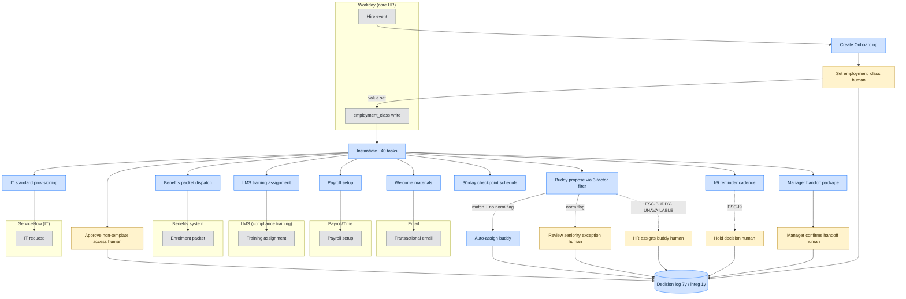

# Delegation Analysis — Scenario 1 (HR Onboarding Coordination)

## Front-matter

- **Submission ID:** `delegation-analysis-scenario-1-202`
- **Source scenario:** [`../../scenario-1.md`](../../scenario-1.md)
- **Date produced:** 24.04.2026
- **Status:** First draft, pre-coach-session for this deliverable. HUMAN assumptions **H4**, **H5**, **H6** are **High** (coach-validated); the three-factor buddy filter under H4 is treated as settled for the work-inventory row. **H1**, **H3**, **H7** remain Medium; **H2** remains Low and is explicitly **not** used to move any row into FULL delegation.
- **Companion deliverables:**
  - Upstream: [`./problem-statement-scenario-1-201.md`](./problem-statement-scenario-1-201.md) — success metrics (M1–M4) this deliverable must defend; M4 is the boundary-respect non-negotiable.
  - Downstream: [`./capability-specification-scenario-1-203.md`](./capability-specification-scenario-1-203.md), [`./validation-design-scenario-1-204.md`](./validation-design-scenario-1-204.md), [`./assumptions-and-unknowns-scenario-1-205.md`](./assumptions-and-unknowns-scenario-1-205.md).

---

## 2. Assumption Log (scoped to the delegation boundary)

### 2.1 Scan table

| # | Source | Assumption (one line) | Cagan risk | Confidence | Row / hard constraint at risk if wrong |
|---|---|---|---|---|---|
| H4 | HUMAN | Buddy matching uses a three-factor filter (seniority + department + location), one buddy per mentee, tie-break by dept → location → seniority → random | Feasibility | High | Buddy *final-assign* row could move from FULL back to HUMAN-IN-LOOP |
| H5 | HUMAN | The 2 unnamed systems are Benefits and Payroll/Time, with similar integration capability to Workday/ServiceNow/LMS | Feasibility | High | Benefits enrolment and Payroll/Time setup rows hinge on this |
| H6 | HUMAN | HR Ops will grant the access needed to integrate with all 6 systems | Viability | High | Every FULL row depends on access being granted |
| H2 | HUMAN | Judgment-call tasks pattern cleanly enough to codify | Feasibility | Low | If used to FULL-delegate any judgment row, the boundary breaks — **explicitly not used that way here** |
| H7 | HUMAN | "Late I-9 triggers a hold" is a regulatory hold with legal exposure | Viability | Medium | Hold-decision row must be HUMAN-LED; if wrong, wording around boundary guard may change but the row itself does not |
| A5 | AGENT | "Not available" for buddy candidacy has three sub-cases — zero-match, capacity-exhausted (already a buddy), on-leave. HR escalation is required only on zero-match of *unencumbered* candidates; capacity-exhausted and on-leave are filtered upstream by the filter itself. | Feasibility | Medium | Buddy *propose* row and ESC-BUDDY-UNAVAILABLE wording |
| A6 | AGENT | Tie-break order under H4 (dept → location → seniority → random) is the coach-confirmed priority; if an apparent conflict exists with the H4 hypothesis wording ("prioritise in order of department, location and seniority"), the text is treated as authoritative. | Feasibility | Medium | Buddy tie-break mechanics — does not move a row but is build-blocking |
| A7 | AGENT | Employment-class decision (`contractor` vs `full_employee`) is HUMAN-LED; the agent does not infer it from any signal and does not branch processing off its own guess | Viability | High (cited IRS/ACA/state ABC — regulatory rather than coach-validated) | Classification row; boundary-respect M4 |
| A8 | AGENT | Seniority-norm check on buddy assignment (scenario calls out "whether a buddy assignment crosses seniority norms") is a *judgment call on the filter's output*, not a fourth filter factor. The agent may flag high-seniority-delta matches but may not block or override. | Feasibility | Medium | Buddy final-assign row |
| A9 | AGENT | Audit-trail retention: 7 years for employment records (I-9, classification, compliance training); 1 year for integration audit logs | Viability | Medium (industry standard; client policy may differ) | Decision-log hard constraint |

**Tension to surface (per primer anti-pattern "silently picking a side"):** H4's hypothesis text reads "prioritise in order of department, location and seniority" but the assumption statement text reads "department, location and seniority" — these agree. However, the scenario text flags seniority-norm *judgment* as one of the 15% judgment calls, which appears in tension with H4's *High* rating for full auto-assignment. This is surfaced as **A8**: agent may auto-assign from the three-factor filter's output, but must not override a flagged seniority-norm concern raised by HR — and must not suppress the flag.

### 2.2 Coach-session priority queue

1. **A5 (buddy "unavailable" semantics)** — resolution moves the BUDDY-PROPOSE row and the exact trigger of `ESC-BUDDY-UNAVAILABLE`. Highest leverage.
2. **A8 (seniority-norm flag vs. auto-assign)** — directly conditions whether the final-assign row is FULL or HUMAN-IN-LOOP.
3. **A9 (retention)** — affects every decision-log row; pinning it early avoids reopening the capability spec.
4. **A6 (tie-break order wording)** — build-blocking but does not move a row.
5. **A7 / H7 (regulatory wording for classification and I-9)** — does not move the rows (both stay HUMAN-LED) but conditions the boundary-guard rule language.
6. **H6 (access provisioning)** — non-blocking for classification but gates the FULL rows being operationally valid.

### 2.3 Update protocol

After each coach session, update entries in place: raise or lower confidence, add a dated note, change dependent rows in §4. Do not silently delete an assumption. If refuted, strikethrough and add a new numbered entry pointing at the replacement. A row moving from HUMAN-LED to FULL (or vice versa) must be visible as a change in a fresh re-run rather than hand-edited, per the regeneration rule.

### 2.4 Full entries

**H4 — Buddy three-factor filter** _(HUMAN — High, coach-validated per scenario file)_
- **Assumption:** Buddy assignment is determined by seniority + department + location; one buddy per mentee; if multiple matches, tie-break in order dept → location → seniority → random; if no candidate, escalate to HR.
- **Hypothesis:** Filter passes → agent auto-assigns; filter fails → HR takes over.
- **How I'd test it:** Already coach-validated on the three-factor model and HR-escalation-on-zero-match. Operational probes carried forward as A5, A6, A8.
- **Confidence:** High — coach-confirmed on the model and the escalation rule.

**H5 — Unnamed systems = Benefits + Payroll/Time** _(HUMAN — High, coach-validated)_
- **Assumption:** The 2 systems the scenario leaves unnamed are a benefits system and a payroll/time system with similar integration surface.
- **Hypothesis:** Integration treatment parallels Workday / ServiceNow / LMS.
- **How I'd test it:** Confirmed in coach session; vendor / API specifics tracked in the capability spec's integration section.
- **Confidence:** High.

**H6 — HR Ops willingness to grant integration access** _(HUMAN — High, coach-validated)_
- **Assumption:** HR Ops will provide the access and support needed for the agent to integrate with all 6 systems.
- **Hypothesis:** Willingness-to-adopt extends to willingness-to-provision-access.
- **How I'd test it:** Already coach-validated. Specific system owners and access turnaround are tracked as AGENT entries in the assumptions-and-unknowns register.
- **Confidence:** High.

**H2 — Judgment-call patternability** _(HUMAN — Low)_
- **Assumption:** Judgment calls follow identifiable patterns.
- **Hypothesis / How I'd test it:** See problem-statement deliverable §2.4.
- **Confidence:** Low — not used to move any row in §4 from HUMAN-LED to FULL. The three scenario-named judgment calls (classification, seniority-norm, late I-9) all stay HUMAN-LED on the strength of the scenario text and cited regulation, *not* on this assumption.

**H7 — Late I-9 is a regulatory hold** _(HUMAN — Medium)_
- **Assumption:** "Late I-9 triggers a hold" is regulatory (IRCA).
- **Hypothesis:** Hold decision is HUMAN-LED.
- **How I'd test it:** Client's written I-9 policy + IRCA text.
- **Confidence:** Medium — reasonable but unconfirmed in detail.

**A5 — Buddy "unavailable" sub-cases** _(AGENT — Medium)_
- **Assumption:** The filter output is empty if every otherwise-matching candidate is already a buddy or on leave; ESC-BUDDY-UNAVAILABLE fires only on zero-match of unencumbered candidates.
- **Hypothesis:** If the filter already screens for capacity and leave, the escalation semantics are "no candidate exists this week" rather than "no candidate exists at all".
- **How I'd test it:** "When HR takes over buddy assignment today, are they typically looking at a pool with leave and capacity pre-filtered, or do they sometimes find someone the filter missed?"
- **Confidence:** Medium.

**A6 — Tie-break order** _(AGENT — Medium)_
- **Assumption:** The tie-break priority is dept → location → seniority → random, per H4.
- **Hypothesis:** Deterministic ordering is necessary to avoid silent non-determinism in audit logs.
- **How I'd test it:** Confirm ordering in coach session; otherwise build-blocking.
- **Confidence:** Medium.

**A7 — Classification is HUMAN-LED regardless of signal strength** _(AGENT — High, regulatory-anchored)_
- **Assumption:** Employment-class (`contractor` vs `full_employee`) is set by a named human; the agent must not infer it from signals (engagement-letter language, hours, title).
- **Hypothesis:** If the agent flipped a processing path on an inferred classification, the firm could be exposed on IRS common-law test, ACA 30-hour rule, or state ABC tests.
- **How I'd test it:** Regulatory text is the source; no client test needed to confirm the boundary — only to confirm *who* the named human is.
- **Confidence:** High on the boundary; Medium on the named-human identity.

**A8 — Seniority-norm flag is a HUMAN-LED exception to auto-assign** _(AGENT — Medium)_
- **Assumption:** The scenario's "whether a buddy assignment crosses seniority norms" judgment call is an after-filter check, not a fourth filter factor.
- **Hypothesis:** If the filter yields a match, auto-assign proceeds, *but* if the seniority delta exceeds a threshold (to be set by HR), the agent flags the proposed match for HR review before the assignment is persisted.
- **How I'd test it:** "Is there a seniority-delta threshold you would want us to surface for your review before the system auto-assigns?" If yes → this row becomes HUMAN-IN-LOOP under that specific condition. If no → pure FULL.
- **Confidence:** Medium.

**A9 — Retention periods** _(AGENT — Medium)_
- **Assumption:** 7 years for employment records; 1 year for integration audit logs.
- **Hypothesis:** Matches industry standard; may be tightened by client policy.
- **How I'd test it:** Ask client's records-retention policy owner.
- **Confidence:** Medium.

---

## 3. Delegation Framework (brief)

Three classifications are used in the work inventory below, applied at the **task / decision** level (not the capability level) — a single capability can contain rows in all three:

- **FULL DELEGATION.** Agent executes end-to-end. The task is rule-governed, the outcome is reversible or low-impact, the system of record is named, and the decision is deterministic given the inputs.
- **HUMAN-IN-LOOP.** Agent drafts, proposes, or prepares; a *named human* must act (approve, confirm, sign off) before the system state changes. The agent may not treat silence as approval.
- **HUMAN-LED.** A human decides. The agent may detect, flag, or compile evidence, but must not take the decision itself. Silent-error cost or regulatory exposure puts the call here.

Vocabulary anchored in `SupportingDocs/the-fde.md` (Delegation Archetypes / Cognitive Zones). No hybrids inside a single cell — where a task has a routine execution and a judgment gate, it produces two rows (see Buddy matching: propose vs. final assign).

---

## 4. Work Inventory

| # | Task / Decision | Classification | Rationale (why) | Source |
|---|---|---|---|---|
| 1 | **Create `Onboarding` record** on hire event from Workday | FULL | Rule-governed, reversible, Workday is system of record, deterministic trigger. | [CITED] scenario — Workday is core HR |
| 2 | **Instantiate ~40 onboarding tasks** from template per classification | FULL | Template expansion is deterministic once `employment_class` is set upstream by a human (see #3). Reversible. | [CITED] scenario (40 tasks, 2-week span) |
| 3 | **Decide `employment_class` (contractor vs full employee)** | HUMAN-LED | Scenario names classification as a judgment call; regulatory exposure (IRS common-law test, ACA 30-hour, state ABC) makes silent-error cost extreme; an incorrect agent inference is an irreversible compliance finding. Agent may not branch on a signal it synthesised itself. | [CITED] scenario quote; [CITED] IRCA-adjacent regulation. [ASSUMED] — A7 (specific cites); **not** relying on H2. |
| 4 | **IT provisioning — request creation in ServiceNow** (laptop, accounts, access bundles per role) | FULL | Rule-governed given classification and role; ServiceNow is system of record; idempotent on a deterministic key. Reversible (deprovision path exists). | [CITED] scenario (ServiceNow for IT); [ASSUMED] — H6 (access) |
| 5 | **IT provisioning — approval of access bundles that exceed standard role template** | HUMAN-IN-LOOP | Standard bundles are FULL under #4; anything outside the template is an access-control decision that requires a named approver. | [ASSUMED] — A7 (regulatory-adjacent access); best-practice IT governance |
| 6 | **Benefits enrolment — send enrolment packet & track deadline** | FULL | Paperwork dispatch and deadline-nag cadence are rule-governed; non-completion raises an escalation, does not cause agent to make enrolment elections. | [CITED] scenario (6 systems); [ASSUMED] — H5 (Benefits system identity) |
| 7 | **Benefits enrolment — elections on behalf of employee** | HUMAN-LED | The *employee* makes the election. Agent does not. | [CITED] common-sense; reinforced by ERISA-style fiduciary framing |
| 8 | **Compliance training — assignment in LMS** per classification | FULL | Deterministic mapping from classification → track; LMS is system of record; idempotent on a deterministic key. | [CITED] scenario (LMS); [ASSUMED] — H5-adjacent (LMS API availability) |
| 9 | **Compliance training — which track applies to contractor vs. full employee** | HUMAN-LED (indirectly) | This is actually the classification decision (#3) surfacing again — once classification is set, the track mapping in #8 is deterministic. Listed here for completeness so reviewers do not think the agent chooses a track independently. | [CITED] scenario (explicit judgment call example) |
| 10 | **Buddy matching — propose candidate via 3-factor filter** (seniority + dept + location; one-buddy-per-mentee; tie-break dept→loc→sen→random) | FULL | Coach-validated under H4 as a deterministic filter. Reversible (reassign possible). | [CITED] per H4; tie-break per A6 |
| 11 | **Buddy matching — final assignment when no seniority-norm concern** | FULL | Given the filter's coach-validated three-factor scope, the default case is auto-assign. | [ASSUMED] — H4 (High); A5 |
| 12 | **Buddy matching — seniority-norm exception path** (e.g. delta exceeds threshold) | HUMAN-IN-LOOP | Scenario names "buddy crosses seniority norms" as a judgment call — surfaced here as an after-filter exception rather than a fourth filter factor. Agent flags, HR reviews, HR persists. | [CITED] scenario; [ASSUMED] — A8 |
| 13 | **Buddy matching — no candidate available (zero-match of unencumbered pool)** | HUMAN-LED | Per H4's escalation rule. Agent raises `ESC-BUDDY-UNAVAILABLE`; HR decides the override (pick someone on-leave, skip, or expand pool). | [CITED] per H4; [ASSUMED] — A5 |
| 14 | **Welcome materials dispatch** (email + portal seeding) | FULL | Rule-governed, reversible, low-impact. | [CITED] scenario |
| 15 | **30-day checkpoint scheduling** (calendar invite, reminder cadence) | FULL | Calendaring + reminder logic is deterministic. | [CITED] scenario |
| 16 | **Manager handoff package preparation** (assembled artefact: who reports to whom, access summary, buddy) | FULL | Agent compiles from existing records; reversible; no new facts. | [CITED] scenario |
| 17 | **Manager handoff confirmation** (manager confirms receipt / readiness) | HUMAN-IN-LOOP | System state (`onboarding.handoff_status`) should not flip to DONE on silence; the manager is the named actor. | [ASSUMED] — A9 (audit); operational best practice |
| 18 | **I-9 Section 2 — reminder cadence to employee and manager** | FULL | Nag cadence is rule-governed; agent does not complete I-9 itself. | [CITED] IRCA 8 U.S.C. § 1324a — 3 business day rule |
| 19 | **I-9 Section 2 — hold decision when overdue** | HUMAN-LED | Regulatory; agent raises `ESC-I9`, HR decides the hold. | [CITED] scenario ("late I-9 triggers a hold"); [CITED] IRCA; [ASSUMED] — H7 (Medium) |
| 20 | **Workday write of `employment_class`** | HUMAN-LED | Direct corollary of #3. Agent may not write this field. | [CITED] per #3; [ASSUMED] — A7 |
| 21 | **All external-system writes (Workday, ServiceNow, LMS, Benefits, Payroll, Email)** | FULL (with idempotency and retry — see capability spec §6) | Rule-governed mechanics; retry on 5xx/429, escalate on repeated 4xx. Reversible via compensating write where feasible; flagged for HR where not. | [ASSUMED] — H6 (access); H5 (Benefits/Payroll identity) |
| 22 | **Decision-log write for every state transition, escalation, and human decision** | FULL | Rule-governed; deterministic; retention per A9. Non-negotiable for M4. | [ASSUMED] — A9; **supports** M4 non-negotiable metric |

### Conditional rows that will move if an assumption resolves differently

- **Row 11 (buddy final-assign)** moves to HUMAN-IN-LOOP if A8 resolves with a named seniority-delta threshold that HR wants to review pre-assignment on *every* match, not only exceptions.
- **Row 10 (buddy propose)** does *not* move regardless of A5; what changes is the condition under which `ESC-BUDDY-UNAVAILABLE` fires.
- **Row 5 (IT access bundle approval)** becomes FULL only if the client later confirms a policy that "anything in the role template" is pre-approved for the agent; no such confirmation today.
- If H7 resolves as internal-policy-only (not IRCA), Row 19's wording changes but the classification stays HUMAN-LED — holds on regulatory artefacts are never agent decisions regardless of source.

---

## 5. Hard Constraints on the Boundary

| # | Constraint | Source | Effect on the boundary |
|---|---|---|---|
| C1 | **Employment classification is a human decision.** Agent must not infer or set `employment_class`; downstream processing branches only after a named human has set the value in Workday. | [CITED] scenario (classification named as judgment call); [CITED] IRS common-law test; ACA 30-hour rule; state-level ABC tests (e.g. California AB5 codifying *Dynamex* test). | Fixes row #3 as HUMAN-LED and row #20 as HUMAN-LED regardless of design preference. |
| C2 | **I-9 Section 2 must be completed within 3 business days of start date; hold decisions on non-completion are human.** Agent detects, reminds, and escalates; it does not hold. | [CITED] scenario ("late I-9 triggers a hold"); [CITED] IRCA 8 U.S.C. § 1324a. | Fixes row #18 as FULL (reminders only) and row #19 as HUMAN-LED. |
| C3 | **No employee benefit election may be made on the employee's behalf.** Agent dispatches, tracks, escalates; it does not elect. | [CITED] scenario (benefits enrolment is named); ERISA-style fiduciary framing makes the election a protected individual decision. | Fixes row #7 as HUMAN-LED. |
| C4 | **Every human decision is logged; employment-record retention is 7 years.** A task classified as requiring a human decision cannot transition to `COMPLETE` without a matching `HumanDecision` log row. | [CITED] audit-trail convention for employment records (IRCA recordkeeping requires I-9 retention of 3 years after hire or 1 year after termination, whichever is later; firm-wide 7-year standard is the envelope). [ASSUMED — A9] for the specific 7-year / 1-year split; client policy to confirm. | Makes M4 (boundary-respect 100%) enforceable. No FULL row may be reclassified to swallow a HUMAN-LED gate. |

Every row here is either [CITED] from the scenario, from named regulation, or from a standard recordkeeping framework. A9 tags the 7-year/1-year specifics as [ASSUMED] because the exact envelope is client-policy-specific; the existence of a retention requirement is not assumed.

---

## 6. Delegation Boundary Diagram

Trigger check (`CLAUDE.md` § *Diagrams*): work inventory has **22 rows** (> 10), and rows #3, #12, #13, #17, #19 cross the agent-vs-human boundary with distinct veto / override / hold paths. Both triggers fire. A diagram is warranted.

*Figure 1 — Delegation boundary across the Onboarding orchestration (work inventory §4). Agent-driven nodes are blue; human-led nodes are yellow and suffixed `(human)` in prose references. Escalation edges are dashed with `ESC-*` codes. External systems are grouped by subgraph.*

The diagram introduces no new facts: every node maps to a row in §4 and every escalation edge maps to a hard constraint in §5.

---

## 7. Boundary-Respect Metric (hand-off to Deliverable 1)

The delegation analysis forces exactly one non-negotiable success metric, which the problem-statement deliverable carries as **M4**:

> **100% of judgment-classified tasks reach a logged `HumanDecision` record before the task state can become `COMPLETE`. Zero silent agent decisions.**

This is enforced by hard constraint **C4** in §5 and by the state-machine guard the capability spec will carry on `Task.status = COMPLETE`. If the problem-statement deliverable is regenerated, M4's wording and non-negotiable tag must survive unchanged.

---

## 8. Out of scope for this deliverable

This file produces Deliverable 2 only — work inventory + boundary rationale + hard constraints. It deliberately does not cover:

- **Problem statement and success metrics.** See [`./problem-statement-scenario-1-201.md`](./problem-statement-scenario-1-201.md) and [`../../Prompts/problem-statement.md`](../../Prompts/problem-statement.md).
- **Capability specification** — inputs, outputs, business rules, state machines, escalation triggers, integration contracts. See [`../../Prompts/capability-specification.md`](../../Prompts/capability-specification.md).
- **Validation design** — happy path, edge cases, failure modes, boundary tests. See [`../../Prompts/validation-design.md`](../../Prompts/validation-design.md).
- **Full assumptions / unknowns register.** See [`../../Prompts/assumptions-and-unknowns.md`](../../Prompts/assumptions-and-unknowns.md).

