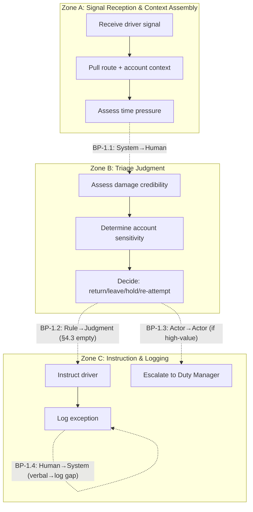
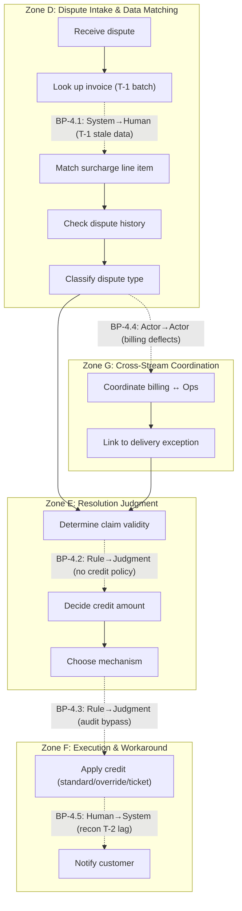
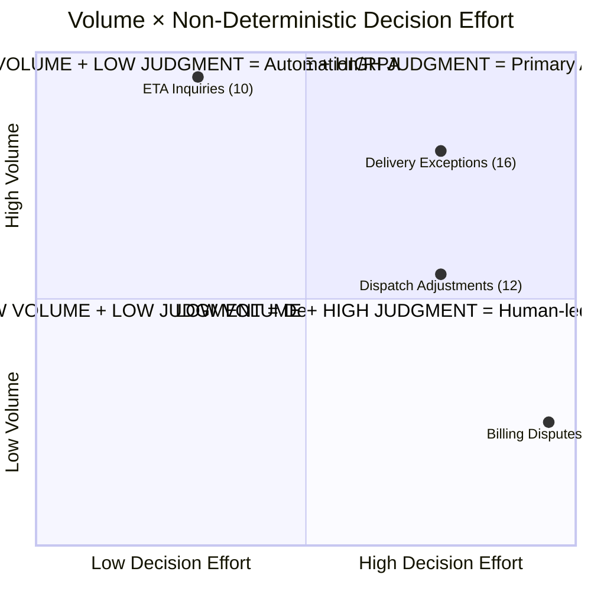
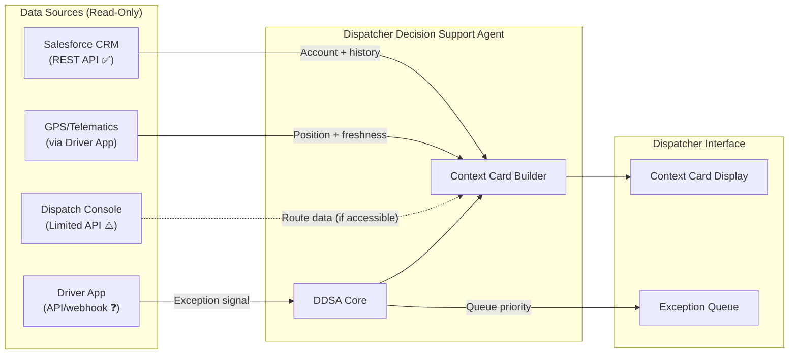

# Gate 2 — Chris Edwards

**Scenario:** Apex Distribution Ltd — Customer Operations
**Date:** 06.05.2026

---

# Deliverable 1 — Cognitive Load Map

> **Scenario:** Apex Distribution Ltd — Customer Operations (4 work streams, 35 people)  
> **Work streams selected:** Delivery Exceptions + Billing Disputes (richest artefact coverage: Artefacts 1, 2, 4, 5 + CSV exports)

---

## Section 1 — Lived-Process Narrative

### Work Stream 1: Delivery Exceptions (~180/day, avg 12 min/case)

**How it actually happens** `[Artefact 1]`:

Mark Petrov (driver, route 042) hits a refused delivery at Cobham. The recipient's warehouse worker (not the site manager) won't sign because the pallet "looks damaged." Mark's assessment differs — "it's just been on the lorry." He's parked up, blocking his remaining six drops. He calls dispatch, gets a voicemail because Sandra's line is busy. He's now waiting idle until someone calls back.

**Cognitive hotspots:**

1. **Triage decision under ambiguity** — the dispatcher (Sandra) must decide: return-to-depot, leave with the customer, or re-attempt later. This requires synthesising: (a) driver's visual assessment vs customer's refusal, (b) account value (Stein-Allen = "the big one"), (c) route pressure (6 remaining drops), (d) whether the site manager would override the warehouse worker if called `[INFERRED — scenario brief]`.

2. **High-value escalation threshold** — SOP says >£500 escalates to Duty Manager `[Artefact 4]`. But the SOP references DispatchHub (retired Oct 2024) and Section 4.3 (Damaged consignments) is literally incomplete — "TBD pending review of insurance protocol." The real decision process is undocumented.

3. **Time pressure cascade** — driver is parked. Every minute costs route completion time for 6 other customers. Dispatcher must balance get-it-right against get-it-done.

**Documented ↔ lived divergences:**

| SOP says | Reality shows |
|----------|-------------|
| Driver notes reason in DispatchHub tablet | DispatchHub retired Oct 2024; driver uses Driver App (or calls/voicemails dispatch) `[Artefact 4 footnote]` |
| DispatchHub confirms return/hold/re-attempt | Dispatcher makes verbal decision by phone `[Artefact 1]` |
| Damaged consignments follow §4.3 | §4.3 is empty — "TBD pending review of insurance protocol" `[Artefact 4]` |
| >£500 escalates to Duty Manager via console | No evidence this threshold is followed; Mark doesn't mention it; dispatcher makes the call `[INFERRED — Artefact 1]` |

---

### Work Stream 4: Billing Disputes (~60/day, avg 28 min/case)

**How it actually happens** `[Artefact 2, Artefact 5, CSV exports]`:

Pete (Hayes & Sons) emails billing@ about invoice INV-2026-04318: a £340 fuel surcharge on a delivery that arrived damaged. The Aurum Billing Team responds same-day with a template deflection: "fuel surcharges are calculated automatically... contact Customer Operations." Pete calls Customer Ops, waits 22 minutes, gets cut off. He emails back angry on day 4. Sandra (Customer Ops) responds on day 6 with a £170 goodwill credit — a workaround, not a fix, because "fuel surcharge can't be adjusted on individual invoices because of how Aurum works."

**Critical detail:** Sandra's £170 credit has no entry in the credits audit log `[Artefact 2 internal note]`. She used a manual override. Yet the APEX_CREDITS CSV export `[Artefact 5]` shows other credits (CR-2026-00814: £88 goodwill to Hayes & Sons, same approver U-0089) with proper AUDIT_REF entries. Sandra's override bypassed the standard credit path.

**Cognitive hotspots:**

1. **Cross-system handoff** — billing dispute lives in Aurum but resolution (goodwill credit) must be applied in Customer Ops. Billing deflects to Ops; Ops can't adjust the invoice. The customer bounces between teams for 6 days.

2. **Workaround judgment** — Sandra must decide: (a) credit amount (she chose £170, not £340 — roughly half the surcharge), (b) credit mechanism (manual override vs standard path), (c) whether to eat the audit gap. This requires weighing customer retention against financial controls.

3. **Pattern recognition** — Pete says "this is the second time this quarter." The disputes CSV confirms Hayes & Sons has 3 open disputes (D-2026-00342, D-2026-00337, D-2026-00318), 2 of which are FUEL_SURCH_DAMAGE type `[Artefact 5 — DISPUTES_OPEN]`. This is a repeat pattern, not an isolated case.

4. **Aurum constraint navigation** — fuel surcharges are batch-calculated by SYS_BATCH at 02:14 GMT `[FUEL_SURCH CSV]`, using tiered rates (T1=~8%, T2=~9–10%, T3=~12%). They can't be adjusted per-invoice. The only resolution is a separate goodwill credit — a different accounting event.

**Documented ↔ lived divergences:**

| System/process says | Reality shows |
|---------------------|-------------|
| Credits have AUDIT_REF entries `[CREDITS CSV]` | Sandra's £170 has no audit trail `[Artefact 2 internal note]` |
| Billing team handles billing queries | Billing deflects damage-related disputes to Customer Ops `[Artefact 2, msg 2]` |
| Resolution via standard credit path | Sandra uses manual override for speed `[Artefact 2]` |
| Reconciliation catches discrepancies within T-2 | Recon lags 24h behind invoice; override credits may not appear until next batch `[ASSUMED — A1]` |

---

## Section 2 — Jobs to be Done Decomposition

### Work Stream 1: Delivery Exceptions

| Field | JtD-1.1: Triage Refused Delivery | JtD-1.2: Resolve Driver Blockage | JtD-1.3: Escalate High-Value Exception |
|-------|---|---|---|
| **JtD ID** | JtD-1.1 | JtD-1.2 | JtD-1.3 |
| **Trigger** | Driver reports refusal (voicemail, app message, or call) | Driver parked awaiting instruction; remaining drops at risk | Consignment value >£500 OR account flagged as key |
| **Actor (current)** | Dispatcher (Sandra or colleague) | Dispatcher | Duty Manager (escalation path) |
| **Goal / Outcome** | Decide: return-to-depot, leave, hold, or re-attempt — with justification that protects the account relationship and minimises route disruption | Unblock the driver within minutes so remaining route completes on time | Ensure high-value decisions carry management authority and paper trail |
| **Key decisions** | Is the damage real or cosmetic? Is the person refusing authorised? Is the account relationship at risk? Is the driver's assessment credible? | How many drops remain? What's the time pressure? Can a re-attempt work later today? | Does value exceed threshold? Who is available as Duty Manager? Is documentation sufficient? |
| **Key systems** | Driver App (inbound message), Dispatch console (route context, account history), CRM (customer record) | Dispatch console (route planning), Driver App (messaging) | Dispatch console, CRM (account value) |
| **Expected output** | Verbal instruction to driver + exception logged in dispatch console | Driver moving to next drop; exception noted | Duty Manager decision recorded; driver instructed |
| **Primary type** | Decision-making | Execution + time-critical coordination | Exception-handling |

### Work Stream 4: Billing Disputes

| Field | JtD-4.1: Classify Dispute Type | JtD-4.2: Determine Resolution Path | JtD-4.3: Apply Financial Remedy | JtD-4.4: Manage Customer Through Delay |
|-------|---|---|---|---|
| **JtD ID** | JtD-4.1 | JtD-4.2 | JtD-4.3 | JtD-4.4 |
| **Trigger** | Customer contacts billing@ or Customer Ops with charge query | Dispute classified; agent must decide what to do | Resolution agreed; must be executed in Aurum or via workaround | Customer waiting (avg 6+ days); escalation risk rising |
| **Actor (current)** | Customer Ops agent (Sandra, Tom) | Customer Ops agent | Customer Ops agent (or Aurum support team for invoice mods) | Customer Ops agent |
| **Goal / Outcome** | Determine: is this fuel surcharge, redelivery fee, dim-weight, or something else? Link to correct invoice and match to dispute type codes | Decide: can this be resolved via goodwill credit, does it need Aurum ticket, or is it a non-Apex issue to reject? | Credit applied, tracked, and auditable; customer notified of resolution | Customer doesn't escalate to management; account relationship preserved |
| **Key decisions** | Which invoice? Which line item? Does the dispute match the data in Aurum exports? | Is the customer right? What's the precedent? How much discretion does the agent have? Is it worth a 48h Aurum ticket or faster via goodwill credit? | Amount (full vs partial)? Standard path vs manual override? Audit compliance? | What to promise on timeline? When to proactively update? |
| **Key systems** | CRM (case, comms), Aurum exports (invoice lookup — T-1 lag) | CRM, Aurum exports, Aurum disputes file, Aurum credits history | Aurum (manual ticket for invoice mod — 48h) OR CRM (goodwill credit — immediate but workaround) | CRM (communications), email/phone |
| **Expected output** | Dispute categorised, linked to invoice in CRM | Resolution plan: credit amount, mechanism, timeline communicated to customer | Credit entry (with or without AUDIT_REF), customer notification | Customer informed of status; escalation prevented or managed |
| **Primary type** | Synthesis (data matching) | Decision-making | Execution (with compliance risk) | Communication |

---

## Section 3 — Cognitive Zones and Breakpoints

### Work Stream 1: Delivery Exceptions

**Zone A — Signal Reception & Context Assembly**
- Receive driver contact (voicemail/app/call)
- Pull route context from dispatch console
- Identify account (Stein-Allen = key account?)
- Assess time pressure (drops remaining, time of day)

**Zone B — Triage Judgment**
- Assess damage assessment: driver says cosmetic vs customer refuses
- Weigh: account value vs route pressure vs cost of return
- Decide: return / leave / hold / re-attempt
- Consider: is the refusing person authorised? (warehouse worker vs site manager)

**Zone C — Instruction & Logging**
- Call driver back with decision
- Log exception in dispatch console
- If high-value: escalate to Duty Manager

**Breakpoints:**

- `BP-1.1: System → Human — signal arrives (voicemail/app) but requires human interpretation of ambiguous context (is the pallet really damaged?)` `[Artefact 1]`
- `BP-1.2: Rule → Judgment — SOP says >£500 escalates, but §4.3 (damage) is undocumented; dispatcher must judge without protocol` `[Artefact 4]`
- `BP-1.3: One actor → Another — if escalation triggered, Dispatcher → Duty Manager handoff with context loss risk`
- `BP-1.4: Human → System — decision made verbally but must be logged in dispatch console; gap between decision and record` `[ASSUMED — A2]`

---

### Work Stream 4: Billing Disputes

**Zone D — Dispute Intake & Data Matching**
- Receive customer dispute (email/phone)
- Look up invoice in Aurum daily exports (T-1 lag)
- Match surcharge line item to fuel surcharge export
- Identify dispute type code
- Check customer dispute history

**Zone E — Resolution Judgment**
- Determine if customer's claim is valid
- Calculate appropriate credit (full vs partial)
- Decide mechanism: standard credit (audited) vs manual override (fast, unaudited) vs Aurum ticket (slow, correct)
- Weigh: customer retention vs financial control vs audit risk

**Zone F — Execution & Workaround**
- Apply credit via chosen mechanism
- If standard: create credit with AUDIT_REF
- If override: apply manually (no audit trail)
- If Aurum ticket: submit and wait 48h
- Notify customer of resolution and timeline

**Zone G — Cross-Stream Coordination**
- Link billing dispute to delivery exception (if dispute originated from damaged delivery)
- Check if related delivery exception is already logged
- Coordinate between billing team and Customer Ops (customer bounced between teams)

**Breakpoints:**

- `BP-4.1: System → Human — Aurum exports arrive as batch T-1; agent cannot verify real-time invoice state, must work from stale data` `[Artefact 5]`
- `BP-4.2: Rule → Judgment — no documented authority level for goodwill credits; Sandra decides £170 (partial, not full £340) with no visible policy` `[Artefact 2]`
- `BP-4.3: Rule → Judgment — standard credit path requires AUDIT_REF, but Sandra bypasses it via manual override when speed matters more than compliance` `[Artefact 2 internal note]`
- `BP-4.4: One actor → Another — billing team deflects to Customer Ops; customer must re-explain context; no case handoff in CRM` `[Artefact 2, msg 2→3]`
- `BP-4.5: Human → System — credit applied but reconciliation won't reflect it until T-2 (24h+ lag); system state lags behind human action` `[RECON CSV]`

---

## Section 4 — Micro-Task Inventory

### Work Stream 1: Delivery Exceptions

| Micro-task | Cognitive Load | Input Structure | Decision Determinism | Exception Frequency | Turn-Taking Degree | Latency Constraint | Compliance/Risk Sensitivity | Tool/API Availability |
|---|---|---|---|---|---|---|---|---|
| Receive & parse driver signal | L | L (unstructured voicemail/message) | H (deterministic: receive and note) | L | L | H (driver waiting) | L | H (Driver App has messaging API) |
| Pull route context + account info | L | H (structured dispatch data) | H | L | L | H | L | M (dispatch console = limited API) |
| Assess damage credibility | H | L (verbal description, no photo) | L (judgment call) | M | M (may need to call driver back) | H | M (liability implications) | L (no visual verification system) |
| Determine account sensitivity | M | H (CRM account record) | M (key accounts known but not flagged systematically) | L | L | M | M | H (CRM API available) |
| Decide: return/leave/hold/re-attempt | H | L (synthesises multiple inputs) | L (dispatcher discretion) | H (every refusal is different) | M | H (driver blocked) | H (wrong call = lost consignment or lost customer) | L (no decision-support tool) |
| Instruct driver | L | H (simple message) | H (once decided, execution is deterministic) | L | M (driver may push back) | H | L | H (Driver App messaging) |
| Log exception in dispatch console | L | H (structured form) | H | L | L | M | M (audit trail) | M (dispatch console limited API) |
| Escalate to Duty Manager (if triggered) | M | M (must package context) | M (threshold exists but §4.3 is undocumented) | M? | H (handoff to another person) | H | H (high-value decisions) | M |

### Work Stream 4: Billing Disputes

| Micro-task | Cognitive Load | Input Structure | Decision Determinism | Exception Frequency | Turn-Taking Degree | Latency Constraint | Compliance/Risk Sensitivity | Tool/API Availability |
|---|---|---|---|---|---|---|---|---|
| Receive dispute & identify invoice | L | M (email free-text but references invoice #) | H (lookup) | L | L | L (not time-critical) | L | H (CRM API + batch CSV) |
| Match invoice to surcharge/fee line | M | H (CSV structured) | H (data matching) | L | L | L | L | H (batch exports parseable) |
| Check customer dispute history | M | H (disputes CSV, CRM history) | H (lookup) | L | L | L | M (pattern = escalation risk) | H |
| Classify dispute type | M | M (customer's description vs system codes) | M (requires interpretation of customer language) | M | L | L | L | H |
| Determine if claim is valid | H | L (requires judgment: was delivery damaged? is surcharge fair?) | L (no clear rules; Sandra decides) | H | M (may need delivery exception record) | L | H (financial impact) | M (need to cross-reference exception logs) |
| Decide credit amount | H | M (invoice amount known; guideline unclear) | L (discretionary: Sandra chose half — £170 of £340) | H | L | L | H (financial, audit) | L (no decision-support / approval system) |
| Choose mechanism (standard vs override vs Aurum ticket) | H | M | L (trade-off: speed vs audit compliance) | M | L | M (48h Aurum vs immediate override) | H (audit/compliance risk) | M? |
| Apply credit | M | H (execute in chosen path) | H (once decided, mechanical) | L | L | M | H (must be auditable — often isn't) | M (Aurum = manual ticket; override = no trail) |
| Notify customer | L | M (compose resolution email) | H | L | L | M (customer waiting 6+ days) | L | H (CRM/email) |
| Coordinate billing ↔ Customer Ops | M | L (organisational handoff, no shared queue) | L (no protocol) | H (every dispute crosses the boundary) | H (billing team + ops team + customer) | M | M | L (no shared case management between teams) |

---

## Section 5 — Process Topology Diagram



*Figure 1 — Delivery Exceptions: Zone topology with breakpoints. Note BP-1.2: the Rule→Judgment transition occurs because the SOP is literally incomplete for damaged consignments.*



*Figure 2 — Billing Disputes: Zone topology. Note the cross-stream coordination (Zone G) creates a loop — delivery exceptions feed billing disputes, requiring context assembly across teams.*


---

# Deliverable 2 — Delegation Suitability Matrix

> **Input:** Micro-task inventory from Deliverable 1 (18 micro-tasks across 2 work streams)  
> **Scoring:** 7 delegation suitability dimensions per `atx-scoring.md`

---

## Suitability Gate (Pre-Filter)

Before scoring, filter tasks that are not agent candidates:

| Task cluster | Gate result | Reason |
|---|---|---|
| Receive & parse driver signal | **Pass** — scored as part of "Assess damage credibility" | Unstructured input (voicemail/message) interpretation is the first micro-task within the triage judgment; scored below as the Input Structure dimension of "Assess damage credibility" |
| Pull route context + account info | **Route to automation/RPA** | Deterministic lookup; no judgment; H determinism, H input structure |
| Instruct driver (post-decision) | **Route to automation/RPA** | Once decision made, instruction is deterministic message send |
| Log exception in dispatch console | **Route to automation/RPA** | Structured form fill; no judgment |
| Receive dispute & identify invoice | **Pass** — proceeds to scoring | Requires parsing free-text email to extract invoice reference |
| Match invoice to surcharge/fee line | **Route to automation/RPA** | Deterministic data join on INVOICE_NO across CSVs |
| Check customer dispute history | **Route to automation/RPA** | Deterministic lookup in DISPUTES_OPEN + CRM |
| Apply credit (execution) | **Conditional** — standard path is automatable; manual override is not | Split: standard credit = automation; override = human |
| Notify customer | **Pass** — proceeds to scoring | Requires contextual composition (not template-only) |

**4 tasks routed to automation/RPA** (not agent territory): route/account lookup, driver instruction relay, exception logging, invoice-to-surcharge matching, dispute history lookup.

---

## Suitability Scoring Table

| Task cluster | Input Structure | Decision Determinism | Tool Coverage | Context Complexity | Exception Rate | Latency Constraint | Risk/Compliance | Key drivers | **Archetype** |
|---|---|---|---|---|---|---|---|---|---|
| **Assess damage credibility** | L | L | L | H | M | H | M | No visual data; verbal-only input; driver vs customer conflict; time pressure | **Human-only** |
| **Determine account sensitivity** | H | M | H | M | L | M | M | CRM data available but "key account" not systematically flagged; heuristic knowledge | **Agent-led + human oversight** |
| **Decide: return/leave/hold/re-attempt** | L | L | L | H | H | H | H | Highest-judgment task; synthesises ambiguous inputs under time pressure; wrong call = lost goods or lost customer | **Human-led + agent support** |
| **Escalate to Duty Manager** | M | M | M | M | M? | H | H | Threshold exists (>£500) but §4.3 undocumented; context packaging needed | **Human-led + agent support** |
| **Classify dispute type** | M | M | H | M | M | L | L | Customer language needs interpretation but maps to finite set of codes; batch data available | **Agent-led + human oversight** |
| **Determine if claim is valid** | L | L | M | H | H | L | H | Requires cross-referencing delivery exception with billing data; no documented validation rules; financial judgment | **Human-led + agent support** |
| **Decide credit amount** | M | L | L | H | H | L | H | No visible policy (Sandra chose half); discretionary; audit implications | **Human-only** |
| **Choose mechanism (standard/override/ticket)** | M | L | M | M | M | M | H | Trade-off between speed, audit compliance, and Aurum constraints; compliance risk is high | **Human-led + agent support** |
| **Notify customer** | M | H | H | L | L | M | L | Template-able for standard cases; contextual for disputes with history; CRM/email available | **Agent-led + human oversight** |
| **Coordinate billing ↔ Customer Ops** | L | L | L | H | H | M | M | No shared queue; no protocol; organisational boundary; every dispute crosses it | **Human-led + agent support** |

---

## Archetype Distribution

| Archetype | Count | Task clusters |
|---|---|---|
| **Fully Agentic** | 0 | — |
| **Agent-led + Human Oversight** | 3 | Determine account sensitivity, Classify dispute type, Notify customer |
| **Human-led + Agent Support** | 5 | Decide return/leave/hold/re-attempt, Escalate to Duty Manager, Determine claim validity, Choose mechanism, Coordinate billing↔Ops |
| **Human-only** | 2 | Assess damage credibility, Decide credit amount |
| **Routed to RPA/automation** | 4 | Route/account lookup, Instruction relay, Exception logging, Invoice matching, Dispute history lookup |

**No task cluster is fully agentic.** This is a high-judgment, time-pressured, ambiguous-input domain. The richest agentic opportunity is in the *support* layer — accelerating human decisions with pre-assembled context, pattern detection, and data matching — not in replacing the decisions themselves.

---

## Archetype Rationale

### Human-only: Assess damage credibility

The dispatcher must judge whether a pallet is actually damaged based on a driver's verbal description over voicemail, with no visual evidence, while the customer (an unauthorised warehouse worker) insists otherwise. No system, API, or structured data supports this judgment today. Tool/API Availability = L. Input Structure = L. Even with photo evidence (future state), the damage-vs-cosmetic determination is a liability call, not a pattern-matching exercise. **Adjacent archetype rejected (Human-led + agent support):** an agent could surface account value and route pressure, but the core judgment (is the damage real?) cannot be delegated — it carries insurance and contractual liability `[Artefact 1]`.

### Human-only: Decide credit amount

Sandra chose £170 on a £340 surcharge with no documented guideline. The disputes CSV shows another credit (CR-2026-00814, £88) to the same customer for a different invoice — also GOODWILL, also without a clear formula. There is no visible credit policy: no percentage rule, no approval threshold, no delegation authority documented anywhere in the artefacts. Until a credit policy exists, this is pure human discretion. **Adjacent archetype rejected (Human-led + agent support):** an agent could suggest a range based on historical precedent, but without a policy guardrail, any autonomous action carries financial and audit risk. The compliance dimension alone (H) keeps this human-only `[Artefact 2, CREDITS CSV]`.

### Human-led + agent support: Decide return/leave/hold/re-attempt

The decision synthesises: driver assessment (unreliable — no photos), customer refusal authority (warehouse worker ≠ site manager), account value (Stein-Allen = "the big one"), route pressure (6 drops), and time of day. Context Complexity = H, Decision Determinism = L, Exception Rate = H. **But the agent can materially help:** surface the account tier from CRM, show the route remaining (drops + time), pull prior refusal history for this account, and present options with trade-offs. The human decides; the agent accelerates context assembly from ~5 min to seconds. **Adjacent archetype rejected (Agent-led + oversight):** the liability and route-cascade consequences of a wrong autonomous call are too high for oversight-only; the human must own the decision `[Artefact 1, scenario brief]`.

### Human-led + agent support: Determine if claim is valid

Requires cross-referencing a billing dispute with a delivery exception (different systems, different teams). Did the delivery actually arrive damaged? Was an exception logged? Is the customer's claim consistent with dispatch records? Today, Sandra must manually link these. An agent could: (a) match the dispute invoice to any delivery exception logged for that route/date, (b) surface the delivery scan record and GPS data, (c) flag inconsistencies. But the *validity determination* is judgment — especially when the exception record is incomplete (§4.3 is "TBD") and the customer's claim can't be verified from system data alone `[Artefact 2 + Artefact 4]`.

### Human-led + agent support: Choose mechanism (standard/override/Aurum ticket)

Three options exist, each with different speed, compliance, and cost profiles. The standard credit path is auditable (AUDIT_REF present in CSV). The manual override is fast but leaves no trail. The Aurum ticket is correct but takes 48h. An agent could present the options with compliance flags (e.g. "Override: fast but no audit entry — compliance risk") and recommend standard path with auto-generated AUDIT_REF. But the final choice — especially the decision to bypass audit — cannot be delegated. **Adjacent archetype rejected (Agent-led + oversight):** the audit bypass decision carries personal accountability; Risk/Compliance = H `[Artefact 2 internal note, CREDITS CSV]`.

### Human-led + agent support: Coordinate billing ↔ Customer Ops

No shared queue exists. Billing deflects to Ops via template response (Artefact 2, msg 2). The customer must re-explain. Context is lost. An agent could: route the dispute to the correct team with context pre-attached, flag when a dispute has already bounced, and alert when customer wait exceeds threshold. But the organisational coordination (who owns this dispute?) is a human protocol problem — not solvable by an agent alone `[Artefact 2]`.

### Human-led + agent support: Escalate to Duty Manager

The £500 threshold exists in the SOP but the SOP is stale. The real escalation criteria are undocumented. An agent could flag when a consignment's value exceeds threshold and pre-assemble the context package for the Duty Manager. But the *decision to escalate* (and the judgment that the threshold applies in this specific case) remains human — especially given the SOP gap on damages `[Artefact 4]`.

### Agent-led + human oversight: Determine account sensitivity

CRM holds account data (contract type, rate card, credit limit, account manager). The Customer Master CSV shows structured fields. An agent could classify accounts by tier (B2B_VOLUME > B2B_STANDARD; higher credit limit = higher sensitivity) and flag accordingly. Human oversight needed because "key account" status includes informal knowledge (Stein-Allen = "the big one" per driver, but nothing in the system flags this) `[Artefact 1, CUSTOMER_MASTER CSV]`.

### Agent-led + human oversight: Classify dispute type

Customer emails use natural language ("fuel surcharge on a delivery that arrived damaged") that maps to system codes (FUEL_SURCH_DAMAGE, REDELIVERY_FEE, DIM_WEIGHT per disputes CSV). Input is semi-structured (invoice numbers referenced), output is a finite set of codes. An agent could classify with high confidence for clear cases and flag ambiguous ones for human review. Tool coverage = H (CRM API + batch exports). Risk/Compliance = L (classification error is correctable) `[Artefact 2, DISPUTES_OPEN CSV]`.

### Agent-led + human oversight: Notify customer

Standard notifications are template-able (acknowledgements, status updates, timeline promises). For cases with history (repeat disputants like Hayes & Sons), tone and content need calibration — human reviews before send. CRM and email APIs available (Tool/API = H). Low compliance risk. **Adjacent archetype rejected (Fully agentic):** because some notifications reference financial outcomes or make promises (timelines, credit amounts), a human should review dispute-resolution notifications before send `[Artefact 2, scenario brief]`.

---

## Feed-Forward Summary

**Primary signal for D3 (Volume × Value):**
- Delivery Exceptions: high volume (180/day), high judgment, low tool coverage → Human-led + agent support
- Billing Disputes: lower volume (60/day) but highest handling time (28 min), cross-system complexity, compliance risk → mixed (Human-only + Human-led + Agent-led)

**The agent opportunity is in the support layer**, not the decision layer. The primary agentic target should be the work stream where agent support most reduces handling time without requiring autonomous judgment.


---

# Deliverable 3 — Volume × Value Analysis

> **Input:** Scenario brief (4 work streams with volumes) + Deliverable 2 (delegation archetypes)  
> **Scoring:** ATX 1–5 scales per `atx-scoring.md` § Step 2

---

## Scoring Table

| Work stream | Vol/day | Handling time | Execution Frequency (1–5) | Non-Deterministic Decision Effort (1–5) | Agentic Value Score | Justification |
|---|---|---|---|---|---|---|
| **Delivery Exceptions** | ~180 | 12 min | 4 (high daily volume, continuous inflow) | 4 (dispatcher discretion on every case; ambiguous inputs; SOP gap) | **16** | Every case requires triage judgment under time pressure. No two refusals are identical. §4.3 undocumented. Driver vs customer conflict with no structured evidence. `[Artefact 1, Artefact 4]` |
| **ETA Inquiries** | ~400 | 4 min | 5 (highest volume) | 2 (mostly lookup-and-respond; edge cases need driver call but majority are deterministic) | **10** | 80%+ is "check route, read ETA window, respond." Edge cases (GPS stale, driver unreachable) add non-determinism but are the minority. `[Artefact 3]` |
| **Dispatch Adjustments** | ~90 | 18 min | 3 (moderate daily volume) | 4 (mid-route changes under tight time pressure; driver swaps require coordination) | **12** | High non-determinism per case but lower volume. Every adjustment is time-critical and touches live routes. Requires dispatch console (limited API). `[INFERRED — scenario brief]` |
| **Billing Disputes** | ~60 | 28 min | 2 (lowest daily volume) | 5 (highest: cross-system, no documented credit policy, workaround judgment, audit trade-offs) | **10** | Each case is the most cognitively complex — but only 60/day. Resolution requires navigating Aurum constraints, undocumented credit authority, and cross-team coordination. `[Artefact 2, Artefact 5]` |

**Scoring scale reference:**
- Execution Frequency: 1=rare (<10/wk), 2=low (10–50/wk), 3=moderate (50–100/day), 4=high (100–300/day), 5=very high (>300/day)
- Non-Deterministic Decision Effort: 1=fully rule-based, 2=mostly rules with edge cases, 3=mixed rules and judgment, 4=mostly judgment with some patterns, 5=pure judgment/novel each time

---

## 2×2 Grid



*Figure 3 — Volume × Value quadrant chart. Delivery Exceptions lands top-right (highest agentic value). ETA Inquiries is top-left (automation candidate). Billing Disputes is bottom-right (high judgment but low volume — agent-assist, not agent-led).*

---

## Primary Agentic Target: Delivery Exceptions

**Score: 16** (Frequency 4 × Decision Effort 4)

**Why it wins:**

1. **Volume justifies investment** — 180 cases/day × 12 min = 36 person-hours/day of dispatcher time. Even a 30% reduction in context-assembly time saves ~11 person-hours/day.

2. **Agent-support architecture fits** — D2 shows the work is Human-led + Agent Support (not human-only). The agent's role is clear: assemble context (route, account, history) in seconds so the dispatcher decides faster. This is not a chatbot (Sarah hates those) — it's a decision-support tool for dispatchers.

3. **Tool coverage is partially available** — CRM (REST API), Driver App (messaging), and GPS data are accessible. The dispatch console (limited API) is a constraint but not a blocker for the context-assembly role.

4. **Time pressure multiplies value** — every minute the dispatcher spends assembling context is a minute the driver is parked and 6 other drops are delayed. Speed of context delivery = direct operational value.

5. **Doesn't require Aurum** — unlike Billing Disputes, delivery exceptions don't cross into the legacy billing system. The integration constraints are lower.

---

## Why Other Work Streams Don't Win

### ETA Inquiries (score 10) — Automation/RPA candidate, not agent

Highest volume (400/day) but low non-determinism (score 2). The standard case is: look up order → check route → read ETA window → respond. This is a rules/lookup automation problem, not an agentic one. The edge cases (driver call needed, GPS stale) are real but minority (<20% `[ASSUMED — A3]`). **Recommendation:** automate the 80% via a customer-facing ETA lookup tool or chatbot-style auto-responder; route edge cases to dispatch. Sarah's concern about chatbots is valid — but a self-service ETA lookup is different from the 2024 chatbot that tried to handle exceptions. `[Artefact 3, scenario brief]`

### Dispatch Adjustments (score 12) — Strong secondary target (Wave 2)

Moderate volume (90/day), high judgment (score 4), highest handling time per case after billing. The constraint is the dispatch console's limited API — mid-route changes require the Citrix-deployed Java console that the agent can't easily interact with. Until that constraint is resolved (API or integration layer), the agent's role is limited to notification and coordination, not execution. **Recommendation:** Wave 2 target once dispatch console integration is addressed.

### Billing Disputes (score 10) — Highest complexity but lowest volume

Only 60/day but each takes 28 min. The non-determinism score is highest (5) because every case involves undocumented credit authority, Aurum workarounds, audit trade-offs, and cross-team coordination. But the volume doesn't justify a dedicated agent — and the Aurum system (batch-only, 48h modification turnaround, quarterly schema changes) makes autonomous action nearly impossible. **Recommendation:** agent-assist for context pre-assembly (match dispute to invoice, surface history, flag repeat customers) but human-led resolution. Shared infrastructure with D.Exceptions agent (CRM integration, account classification). `[Artefact 2, Artefact 5]`

---

## Wave Sequencing

| Wave | Work stream | Agent role | Dependency |
|---|---|---|---|
| **Wave 1** | Delivery Exceptions | Dispatcher Decision Support Agent — context assembly, account flagging, pattern detection, option presentation | CRM API + Driver App + GPS |
| **Wave 1 (parallel)** | ETA Inquiries | Self-service automation (not agent) — lookup tool for standard cases | CRM API + route data |
| **Wave 2** | Dispatch Adjustments | Coordination agent — notification of affected parties, option assembly | Dispatch console API/integration layer |
| **Wave 2** | Billing Disputes | Context-assembly assist — dispute-to-invoice matching, history surfacing, repeat-pattern flagging | Aurum batch ingestion pipeline |

Wave 1 builds shared infrastructure (CRM API client, account classification, GPS/route data access) that Wave 2 reuses.


---

# Deliverable 4 — Agent Purpose Document

> **Agent:** Dispatcher Decision Support Agent (DDSA)  
> **Primary target:** Delivery Exceptions (Work Stream 1, score 16)  
> **Archetype:** Human-led + Agent Support

---

## Assumption Log (Scenario & Design Assumptions)

| # | Type | Assumption | Confidence | Test |
|---|------|-----------|------------|------|
| A1 | AGENT | Reconciliation file (T-2 lag) does not surface manual override credits until the next batch cycle — Sandra's unaudited credits are invisible for 24–48h | Medium | Ask Sarah: "When Sandra applies a goodwill credit, how quickly does finance see it?" |
| A2 | AGENT | Exception logging in the dispatch console happens after the decision is communicated to the driver — there is a gap between verbal instruction and system record | Medium | Ask Sarah: "Do dispatchers log exceptions before or after calling the driver back?" |
| A3 | AGENT | ~80% of ETA inquiries are standard lookup; ~20% require dispatch/driver contact | Low | Ask Sarah: "What proportion of 'where's my delivery' calls need a dispatcher, vs just a system lookup?" |
| A4 | AGENT | Dispatchers currently spend ~5 min of the 12 min/case on context assembly (pulling route, account, history) before making the triage decision | Low | Ask Sarah: "When a driver calls in with an exception, how long does it take your team to pull up the context before they can decide?" |
| A5 | AGENT | The Driver App has a messaging API or webhook capability that can surface inbound signals to external systems | Medium | Ask IT/Sarah: "Can the Driver App push notifications to other systems, or is it self-contained?" |
| A6 | AGENT | Stein-Allen account value and sensitivity is known informally by dispatchers but not flagged in CRM or any system | Medium | Ask Sarah: "How does a new dispatcher know which accounts are sensitive? Is it written down anywhere?" |
| A7 | AGENT | The £500 high-value escalation threshold from the SOP is still approximately correct even though the SOP is stale | Low | Ask Sarah: "Is there a value threshold for Duty Manager escalation? Is it still £500?" |
| A8 | AGENT | Dispatchers handle delivery exceptions individually (not batched) — each case gets immediate attention as it arrives | Medium | Ask Sarah: "Do dispatchers work exceptions one at a time as they come in, or batch them?" |
| A9 | AGENT | Sarah's scepticism of chatbots does not extend to internal decision-support tools for her own dispatchers | Medium | Ask Sarah: "When you say you're sceptical of AI — is that customer-facing AI specifically, or any AI tool including internal ones?" |

---

## Agent Identity

```
Agent Name:        Dispatcher Decision Support Agent (DDSA)
Job to be Done:    When a delivery exception arrives (refused delivery, damage dispute, 
                   missed window), assemble the decision context — account profile, route 
                   pressure, exception history, consignment value — in seconds rather 
                   than minutes, so the dispatcher can make the triage call faster and 
                   with better information. The agent does NOT make the triage decision.

Business context:  Customer Operations, Apex Distribution Ltd. 35-person team handling 
                   ~180 delivery exceptions/day across Midlands, South, and East England. 
                   COO (Sarah Whitmore) wants to reduce exception handling time without 
                   introducing customer-facing automation. Two prior AI projects failed 
                   (customer chatbot 2024; RPA for billing 2024).
```

---

## Primary Objectives

1. **Reduce context-assembly time** — from ~5 min to <30 seconds per exception case, so dispatchers spend their 12 minutes on judgment, not lookup `[ASSUMED — A4]`
2. **Surface decision-relevant data proactively** — account sensitivity, route pressure (drops remaining + time), prior exception history for this account/driver, consignment value — before the dispatcher asks
3. **Detect patterns invisible to individual dispatchers** — repeat refusals from the same site, drivers with above-average exception rates, accounts trending toward escalation

---

## KPIs

> **Note on KPI template:** The standard ATX KPIs (Accuracy, Coverage, Throughput, Cost/case, HITL rate) assume an autonomous agent. DDSA is Human-led + Agent Support — HITL rate is 100% by architecture (not a metric to minimise). The KPIs below measure what matters for a support agent: speed, completeness, adoption, and signal quality.

| KPI | Target | Acceptable floor/ceiling | Measurement |
|---|---|---|---|
| **Context assembly time** | <30 seconds from signal receipt to full context display | Ceiling: 60 seconds (above this, dispatcher waits too long) | Time from inbound signal to context card visible to dispatcher |
| **Context completeness** | 90% of cases where all 4 context elements (account, route, history, value) are surfaced without dispatcher having to look them up manually | Floor: 75% | % of cases where dispatcher does not need to open a second system |
| **Dispatcher adoption** | 80% of dispatchers actively using the context card within 4 weeks | Floor: 60% | Usage analytics (card views per exception case) |
| **Exception handling time reduction** | 25% reduction in mean handling time (12 min → 9 min) | Floor: 15% reduction | Before/after mean handling time from dispatch console logs `[ASSUMED — A4]` |
| **False-alert rate** | <10% of account-sensitivity flags are overridden by dispatcher as irrelevant | Ceiling: 20% | % of flagged cases where dispatcher dismisses the flag |

---

## Failure Modes

### FM-1: Stale context card — data doesn't match reality

**Bad output:** Agent surfaces account info or route data that is outdated (e.g. route has already been re-sequenced by dispatch but GPS hasn't caught up). Dispatcher acts on wrong context.

**Consequence:** Wrong triage decision (e.g. "driver has 6 drops remaining" when actually 3 have been reassigned). Trust erosion — dispatcher stops consulting the card.

**Recovery:** Timestamp every data element on the context card. Flag data freshness ("GPS: 3 min ago" vs "GPS: 22 min ago — may be stale"). If GPS is >15 min stale, mark route pressure as "unverified" rather than displaying a number.

### FM-2: Over-alerting on account sensitivity — alert fatigue

**Bad output:** Agent flags too many accounts as "sensitive" because the classification rule is too broad (e.g. all B2B_VOLUME accounts flagged when only 2–3 are genuinely sensitive to the dispatchers).

**Consequence:** Dispatchers ignore sensitivity flags entirely. The signal becomes noise.

**Recovery:** Start with a conservative rule (only flag accounts where credit limit > £40K AND prior escalation in last 90 days). Tune based on dispatcher override rate. If override rate >20%, tighten the rule.

### FM-3: Agent surfaces incomplete history — dispatcher makes decision without key context

**Bad output:** Agent shows "no prior exceptions for this account" when in fact there were exceptions logged in the dispatch console that the agent can't read (limited API surface).

**Consequence:** Dispatcher treats a repeat-offender account as a first-time refusal. Wrong calibration of response.

**Recovery:** Display "History: CRM only — dispatch console history not available" so the dispatcher knows the limitation. Include a "check dispatch console" prompt for high-value accounts. Log cases where dispatcher overrides to add context manually — these are integration gap signals.

### FM-4: Agent acts beyond delegation boundary — makes or implies a triage recommendation

**Bad output:** Agent displays "Recommended action: return to depot" based on pattern matching, and dispatcher follows it without applying their own judgment (authority drift).

**Consequence:** Agent is effectively making triage decisions by proxy. When a recommendation is wrong and cargo is lost, accountability is unclear.

**Recovery:** The agent MUST NOT present recommendations as actions. It presents context and options, never a single recommendation. UI design: display "Options: Return / Leave / Hold / Re-attempt" with trade-offs for each — never highlight one. If the system detects a dispatcher always selecting the first-displayed option, flag to operations lead.

---

## Delegation Archetype

**Human-led + Agent Support**

**Rationale (from D2):** Delivery exception triage scores: Input Structure = L, Decision Determinism = L, Context Complexity = H, Exception Rate = H, Latency Constraint = H, Risk/Compliance = H. The core decision (return/leave/hold/re-attempt) cannot be delegated — it carries liability for lost goods and customer relationships. But the context-assembly step is where most time is wasted and where the agent creates measurable value.

**Adjacent archetype rejected (Agent-led + oversight):** The 2024 chatbot failed because it made decisions customers disagreed with. An agent-led exception triage system would face the same trust problem internally — dispatchers won't accept an AI making calls that could lose a £2,000 pallet or a key account. Sarah is explicitly sceptical of autonomous AI; a support tool that makes her team faster (not redundant) is the politically viable and technically correct architecture.

**Adjacent archetype rejected (Human-only):** The agent doesn't decide but it materially changes the decision quality and speed. Without it, dispatchers spend 5 minutes pulling context from 3 systems. With it, they spend 30 seconds reviewing a pre-assembled card. That's not "human-only" — it's human-led with substantive agent contribution.

---

## Escalation Triggers

| # | Condition | Target | Urgency |
|---|---|---|---|
| ET-1 | Consignment value >£500 AND no Duty Manager currently on shift | Operations Lead | Immediate — driver is waiting |
| ET-2 | Account classified as high-sensitivity AND exception is 2nd+ in 30 days for this account | Dispatcher + account manager notification | Within exception handling window |
| ET-3 | Driver has been waiting >15 minutes with no dispatcher response (all lines busy — like Mark's situation) | Queue priority escalation — next available dispatcher sees it first | Automatic |
| ET-4 | Context card cannot be assembled (system outage — CRM or Driver App unreachable) | Alert dispatcher: "Context unavailable — proceed manually" | Immediate — do not block dispatcher |
| ET-5 | Agent confidence in account classification <70% (new account, sparse history) | Flag to dispatcher: "Account sensitivity unknown — check manually" | Within context card display |

---

## Autonomy Matrix

### AGENT DECIDES ALONE (no human input):
- Poll Driver App for inbound exception signals (continuous)
- Pull route data, GPS position, drops remaining from dispatch console / Driver App
- Pull account record from CRM (contract type, credit limit, account manager, prior exceptions)
- Pull exception history for this account (last 90 days from CRM)
- Assemble context card and display to next available dispatcher
- Calculate route pressure score (drops remaining × time-of-day factor)
- Classify account sensitivity using rule: credit limit >£40K AND prior escalation in 90 days

### AGENT ACTS, DISPATCHER NOTIFIED:
- Flag account as high-sensitivity on the context card (dispatcher can override)
- Prioritise exception in queue if driver wait time >15 minutes (ET-3)
- Log context card delivery timestamp for performance metrics
- Surface "repeat pattern" alert if 2+ exceptions from same account in 30 days

### AGENT PROPOSES, DISPATCHER DECIDES:
- Present triage options (Return / Leave / Hold / Re-attempt) with trade-off notes per option
- Suggest "check with site manager" option if refusing party appears unauthorised (based on contact role in CRM ≠ "site manager" or "operations manager")
- Propose Duty Manager escalation when value >£500 threshold detected (ET-1)

### AGENT MUST NOT:
- Make or recommend a specific triage decision (return/leave/hold/re-attempt)
- Contact the driver directly with instructions (only dispatcher does this)
- Contact the customer or recipient
- Override a dispatcher's flag or decision
- Modify dispatch routes or assignments
- Apply any credits, financial adjustments, or billing changes
- Access or interact with Aurum Billing in any way
- Present a single "recommended action" — always present options with trade-offs

---

## Activity Catalog

| Activity | Trigger | Inputs | Outputs | Autonomy tier |
|---|---|---|---|---|
| Detect inbound exception | Driver App signal (message/voicemail transcript) | Driver ID, route code, message content | Exception case created; routed to dispatcher queue | Decides alone |
| Assemble context card | Exception case created | CRM account data, route data (GPS, drops), exception history (90 days), consignment manifest | Formatted context card with 4 sections: Account, Route, History, Value | Decides alone |
| Classify account sensitivity | Context card assembly | Credit limit, contract type, escalation history | Sensitivity flag (High/Standard/Unknown) | Acts, dispatcher notified |
| Detect driver wait breach | Continuous monitoring of open exceptions | Exception creation timestamp, dispatcher assignment status | Queue priority escalation (ET-3) | Acts, dispatcher notified |
| Present triage options | Context card viewed by dispatcher | All context elements + trade-off logic | Options display with per-option notes | Proposes, dispatcher decides |
| Detect repeat pattern | Context card assembly | Account exception history (90 days) | "Repeat pattern" alert on context card | Acts, dispatcher notified |
| Propose Duty Manager escalation | Value >£500 detected in consignment manifest | Consignment value, Duty Manager availability | Escalation proposal on context card | Proposes, dispatcher decides |

---

## Operating Parameters

### Context card contents (4 sections):

**1. Account**
- Customer name, contract type (B2B_VOLUME / B2B_STANDARD), credit limit
- Account manager name
- Sensitivity flag (High / Standard / Unknown) with rule basis
- Last 3 exceptions for this account (date, type, outcome)

**2. Route**
- Route code, driver name, current GPS position (+ freshness timestamp)
- Drops remaining on route (count + next drop ETA)
- Route pressure score: `(drops_remaining × 1.5) + (hours_until_depot_close × 2)`
- If GPS >15 min stale: "⚠️ Route data may be stale"

**3. History**
- Exception count for this account (30 / 90 / 365 days)
- Exception count for this driver (30 days)
- Most common exception type for this account
- If repeat pattern detected: "⚠️ 2nd+ exception in 30 days — escalation risk"

**4. Value**
- Consignment value (from manifest/CRM if available)
- If >£500: "⚠️ High-value threshold — Duty Manager escalation may apply"
- If value unknown: "Value: not available — ask driver or check manifest"

### Response time SLA:
- Context card must be assembled and displayed within 30 seconds of signal receipt
- If any data source is unreachable, display partial card with "unavailable" markers — never block on a timeout

---

## System Dependencies

| System | What DDSA needs | Access type | Constraint |
|---|---|---|---|
| CRM (Salesforce) | Account records, case history, communications | Read (REST API) | None — API available |
| Driver App | Inbound exception signals, GPS, route progress | Read (API/webhook) | `[ASSUMED — A5]` API availability not confirmed |
| Dispatch console | Route data, drops remaining, driver assignment | Read (limited API) | Major constraint — "limited API surface" per scenario. May need screen-scrape or data export as fallback. |
| Aurum Billing | **None** — DDSA does not interact with billing | N/A | Out of scope by design |


---

# Deliverable 5 — System/Data Inventory

> **Agent:** Dispatcher Decision Support Agent (DDSA)  
> **Scope:** Read-only access to 3 systems (CRM, Driver App, Dispatch Console). No billing system interaction.

---

## Assumption Log (System & Artefact-Based Assumptions)

| # | Type | Assumption | Confidence | Test |
|---|------|-----------|------------|------|
| S1 | AGENT | Driver App has a webhook or messaging API that can push inbound exception signals to external systems (not just display them internally) | Medium | Ask IT: "Does the Driver App have an outbound webhook or API for new messages/exceptions?" |
| S2 | AGENT | Dispatch console's "limited API surface" includes at minimum a read-only endpoint for route status (drops remaining, driver assignment) | Low | Ask IT: "What exactly can we read from the dispatch console API? Is there documentation?" |
| S3 | AGENT | GPS data (driver position) is accessible either via the Driver App API or via the dispatch console — not locked inside the Citrix environment only | Medium | Ask IT: "Where does GPS data live? Can we access it outside the dispatch console?" |
| S4 | AGENT | CRM (Salesforce) contains a case record for each delivery exception, linked to the customer account — not just billing/communications | Medium | Ask Sarah: "When a delivery exception is resolved, does it get logged in Salesforce as a case?" |
| S5 | AGENT | Consignment value is available either in the CRM order record or in a manifest system accessible via API — not only on the physical delivery note | Low | Ask Sarah/IT: "Where is consignment value stored digitally? Or is it only on the paper manifest?" |
| S6 | AGENT | The Driver App replaced DispatchHub in Oct 2024 and handles the same functions (exception reporting, GPS, scan-on-delivery) plus driver-to-dispatch messaging | High | Scenario states "Driver app (in-house iOS/Android) — GPS, route, scan-on-delivery, driver-to-dispatch messaging" `[scenario brief]` |
| S7 | AGENT | Exception history in the dispatch console is not queryable via API — data is trapped in the Citrix-deployed Java application | Low | Ask IT: "Can we query historical exception data from the dispatch console, or is it UI-only?" |
| S8 | AGENT | There is no unified case/exception ID that links a delivery exception across CRM, dispatch console, and Driver App — they are siloed | Medium | Ask Sarah: "When you look up a past exception, do you search in one system or multiple?" |
| S9 | AGENT | The Aurum batch exports (CSVs) are accessible on a shared filesystem or SFTP that the DDSA could read — but DDSA doesn't need to for Wave 1 | High | Scenario states exports written to `/exports/aurum/` — accessible `[Artefact 5]`. Not needed for DDSA. |

---

## System Inventory

| System | Data needed by DDSA | Access type | Availability | Integration effort | Gap/Risk |
|---|---|---|---|---|---|
| **CRM (Salesforce)** | Account records: customer name, contract type, credit limit, account manager. Case history: prior exceptions linked to account. Communications log. | Read | **Available** — REST API confirmed `[scenario brief]` | Low | **Risk:** CRM may not contain delivery exception cases if dispatchers log only in the console `[ASSUMED — S4]`. If CRM has no exception history, the "last 3 exceptions" field on the context card will be empty for many accounts. |
| **Driver App** (in-house iOS/Android) | Inbound exception signals (messages, voicemail transcripts). GPS position. Route progress (drops completed/remaining). Scan-on-delivery confirmations. | Read (push/webhook preferred) | **Partially available** — app exists and handles messaging, but API/webhook capability not confirmed `[ASSUMED — S1]` | Medium | **Critical dependency.** If the Driver App cannot push signals to external systems, DDSA cannot detect exceptions in real-time. Fallback: poll dispatch console for new exceptions (adds latency). **Gap:** No confirmation of outbound API. |
| **Dispatch Console** (Java/Citrix) | Route data: drops remaining, driver assignment, route sequence. Exception triage status. Historical exception records. | Read | **Limited** — "Limited API surface" per scenario `[scenario brief]` | High | **Major constraint.** Citrix-deployed Java desktop app — likely no modern REST API. May offer: (a) a thin data-export layer, (b) database-level read access, or (c) nothing beyond the UI. **Gap:** Drops-remaining and route-pressure data may only be available via screen-scrape or manual export. `[ASSUMED — S2]` |
| **GPS / Telematics** | Driver current position, last ping timestamp, position freshness | Read | **Available via Driver App** (most likely) or dispatch console | Low–Medium | **Risk:** GPS freshness depends on the polling interval of the Driver App. If GPS updates every 5 min (not real-time), route pressure scores will lag. `[ASSUMED — S3]` |
| **Aurum Billing** (on-prem Oracle, 2008) | **None for Wave 1 DDSA** | N/A | Not available (batch-only, no API) | N/A | **Out of scope by design.** DDSA does not interact with billing. Included for completeness and Wave 2 planning. Constraints: batch CSV exports daily 02:00–04:00 GMT (T-1), reconciliation T-2 lag, invoice modifications require manual ticket (48h turnaround), schema changes quarterly without notice. `[Artefact 5]` |
| **Consignment manifest / order system** | Consignment value per delivery | Read | **Unknown** — not described in scenario | Unknown | **Gap:** Consignment value is needed for the £500 escalation threshold (ET-1). If no system holds this digitally, the driver must report it verbally and the context card shows "Value: unknown." `[ASSUMED — S5]` |

---

## Shadow Systems & Lived-Work Tools

| Shadow system | What it holds | Who uses it | Why it matters for DDSA | Risk |
|---|---|---|---|---|
| **Voicemail (dispatch phone line)** | Inbound exception reports from drivers who can't reach a dispatcher | Dispatchers (check voicemail between calls) | This IS the primary exception signal channel when Sandra's line is busy `[Artefact 1]`. DDSA needs to detect these — either via voicemail transcription or by routing drivers to the app instead. | **Signal loss risk.** If DDSA only monitors the Driver App but drivers still use voicemail, exceptions go undetected until a human checks the machine. |
| **Dispatcher informal knowledge** | Account sensitivity ("the big one"), driver reliability, site-specific behaviours | Individual dispatchers (not written down) | DDSA can't access this. Account sensitivity classification (credit limit + escalation history) is a proxy but misses informal knowledge `[ASSUMED — A6, Artefact 1]` | **Incomplete context.** New dispatchers and the agent both lack this knowledge. Over time, dispatcher overrides of the sensitivity flag teach the system — but initially it will miss some key accounts. |
| **Sandra's manual override path** | Unaudited goodwill credits applied outside the standard credit workflow | Sandra (Customer Ops) | Not relevant to DDSA (Wave 1 = delivery exceptions only). But signals that other work streams have compliance gaps that an agent could detect. | N/A for Wave 1. Relevant for Wave 2 billing dispute agent. |

---

## Data Quality Assessment

| Data source | Quality issue | Impact on DDSA | Mitigation |
|---|---|---|---|
| **GPS (via Driver App)** | Position freshness unknown — may update every 30 sec or every 5 min | Route pressure score could be based on stale position; "drops remaining" may be inaccurate | Display freshness timestamp on context card; mark as "⚠️ may be stale" if >15 min since last ping |
| **CRM exception history** | May not contain all exceptions — dispatchers may log in console only, not CRM | "Last 3 exceptions" field empty or incomplete; repeat-pattern detection fails | Display "History: CRM only" on context card so dispatcher knows the limitation; log cases where dispatcher adds context manually as integration gap signals |
| **Dispatch console route data** | Accessible only via limited API (or not at all) | Drops remaining and route sequence may be unavailable | If no API: (a) display "Route data: unavailable" and let dispatcher check manually, or (b) derive approximate data from GPS + planned route (if route plan is accessible from CRM/order system) |
| **Account sensitivity** | Informal knowledge not captured in any system; CRM credit limit is a proxy | Agent will miss some genuinely sensitive accounts that dispatchers know about but haven't flagged | Start conservative (flag only high-credit + recent escalation); tune based on override data; eventually allow dispatchers to manually flag accounts |

---

## Integration Architecture



*Figure 4 — DDSA integration topology. Solid arrows = confirmed available. Dashed arrow = limited/unconfirmed API. The dispatch console is the primary integration risk.*

---

## What's Missing vs What's Available (Summary)

| Need | Available? | If not, impact on DDSA |
|---|---|---|
| Inbound exception signal (real-time) | ❓ Driver App API unconfirmed | **Critical** — without this, DDSA can't trigger. Fallback: poll dispatch console or voicemail transcription. |
| Account record + history | ✅ CRM REST API | Low risk |
| GPS / driver position | ⚠️ Likely via Driver App (unconfirmed freshness) | Medium — stale GPS degrades route pressure score but doesn't block core function |
| Route data (drops remaining) | ⚠️ Dispatch console limited API | Medium–High — without this, cannot calculate route pressure. Fallback: derive from GPS + planned route. |
| Consignment value | ❓ No system identified | Low–Medium — affects ET-1 (£500 threshold) only. Fallback: "Value unknown — ask driver." |
| Exception history (cross-system) | ⚠️ CRM only; console history may be inaccessible | Medium — repeat-pattern detection incomplete. Mitigated by "CRM only" label on card. |
| Unified case ID across systems | ❌ Likely doesn't exist `[ASSUMED — S8]` | Medium — DDSA must match by (account + date + route) heuristic, not by ID join. Risk of missed matches. |


---

# Deliverable 6 — Discovery Questions for the Main Stakeholder

> **Stakeholder:** Sarah Whitmore, COO, Apex Distribution Ltd  
> **Format:** 10-minute live clarification round. She's impatient, sceptical, and will deflect some questions.  
> **Strategy:** Lead with the questions whose answers would cause the largest design changes. Ask ~5–7; have extras ready.

---

## Priority 1 — Must-Ask (Design-Changing)

### Q1: Context assembly time — is it really the bottleneck?

**Ask:** "When Mark called in about the Stein-Allen pallet — how long did it take Sandra to pull up his route, the account, and decide what to tell him? Roughly?"

**Tension targeted:** A4 — the entire DDSA value proposition rests on context assembly taking ~5 min of the 12 min/case. If it's actually 1 minute (because dispatchers know their routes cold), the agent saves negligible time.

**Design decision:** If context assembly <2 min → DDSA's primary value shifts from speed to pattern detection (repeat accounts, driver trends). KPI targets and objectives change. If >5 min → current design is validated.

**If she hedges ("it varies"):** Push: "Give me the worst case and the best case. For a dispatcher who's been here 6 months vs Sandra who knows everything — how different is it?"

---

### Q2: Driver App API — can it push signals outward?

**Ask:** "The Driver App — when Mark sent that message, did it just sit in the app until Sandra checked, or does it pop up somewhere else too? Does it ping a screen, send a notification?"

**Tension targeted:** S1 — DDSA's real-time triggering depends entirely on the Driver App surfacing signals to external systems. If it's a self-contained app with no outbound capability, the entire architecture needs rethinking.

**Design decision:** If Driver App can push → DDSA detects exceptions in real-time (current design). If self-contained → fallback to polling dispatch console (adds 2–5 min latency, degrades the "seconds not minutes" promise). Architecture changes fundamentally.

**If she says "I'd have to check with IT":** That's an honest answer — note it. Ask: "Do dispatchers currently see Driver App messages on their dispatch console screen, or do they have to switch to a separate app?"

---

### Q3: Dispatch console — what can we actually read from it?

**Ask:** "The dispatch console — the Java thing on Citrix. If we wanted to pull route data from it automatically — drops remaining, driver position — is that something IT has done before, or is it completely locked down?"

**Tension targeted:** S2 — "limited API surface" is vague. The DDSA needs route data. If the console is truly a black box with no data export, route pressure scoring (a core context card element) is impossible.

**Design decision:** If some API exists → integrate as primary route data source. If zero API and no export → derive route data from GPS + planned route (less accurate); or accept "Route data: unavailable" on the context card. Changes the context completeness KPI target.

**If she deflects to IT:** Ask: "Has anyone ever built a report or export from the dispatch console? Even a manual CSV dump?"

---

### Q4: The £500 threshold — is it real?

**Ask:** "The SOP mentions £500 for Duty Manager escalation on high-value consignments. Your team still use that number? Or has it moved?"

**Tension targeted:** A7 — ET-1 is built around this threshold. If the SOP threshold is stale (like the rest of the SOP), the agent would trigger false escalations or miss real ones.

**Design decision:** If £500 is still correct → ET-1 stays as designed. If different (e.g. £1,000 or "it depends on the account") → need a different escalation rule. If "we don't really escalate on value anymore" → remove ET-1 entirely and redesign escalation around account sensitivity instead.

---

### Q5: What killed the chatbot and the RPA project?

**Ask:** "The chatbot in 2024 and the billing RPA — what specifically went wrong? Was it a technology problem, or did the team reject it, or did customers hate it?"

**Tension targeted:** A9 — Sarah is "sceptical of chatbots and consultants." Understanding exactly what failed tells me what the DDSA must visibly avoid. If the chatbot failed because it made decisions customers disagreed with → confirms DDSA's "never recommend, only present options" rule. If the RPA failed because of Aurum schema changes → confirms avoiding Aurum in Wave 1.

**Design decision:** If team rejection was the cause → dispatcher adoption KPI becomes the primary risk; need change management built into rollout. If customer hatred → confirms internal-only tool framing. If technology brittleness → need to address schema resilience explicitly for dispatch console integration.

---

## Priority 2 — High-Value (Ask if Time Allows)

### Q6: How do new dispatchers learn which accounts are sensitive?

**Ask:** "If a new dispatcher started Monday and Mark called in about Stein-Allen — how would they know that's a big account? Is it written somewhere, or does someone tell them?"

**Tension targeted:** A6 — account sensitivity classification (credit limit + escalation history) is DDSA's proxy for informal knowledge. If dispatchers learn sensitivity verbally over months, the agent's classification will be weaker than an experienced dispatcher's intuition — and they'll distrust it.

**Design decision:** If informal-only → DDSA starts with weak classification and must build trust via tuning. If there IS a list somewhere → ingest it as seed data. If "they just know after a few weeks" → plan for high override rate initially (adjust false-alert ceiling from 20% to 30% in first quarter).

---

### Q7: Do exceptions get logged in Salesforce or only the dispatch console?

**Ask:** "When an exception is resolved — driver got their answer, moved on — where does that get recorded? Salesforce? The dispatch console? Both?"

**Tension targeted:** S4 — if CRM has no exception records, DDSA's "exception history" card section is empty for most accounts. Pattern detection (repeat refusals) requires historical data from somewhere.

**Design decision:** If Salesforce has cases → integrate directly (low effort, API available). If console-only → history is inaccessible via API (major gap). If neither → there is no exception history at all, and "repeat pattern" detection is impossible without building a new data store.

---

### Q8: What proportion of delivery exceptions are damaged-pallet vs other types?

**Ask:** "Of your 180 exceptions a day — roughly how many are refusals like Mark's (damage/cosmetic), versus missed windows, versus something else entirely?"

**Tension targeted:** D1 cognitive load map only covers refusals in detail (grounded in Artefact 1). If damage-refusals are 10% of exceptions and missed windows are 60%, the context card needs different content for the dominant case type.

**Design decision:** If damage-refusals dominate → current context card design (value + damage assessment) is correct. If missed windows dominate → add "delivery window status" and "customer notification history" to the context card. Content changes.

---

## Priority 3 — Depth (Use if Conversation Flows There)

### Q9: Voicemail vs app — which channel do drivers actually use?

**Ask:** "Mark left a voicemail. Do most drivers do that, or do they mostly use the app? What's the split?"

**Tension targeted:** Shadow system (voicemail as primary signal channel). If 70% of exceptions come via voicemail rather than the app, DDSA needs a voicemail transcription integration — or it misses most signals.

**Design decision:** If mostly app → integrate app only (current design). If mostly voicemail → add voicemail transcription as a critical integration (changes effort from Medium to High). If split → need both channels (increases complexity and cost).

---

### Q10: Sandra's line was busy — how often are all dispatchers unavailable?

**Ask:** "Mark said Sandra's line was busy. How often does it happen that a driver can't reach anyone — all lines occupied?"

**Tension targeted:** ET-3 (driver wait >15 min triggers queue escalation). If this is rare (once a week), ET-3 is a safety net. If it's daily (peak hours), it's a core operational problem and the DDSA needs more aggressive queue management.

**Design decision:** If rare → ET-3 stays as-is (safety net). If frequent (daily during peaks) → DDSA needs to manage exception queuing proactively (priority scoring based on wait time + route pressure + account sensitivity). Becomes a primary function, not an edge case trigger.

---

## Follow-Up Probes (for evasion)

| If Sarah says... | Push with... |
|---|---|
| "It depends" / "It varies" | "Can you give me two specific examples where it went differently? What made the difference?" |
| "I'd have to check with IT" | "Fair enough — but from your team's perspective, does the data ever come out of that system into anything else? A report, a spreadsheet, anything?" |
| "We follow the process" | "Mark's voicemail suggests the process doesn't quite match what the SOP says anymore. How often does that gap show up?" |
| "We haven't had problems with that" | "The two failed projects — what would have prevented those? If I could promise you one thing about this, what would it be?" |
| Contradicts an earlier answer | "Earlier you said X, but just now that sounds different. Can you help me understand which one's closer to reality?" |

---

## Closing Question (if time allows)

> "If we built a tool that gave your dispatchers instant context on every exception — account, route, history — but it never made a decision for them, never talked to a customer, and never touched Aurum... would you let it run for a month as a trial?"

**Why this works:** Tests adoption feasibility directly. Sarah's answer reveals her real threshold for trying something new — and any constraints we haven't surfaced (union issues, IT approval process, dispatcher pushback risk).


---

# Deliverable 7 — CLAUDE.md

# CLAUDE.md — Dispatcher Decision Support Agent (DDSA)

> **Project:** Agentic transformation of Customer Operations, Apex Distribution Ltd  
> **Agent:** Dispatcher Decision Support Agent (DDSA)  
> **Scope:** Delivery Exceptions work stream (~180/day)  
> **Archetype:** Human-led + Agent Support

---

## Project Purpose

The DDSA is an internal decision-support agent for the dispatch team at Apex Distribution Ltd. When a delivery exception arrives (refused delivery, damage dispute, missed window), the agent assembles the decision context — account profile, route pressure, exception history, consignment value — in seconds rather than minutes, so the dispatcher can make the triage call faster and with better information.

**The agent does NOT make triage decisions.** It presents context and options. The dispatcher decides.

---

## Business Context

- **Organisation:** Apex Distribution Ltd, Birmingham, UK. Regional carrier, 800 employees, 180 vehicles, ~3,500 deliveries/day.
- **Function:** Customer Operations (35 people), Delivery Exceptions work stream
- **Volume:** ~180 exceptions/day, avg 12 min handling time
- **Stakeholder:** Sarah Whitmore, COO. Sceptical of chatbots and consultants. Burned by 2024 chatbot and billing RPA failures. Open to internal tools that make her team faster.
- **Political context:** CEO wants AI savings; Sarah wants something that actually works and doesn't alienate her team or customers.

---

## Domain Entities

| Entity | Definition | Source system |
|---|---|---|
| **Exception Case** | A delivery exception requiring dispatcher triage (refusal, damage, missed window, driver issue) | Created by DDSA from Driver App signal |
| **Account** | Customer account with contract, credit limit, sensitivity classification | CRM (Salesforce) |
| **Route** | A driver's planned delivery sequence for the day; includes drops, GPS position, time estimates | Dispatch console / Driver App |
| **Consignment** | The goods being delivered; has a value, a manifest, and a delivery status | Order system (unconfirmed) |
| **Context Card** | The assembled decision-support artifact displayed to dispatchers — 4 sections (Account, Route, History, Value) | DDSA output |
| **Sensitivity Flag** | Classification of account as High / Standard / Unknown based on credit limit + escalation history | DDSA-generated |

---

## System Integrations

| System | Status | Access | Constraint |
|---|---|---|---|
| CRM (Salesforce) | ✅ Available | REST API (Read) | None |
| Driver App | ⚠️ API unconfirmed | Read (webhook/poll) | Must confirm outbound signal capability `[S1]` |
| Dispatch Console | ⚠️ Limited | Read (limited API) | Citrix/Java; route data may be inaccessible `[S2]` |
| GPS/Telematics | ⚠️ Via Driver App | Read | Freshness interval unknown `[S3]` |
| Voicemail (dispatch line) | ⚠️ Shadow system | Unstructured audio | Primary signal channel when dispatchers busy; needs transcription if drivers prefer it over app `[S1 related]` |
| Dispatcher informal knowledge | ❌ Not digitised | None | Account sensitivity known verbally; DDSA proxy = credit limit + escalation history `[A6]` |
| Aurum Billing | 🚫 Out of scope | None | DDSA does not interact with billing — by design |

---

## Delegation Boundaries

### The agent MAY (decides alone):
- Poll Driver App for inbound exception signals
- Pull account records and exception history from CRM
- Pull route data and GPS from available APIs
- Assemble and display the context card
- Calculate route pressure score
- Classify account sensitivity (credit limit >£40K AND prior escalation in 90 days)
- Log performance metrics (card delivery time, adoption)

### The agent MAY (acts, dispatcher notified):
- Flag account as high-sensitivity on the context card
- Prioritise exceptions in queue when driver wait >15 minutes
- Surface "repeat pattern" alerts for accounts with 2+ exceptions in 30 days

### The agent MAY (proposes, dispatcher approves):
- Present triage options with trade-off notes
- Suggest "check with site manager" when refusing party appears unauthorised
- Propose Duty Manager escalation when consignment value >£500

### The agent MUST NOT:
- Make or recommend a specific triage decision (return/leave/hold/re-attempt)
- Contact drivers with instructions
- Contact customers or recipients
- Override dispatcher flags or decisions
- Modify routes or assignments in the dispatch console
- Apply credits, financial adjustments, or billing changes
- Access or interact with Aurum Billing
- Present a single "recommended action" — always options with trade-offs
- Block a dispatcher from proceeding if context card fails to load

---

## Escalation Triggers

| Code | Condition | Target | Urgency |
|---|---|---|---|
| ET-1 | Consignment value >£500, no Duty Manager on shift | Operations Lead | Immediate |
| ET-2 | High-sensitivity account + 2nd+ exception in 30 days | Dispatcher + account manager | Within handling window |
| ET-3 | Driver waiting >15 min, no dispatcher response | Queue priority escalation | Automatic |
| ET-4 | System outage (CRM or Driver App unreachable) | Alert dispatcher: proceed manually | Immediate |
| ET-5 | Account classification confidence <70% | Flag on context card | Within card display |

---

## Operating Parameters

### Context card SLA:
- Assembled within 30 seconds of signal receipt
- If any source unreachable: display partial card with "unavailable" markers — never block

### Account sensitivity rule:
```
High = credit_limit > £40,000 AND escalation_in_last_90_days = true
Standard = all others with sufficient history
Unknown = new account OR sparse history (confidence <70%)
```

### Route pressure score:
```
route_pressure = (drops_remaining × 1.5) + (hours_until_depot_close × 2)
```
If GPS >15 min stale → mark as "⚠️ unverified"

---

## Assumptions

All assumptions are logged in Deliverable 4 (A1–A9, design assumptions) and Deliverable 5 (S1–S9, system assumptions). Key ones affecting this CLAUDE.md:

- `[S1]` Driver App API/webhook capability unconfirmed — critical dependency
- `[S2]` Dispatch console limited API — route data may be unavailable
- `[A4]` Context assembly currently takes ~5 min — DDSA value prop depends on this
- `[A6]` Account sensitivity is informal knowledge — agent classification is a proxy

---

## Source Tagging Conventions

All artefacts in this project use:
- `[Artefact N]` — grounded in scenario sample artefact (1=voicemail, 2=billing email, 3=SMS, 4=SOP, 5=Aurum exports)
- `[INFERRED — scenario brief]` — derived from the scenario text
- `[ASSUMED — AN]` — design assumption (see D4 log)
- `[ASSUMED — SN]` — system assumption (see D5 log)

---

## Naming Conventions

- Files: `lowercase-hyphens.md`
- Entities: PascalCase (Exception Case, Context Card, Sensitivity Flag)
- Escalation codes: `ET-N`
- Assumption IDs: `AN` (design), `SN` (system)
- KPI measurements: camelCase (contextAssemblyTime, dispatcherAdoption)

---

## Scope Boundaries

### In scope (Wave 1):
- Delivery Exceptions work stream (~180/day)
- Context assembly and display for dispatchers
- Account sensitivity classification
- Pattern detection (repeat accounts, driver trends)
- Queue priority management (driver wait time)

### Out of scope:
- ETA Inquiries (automation candidate — separate project)
- Dispatch Adjustments (Wave 2 — blocked by console API)
- Billing Disputes (Wave 2 — requires Aurum integration)
- Customer-facing communication of any kind
- Route modification or driver instruction
- Any interaction with Aurum Billing system
- Credit application or financial adjustments

### Deferred (future waves):
- Voicemail transcription integration (if drivers primarily use phone not app)
- Dispatch console deep integration (when API surface is clarified)
- Cross-stream exception-to-dispute linking (Wave 2, billing agent)

---

## Output Placement

| Artefact type | Location |
|---|---|
| Context cards (runtime) | Displayed in dispatcher UI — not persisted as files |
| Performance metrics | Logged to metrics store (format TBD) |
| Exception case records | Written to CRM as Salesforce cases |
| Configuration (sensitivity rules, thresholds) | `config/` directory — version-controlled |
| Agent logs (debug, audit) | `logs/` — retained 90 days |
