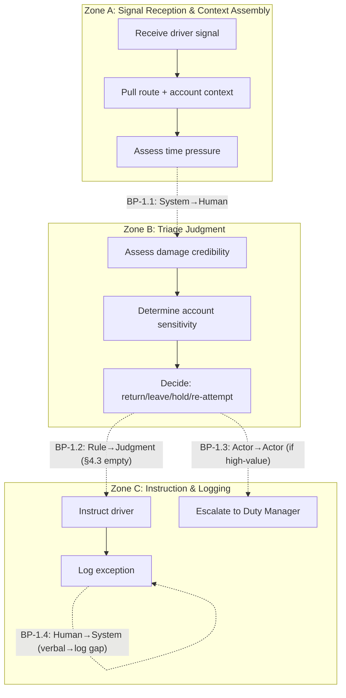
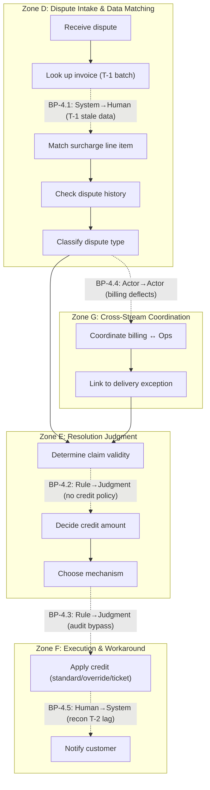

# Deliverable 1 — Cognitive Load Map

> **Scenario:** Apex Distribution Ltd — Customer Operations (4 work streams, 35 people)  
> **Work streams selected:** Delivery Exceptions + Billing Disputes (richest artefact coverage: Artefacts 1, 2, 4, 5 + CSV exports)

---

## Section 1 — Lived-Process Narrative

### Work Stream 1: Delivery Exceptions (~180/day, avg 12 min/case)

**How it actually happens** `[Artefact 1]`:

Mark Petrov (driver, route 042) hits a refused delivery at Cobham. The recipient's warehouse worker (not the site manager) won't sign because the pallet "looks damaged." Mark's assessment differs — "it's just been on the lorry." He's parked up, blocking his remaining six drops. He calls dispatch, gets a voicemail because Sandra's line is busy. He's now waiting idle until someone calls back.

**Cognitive hotspots:**

1. **Triage decision under ambiguity** — the dispatcher (Sandra) must decide: return-to-depot, leave with the customer, or re-attempt later. This requires synthesising: (a) driver's visual assessment vs customer's refusal, (b) account value (Stein-Allen = "the big one"), (c) route pressure (6 remaining drops), (d) whether the site manager would override the warehouse worker if called `[INFERRED — scenario brief]`.

2. **High-value escalation threshold** — SOP says >£500 escalates to Duty Manager `[Artefact 4]`. But the SOP references DispatchHub (retired Oct 2024) and Section 4.3 (Damaged consignments) is literally incomplete — "TBD pending review of insurance protocol." The real decision process is undocumented.

3. **Time pressure cascade** — driver is parked. Every minute costs route completion time for 6 other customers. Dispatcher must balance get-it-right against get-it-done.

**Documented ↔ lived divergences:**

| SOP says | Reality shows |
|----------|-------------|
| Driver notes reason in DispatchHub tablet | DispatchHub retired Oct 2024; driver uses Driver App (or calls/voicemails dispatch) `[Artefact 4 footnote]` |
| DispatchHub confirms return/hold/re-attempt | Dispatcher makes verbal decision by phone `[Artefact 1]` |
| Damaged consignments follow §4.3 | §4.3 is empty — "TBD pending review of insurance protocol" `[Artefact 4]` |
| >£500 escalates to Duty Manager via console | No evidence this threshold is followed; Mark doesn't mention it; dispatcher makes the call `[INFERRED — Artefact 1]` |

---

### Work Stream 4: Billing Disputes (~60/day, avg 28 min/case)

**How it actually happens** `[Artefact 2, Artefact 5, CSV exports]`:

Pete (Hayes & Sons) emails billing@ about invoice INV-2026-04318: a £340 fuel surcharge on a delivery that arrived damaged. The Aurum Billing Team responds same-day with a template deflection: "fuel surcharges are calculated automatically... contact Customer Operations." Pete calls Customer Ops, waits 22 minutes, gets cut off. He emails back angry on day 4. Sandra (Customer Ops) responds on day 6 with a £170 goodwill credit — a workaround, not a fix, because "fuel surcharge can't be adjusted on individual invoices because of how Aurum works."

**Critical detail:** Sandra's £170 credit has no entry in the credits audit log `[Artefact 2 internal note]`. She used a manual override. Yet the APEX_CREDITS CSV export `[Artefact 5]` shows other credits (CR-2026-00814: £88 goodwill to Hayes & Sons, same approver U-0089) with proper AUDIT_REF entries. Sandra's override bypassed the standard credit path.

**Cognitive hotspots:**

1. **Cross-system handoff** — billing dispute lives in Aurum but resolution (goodwill credit) must be applied in Customer Ops. Billing deflects to Ops; Ops can't adjust the invoice. The customer bounces between teams for 6 days.

2. **Workaround judgment** — Sandra must decide: (a) credit amount (she chose £170, not £340 — roughly half the surcharge), (b) credit mechanism (manual override vs standard path), (c) whether to eat the audit gap. This requires weighing customer retention against financial controls.

3. **Pattern recognition** — Pete says "this is the second time this quarter." The disputes CSV confirms Hayes & Sons has 3 open disputes (D-2026-00342, D-2026-00337, D-2026-00318), 2 of which are FUEL_SURCH_DAMAGE type `[Artefact 5 — DISPUTES_OPEN]`. This is a repeat pattern, not an isolated case.

4. **Aurum constraint navigation** — fuel surcharges are batch-calculated by SYS_BATCH at 02:14 GMT `[FUEL_SURCH CSV]`, using tiered rates (T1=~8%, T2=~9–10%, T3=~12%). They can't be adjusted per-invoice. The only resolution is a separate goodwill credit — a different accounting event.

**Documented ↔ lived divergences:**

| System/process says | Reality shows |
|---------------------|-------------|
| Credits have AUDIT_REF entries `[CREDITS CSV]` | Sandra's £170 has no audit trail `[Artefact 2 internal note]` |
| Billing team handles billing queries | Billing deflects damage-related disputes to Customer Ops `[Artefact 2, msg 2]` |
| Resolution via standard credit path | Sandra uses manual override for speed `[Artefact 2]` |
| Reconciliation catches discrepancies within T-2 | Recon lags 24h behind invoice; override credits may not appear until next batch `[ASSUMED — A1]` |

---

## Section 2 — Jobs to be Done Decomposition

### Work Stream 1: Delivery Exceptions

| Field | JtD-1.1: Triage Refused Delivery | JtD-1.2: Resolve Driver Blockage | JtD-1.3: Escalate High-Value Exception |
|-------|---|---|---|
| **JtD ID** | JtD-1.1 | JtD-1.2 | JtD-1.3 |
| **Trigger** | Driver reports refusal (voicemail, app message, or call) | Driver parked awaiting instruction; remaining drops at risk | Consignment value >£500 OR account flagged as key |
| **Actor (current)** | Dispatcher (Sandra or colleague) | Dispatcher | Duty Manager (escalation path) |
| **Goal / Outcome** | Decide: return-to-depot, leave, hold, or re-attempt — with justification that protects the account relationship and minimises route disruption | Unblock the driver within minutes so remaining route completes on time | Ensure high-value decisions carry management authority and paper trail |
| **Key decisions** | Is the damage real or cosmetic? Is the person refusing authorised? Is the account relationship at risk? Is the driver's assessment credible? | How many drops remain? What's the time pressure? Can a re-attempt work later today? | Does value exceed threshold? Who is available as Duty Manager? Is documentation sufficient? |
| **Key systems** | Driver App (inbound message), Dispatch console (route context, account history), CRM (customer record) | Dispatch console (route planning), Driver App (messaging) | Dispatch console, CRM (account value) |
| **Expected output** | Verbal instruction to driver + exception logged in dispatch console | Driver moving to next drop; exception noted | Duty Manager decision recorded; driver instructed |
| **Primary type** | Decision-making | Execution + time-critical coordination | Exception-handling |

### Work Stream 4: Billing Disputes

| Field | JtD-4.1: Classify Dispute Type | JtD-4.2: Determine Resolution Path | JtD-4.3: Apply Financial Remedy | JtD-4.4: Manage Customer Through Delay |
|-------|---|---|---|---|
| **JtD ID** | JtD-4.1 | JtD-4.2 | JtD-4.3 | JtD-4.4 |
| **Trigger** | Customer contacts billing@ or Customer Ops with charge query | Dispute classified; agent must decide what to do | Resolution agreed; must be executed in Aurum or via workaround | Customer waiting (avg 6+ days); escalation risk rising |
| **Actor (current)** | Customer Ops agent (Sandra, Tom) | Customer Ops agent | Customer Ops agent (or Aurum support team for invoice mods) | Customer Ops agent |
| **Goal / Outcome** | Determine: is this fuel surcharge, redelivery fee, dim-weight, or something else? Link to correct invoice and match to dispute type codes | Decide: can this be resolved via goodwill credit, does it need Aurum ticket, or is it a non-Apex issue to reject? | Credit applied, tracked, and auditable; customer notified of resolution | Customer doesn't escalate to management; account relationship preserved |
| **Key decisions** | Which invoice? Which line item? Does the dispute match the data in Aurum exports? | Is the customer right? What's the precedent? How much discretion does the agent have? Is it worth a 48h Aurum ticket or faster via goodwill credit? | Amount (full vs partial)? Standard path vs manual override? Audit compliance? | What to promise on timeline? When to proactively update? |
| **Key systems** | CRM (case, comms), Aurum exports (invoice lookup — T-1 lag) | CRM, Aurum exports, Aurum disputes file, Aurum credits history | Aurum (manual ticket for invoice mod — 48h) OR CRM (goodwill credit — immediate but workaround) | CRM (communications), email/phone |
| **Expected output** | Dispute categorised, linked to invoice in CRM | Resolution plan: credit amount, mechanism, timeline communicated to customer | Credit entry (with or without AUDIT_REF), customer notification | Customer informed of status; escalation prevented or managed |
| **Primary type** | Synthesis (data matching) | Decision-making | Execution (with compliance risk) | Communication |

---

## Section 3 — Cognitive Zones and Breakpoints

### Work Stream 1: Delivery Exceptions

**Zone A — Signal Reception & Context Assembly**
- Receive driver contact (voicemail/app/call)
- Pull route context from dispatch console
- Identify account (Stein-Allen = key account?)
- Assess time pressure (drops remaining, time of day)

**Zone B — Triage Judgment**
- Assess damage assessment: driver says cosmetic vs customer refuses
- Weigh: account value vs route pressure vs cost of return
- Decide: return / leave / hold / re-attempt
- Consider: is the refusing person authorised? (warehouse worker vs site manager)

**Zone C — Instruction & Logging**
- Call driver back with decision
- Log exception in dispatch console
- If high-value: escalate to Duty Manager

**Breakpoints:**

- `BP-1.1: System → Human — signal arrives (voicemail/app) but requires human interpretation of ambiguous context (is the pallet really damaged?)` `[Artefact 1]`
- `BP-1.2: Rule → Judgment — SOP says >£500 escalates, but §4.3 (damage) is undocumented; dispatcher must judge without protocol` `[Artefact 4]`
- `BP-1.3: One actor → Another — if escalation triggered, Dispatcher → Duty Manager handoff with context loss risk`
- `BP-1.4: Human → System — decision made verbally but must be logged in dispatch console; gap between decision and record` `[ASSUMED — A2]`

---

### Work Stream 4: Billing Disputes

**Zone D — Dispute Intake & Data Matching**
- Receive customer dispute (email/phone)
- Look up invoice in Aurum daily exports (T-1 lag)
- Match surcharge line item to fuel surcharge export
- Identify dispute type code
- Check customer dispute history

**Zone E — Resolution Judgment**
- Determine if customer's claim is valid
- Calculate appropriate credit (full vs partial)
- Decide mechanism: standard credit (audited) vs manual override (fast, unaudited) vs Aurum ticket (slow, correct)
- Weigh: customer retention vs financial control vs audit risk

**Zone F — Execution & Workaround**
- Apply credit via chosen mechanism
- If standard: create credit with AUDIT_REF
- If override: apply manually (no audit trail)
- If Aurum ticket: submit and wait 48h
- Notify customer of resolution and timeline

**Zone G — Cross-Stream Coordination**
- Link billing dispute to delivery exception (if dispute originated from damaged delivery)
- Check if related delivery exception is already logged
- Coordinate between billing team and Customer Ops (customer bounced between teams)

**Breakpoints:**

- `BP-4.1: System → Human — Aurum exports arrive as batch T-1; agent cannot verify real-time invoice state, must work from stale data` `[Artefact 5]`
- `BP-4.2: Rule → Judgment — no documented authority level for goodwill credits; Sandra decides £170 (partial, not full £340) with no visible policy` `[Artefact 2]`
- `BP-4.3: Rule → Judgment — standard credit path requires AUDIT_REF, but Sandra bypasses it via manual override when speed matters more than compliance` `[Artefact 2 internal note]`
- `BP-4.4: One actor → Another — billing team deflects to Customer Ops; customer must re-explain context; no case handoff in CRM` `[Artefact 2, msg 2→3]`
- `BP-4.5: Human → System — credit applied but reconciliation won't reflect it until T-2 (24h+ lag); system state lags behind human action` `[RECON CSV]`

---

## Section 4 — Micro-Task Inventory

### Work Stream 1: Delivery Exceptions

| Micro-task | Cognitive Load | Input Structure | Decision Determinism | Exception Frequency | Turn-Taking Degree | Latency Constraint | Compliance/Risk Sensitivity | Tool/API Availability |
|---|---|---|---|---|---|---|---|---|
| Receive & parse driver signal | L | L (unstructured voicemail/message) | H (deterministic: receive and note) | L | L | H (driver waiting) | L | H (Driver App has messaging API) |
| Pull route context + account info | L | H (structured dispatch data) | H | L | L | H | L | M (dispatch console = limited API) |
| Assess damage credibility | H | L (verbal description, no photo) | L (judgment call) | M | M (may need to call driver back) | H | M (liability implications) | L (no visual verification system) |
| Determine account sensitivity | M | H (CRM account record) | M (key accounts known but not flagged systematically) | L | L | M | M | H (CRM API available) |
| Decide: return/leave/hold/re-attempt | H | L (synthesises multiple inputs) | L (dispatcher discretion) | H (every refusal is different) | M | H (driver blocked) | H (wrong call = lost consignment or lost customer) | L (no decision-support tool) |
| Instruct driver | L | H (simple message) | H (once decided, execution is deterministic) | L | M (driver may push back) | H | L | H (Driver App messaging) |
| Log exception in dispatch console | L | H (structured form) | H | L | L | M | M (audit trail) | M (dispatch console limited API) |
| Escalate to Duty Manager (if triggered) | M | M (must package context) | M (threshold exists but §4.3 is undocumented) | M? | H (handoff to another person) | H | H (high-value decisions) | M |

### Work Stream 4: Billing Disputes

| Micro-task | Cognitive Load | Input Structure | Decision Determinism | Exception Frequency | Turn-Taking Degree | Latency Constraint | Compliance/Risk Sensitivity | Tool/API Availability |
|---|---|---|---|---|---|---|---|---|
| Receive dispute & identify invoice | L | M (email free-text but references invoice #) | H (lookup) | L | L | L (not time-critical) | L | H (CRM API + batch CSV) |
| Match invoice to surcharge/fee line | M | H (CSV structured) | H (data matching) | L | L | L | L | H (batch exports parseable) |
| Check customer dispute history | M | H (disputes CSV, CRM history) | H (lookup) | L | L | L | M (pattern = escalation risk) | H |
| Classify dispute type | M | M (customer's description vs system codes) | M (requires interpretation of customer language) | M | L | L | L | H |
| Determine if claim is valid | H | L (requires judgment: was delivery damaged? is surcharge fair?) | L (no clear rules; Sandra decides) | H | M (may need delivery exception record) | L | H (financial impact) | M (need to cross-reference exception logs) |
| Decide credit amount | H | M (invoice amount known; guideline unclear) | L (discretionary: Sandra chose half — £170 of £340) | H | L | L | H (financial, audit) | L (no decision-support / approval system) |
| Choose mechanism (standard vs override vs Aurum ticket) | H | M | L (trade-off: speed vs audit compliance) | M | L | M (48h Aurum vs immediate override) | H (audit/compliance risk) | M? |
| Apply credit | M | H (execute in chosen path) | H (once decided, mechanical) | L | L | M | H (must be auditable — often isn't) | M (Aurum = manual ticket; override = no trail) |
| Notify customer | L | M (compose resolution email) | H | L | L | M (customer waiting 6+ days) | L | H (CRM/email) |
| Coordinate billing ↔ Customer Ops | M | L (organisational handoff, no shared queue) | L (no protocol) | H (every dispute crosses the boundary) | H (billing team + ops team + customer) | M | M | L (no shared case management between teams) |

---

## Section 5 — Process Topology Diagram

*Figure 1 — Delivery Exceptions: Zone topology with breakpoints. Note BP-1.2: the Rule→Judgment transition occurs because the SOP is literally incomplete for damaged consignments.*

*Figure 2 — Billing Disputes: Zone topology. Note the cross-stream coordination (Zone G) creates a loop — delivery exceptions feed billing disputes, requiring context assembly across teams.*

