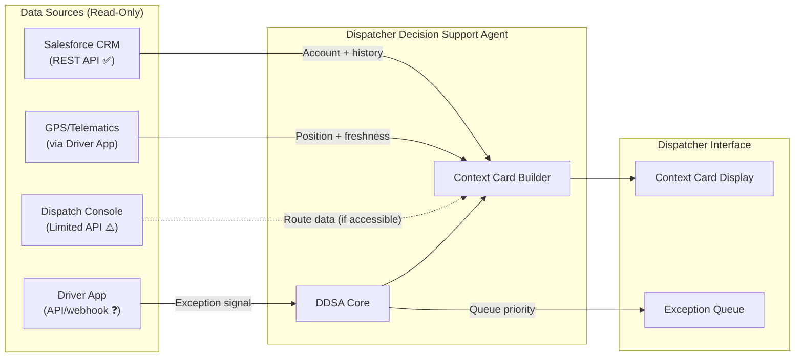

# Deliverable 5 — System/Data Inventory

> **Agent:** Dispatcher Decision Support Agent (DDSA)  
> **Scope:** Read-only access to 3 systems (CRM, Driver App, Dispatch Console). No billing system interaction.

---

## Assumption Log (System & Artefact-Based Assumptions)

| # | Type | Assumption | Confidence | Test |
|---|------|-----------|------------|------|
| S1 | AGENT | Driver App has a webhook or messaging API that can push inbound exception signals to external systems (not just display them internally) | Medium | Ask IT: "Does the Driver App have an outbound webhook or API for new messages/exceptions?" |
| S2 | AGENT | Dispatch console's "limited API surface" includes at minimum a read-only endpoint for route status (drops remaining, driver assignment) | Low | Ask IT: "What exactly can we read from the dispatch console API? Is there documentation?" |
| S3 | AGENT | GPS data (driver position) is accessible either via the Driver App API or via the dispatch console — not locked inside the Citrix environment only | Medium | Ask IT: "Where does GPS data live? Can we access it outside the dispatch console?" |
| S4 | AGENT | CRM (Salesforce) contains a case record for each delivery exception, linked to the customer account — not just billing/communications | Medium | Ask Sarah: "When a delivery exception is resolved, does it get logged in Salesforce as a case?" |
| S5 | AGENT | Consignment value is available either in the CRM order record or in a manifest system accessible via API — not only on the physical delivery note | Low | Ask Sarah/IT: "Where is consignment value stored digitally? Or is it only on the paper manifest?" |
| S6 | AGENT | The Driver App replaced DispatchHub in Oct 2024 and handles the same functions (exception reporting, GPS, scan-on-delivery) plus driver-to-dispatch messaging | High | Scenario states "Driver app (in-house iOS/Android) — GPS, route, scan-on-delivery, driver-to-dispatch messaging" `[scenario brief]` |
| S7 | AGENT | Exception history in the dispatch console is not queryable via API — data is trapped in the Citrix-deployed Java application | Low | Ask IT: "Can we query historical exception data from the dispatch console, or is it UI-only?" |
| S8 | AGENT | There is no unified case/exception ID that links a delivery exception across CRM, dispatch console, and Driver App — they are siloed | Medium | Ask Sarah: "When you look up a past exception, do you search in one system or multiple?" |
| S9 | AGENT | The Aurum batch exports (CSVs) are accessible on a shared filesystem or SFTP that the DDSA could read — but DDSA doesn't need to for Wave 1 | High | Scenario states exports written to `/exports/aurum/` — accessible `[Artefact 5]`. Not needed for DDSA. |

---

## System Inventory

| System | Data needed by DDSA | Access type | Availability | Integration effort | Gap/Risk |
|---|---|---|---|---|---|
| **CRM (Salesforce)** | Account records: customer name, contract type, credit limit, account manager. Case history: prior exceptions linked to account. Communications log. | Read | **Available** — REST API confirmed `[scenario brief]` | Low | **Risk:** CRM may not contain delivery exception cases if dispatchers log only in the console `[ASSUMED — S4]`. If CRM has no exception history, the "last 3 exceptions" field on the context card will be empty for many accounts. |
| **Driver App** (in-house iOS/Android) | Inbound exception signals (messages, voicemail transcripts). GPS position. Route progress (drops completed/remaining). Scan-on-delivery confirmations. | Read (push/webhook preferred) | **Partially available** — app exists and handles messaging, but API/webhook capability not confirmed `[ASSUMED — S1]` | Medium | **Critical dependency.** If the Driver App cannot push signals to external systems, DDSA cannot detect exceptions in real-time. Fallback: poll dispatch console for new exceptions (adds latency). **Gap:** No confirmation of outbound API. |
| **Dispatch Console** (Java/Citrix) | Route data: drops remaining, driver assignment, route sequence. Exception triage status. Historical exception records. | Read | **Limited** — "Limited API surface" per scenario `[scenario brief]` | High | **Major constraint.** Citrix-deployed Java desktop app — likely no modern REST API. May offer: (a) a thin data-export layer, (b) database-level read access, or (c) nothing beyond the UI. **Gap:** Drops-remaining and route-pressure data may only be available via screen-scrape or manual export. `[ASSUMED — S2]` |
| **GPS / Telematics** | Driver current position, last ping timestamp, position freshness | Read | **Available via Driver App** (most likely) or dispatch console | Low–Medium | **Risk:** GPS freshness depends on the polling interval of the Driver App. If GPS updates every 5 min (not real-time), route pressure scores will lag. `[ASSUMED — S3]` |
| **Aurum Billing** (on-prem Oracle, 2008) | **None for Wave 1 DDSA** | N/A | Not available (batch-only, no API) | N/A | **Out of scope by design.** DDSA does not interact with billing. Included for completeness and Wave 2 planning. Constraints: batch CSV exports daily 02:00–04:00 GMT (T-1), reconciliation T-2 lag, invoice modifications require manual ticket (48h turnaround), schema changes quarterly without notice. `[Artefact 5]` |
| **Consignment manifest / order system** | Consignment value per delivery | Read | **Unknown** — not described in scenario | Unknown | **Gap:** Consignment value is needed for the £500 escalation threshold (ET-1). If no system holds this digitally, the driver must report it verbally and the context card shows "Value: unknown." `[ASSUMED — S5]` |

---

## Shadow Systems & Lived-Work Tools

| Shadow system | What it holds | Who uses it | Why it matters for DDSA | Risk |
|---|---|---|---|---|
| **Voicemail (dispatch phone line)** | Inbound exception reports from drivers who can't reach a dispatcher | Dispatchers (check voicemail between calls) | This IS the primary exception signal channel when Sandra's line is busy `[Artefact 1]`. DDSA needs to detect these — either via voicemail transcription or by routing drivers to the app instead. | **Signal loss risk.** If DDSA only monitors the Driver App but drivers still use voicemail, exceptions go undetected until a human checks the machine. |
| **Dispatcher informal knowledge** | Account sensitivity ("the big one"), driver reliability, site-specific behaviours | Individual dispatchers (not written down) | DDSA can't access this. Account sensitivity classification (credit limit + escalation history) is a proxy but misses informal knowledge `[ASSUMED — A6, Artefact 1]` | **Incomplete context.** New dispatchers and the agent both lack this knowledge. Over time, dispatcher overrides of the sensitivity flag teach the system — but initially it will miss some key accounts. |
| **Sandra's manual override path** | Unaudited goodwill credits applied outside the standard credit workflow | Sandra (Customer Ops) | Not relevant to DDSA (Wave 1 = delivery exceptions only). But signals that other work streams have compliance gaps that an agent could detect. | N/A for Wave 1. Relevant for Wave 2 billing dispute agent. |

---

## Data Quality Assessment

| Data source | Quality issue | Impact on DDSA | Mitigation |
|---|---|---|---|
| **GPS (via Driver App)** | Position freshness unknown — may update every 30 sec or every 5 min | Route pressure score could be based on stale position; "drops remaining" may be inaccurate | Display freshness timestamp on context card; mark as "⚠️ may be stale" if >15 min since last ping |
| **CRM exception history** | May not contain all exceptions — dispatchers may log in console only, not CRM | "Last 3 exceptions" field empty or incomplete; repeat-pattern detection fails | Display "History: CRM only" on context card so dispatcher knows the limitation; log cases where dispatcher adds context manually as integration gap signals |
| **Dispatch console route data** | Accessible only via limited API (or not at all) | Drops remaining and route sequence may be unavailable | If no API: (a) display "Route data: unavailable" and let dispatcher check manually, or (b) derive approximate data from GPS + planned route (if route plan is accessible from CRM/order system) |
| **Account sensitivity** | Informal knowledge not captured in any system; CRM credit limit is a proxy | Agent will miss some genuinely sensitive accounts that dispatchers know about but haven't flagged | Start conservative (flag only high-credit + recent escalation); tune based on override data; eventually allow dispatchers to manually flag accounts |

---

## Integration Architecture

*Figure 4 — DDSA integration topology. Solid arrows = confirmed available. Dashed arrow = limited/unconfirmed API. The dispatch console is the primary integration risk.*

---

## What's Missing vs What's Available (Summary)

| Need | Available? | If not, impact on DDSA |
|---|---|---|
| Inbound exception signal (real-time) | ❓ Driver App API unconfirmed | **Critical** — without this, DDSA can't trigger. Fallback: poll dispatch console or voicemail transcription. |
| Account record + history | ✅ CRM REST API | Low risk |
| GPS / driver position | ⚠️ Likely via Driver App (unconfirmed freshness) | Medium — stale GPS degrades route pressure score but doesn't block core function |
| Route data (drops remaining) | ⚠️ Dispatch console limited API | Medium–High — without this, cannot calculate route pressure. Fallback: derive from GPS + planned route. |
| Consignment value | ❓ No system identified | Low–Medium — affects ET-1 (£500 threshold) only. Fallback: "Value unknown — ask driver." |
| Exception history (cross-system) | ⚠️ CRM only; console history may be inaccessible | Medium — repeat-pattern detection incomplete. Mitigated by "CRM only" label on card. |
| Unified case ID across systems | ❌ Likely doesn't exist `[ASSUMED — S8]` | Medium — DDSA must match by (account + date + route) heuristic, not by ID join. Risk of missed matches. |

