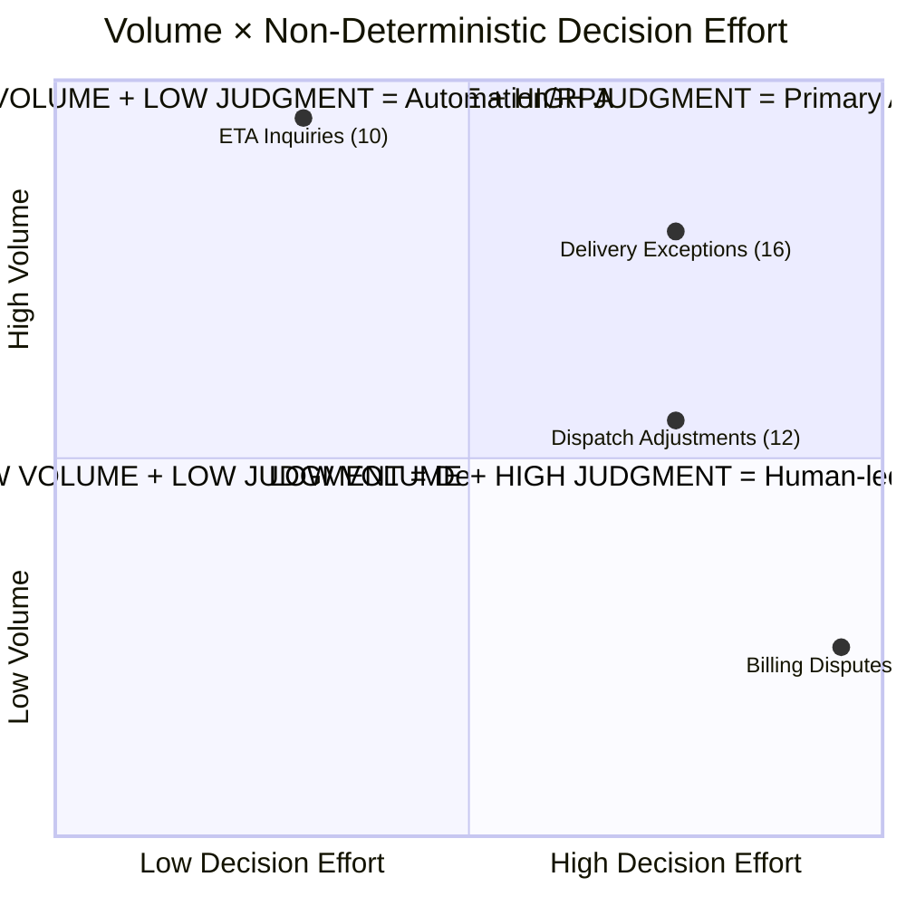

# Deliverable 3 — Volume × Value Analysis

> **Input:** Scenario brief (4 work streams with volumes) + Deliverable 2 (delegation archetypes)  
> **Scoring:** ATX 1–5 scales per `atx-scoring.md` § Step 2

---

## Scoring Table

| Work stream | Vol/day | Handling time | Execution Frequency (1–5) | Non-Deterministic Decision Effort (1–5) | Agentic Value Score | Justification |
|---|---|---|---|---|---|---|
| **Delivery Exceptions** | ~180 | 12 min | 4 (high daily volume, continuous inflow) | 4 (dispatcher discretion on every case; ambiguous inputs; SOP gap) | **16** | Every case requires triage judgment under time pressure. No two refusals are identical. §4.3 undocumented. Driver vs customer conflict with no structured evidence. `[Artefact 1, Artefact 4]` |
| **ETA Inquiries** | ~400 | 4 min | 5 (highest volume) | 2 (mostly lookup-and-respond; edge cases need driver call but majority are deterministic) | **10** | 80%+ is "check route, read ETA window, respond." Edge cases (GPS stale, driver unreachable) add non-determinism but are the minority. `[Artefact 3]` |
| **Dispatch Adjustments** | ~90 | 18 min | 3 (moderate daily volume) | 4 (mid-route changes under tight time pressure; driver swaps require coordination) | **12** | High non-determinism per case but lower volume. Every adjustment is time-critical and touches live routes. Requires dispatch console (limited API). `[INFERRED — scenario brief]` |
| **Billing Disputes** | ~60 | 28 min | 2 (lowest daily volume) | 5 (highest: cross-system, no documented credit policy, workaround judgment, audit trade-offs) | **10** | Each case is the most cognitively complex — but only 60/day. Resolution requires navigating Aurum constraints, undocumented credit authority, and cross-team coordination. `[Artefact 2, Artefact 5]` |

**Scoring scale reference:**
- Execution Frequency: 1=rare (<10/wk), 2=low (10–50/wk), 3=moderate (50–100/day), 4=high (100–300/day), 5=very high (>300/day)
- Non-Deterministic Decision Effort: 1=fully rule-based, 2=mostly rules with edge cases, 3=mixed rules and judgment, 4=mostly judgment with some patterns, 5=pure judgment/novel each time

---

## 2×2 Grid

*Figure 3 — Volume × Value quadrant chart. Delivery Exceptions lands top-right (highest agentic value). ETA Inquiries is top-left (automation candidate). Billing Disputes is bottom-right (high judgment but low volume — agent-assist, not agent-led).*

---

## Primary Agentic Target: Delivery Exceptions

**Score: 16** (Frequency 4 × Decision Effort 4)

**Why it wins:**

1. **Volume justifies investment** — 180 cases/day × 12 min = 36 person-hours/day of dispatcher time. Even a 30% reduction in context-assembly time saves ~11 person-hours/day.

2. **Agent-support architecture fits** — D2 shows the work is Human-led + Agent Support (not human-only). The agent's role is clear: assemble context (route, account, history) in seconds so the dispatcher decides faster. This is not a chatbot (Sarah hates those) — it's a decision-support tool for dispatchers.

3. **Tool coverage is partially available** — CRM (REST API), Driver App (messaging), and GPS data are accessible. The dispatch console (limited API) is a constraint but not a blocker for the context-assembly role.

4. **Time pressure multiplies value** — every minute the dispatcher spends assembling context is a minute the driver is parked and 6 other drops are delayed. Speed of context delivery = direct operational value.

5. **Doesn't require Aurum** — unlike Billing Disputes, delivery exceptions don't cross into the legacy billing system. The integration constraints are lower.

---

## Why Other Work Streams Don't Win

### ETA Inquiries (score 10) — Automation/RPA candidate, not agent

Highest volume (400/day) but low non-determinism (score 2). The standard case is: look up order → check route → read ETA window → respond. This is a rules/lookup automation problem, not an agentic one. The edge cases (driver call needed, GPS stale) are real but minority (<20% `[ASSUMED — A3]`). **Recommendation:** automate the 80% via a customer-facing ETA lookup tool or chatbot-style auto-responder; route edge cases to dispatch. Sarah's concern about chatbots is valid — but a self-service ETA lookup is different from the 2024 chatbot that tried to handle exceptions. `[Artefact 3, scenario brief]`

### Dispatch Adjustments (score 12) — Strong secondary target (Wave 2)

Moderate volume (90/day), high judgment (score 4), highest handling time per case after billing. The constraint is the dispatch console's limited API — mid-route changes require the Citrix-deployed Java console that the agent can't easily interact with. Until that constraint is resolved (API or integration layer), the agent's role is limited to notification and coordination, not execution. **Recommendation:** Wave 2 target once dispatch console integration is addressed.

### Billing Disputes (score 10) — Highest complexity but lowest volume

Only 60/day but each takes 28 min. The non-determinism score is highest (5) because every case involves undocumented credit authority, Aurum workarounds, audit trade-offs, and cross-team coordination. But the volume doesn't justify a dedicated agent — and the Aurum system (batch-only, 48h modification turnaround, quarterly schema changes) makes autonomous action nearly impossible. **Recommendation:** agent-assist for context pre-assembly (match dispute to invoice, surface history, flag repeat customers) but human-led resolution. Shared infrastructure with D.Exceptions agent (CRM integration, account classification). `[Artefact 2, Artefact 5]`

---

## Wave Sequencing

| Wave | Work stream | Agent role | Dependency |
|---|---|---|---|
| **Wave 1** | Delivery Exceptions | Dispatcher Decision Support Agent — context assembly, account flagging, pattern detection, option presentation | CRM API + Driver App + GPS |
| **Wave 1 (parallel)** | ETA Inquiries | Self-service automation (not agent) — lookup tool for standard cases | CRM API + route data |
| **Wave 2** | Dispatch Adjustments | Coordination agent — notification of affected parties, option assembly | Dispatch console API/integration layer |
| **Wave 2** | Billing Disputes | Context-assembly assist — dispute-to-invoice matching, history surfacing, repeat-pattern flagging | Aurum batch ingestion pipeline |

Wave 1 builds shared infrastructure (CRM API client, account classification, GPS/route data access) that Wave 2 reuses.

