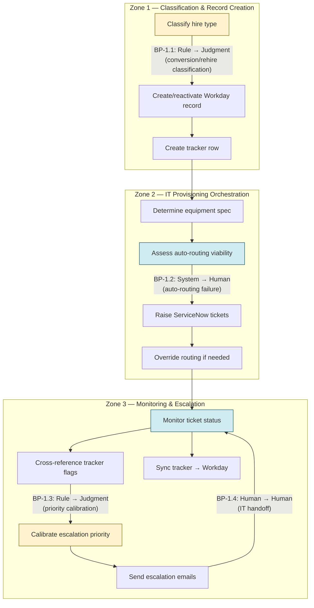
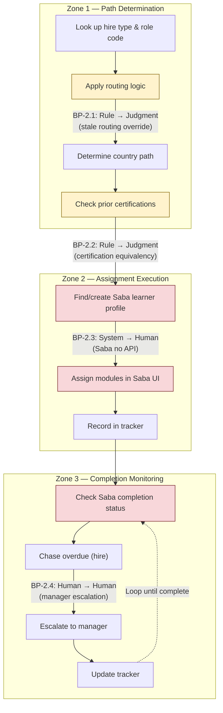

# Cognitive Load Map — HR Onboarding Coordination (Aldridge & Sykes)

> **Deliverable #1** | Scenario 1 (enriched) | Practice run
>
> **Assumptions:** All assumptions referenced in this document (e.g. `[ASSUMED — A3]`) are logged in the consolidated Assumption Log in the [Agent Purpose Document](./agent-purpose-document-001.md).

---

---

## Section 1 — Lived-Process Narratives

### Work Stream 1: New-Hire System & Access Setup

**How the work actually happens** [Artefact 1.1, Artefact 1.2]

When a new hire is confirmed, Priya or a coordinator creates the Workday record and simultaneously opens one or more ServiceNow tickets for IT provisioning (laptop, software licences, building access, badge). The Workday record creation is relatively straightforward for standard FTEs — structured fields, known values. But the work immediately fractures after that.

**Cognitive hotspot 1: Equipment specification matching.** The email thread [Artefact 1.1] reveals that ServiceNow auto-routing failed for Tom Reeves because "the consulting laptop spec changed last quarter and the auto-routing didn't pick it up." This means Priya must carry in her head (or in the tracker's hidden notes) which equipment specs are current for which divisions and role types. When auto-routing fails silently, nobody knows until the hire complains days later.

**Cognitive hotspot 2: Priority calibration and stakeholder management.** Priya's response pattern in the email thread shows a multi-day escalation cycle: check status → chase IT → reset priority → direct ping → escalation to CFO. Each step requires judgment about urgency. Tom Reeves is flagged as "Director's hire from Deloitte; sensitive about onboarding speed" in the tracker [Artefact 1.2] — this context drives Priya's priority decisions but exists only in a hidden column in her personal spreadsheet, not in ServiceNow or Workday.

**Cognitive hotspot 3: Non-standard hire types.** The tracker [Artefact 1.2] shows three fundamentally different cases being processed in the same week: a standard FTE (Tom), a contractor-to-FTE conversion (Maria), and a returning hire with a frozen record (James). Each takes a different path through the systems:
- Tom: standard path, but equipment spec mismatch causes silent failure
- Maria: FTE record exists but contractor compliance history didn't carry over — the system sees her as new, but she isn't
- James: old record frozen, IT flags as potential duplicate — his start is delayed until Workday reactivation clears

**Documented ↔ lived divergence:** The documented process assumes a linear flow: create Workday record → auto-generate ServiceNow tickets → IT fulfils. The lived process is: create Workday record → update tracker first → manually check whether auto-routing will work for this hire type → open ServiceNow tickets with manual overrides where needed → monitor via tracker + email → escalate via personal relationships when SLAs slip. The tracker is the real coordination instrument, not Workday or ServiceNow. [Artefact 1.2: "Workday is the 'system of record' but Priya updates the tracker first and refreshes Workday end-of-week."]

---

### Work Stream 2: Compliance Training Assignment & Tracking

**How the work actually happens** [Artefact 1.3, Artefact 1.2]

The documented compliance routing flowchart [Artefact 1.3] presents a clean decision tree: hire type → role code → compliance pack. In reality, this flowchart is stale and incomplete.

**Cognitive hotspot 1: Stale routing logic.** The pencilled footnote [Artefact 1.3] — "TEMP-EXT retired 2024-Q1 — these now route as CONS-D. Update flowchart sometime" — reveals that the documented routing logic is out of date. The real routing lives in Priya's head and on a printed copy on her desk. A coordinator following the flowchart literally would attempt to route TEMP-EXT hires to "no assignment (out of scope)" when they should receive the 4-module CONS-D pack.

**Cognitive hotspot 2: Country-based routing (undocumented).** The scenario states compliance path selection depends on "role, country (UK vs Republic of Ireland), prior employment certifications." The flowchart fragment [Artefact 1.3] shows only hire-type and role-code routing — there is no documented path for the UK vs Ireland split or for prior certifications. This means the country and certification routing exists entirely as tacit knowledge within the team. `[ASSUMED — A8]`

**Cognitive hotspot 3: Contractor-to-FTE compliance history gap.** Maria Costa's tracker entry [Artefact 1.2] notes: "Originally contractor June; FTE conversion record didn't pull contractor compliance history." When a contractor converts to FTE, Saba LMS treats the FTE record as new but the contractor may have already completed some compliance modules. The coordinator must manually check what was completed under the contractor record and determine which modules to assign under the FTE record. This reconciliation is entirely manual and depends on knowing to look for it.

**Cognitive hotspot 4: Chasing completion.** The scenario notes ~45 min/case includes "chasing." Since Saba LMS has no API [scenario tooling sketch], monitoring completion requires logging into the LMS UI to check status, then emailing or messaging the hire and their manager. There is no automated alerting for overdue training. `[ASSUMED — A6]`

**Documented ↔ lived divergence:** The flowchart [Artefact 1.3] implies a one-time routing decision followed by system execution. The lived process is: check hire type → check role code → mentally override stale routing rules → check country → check prior certifications (for conversions/rehires, manually in Saba) → assign in the LMS UI one module at a time → track in the Master Tracker → chase via email when overdue. The compliance training "assignment" is not a single decision — it is a multi-step cognitive process with undocumented branch conditions and manual system interactions.

---

## Section 2 — Jobs to be Done Decomposition

### Work Stream 1: New-Hire System & Access Setup

| Field | JtD-1.1: Initiate Hire Record |
|-------|------|
| **JtD ID** | JtD-1.1 |
| **Trigger** | Hire confirmed (offer accepted, start date set) |
| **Actor (current)** | HR Coordinator (or Priya for sensitive hires) |
| **Goal / Outcome** | Hire exists in Workday with correct attributes; downstream systems can reference the record |
| **Key decisions** | Which hire type to classify as (FTE / contractor / secondment / rehire / conversion) — affects all downstream routing. Whether to reactivate an old record or create new (rehires like James O'Connor). `[Artefact 1.2]` |
| **Key systems** | Workday (primary), Master Tracker (actual first entry point) |
| **Expected output** | Active Workday record; tracker row with status, notes, risk flag |
| **Primary type** | Decision-making (classification) + Execution (data entry) |

| Field | JtD-1.2: Provision IT Equipment & Access |
|-------|------|
| **JtD ID** | JtD-1.2 |
| **Trigger** | Workday record created (or should be — sometimes triggered from tracker before Workday is updated) |
| **Actor (current)** | HR Coordinator (raises tickets), IT (fulfils) |
| **Goal / Outcome** | Hire has correct laptop, software, building access, and badge before or on start day |
| **Key decisions** | What equipment spec applies for this role/division (consulting spec changed last quarter — `[Artefact 1.1]`). Whether auto-routing will work or manual override is needed. When to escalate a stuck ticket — priority calibration based on stakeholder sensitivity `[Artefact 1.2 — hidden notes]` |
| **Key systems** | ServiceNow (IT tickets), Master Tracker (monitoring), Outlook (escalation) |
| **Expected output** | Fulfilled ServiceNow tickets; hire confirmed equipped; tracker status updated |
| **Primary type** | Execution + Exception-handling (when auto-routing fails or SLAs slip) |

| Field | JtD-1.3: Monitor & Escalate Onboarding Progress |
|-------|------|
| **JtD ID** | JtD-1.3 |
| **Trigger** | Ongoing — daily/weekly check across all active onboardings |
| **Actor (current)** | Priya (primarily — she owns the tracker) |
| **Goal / Outcome** | No onboarding stalls undetected; stakeholders are informed before they escalate |
| **Key decisions** | Which onboardings are at risk (risk flag assignment — Red/Amber/Green). Who to escalate to and when. Whether a stall is systemic (e.g. spec change broke routing) or case-specific. `[Artefact 1.1 — 5-day escalation cycle]` |
| **Key systems** | Master Tracker (primary), ServiceNow (status check), Outlook (communication), Workday (end-of-week sync) |
| **Expected output** | Updated risk flags; escalation emails sent; Workday refreshed |
| **Primary type** | Synthesis (aggregating status across systems) + Communication (stakeholder management) |

### Work Stream 2: Compliance Training Assignment & Tracking

| Field | JtD-2.1: Determine Compliance Path |
|-------|------|
| **JtD ID** | JtD-2.1 |
| **Trigger** | Hire record created (new hire, conversion, or rehire) |
| **Actor (current)** | HR Coordinator |
| **Goal / Outcome** | Correct compliance training path identified for this specific hire |
| **Key decisions** | Hire type classification (FTE / contractor / secondment). Role code → pack mapping (6-module vs 4-module). Country routing (UK vs Ireland). Whether prior certifications from a previous engagement carry over (contractor-to-FTE like Maria Costa). Whether stale routing rules apply or the mental override is needed (TEMP-EXT → CONS-D). `[Artefact 1.3 + footnote]` |
| **Key systems** | Workday (hire type, role code), SharePoint (flowchart — but stale), Saba LMS (prior completion check — manual) |
| **Expected output** | Compliance path decision documented (in tracker); list of modules to assign |
| **Primary type** | Decision-making |

| Field | JtD-2.2: Assign Training in LMS |
|-------|------|
| **JtD ID** | JtD-2.2 |
| **Trigger** | Compliance path determined (JtD-2.1 complete) |
| **Actor (current)** | HR Coordinator |
| **Goal / Outcome** | All required compliance modules assigned to the hire in Saba LMS |
| **Key decisions** | Whether the hire already has a Saba account (conversions/rehires may or may not). Which modules to skip if prior completion is confirmed. `[Artefact 1.2 — Maria Costa's compliance history gap]` |
| **Key systems** | Saba LMS (manual UI — no API `[scenario tooling sketch]`), Master Tracker |
| **Expected output** | Modules assigned in Saba; tracker updated with assigned date |
| **Primary type** | Execution (constrained by lack of API — click-by-click `[ASSUMED — A6]`) |

| Field | JtD-2.3: Track Completion & Chase |
|-------|------|
| **JtD ID** | JtD-2.3 |
| **Trigger** | Assignment made; due date approaching or passed |
| **Actor (current)** | HR Coordinator |
| **Goal / Outcome** | All assigned compliance training completed within the required window |
| **Key decisions** | When to chase (proactive vs reactive). Who to chase (hire, their manager, or both). Whether incomplete training should block other onboarding steps. `[ASSUMED — A6]` |
| **Key systems** | Saba LMS (manual status check), Outlook (chasing), Master Tracker (status logging) |
| **Expected output** | Completion confirmed in Saba; tracker updated; any blocks flagged |
| **Primary type** | Communication + Exception-handling |

---

## Section 3 — Cognitive Zones and Breakpoints

### Work Stream 1: New-Hire System & Access Setup

**Zone 1 — Classification & Record Creation**
- Determine hire type (FTE / contractor / secondment / rehire / conversion)
- Decide: new record or reactivate existing (rehires)
- Create/update Workday record
- Create tracker row with notes and risk flag

**Zone 2 — IT Provisioning Orchestration**
- Determine correct equipment spec for role and division
- Assess whether ServiceNow auto-routing will handle this case
- Raise ServiceNow ticket(s) — manually overriding routing if needed
- Order badge / request building access

**Zone 3 — Monitoring & Escalation**
- Check ServiceNow ticket status
- Cross-reference tracker risk flags and hidden notes
- Calibrate priority based on stakeholder sensitivity
- Send escalation emails / direct pings to IT
- Update tracker and sync Workday (end-of-week)

**Breakpoints:**

- `BP-1.1: Rule → Judgment` — **Hire type classification for non-standard cases.** FTE is straightforward; contractor-to-FTE conversions and rehires with frozen records require judgment about how to represent them in the system. [Artefact 1.2 — Maria Costa, James O'Connor]
- `BP-1.2: System → Human` — **Auto-routing failure detection.** ServiceNow auto-routing silently fails when equipment specs change. No system alerts Priya; she discovers the failure when the hire or their manager complains. [Artefact 1.1 — consulting laptop spec change]
- `BP-1.3: Rule → Judgment` — **Escalation priority calibration.** When an SLA is missed, Priya must decide how urgently to escalate based on who the hire is, who their sponsor is, and how visible the delay is. This context lives in hidden tracker columns, not in any system. [Artefact 1.2 — "Director's hire from Deloitte"]
- `BP-1.4: Human → Human` — **Cross-team handoff to IT.** The ticket goes into IT's queue but HR Ops retains accountability. If IT stalls, Priya must chase — there is no systematic handoff acknowledgement. [Artefact 1.1 — 5-day email cycle]

### Work Stream 2: Compliance Training Assignment & Tracking

**Zone 1 — Path Determination (Cognitive)**
- Identify hire type from Workday record
- Look up role code
- Apply routing logic (flowchart + mental overrides for stale rules)
- Determine country (UK vs Ireland) `[ASSUMED — A8]`
- Check prior certifications for conversions/rehires (manual Saba lookup)

**Zone 2 — Assignment Execution (Manual/System)**
- Log into Saba LMS UI
- Find or create learner profile
- Assign modules one by one
- Record assignment in tracker

**Zone 3 — Completion Monitoring & Chasing (Communication)**
- Check Saba status (manual login)
- Identify overdue modules
- Draft and send chase emails
- Follow up with managers if hire is unresponsive
- Update tracker with completion status

**Breakpoints:**

- `BP-2.1: Rule → Judgment` — **Stale routing override.** The flowchart says TEMP-EXT = no assignment, but the real rule (pencilled footnote) says route as CONS-D. A coordinator following the document literally will make the wrong assignment. [Artefact 1.3 footnote]
- `BP-2.2: Rule → Judgment` — **Prior certification reconciliation.** For contractor-to-FTE conversions, the coordinator must decide which previously completed modules count toward FTE compliance requirements. There are no documented equivalency rules. [Artefact 1.2 — Maria Costa]
- `BP-2.3: System → Human` — **Saba access barrier.** No API means all interactions with the LMS require human UI navigation. This is a hard system boundary — no agent can directly assign or query training without a workaround. [Scenario tooling sketch]
- `BP-2.4: Human → Human` — **Chase escalation to managers.** When a hire doesn't complete training, the coordinator must judge when to escalate from direct chasing to involving the hire's manager, and how firmly. `[ASSUMED — A6]`

---

## Section 4 — Micro-Task Inventory

### Work Stream 1: New-Hire System & Access Setup

| Micro-task | Cognitive Load | Input Structure | Decision Determinism | Exception Frequency | Turn-Taking Degree | Latency Constraint | Compliance/Risk Sensitivity | Tool/API Availability |
|---|---|---|---|---|---|---|---|---|
| Classify hire type (standard FTE) | L | H (structured Workday fields) | H (clear rules) | L | L | L (batch OK) | M (affects downstream routing) | H (Workday REST API) |
| Classify hire type (conversion/rehire) | H | M (requires cross-referencing old records) | L (judgment-dependent) | M (~15% are non-standard) | M (may need to check with hiring manager) | L | H (wrong classification cascades) | M (Workday has data but logic is tacit) |
| Create Workday record | L | H (structured form) | H (deterministic) | L | L | L | M (must be accurate) | H (Workday REST API) |
| Reactivate frozen record (rehires) | H | M (old data may be inconsistent) | L (case-by-case judgment) | L (~30–50/yr total edge cases) | H (IT involvement, potential duplicate resolution) | M (blocks start date) | H (wrong reactivation = compliance risk) | M (Workday API, but IT manual intervention often needed) |
| Determine equipment spec for role/division | M | M (role is structured; spec mapping is tacit) | M (patterns exist but change quarterly) | M (specs change without system update) | L | L | L (wrong spec = delay, not compliance risk) | L (no system holds current spec mapping) `[ASSUMED — A1]` |
| Raise ServiceNow tickets | L | H (structured form) | H (deterministic given correct inputs) | L | L | L | L | H (ServiceNow API) |
| Override ServiceNow auto-routing | M | M (requires knowing routing is wrong) | M (pattern-based but needs current knowledge) | M (when specs change) | M (may need IT confirmation) | M (delay compounds daily) | L | M (ServiceNow API but override rules are manual) |
| Monitor ticket status | L | H (ServiceNow status field) | H (deterministic check) | L | L | L | L | H (ServiceNow API) |
| Calibrate escalation priority | H | L (unstructured — stakeholder context, hidden notes) | L (judgment-dependent on political sensitivity) | M | H (multi-party email chains) | M (delay-sensitive) | M (reputational risk) | L (context in tracker hidden columns, not in APIs) |
| Update Master Tracker | L | H (structured spreadsheet) | H (deterministic) | L | L | L | L (but tracker is single point of failure) | M (OneDrive/Excel — no formal API but scriptable) |
| Sync tracker to Workday (end-of-week) | L | H (structured both sides) | H (deterministic) | L | L | L | M (data integrity) | H (Workday REST API + tracker is readable) |

### Work Stream 2: Compliance Training Assignment & Tracking

| Micro-task | Cognitive Load | Input Structure | Decision Determinism | Exception Frequency | Turn-Taking Degree | Latency Constraint | Compliance/Risk Sensitivity | Tool/API Availability |
|---|---|---|---|---|---|---|---|---|
| Look up hire type and role code | L | H (Workday fields) | H (deterministic read) | L | L | L | L | H (Workday REST API) |
| Apply routing logic (standard path) | L | H (hire type + role code) | H (documented rules for standard cases) | L | L | L | M (wrong path = non-compliance) | L (logic is on paper/in heads, not in a system) |
| Apply routing logic (stale/edge cases) | H | M (requires knowing which rules are outdated) | L (tacit knowledge overrides documented rules) | M (~15% of hires are non-standard) | L | L | H (compliance training is regulated) | L (no system holds current rules) |
| Determine country-based path (UK vs Ireland) | M? | M (country is structured; routing rules are not documented) | M? (patterns exist but undocumented) | L? (Dublin team is small) | L | L | H (different regulatory jurisdictions) | M? (Workday has country; routing logic is tacit) `[ASSUMED — A8]` |
| Check prior certifications (conversions/rehires) | H | L (requires manual Saba lookup across two learner profiles) | L (no documented equivalency rules) | M (every conversion is an edge case) | M (may need to contact previous manager) | L | H (compliance risk if modules skipped incorrectly) | L (Saba — no API, manual UI only) |
| Assign modules in Saba LMS | L | H (known module IDs) | H (deterministic once path decided) | L | L | L | M (must assign the right modules) | L (no API — manual UI clicks) |
| Track completion status | L | H (Saba shows pass/fail) | H (deterministic check) | L | L | M (deadlines exist) | M (overdue = compliance gap) | L (Saba — manual login to check) |
| Chase overdue training (hire) | M | M (email template but personalisation needed) | M (standard chase but judgment on tone/urgency) | M (regular occurrence — `[INFERRED — scenario brief: "45 min/case for assignment plus chasing"]`) | M (back-and-forth emails) | M (deadline-driven) | M (compliance deadline) | M (Outlook — scriptable but context is manual) |
| Escalate to manager (persistent non-completion) | H | L (unstructured judgment) | L (when to escalate, how firmly) | L (subset of overdue) | H (multi-party communication) | M | H (compliance escalation) | M (Outlook) |

---

## Section 5 — Process Topology Diagrams

### Work Stream 1: New-Hire System & Access Setup

*Figure 1 — Process topology: New-hire system & access setup. Yellow nodes involve judgment calls; blue nodes are system-dependent steps.*

### Work Stream 2: Compliance Training Assignment & Tracking

*Figure 2 — Process topology: Compliance training assignment & tracking. Yellow nodes involve judgment; red nodes are blocked by Saba LMS no-API constraint.*

