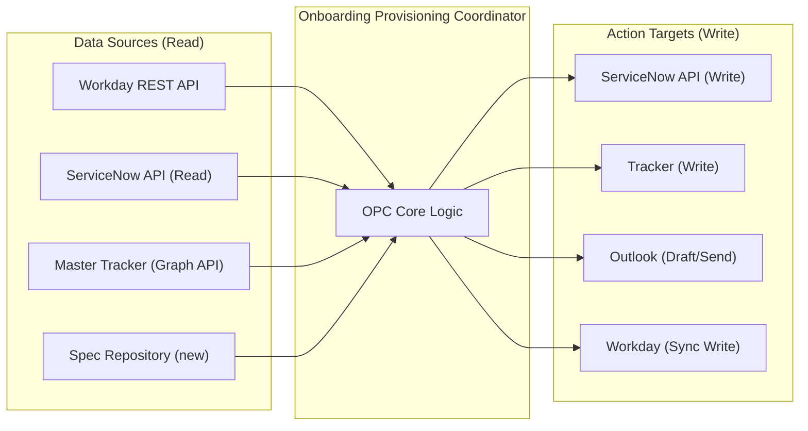

# System/Data Inventory — Onboarding Provisioning Coordinator (OPC)

> **Deliverable #5** | Scenario 1 (enriched) | Practice run
>
> **Assumptions:** All assumptions referenced in this document are logged in the consolidated Assumption Log in the [Agent Purpose Document](./agent-purpose-document-001.md).

---

## System Inventory

| System | Data needed by OPC | Access type | Availability | Integration effort | Gap/Risk |
|---|---|---|---|---|---|
| **Workday** | Hire record: type, role code, division, country, start date, employment history, rehire flag | Read | **Available** — REST API confirmed in scenario tooling sketch ("modern, REST APIs available") | Low | **Risk:** API may not expose employment history for rehires (needed for JtD-1.1 classification). Confirm field availability. |
| **ServiceNow** | IT tickets: creation, status, priority, category, comments, fulfilment ETA, assignment group. **Also:** building access for Manchester and Leeds offices. | Read/Write | **Available** — scenario states "robust auto-routing" implying API-driven; standard ServiceNow instances expose REST API | Low–Medium | **Risk:** Auto-routing rules are configured by IT, not HR Ops — HR Ops cannot update routing config, only tickets. `[CONFIRMED — Priya, Q5: "We don't have admin access to ServiceNow routing configuration"]` **Gap:** Nobody owns the governance chain for updating routing rules when specs change — changes fall between Procurement, IT, and HR Ops. `[CONFIRMED — Priya, Q5]` **Note:** Building access for Birmingham and Dublin does NOT go through ServiceNow — see below. |
| **Birmingham Facilities Management** | Building access requests for Birmingham office | Write (email) | **Email-only** — external facilities management company, no API | Low | **Gap:** No system integration possible. Agent must draft email for coordinator review. `[CONFIRMED — Priya, Q9]` |
| **Dublin Office Manager** | Building access / fob system for Dublin office | Write (email) | **Email-only** — informal process, office manager adds to fob system | Low | **Gap:** No system integration. Agent drafts email, coordinator sends. `[CONFIRMED — Priya, Q9]` |
| **Saba LMS** | Compliance training: not directly needed by OPC (OPC covers Work Stream 1, not Work Stream 2) | N/A for OPC | **Not available** — "no API" per scenario | N/A | **Note:** OPC does not interact with Saba. Included for completeness — Saba is a Wave 2 constraint for the compliance training agent. |
| **SharePoint** | Onboarding doc library: welcome materials, process documents | Read | **Available** — standard SharePoint APIs via Microsoft Graph | Low | **Risk:** Low. OPC may reference onboarding docs but doesn't write to SharePoint. Static content. |
| **Outlook** | Email: send notifications, draft escalation emails, read incoming escalation requests from stakeholders | Read/Write | **Available** — Microsoft Graph API for mail | Low–Medium | **Risk:** Sending as a service account vs sending as Priya. Stakeholders expect emails from Priya — an agent-sent email may reduce response urgency. **Mitigation:** Draft for Priya's approval and send from her mailbox (with consent). `[ASSUMED — A4]` |
| **Master Tracker (Excel, OneDrive)** | All active onboarding cases: status, risk flags, hidden notes (stakeholder sensitivity, buddy overrides), dates | Read/Write | **Partially available** — Microsoft Graph API can read/write Excel files on OneDrive. No structured schema; column positions may shift. | Medium | **Risk:** Single point of failure. Hidden columns are Priya's private context layer — coordinators don't routinely use them. `[CONFIRMED — Priya, Q2]` **Mitigating factor:** Column layout has been stable ~2 years; changes are limited to dropdown values and rare new columns. Header-based reading should be robust. `[CONFIRMED — Priya, Q2]` **Gap:** No schema enforcement; no change history beyond OneDrive version history. |
| **Equipment Spec Repository** | Current equipment specifications per role/division: laptop model, software bundle, accessories | Read | **Does not exist** — would be created as a new system/data store in Wave 1 | High (creation, not integration) | **Critical gap:** This data currently lives in Priya's head and in division-specific emails. The OPC cannot reliably match equipment specs without a structured, maintained repository. **Mitigation:** Create as a simple structured document (SharePoint list or JSON file) maintained quarterly by division ops leads. `[ASSUMED — A5]` |

---

## Shadow Systems (Lived-Work Tools Not in Official Tooling Sketch)

| Shadow system | What it holds | Who uses it | Why it matters for OPC | Risk |
|---|---|---|---|---|
| **Master Tracker (Excel, OneDrive)** | The real-time view of all onboarding status, plus risk flags, stakeholder context, and buddy overrides in hidden columns | Priya (primary author); coordinators (readers) | OPC needs this as a primary data source — it contains context not available from Workday or ServiceNow (stakeholder sensitivity, risk flags, notes) | **Single point of failure.** No backup beyond OneDrive versioning. No audit trail. Hidden columns mean only Priya has the full picture. If Priya is absent, context is lost. `[Artefact 1.2]` |
| **Printed flowchart with pencilled annotations (Priya's desk)** | Current compliance routing overrides | Priya | Not directly relevant to OPC (Work Stream 1), but signals a pattern: critical operational knowledge exists only in physical/personal artefacts. The equipment spec mapping may have a similar "pencilled note" problem. `[Artefact 1.3]` | **Knowledge loss risk.** If Priya leaves, undocumented overrides are lost. |
| **Outlook email threads as coordination tools** | Escalation history, stakeholder commitments, IT response patterns | Priya + coordinators | The email thread [Artefact 1.1] functions as a case log — Priya tracks status through replies. OPC monitors inbox for reactive sensitivity signals (inbound emails about specific hires). | **Unstructured.** Email is not a queryable system for case status. Agent matches inbound emails to hires by sender (hiring manager lookup) + name search in subject/body. |

---

## Master Tracker Column Schema

`[ASSUMED — based on Artefact 1.2 and discovery responses; confirm complete list with Priya]`

| Column | Data type | Visible? | Agent reads? | Agent writes? | Notes |
|--------|-----------|----------|-------------|--------------|-------|
| Hire | Text (full name) | Yes | Yes | Yes (at initiation) | Primary identifier for email matching |
| Start | Date (DD.MM) | Yes | Yes | No (validated against Workday only) | Used in daily sync validation |
| Type | Dropdown (FTE / Contractor / Secondment / Rehire / Conversion) | Yes | Yes | Yes (at initiation) | Feeds ET-1 classification |
| Workday status | Dropdown | Yes | Yes | Yes (daily + weekly sync) | Synced from Workday |
| Visible status | Text | Yes | Yes | Yes (daily + weekly sync) | Primary status field visible to coordinators |
| Division | Text | Yes | Yes | Yes (at initiation) | Used for coordinator routing (Dev/Sarah) |
| Office | Text | Yes | Yes | Yes (at initiation) | Used for location-code validation + building access routing |
| Notes | Free text | Hidden | Yes | No (read-only for keyword detection) | Source for partner_sponsored keyword detection |
| Risk flag | Dropdown (Green / Amber / Red) | Hidden | Yes | Yes (Green, Amber auto; Red = propose) | Core of escalation logic |
| Buddy override | Text | Hidden | No | No | Out of scope for OPC (Work Stream 3) |

---

## Data Quality Assessment

| Data source | Quality issue | Impact on OPC | Mitigation |
|---|---|---|---|
| **Workday** | Not real-time — Priya updates tracker first, syncs Workday end-of-week `[Artefact 1.2]` | If OPC reads Workday for current status, it will see stale data for recently-changed records | OPC treats tracker as primary source of truth during active onboarding; Workday for initial record and final reconciliation |
| **ServiceNow** | Auto-routing rules not updated when specs change `[Artefact 1.1 — "auto-routing didn't pick it up"]` | OPC may trust auto-routing to work correctly when it won't | OPC validates routing output against spec repository, not just trust ServiceNow blindly |
| **Master Tracker** | Hidden columns not visible to all team members; no schema enforcement; column positions may shift | Agent may misread columns if format changes; may not have access to hidden columns if reading via API automatically | Pin column positions in integration config; require Priya to confirm hidden-column access permissions `[ASSUMED — A3]` |
| **Email (Outlook)** | Unstructured; case information buried in thread context | Agent cannot reliably extract case status from email without NLP | Don't use email as a data source — instead, ensure all relevant case information is logged in tracker or ServiceNow at the time of action |

---

## Integration Architecture (proposed)

*Figure 1 — OPC integration topology. All integrations use existing Microsoft/ServiceNow REST APIs except the Equipment Spec Repository (new, must be created).*

---

## Shared Assets (Compounding Value for Future Agents)

| Integration/Asset | Built in Wave 1 (OPC) | Reusable by Wave 2+ agents |
|---|---|---|
| Workday REST API client (read hire records) | ✓ Build | Compliance Training Agent, Buddy Matching Agent |
| ServiceNow API client (read/write tickets) | ✓ Build | Any agent that interacts with IT services |
| Microsoft Graph API client (tracker, email, SharePoint) | ✓ Build | All future agents needing M365 access |
| Equipment Spec Repository | ✓ Build | IT procurement agent, office setup agent |
| Tracker read/write interface | ✓ Build | All agents monitoring onboarding status |
| Escalation context assembly pattern | ✓ Build | Any agent that needs to escalate with context |

