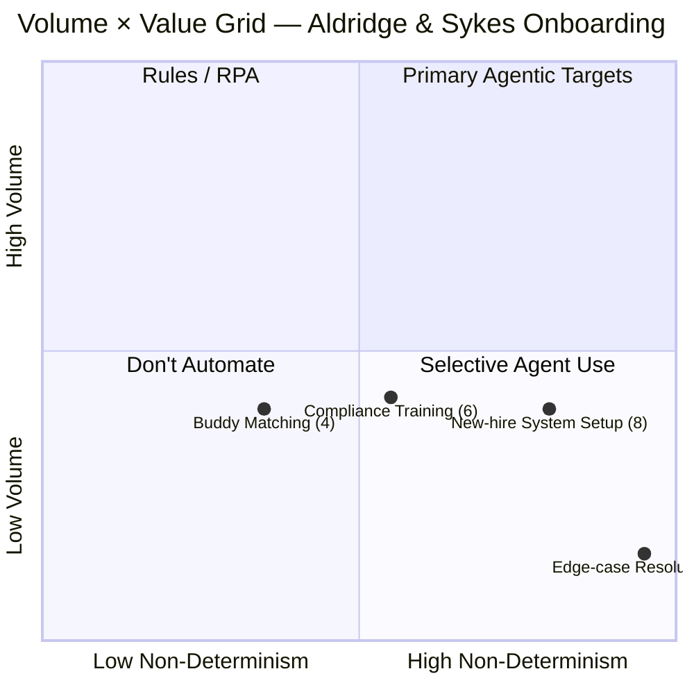

# Volume × Value Analysis — HR Onboarding Coordination (Aldridge & Sykes)

> **Deliverable #3** | Scenario 1 (enriched) | Practice run

---

## Assumption Log

| # | Type | Assumption | Confidence | Test |
|---|------|-----------|------------|------|
| A1 | AGENT | "Effective handling ~3 hrs/case" for new-hire setup includes monitoring/escalation time, not just initial record creation | Medium | Ask Priya: "When you say it takes 3 hours per onboarding, is that active work or does it include waiting and chasing?" |
| A2 | AGENT | The 220/yr compliance training cases map nearly 1:1 to hires (every hire needs some compliance assignment) | High | Scenario states "~220/yr" for both compliance and buddy streams — matches hire volume |
| A3 | AGENT | Edge-case resolution is a separate work stream because these cases consume disproportionate time and attention relative to their volume | Medium | Ask Priya: "Do edge cases always start as standard onboardings that escalate, or are they flagged from the start?" |

---

## Scoring Table

| Work stream | Volume (cases/yr) | Execution Frequency Score (1–5) | Non-Deterministic Decision Effort Score (1–5) | Agentic Value Score (V×ND) | Quadrant |
|---|---|---|---|---|---|
| **New-hire system & access setup** | ~190/yr ≈ ~4/week | 2 (Moderate: several per day or high volume per month) | 4 (Significant reasoning: follows patterns but requires contextual adaptation and exception handling) | **8** | Consider agentic |
| **Compliance training assignment & tracking** | ~220/yr ≈ ~4–5/week | 2 (Moderate) | 3 (Mixed: core path is rule-based but exceptions and edge cases require reasoning) | **6** | Below threshold — rule-based + selective agentic |
| **Buddy matching & welcome cadence** | ~220/yr ≈ ~4–5/week | 2 (Moderate) | 2 (Mostly deterministic: small reasoning component around structured rules) | **4** | Not worth agentifying — rules/automation |
| **Edge-case resolution** | ~30–50/yr ≈ ~1/week | 1 (Infrequent: weekly or monthly) | 5 (High reasoning: requires synthesis of multiple data sources, policy interpretation, contextual judgment) | **5** | Low volume but high complexity — selective |

---

## Scoring Justification

### New-hire system & access setup — Score: 2 × 4 = 8

**Volume (2):** ~190 cases/year = ~4 per week. Not daily-volume work, but sustained and spread across 2-week windows per case — meaning multiple active cases overlap at any given time. Scored 2 (moderate), not 3, because no single day has more than 1–2 new initiations. [INFERRED — scenario brief: "~190/yr; effective handling ~3 hrs/case spread across 2 weeks"]

**Non-Determinism (4):** Scored high because the lived-work evidence shows significant contextual adaptation:
- Equipment spec mapping is tacit and changes quarterly [Artefact 1.1]
- Non-standard hire types (conversions, rehires) require judgment on record creation [Artefact 1.2]
- Escalation priority depends on stakeholder politics, not rules [Artefact 1.2 — hidden columns]
- Silent auto-routing failures require human detection and intervention [Artefact 1.1]

Not scored 5 because the *majority* of cases (~85% FTE) follow a structured path — it's the ~15% non-standard cases plus the monitoring/escalation work that drives the reasoning load.

### Compliance training assignment & tracking — Score: 2 × 3 = 6

**Volume (2):** ~220 cases/year = ~4–5 per week. Similar volume to system setup. ~45 min/case means lower total time investment than new-hire setup.

**Non-Determinism (3):** The core routing logic is rule-based (hire type → role code → compliance pack), but:
- Rules are stale and routing lives in Priya's head, not the system [Artefact 1.3 footnote]
- Country routing is undocumented [ASSUMED — A8 from Deliverable #1]
- Conversions/rehires require manual reconciliation with no equivalency rules [Artefact 1.2 — Maria Costa]

Not scored 4 because ~85% of standard FTE hires follow a deterministic path — the reasoning is concentrated in the ~15% edge cases and the undocumented rules.

**Constraint note:** Even if this scored higher, the Saba LMS no-API constraint blocks full agentic execution. An agent could make routing *decisions* but cannot *execute* them without human Saba interaction or RPA.

### Buddy matching & welcome cadence — Score: 2 × 2 = 4

**Volume (2):** ~220/year, ~30 min initial + 60 min across 30 days = ~90 min total. [INFERRED — scenario brief]

**Non-Determinism (2):** The scenario brief describes "buddy assignment, 30-day check-in scheduling, welcome materials, manager handoff" — mostly coordination and scheduling. The one reasoning component is buddy assignment (the tracker [Artefact 1.2] shows a "Buddy override" column — Priya paired Tom with a peer-level buddy instead of the rule-mandated senior pair). This suggests some judgment in matching, but the scenario provides limited evidence of sustained cognitive complexity. Scored 2 because it's primarily execution with occasional overrides.

### Edge-case resolution — Score: 1 × 5 = 5

**Volume (1):** ~30–50 cases/year = roughly 1 per week. Infrequent but unpredictable. [INFERRED — scenario brief]

**Non-Determinism (5):** The scenario describes these as the hardest work: "Late right-to-work checks (Home Office share-code / passport verification), expired visa work permits, missing reference checks, contractor-to-FTE conversions, rehires with frozen records." Each case is unique, requires synthesis of multiple data sources, policy interpretation (immigration law, employment regulation), and judgment. The tracker [Artefact 1.2] shows James O'Connor's frozen record causing a Red flag and start delay — this is a case requiring multi-system investigation and IT collaboration. Scored 5 because these cases are the ones that "never look the same twice" (Priya's own words in the original brief).

---

## Volume × Value Grid

*Figure 1 — Volume × Value grid. Scores in brackets are the Agentic Value Score (Volume × Non-Determinism). New-hire System Setup is the primary agentic target (upper-right of the moderate-volume band); Edge-case Resolution has highest non-determinism but lowest volume.*

### Quadrant placement:

| Quadrant | Position | Work streams | Implication |
|---|---|---|---|
| **Top-right** (high volume, high ND) | Primary agentic targets | *None cross into this quadrant* — volumes are moderate, not high | No slam-dunk high-volume agentic opportunity |
| **Mid-right** (moderate volume, high ND) | **Primary agentic target** | **New-hire system & access setup (8)** | Best candidate — sustained volume with genuine reasoning |
| **Mid-centre** (moderate volume, moderate ND) | Consider agentic or hybrid | Compliance training (6) | Partially agentic — constrained by Saba |
| **Bottom-left** (low volume, low ND) | Rules/automation or don't automate | Buddy matching (4) | Automate scheduling; don't build an agent |
| **Bottom-right** (low volume, high ND) | Selective agent use | Edge-case resolution (5) | Too infrequent for dedicated agent; agent-assist for the human |

---

## Primary Agentic Target: New-Hire System & Access Setup

**Why it wins:**

1. **Highest agentic value score (8)** — the only work stream crossing the "consider agentic" threshold per ATX scoring guidance (≥ 8)

2. **Best tool coverage** — Workday REST API and ServiceNow API are both available, unlike Compliance Training (blocked by Saba) or Edge-Case Resolution (multi-system, often manual)

3. **Richest lived-work evidence of agentic value** — the email thread [Artefact 1.1] and tracker [Artefact 1.2] show exactly where an agent adds value:
   - Detecting auto-routing failures before they become 5-day escalation cycles
   - Surfacing equipment spec mismatches at ticket-creation time
   - Monitoring SLA status and flagging breaches proactively
   - Providing priority-calibration context to Priya for escalation decisions

4. **Clear delegation architecture** — the matrix (Deliverable #2) shows a mix of fully agentic (status monitoring), agent-led (routing override, sync), and human-led-with-support (classification, escalation priority). This is a well-structured agent that knows its boundaries.

5. **Compounding value** — integrations built for this agent (Workday API, ServiceNow API, tracker interface) are reused by future agents in the compliance and buddy-matching streams.

**Why the second-strongest candidate (Compliance Training, score 6) loses:**

- Score below the ≥ 8 threshold — in the "rule-based + selective agentic" range
- **Saba LMS no-API constraint** blocks agentic execution — the agent can decide but can't act
- The highest-value cognitive work (prior certification reconciliation) was scored **Human Only** in Deliverable #2
- Better addressed as: digitise routing rules + RPA for Saba + agent assists with edge-case routing decisions. This is a Wave 2 opportunity after Saba access is solved.

---

## Implementation Sequencing (preliminary)

| Wave | Focus | Key assets built | Rationale |
|---|---|---|---|
| **Wave 1** | New-hire system & access setup agent | Workday API integration, ServiceNow API integration, tracker interface, equipment spec repository | Self-funding (reduces escalation cycles, frees Priya's monitoring time); builds shared integrations |
| **Wave 2** | Compliance training routing (agent-assist) + Saba workaround | Routing rules engine, Saba RPA/integration | Requires Saba access solution; reuses Workday integration from Wave 1 |
| **Wave 3** | Buddy matching automation + edge-case agent-assist | Scheduling engine, multi-system case assembly | Low-priority; reuses all Wave 1–2 integrations |

