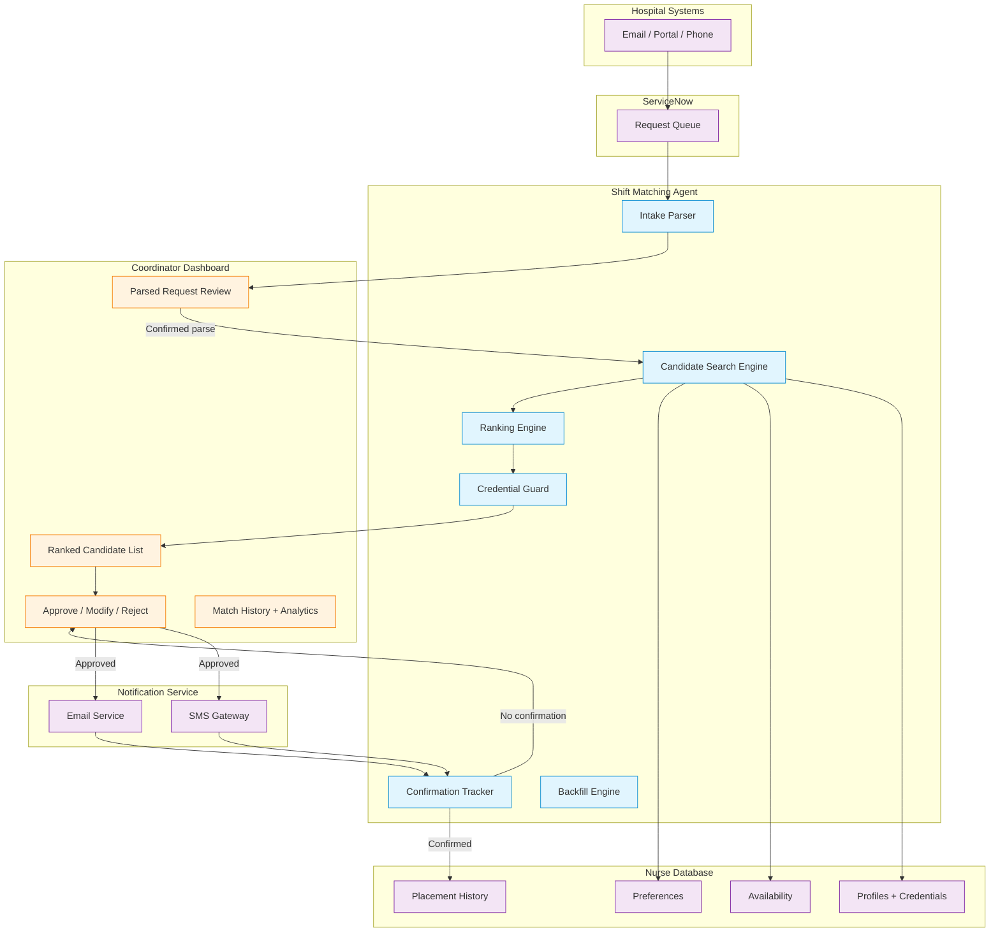

# Deliverable #3 — Agentic Solution Architecture + ADRs

> **Engagement:** MedFlex — Agentic Transformation of Shift Matching  
> **Version:** Interim draft (Thursday EOD)  
> **Status:** Pre-pushback — will be revised against Marcus's Friday memo

---

## 1. Workflow Decomposition & Delegation

### Shift Matching Workflow — End to End

| Step | Current state (manual) | Proposed delegation | Rationale |
|---|---|---|---|
| **1. Receive hospital request** | Lands in ServiceNow as free text (email, portal, phone) | **RPA/automation** — queue monitoring, ticket creation | Deterministic: poll ServiceNow, create internal work item. No judgment. |
| **2. Parse request into structured fields** | Coordinator reads free text, mentally extracts: credentials, shift time, facility, location, special requirements | **Agent-led + coordinator oversight** | This is where agent reasoning adds value. Free text is ambiguous ("need an experienced ICU nurse for nights" requires NLP interpretation of credential level, specialty, shift type). Coordinator reviews parsed output, corrects errors. |
| **3. Search for candidate nurses** | Coordinator manually searches nurse DB by credentials, filters by availability, proximity | **Agent-led** (search is the agent's primary function) | Multi-constraint search across structured data. Agent searches faster and more completely than any human — no judgment needed for the search itself, only for the ranking. |
| **4. Rank candidates by fit** | Coordinator uses experience + gut feeling to pick the best match from search results | **Agent-led + coordinator oversight** | The ranking is where agent reasoning over context occurs. Agent weighs: credential match strength, proximity, availability certainty, hospital feedback history, nurse preference alignment, no-show risk. Coordinator reviews ranking and approves or reorders. |
| **5. Check credential expiry against shift date** | Coordinator checks nurse card (often skipped under time pressure) | **Agent-led (autonomous)** | Deterministic check: if credential_expiry_date < shift_date + 7_day_buffer → flag. No judgment needed. Hard constraint — never skip. |
| **6. Select nurse and compose submission** | Coordinator picks top candidate, prepares submission to hospital | **Human-led + agent support** | Coordinator makes final selection. Agent pre-composes the submission with candidate details. For standard cases, coordinator approves with one click. For complex cases (preferences, partial matches), coordinator edits. |
| **7. Submit to hospital** | Coordinator sends submission via existing channel | **RPA/automation** | Deterministic: send formatted submission via email/portal. No judgment. |
| **8. Notify nurse** | Coordinator sends SMS/email notification to nurse | **Agent-led (autonomous)** | Template notification. Currently no confirmation required — agent adds confirmation request. |
| **9. Track nurse confirmation** | Currently doesn't exist (silence = acceptance) | **Agent-led (new capability)** | Agent sends confirmation request, tracks response, flags non-response for coordinator escalation. |
| **10. Handle hospital response** | Coordinator processes acceptance/rejection | **Agent-led + coordinator oversight** | If accepted: update records, withdraw from other submissions. If rejected: agent proposes next-best candidate. Coordinator reviews. |
| **11. Backfill on no-show / cancellation** | Coordinator scrambles to re-match (reactive, hospital calls) | **Agent-led + coordinator oversight** | Agent identifies backup candidates from original search. Coordinator approves rapid replacement. Speed is critical here — the agent's speed advantage is highest. |

### Delegation Summary

| Archetype | Count | Steps |
|---|---|---|
| **Agent-led (autonomous)** | 2 | Credential expiry check, nurse notification + confirmation |
| **Agent-led + coordinator oversight** | 4 | Request parsing, candidate ranking, hospital response handling, backfill |
| **Human-led + agent support** | 1 | Final nurse selection + submission composition |
| **RPA/automation** | 2 | Request intake monitoring, hospital submission |
| **Human-only** | 0 | — |
| **New capability (agent-created)** | 1 | Proactive nurse confirmation tracking |

### Where the Agent Decision Lives

**The agent decision is in Steps 2 and 4 — parsing and ranking.** This is where contextual reasoning determines an outcome a rule-based system couldn't reach:

- **Step 2 (parsing):** "Need an experienced ICU nurse, preferably someone who's worked with Dr. Patel's team before, for Saturday overnight" → Agent must interpret "experienced" (how many years? what tier?), "ICU" (credential code), "preferably worked with Dr. Patel" (hospital preference — soft constraint), "Saturday overnight" (shift window extraction). A rule-based parser can't handle the preference nuance or the implicit credential interpretation.

- **Step 4 (ranking):** Given 12 credentialed, available nurses within 30 miles, the agent must reason about: Which nurse has the best hospital feedback from this facility? Which nurse has the lowest no-show risk for overnight shifts? Which nurse hasn't worked 6 nights in a row (fatigue risk)? Which nurse's preferences best align (closer to home, prefers this hospital)? This is multi-factor contextual reasoning, not a weighted score formula.

---

## 2. System Architecture

The end-to-end data flow from hospital request to nurse confirmation is shown in Figure 1 below.

*Figure 1 — Shift Matching Agent architecture. Blue nodes = agent-driven. Orange nodes = coordinator-driven (human). Purple nodes = external systems.*

---

## 3. Integration Points

| System | Access method | Auth | Agent reads | Agent writes | Risk | Degradation if down |
|---|---|---|---|---|---|---|
| **ServiceNow** | REST API (assumed — confirm with Aaron) | OAuth 2.0 / API key [ASSUMED] | Shift requests (free text), queue status, timestamps | Parsed request fields, match status updates | API availability unconfirmed. | Fallback: batch polling every 5 min. Agent queues work; coordinators see delay, not failure. |
| **Nurse Database** | Direct DB access or API (assumed) | Service account with read/write [ASSUMED] | Profiles, credentials, credential expiry dates, availability, preferences, placement history | Match records, confirmation status | Schema unknown. Credential expiry field format unconfirmed. | Agent cannot match without nurse data. **Hard dependency.** Coordinator falls back to manual workflow. Alert on >30s response time. |
| **SMS Gateway** | API (existing — used for current nurse notifications) | API key (existing) | Delivery status, confirmation responses | Shift notifications, confirmation requests | Existing integration — lower risk. | Nurse notification delayed. Agent retries 3x, then flags for coordinator to call manually. |
| **Email Service** | API or SMTP (existing) | SMTP auth or API key (existing) | Delivery status | Hospital submissions, nurse notifications | Existing integration — lower risk. | Hospital submission delayed. Agent queues and retries. Coordinator can send manually as fallback. |

**Integration assumptions (to confirm with Aaron in Phase 0):**
- [A-INT-1] ServiceNow has a REST API that supports real-time read of new tickets. **Confidence: Medium.**
- [A-INT-2] Nurse database has credential expiry dates as a structured date field, not just "valid/invalid" flag. **Confidence: Medium.**
- [A-INT-3] SMS gateway supports two-way messaging (nurse can reply to confirm). **Confidence: Low** — current notifications are one-way.

---

## 4. Architecture Decision Records

### ADR-1: Agent-Led with Coordinator Oversight vs. Fully Agentic Matching

**Title:** Agent proposes matches; coordinator reviews and approves all matches in Phase 1.

**Status:** Proposed

**Context:**
- Marcus wants to "automate as much as possible" and says there's nothing that specifically requires human intervention.
- However, MedFlex's recommendation engine failed because coordinators didn't use it — they didn't trust the accuracy and feared for their jobs.
- Experienced coordinators have 10+ years of tacit matching knowledge that isn't systematised.
- The 7% mismatch rate suggests current human matching is imperfect — but coordinators believe they're better than a machine (and for preference-heavy matches, they may be right).
- The competitive market means a bad match is worse than a slow match — reputational damage accumulates.

**Decision:** Agent-led + coordinator oversight for all matches in Phase 1. The agent proposes a ranked list of candidates with reasoning. The coordinator approves, reorders, or rejects. No match goes to hospital without coordinator sign-off.

**Alternatives considered:**

| Alternative | Pros | Cons |
|---|---|---|
| **Fully agentic (no coordinator review)** | Maximum speed. Maximum volume scaling. Time-to-fill approaches minutes. | Highest adoption risk — repeats recommendation engine failure. Coordinators have no role → job security fears → sabotage. Accuracy unproven on MedFlex's specific data. |
| **Human-led + agent support (agent as context tool only)** | Lowest adoption risk. Coordinators feel empowered, not replaced. | Doesn't achieve 14x volume scaling. Coordinator is still the bottleneck. Doesn't justify Series B investment. |
| **Hybrid: auto-submit simple matches, coordinator reviews complex** | Best of both: speed on easy cases, human judgment on hard ones. Progressive autonomy. | Requires a confidence threshold that's calibrated accurately. Miscalibrated threshold = either too many bad matches (auto-submitted) or too much human review (no speed gain). |

**Consequences:**
- Positive: Addresses adoption risk directly. Builds coordinator trust through transparency. Captures tacit knowledge via coordinator feedback (every rejection/modification is training data).
- Negative: Slower than fully agentic. May not achieve <1h time-to-fill in Phase 1 (but <2h is achievable). Coordinators remain a partial bottleneck.
- Acceptable because: Phase 1 is trust-building. Phase 2 introduces progressive autonomy (Alternative C above) once confidence threshold is calibrated from Phase 1 data.

**Reversibility:** High. Moving from agent-led+oversight to progressive autonomy is a configuration change (adjust confidence threshold), not an architectural rebuild.

---

### ADR-2: Free-Text NLP Parsing vs. Structured Intake Form

**Title:** Agent parses free-text hospital requests rather than requiring hospitals to use a structured form.

**Status:** Proposed

**Context:**
- Hospitals submit shift requests via email (biggest channel), portal, and phone — all arriving in ServiceNow as free text.
- Marcus explicitly excludes changing the hospital submission channel ("Building a hospital-facing portal for shift submission" is out of scope).
- A structured form would be the easiest path for accurate parsing — but hospitals won't use it. The chatbot failed partly because hospitals didn't want to change how they submit.
- Competitive market: any friction added to the hospital's process risks losing them to a competitor.

**Decision:** Agent uses NLP to parse free-text requests into structured fields. Coordinator reviews parsed output before matching begins.

**Alternatives considered:**

| Alternative | Pros | Cons |
|---|---|---|
| **Structured intake form (hospital-facing)** | Perfect data quality. No parsing errors. | Explicitly out of scope. Adds friction to hospitals. Failed chatbot attempted this. Hospitals will switch agencies. |
| **Template-based extraction (regex/rules)** | Simpler to build. No LLM cost. Predictable. | Hospital requests are genuinely unstructured — same information expressed 50 different ways. Regex can't handle "need someone like Nurse Maria" or "preferably worked Dr. Patel's floor." |
| **Manual parsing continues (no change)** | Zero risk. Coordinators keep doing what they do. | Doesn't remove the parsing cognitive load. Coordinators spend [ASSUMED: 2-3 min] per request on parsing alone. At 14x volume, this is untenable. |

**Consequences:**
- Positive: Removes highest-waste cognitive step. No change required from hospitals. Agent reasoning on free text is a genuine agentic capability (not RPA/rules).
- Negative: NLP parsing will have errors. Coordinator must review every parse in Phase 1. Cost of LLM inference per request. Potential hallucination risk (agent infers a credential the hospital didn't request).
- Mitigated by: Coordinator review of parsed output. Confidence scoring on each parsed field. Feedback loop: corrections improve the parser.

**Reversibility:** Medium. Switching from NLP to structured intake requires hospital-side change — much harder to reverse. But switching from NLP to template extraction is a model swap, not an architecture change.

---

### ADR-3: Proactive Nurse Confirmation vs. Status Quo (Silence = Acceptance)

**Title:** Agent sends confirmation requests to nurses after match approval; non-response triggers escalation.

**Status:** Proposed

**Context:**
- Current model: nurse is notified of shift via SMS/email. No response required. Silence = acceptance.
- 12% no-show rate. MedFlex discovers no-shows when the hospital calls.
- Marcus says availability system has "no problem" — contradicted by the no-show rate.
- Competitive market: nurses may accept other agencies' offers after being assigned by MedFlex.
- Nurses must notify within 24 hours if they can't attend. Shifts typically assigned 2–3 days in advance.

**Decision:** Agent sends a confirmation request after the coordinator approves a match. Nurse must confirm within [ASSUMED: 4 hours] or the match is flagged for rebooking.

**Alternatives considered:**

| Alternative | Pros | Cons |
|---|---|---|
| **Keep silence = acceptance (no change)** | No nurse-side change. No friction. | 12% no-shows continue. Hospital trust erodes. No early warning for rebooking. |
| **Mandatory phone confirmation (coordinator calls nurse)** | Highest confirmation certainty. Human touch. | Doesn't scale at 14x volume. Each call = 3–5 minutes of coordinator time. |
| **Auto-confirm with follow-up ping 12h before shift** | Lighter touch than immediate confirmation. Less friction for nurses. | Doesn't catch no-shows early enough for rebooking. 12h may be too late to find a replacement. |

**Consequences:**
- Positive: Early warning on non-confirmations → more time for backfill. Reduces no-show rate. Data on confirmation patterns feeds no-show prediction model in Phase 2.
- Negative: Adds friction to nurses. Some nurses may find the confirmation request annoying. Risk: nurse ignores confirmation request like they ignore current notifications.
- Mitigated by: SMS confirmation is low-friction (reply "Y"). Non-response flags for coordinator, not auto-cancellation. Nurse can still call to cancel within 24h.

**Reversibility:** High. Confirmation workflow can be turned off (revert to notification-only) with a configuration change.

